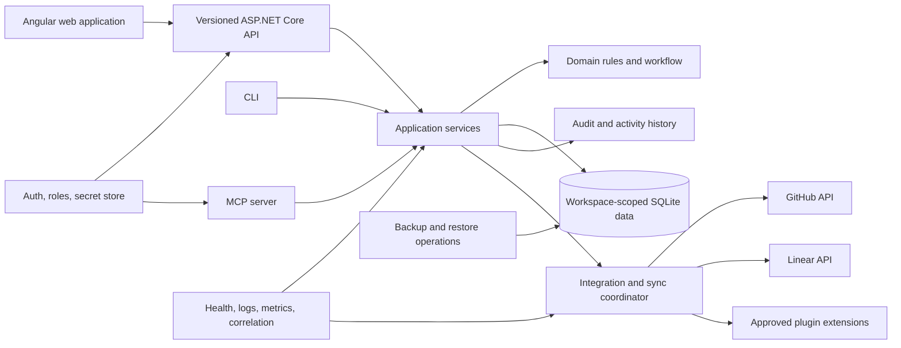
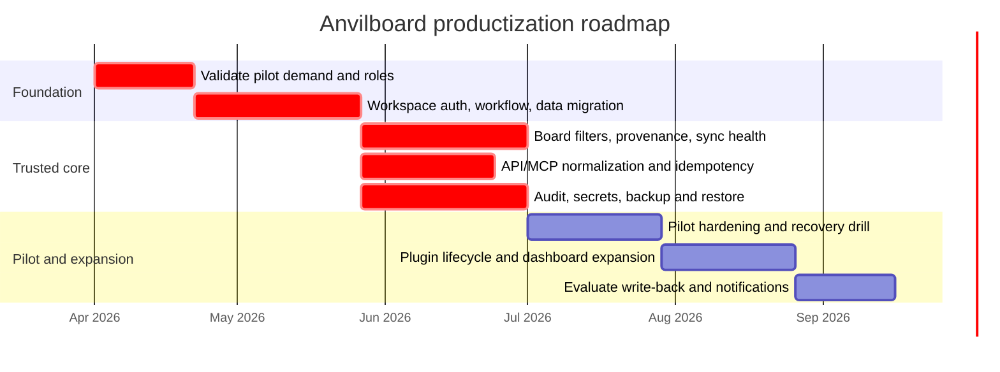

# Anvilboard — Product Requirements Document

## 1. Document Information

| Field | Value |
|---|---|
| PRD ID | PRD-ANV-001 |
| Version | 0.1 |
| Author | Anvilboard maintainers |
| Reviewers | Product, engineering, operations, and early adopters |
| Date | 2026-03-25 |
| Status | Draft |

## 2. Revision History

| Version | Date | Author | Changes |
|---|---|---|---|
| 0.1 | 2026-03-25 | Anvilboard maintainers | Initial future-state product requirements, grounded in the existing proof of concept. |

## 3. Executive Summary

Anvilboard will be a self-hosted work coordination workspace for people and automation that need one trustworthy view of local work and work synchronized from external trackers. It evolves the current local-first proof of concept into a secure, workspace-scoped product with configurable workflows, clear external provenance, dependable synchronization, searchable board and dashboard views, and a first-class API/agent surface.

The product serves small teams that do not want a separate hosted planning system or a fragile spreadsheet-and-tabs workflow. A human can triage and advance work from the web application; a CLI or MCP-capable agent can retrieve, create, and update the same work through stable, machine-readable contracts. The launch outcome is a deployable single-host workspace that preserves the low-operational-cost posture while making synchronization, authorization, audit, and recovery suitable for real work.

## 4. Product Overview & Background

### 4.1 Product Definition

Anvilboard is a local-first, self-hosted board and work-tracking product. A workspace contains teams, people, projects, labels, workflow states, and issues. Issues may originate locally or be synchronized from approved external providers. Anvilboard presents a unified board, list/search experience, issue detail, dashboard, REST API, CLI, and MCP server.

### 4.2 Current-State Evidence

The existing proof of concept validates the core technical direction: an ASP.NET Core and SQLite host, Angular web application, local issues, GitHub and Linear ingestion, a reflection-loaded plugin model, dashboard aggregation, and shared application services consumed by REST and agent interfaces. Its limitations are deliberate PoC boundaries: fixed statuses, no workspace authorization model, limited filters and comments, incomplete sync transparency, numeric-enum inconsistency between REST and agent responses, and no complete operational model for secrets, backup, or audit.

This PRD is the future-state product contract. The current implementation is evidence, not a constraint; incompatible behavior may be changed through versioned migration and API compatibility decisions documented downstream.

### 4.3 Product Principles

1. **One operational view, honest provenance.** A unified issue must retain its originating provider, remote identity, and synchronization condition.
2. **Local-first and boring to operate.** The default deployment remains one application host and a durable local database, with no required broker or external database server.
3. **Human and automation parity.** Human and agent interactions use the same domain rules and have equivalent authorization, auditability, and predictable errors.
4. **Explicit control beats hidden automation.** Synchronization, plugin actions, and agent writes must be observable, attributable, and recoverable.
5. **A small core with intentional extension seams.** Provider integrations and post-commit automations extend defined contracts without weakening core data integrity.

## 5. Market Research & Analysis

### 5.1 Market Sizing

**N/A — Anvilboard is presently a self-hosted product direction, not a commercial market-sizing initiative.** No credible TAM/SAM/SOM research has been collected; this PRD must not manufacture financial estimates. Adoption and operating-value validation in §6 is the immediate decision input.

### 5.2 Competitive Landscape

| Alternative | Strengths | Limitations for Anvilboard's target use case | Differentiation |
|---|---|---|---|
| GitHub Issues / Projects | Native code-host integration, familiar developer workflow | Does not provide a local canonical workspace spanning other providers or an intentionally local-first operational model | Anvilboard unifies provider-backed and local work while preserving source provenance. |
| Linear | Mature planning and workflow experience | Requires adopting a hosted system and does not make a self-hosted local board the primary deployment unit | Anvilboard supports a deployer-controlled workspace and can synchronize selected Linear work rather than replace it wholesale. |
| Spreadsheet, browser tabs, and manual status reports | Zero procurement and flexible ad-hoc use | Duplicates data, obscures source of truth, and cannot provide reliable automation or audit | Anvilboard consolidates governed work records, status, synchronization, and automation contracts. |

### 5.3 Competitive Differentiation

Anvilboard does not compete on broad enterprise portfolio management. It differentiates through a low-operations, self-hosted unified view; explicit source and sync state; and a supported automation surface where human, CLI, and MCP clients execute the same business operations. A team can use external systems where they are strongest while retaining a local operational board for cross-source execution.

### 5.4 Industry Signals

- Engineering teams increasingly coordinate work across code hosts, issue trackers, and AI-assisted workflows; a single manual status report becomes stale quickly.
- Agentic workflows need structured, least-privilege interfaces and deterministic error contracts rather than screen scraping or direct database access.
- Small teams often prefer deployer control and modest infrastructure requirements to another mandatory SaaS control plane.

## 6. Value Proposition & Validation

### 6.1 Core Value Proposition

For small delivery teams who lose context across local notes and external trackers, Anvilboard provides a self-hosted, source-aware work workspace with a unified board and safe automation interfaces, unlike tab-switching, spreadsheets, or replacing every existing tracker, because it keeps local control while synchronizing selected external work through explicit contracts.

### 6.2 Evidence of Real Demand

| Evidence type | Detail | Source | Date |
|---|---|---|---|
| Working proof of concept | The repository implements local issues, dashboard aggregation, GitHub/Linear ingestion, plugins, REST, CLI, and MCP operations. This demonstrates technical demand exploration, not user-market validation. | Existing codebase review | 2026-03-25 |
| Existing documentation | The legacy specification and plugin documentation describe the need to combine local and external work and expose automation hooks. | Repository documentation review | 2026-03-25 |
| Status-quo analysis | Multiple system boundaries require manual reconciliation today; source-aware consolidation removes repeated context switching and duplicate updates. | Product hypothesis derived from current workflow | 2026-03-25 |

Evidence is currently thin on direct user interviews, usage analytics, and willingness-to-pay. Before a general release, product owners must conduct at least five target-user interviews and a time-boxed pilot; those results determine the next priority revision.

### 6.3 Cost of Inaction

Without a governed unified workspace, teams continue to copy status between systems, lose the origin and freshness of externally sourced work, and give automation either no access or unsafe direct access to underlying systems. The PoC remains difficult to trust for production coordination because it lacks clear authorization, recovery, and synchronization controls.

## 7. Feasibility Analysis

### 7.1 Technical Feasibility

| Dimension | Assessment | Notes |
|---|---|---|
| Technology readiness | Ready with targeted extension | .NET, Angular, SQLite, REST, MCP, and provider APIs are already proven by the PoC. |
| Existing infrastructure | Needs extension | The layered host and plugin contracts exist; workspace authorization, configurable workflows, observability, recovery, and API normalization require productization. |
| Technical risk | Medium | External provider limits, sync conflict semantics, plugin isolation, and secure agent credentials require explicit design. |
| Prototype/PoC status | Validated | Core issue, dashboard, ingestion, plugin, CLI, and MCP paths are implemented. |

### 7.2 Business Feasibility

| Dimension | Assessment | Notes |
|---|---|---|
| Revenue model clarity | Needs validation | The current direction is self-hosted; paid distribution or support is not decided. |
| ROI estimate | Uncertain | Baseline time spent reconciling systems has not been measured. |
| Strategic alignment | Core | Directly evolves the existing proof of concept into a usable product. |
| Stakeholder buy-in | In progress | User requested a specification-led future direction; formal pilot feedback is pending. |

### 7.3 Resource Feasibility

| Dimension | Assessment | Notes |
|---|---|---|
| Team availability | Partially available | Existing maintainers can evolve the PoC; pilot support and security review need planned capacity. |
| Required skills | In-house with focused review | .NET, Angular, provider APIs, and plugin engineering are present; security and UX review are required gates. |
| Budget | Not requested | The single-host default limits infrastructure spend; any hosted offering is out of scope for this release. |
| Timeline realism | Achievable in phases | The roadmap must ship the trusted core before additional providers or advanced automation. |

### 7.4 Feasibility Verdict

**Conditional GO.** Proceed with a trusted core and pilot only after the technical design resolves workspace authorization, secret handling, workflow migration, synchronization conflict policy, backup/restore, and REST/agent contract normalization. Broader provider coverage and hosted deployment do not block the first product release.

## 8. Problem Statement

### 8.1 Current Situation

Teams track work in a mixture of external issue trackers, code-host issue lists, local notes, and status reports. The existing PoC can ingest a portion of that work and present a board, but its fixed workflow, narrow UI, and minimal operations controls leave users unable to treat it as an accountable day-to-day system.

### 8.2 Pain Points

- People must switch among systems or copy updates into a separate board, creating stale and conflicting status.
- External items can appear locally without enough visibility into source, timing, failure, or ownership of synchronization.
- Fixed workflow statuses do not fit all teams, while unrestricted customization would make reporting and integrations inconsistent.
- Automation lacks a versioned, authorized, idempotent product contract and a way to understand failures safely.
- A local deployment without backup, audit, secret, and recovery requirements is risky once it contains real work history.

### 8.3 Problem to Solve

Provide a deployer-controlled workspace where authorized humans and agents can consistently discover, create, prioritize, and advance work across local and selected external sources, with transparent provenance, synchronization health, and durable operational controls.

## 9. Goals & Non-Goals

### 9.1 Goals

| Goal ID | Goal | Measure |
|---|---|---|
| GOAL-001 | Make daily work visible in one workspace without losing origin or freshness. | Pilot users can identify source and last-sync state for every external issue; ≥95% of eligible synchronized records display provenance. |
| GOAL-002 | Make core work operations safe for both humans and automation. | All P0 operations enforce workspace authorization, emit audit events, and expose documented machine-readable success/error results. |
| GOAL-003 | Preserve low operational burden while becoming recoverable. | A documented backup and restore drill restores a workspace to a verified point with no unexplained integrity errors. |
| GOAL-004 | Improve execution visibility and coordination. | Pilot users complete board triage and assignee-load review without manually reconciling multiple source views for the tested workflow. |
| GOAL-005 | Establish an extensible, supportable integration platform. | At least GitHub and Linear integrations run under the common sync-health and plugin lifecycle contract. |

### 9.2 Non-Goals

- Replacing every feature of GitHub, Linear, or enterprise portfolio-management products.
- Mandatory cloud hosting, multi-region high availability, or a required message broker/database cluster.
- Bi-directional editing against every provider in the first release; provider write-back is opt-in and must be separately specified.
- Arbitrary third-party code execution without an installation, compatibility, and failure-isolation policy.
- Autonomous agent authority beyond explicitly granted workspace-scoped permissions.
- Native mobile clients in the first release.

## 10. Consumer Analysis

### 10.1 Consumer Types

| Consumer type | Applicable | Justification | Primary interaction |
|---|---|---|---|
| Human user | Yes | Coordinators and contributors need board, issue detail, dashboard, and administrative controls. | Web application and optional CLI. |
| AI agent | Yes | Existing CLI/MCP work establishes a programmatic consumer; future automation must use a supported contract rather than UI automation. | Versioned REST API and MCP over stdio, with workspace-scoped credentials. |

### 10.2 Human Personas

| Persona | Needs | Constraints | Key outcome |
|---|---|---|---|
| Delivery coordinator | Triage one queue, find stale imports, balance assignee load, and explain status. | Cannot manually reconcile every source several times per day. | A source-aware board and dashboard that make current work and exceptions obvious. |
| Contributor | See assigned work, understand priority/status, discuss an issue, and update its progress. | Should not need administrator access or tracker-specific expertise. | A focused, authorized issue workflow with clear activity history. |
| Workspace administrator | Configure members, teams, workflows, integrations, secrets, and recovery procedures. | Must avoid exposing credentials and must diagnose failing sync safely. | Controlled configuration with auditability and actionable health signals. |

### 10.3 Agent Persona

| Attribute | Definition |
|---|---|
| Persona | Delivery automation agent |
| Agent type | Human-in-the-loop by default; it may propose or execute only explicitly authorized changes. |
| Objective | Retrieve current work, create or update issues, and report dashboard summaries for a workspace. |
| Integration pattern | REST with versioned JSON contracts or MCP over stdio JSON-RPC; no browser automation or direct database access. |
| Context constraints | Receives only workspace-scoped data and redacted errors; it must not receive provider secrets or unrestricted cross-workspace history. |
| Failure modes | Expired/revoked credentials, validation failures, concurrency conflicts, rate limiting, unavailable providers, idempotent replay, and ambiguous user intent. |
| Required behavior | Use a request/idempotency key for mutations, parse stable error codes, retry only declared transient failures, and escalate authorization or business-rule failures to a human. |

## 11. User Stories

### 11.1 Human User Stories

**US-HUM-001 — Establish a workspace**

As a workspace administrator, I want to create a workspace and define its teams, members, roles, and workflow so that work has a governed home before it is tracked.

- [ ] An authorized administrator can create and update workspace configuration.
- [ ] A workspace has at least one team and a valid ordered workflow before issues can be created.
- [ ] Roles limit configuration and issue operations according to §12.
- [ ] Configuration changes are recorded in the audit history.

**US-HUM-002 — Work a unified board**

As a delivery coordinator, I want to view, filter, and group work from local and approved external sources so that I can triage the current queue without opening each provider.

- [ ] The board can filter by team, workflow state, assignee, priority, project, label, source, and synchronization condition.
- [ ] Each externally sourced issue shows provider, remote reference, last successful sync, and current sync condition.
- [ ] Filtering and grouping do not change the underlying issue data.
- [ ] An empty result explains the active filters and provides a reset action.

**US-HUM-003 — Maintain an issue**

As a contributor, I want to create a local issue and update its workflow state, assignment, priority, labels, and comments so that the board reflects the work I am doing.

- [ ] Only authorized users can mutate an issue in their workspace.
- [ ] Every mutation validates the configured workflow and records an activity event.
- [ ] The issue detail distinguishes local fields from provider-controlled fields.
- [ ] Conflicting edits show the user what changed and allow refresh before retrying.

**US-HUM-004 — Operate integrations safely**

As a workspace administrator, I want to configure an integration and see its health so that I can trust imported work and correct failures without exposing secrets.

- [ ] Secrets are write-only after entry and never appear in UI, API, audit events, or logs.
- [ ] The administrator can enable, pause, test, and remove an integration under authorization.
- [ ] The health view shows last attempt, last success, record counts, cursor/freshness, and a safe error summary.
- [ ] Pausing or failing one integration does not prevent local work or unrelated integrations from operating.

**US-HUM-005 — Recover accountable work history**

As a workspace administrator, I want documented backup, restore, and audit capabilities so that accidental loss or unexpected changes can be investigated and recovered.

- [ ] The product supports a documented backup operation and a verified restore procedure.
- [ ] Audit history identifies actor, channel, action, target, timestamp, result, and correlation identifier.
- [ ] Restore actions are themselves audited.
- [ ] A user without administrative permission cannot download or restore workspace backups.

### 11.2 Agent User Stories

**US-AGT-001 — Query current work**

As a delivery automation agent, I want to list and retrieve only work I am authorized to access through a versioned structured interface so that I can plan or report without screen scraping.

- [ ] The API and MCP contracts return symbolic, documented values for workflow state, priority, provider, and sync condition.
- [ ] Pagination, filtering, ordering, and response schema version are machine-readable and deterministic.
- [ ] Unauthorized and not-found responses are distinguishable without leaking cross-workspace data.
- [ ] Repeating a read produces no side effect.

**US-AGT-002 — Make safe mutations**

As a human-supervised delivery agent, I want to create or update an issue using an idempotency key and correlation ID so that a retry does not duplicate work and a human can trace the action.

- [ ] Every supported mutation accepts an idempotency key with a documented retention period.
- [ ] Replaying the same key and equivalent request returns the original result without another mutation.
- [ ] Reusing a key with a materially different request returns a stable conflict error.
- [ ] Mutations enforce the same authorization, validation, workflow, audit, and activity rules as web actions.

**US-AGT-003 — Respond to failures predictably**

As a delivery automation agent, I want stable error codes and retry guidance so that I can retry transient failures and escalate non-retryable failures correctly.

- [ ] Error responses contain a stable code, safe message, correlation ID, and retryability indicator.
- [ ] Rate-limit and temporary-provider failures declare the earliest safe retry time when known.
- [ ] Validation, authorization, and concurrency failures are non-retryable unless the response explicitly identifies a remediation path.
- [ ] MCP logging remains on stderr so stdout remains valid JSON-RPC.

## 12. Functional Requirements Overview

| Requirement ID | Feature | Requirement | Priority | Priority rationale | Status |
|---|---|---|---|---|---|
| PRD-ANV-001 | Workspace access | The product shall enforce authenticated, workspace-scoped roles for all human, REST, CLI, and MCP operations. | P0 | A production workspace cannot safely contain real work without authorization; this precedes convenience features. | Proposed |
| PRD-ANV-002 | Workspace configuration | Authorized administrators shall configure teams, members, roles, and an ordered workflow with validation and audit history. | P0 | Core work needs a governed workspace and workflow; fixed global statuses are an inadequate production workaround. | Proposed |
| PRD-ANV-003 | Unified board | The web application shall list, filter, group, and open workspace issues by workflow state, assignee, priority, project, label, provider, and sync condition. | P0 | This is the primary human value and replaces manual reconciliation; without it the product is only an API/store. | Proposed |
| PRD-ANV-004 | Issue lifecycle | Authorized users and agents shall create local issues and update permitted fields, transitions, assignments, labels, comments, and priority through shared domain rules. | P0 | A board without reliable day-to-day work updates is not viable; the next-tier workaround is manual source-specific updates. | Proposed |
| PRD-ANV-005 | Provenance and sync health | Every external issue shall expose provider identity, remote reference, import/update time, freshness, and synchronization condition; the workspace shall expose integration health. | P0 | Trust in a unified view depends on knowing whether data is current and where it came from; no acceptable manual workaround scales. | Proposed |
| PRD-ANV-006 | Integration administration | Authorized administrators shall configure, test, enable, pause, and remove approved integrations while protecting secrets. | P0 | Selected external sources are foundational to the product thesis; administration and secrecy are required before import can be trusted. | Proposed |
| PRD-ANV-007 | API and automation | The product shall provide versioned REST and MCP contracts with symbolic values, stable errors, pagination, correlation IDs, and idempotent mutations. | P0 | Automation is a declared consumer and must be safe from launch; UI-only access is not a valid substitute. | Proposed |
| PRD-ANV-008 | Audit and recovery | The product shall record security- and work-relevant audit events and support documented, authorized backup and restore. | P0 | Real work history requires accountability and recovery; deferring this creates an unacceptable data-loss and investigation risk. | Proposed |
| PRD-ANV-009 | Dashboard | The dashboard shall present workspace-level workflow, source, freshness, and assignee-load summaries with drill-down links. | P1 | It materially improves planning and coordination, but the board remains a workable launch path. | Proposed |
| PRD-ANV-010 | Plugin platform | The product shall support versioned ingestion, webhook, and post-commit extension contracts with lifecycle validation, isolation, and health reporting. | P1 | Extensibility preserves the small core and supports new providers, but GitHub and Linear can launch via first-party integrations. | Proposed |
| PRD-ANV-011 | External write-back | The product shall support explicitly configured provider write-back and conflict handling for selected fields. | P2 | Valuable for reducing duplicate updates, but read/import plus local work is a viable initial workflow and conflict semantics need validation. | Proposed |
| PRD-ANV-012 | Saved views and notifications | Users shall save shareable board views and receive configurable notifications for assignments, mentions, and sync failures. | P2 | Improves retention and responsiveness, but manual filters and health checks remain an acceptable first-release workaround. | Proposed |

**Priority legend:** P0 = required for trusted launch; P1 = significant launch-following capability; P2 = planned enhancement after pilot validation.

## 13. User Journey

```mermaid
graph TD
    subgraph Human path
        A[Administrator signs in] --> B[Create or select workspace]
        B --> C[Configure teams, roles, workflow, and integrations]
        C --> D{Integration healthy?}
        D -- Yes --> E[Board shows local and external work with provenance]
        D -- No --> F[Health view explains safe failure and corrective action]
        F --> C
        E --> G[Coordinator filters and triages work]
        G --> H[Contributor opens issue and updates permitted fields]
        H --> I[Validate transition and authorization]
        I --> J[Persist change and audit/activity event]
        J --> E
    end
    subgraph Agent path
        K[Agent authenticates with workspace-scoped credential] --> L[Calls versioned REST or MCP operation]
        L --> M{Authorized and valid?}
        M -- No --> N[Structured non-retryable error with correlation ID]
        M -- Yes --> O{Mutation?}
        O -- No --> P[Return paginated symbolic JSON]
        O -- Yes --> Q[Validate idempotency key and domain rules]
        Q --> R{Already processed?}
        R -- Yes --> S[Return original result]
        R -- No --> T[Persist mutation and audit/activity event]
        T --> U[Return structured result]
    end
```

## 14. Feature Architecture

The technical design defines the exact trust boundaries, data model, lifecycle, deployment, and extension contracts. The web API, CLI, and MCP server remain parallel clients of shared application services so domain behavior does not diverge by channel.

## 15. Success Metrics

| Metric | Type | Target value | Measurement method | Current baseline |
|---|---|---|---|---|
| Eligible external issues with displayed provenance and sync state | KPI / GOAL-001 | ≥95% during pilot | Automated data-quality check and pilot workspace audit | Not measured |
| Authorized P0 mutations producing audit events and correlation IDs | KPI / GOAL-002 | 100% | Contract and integration test reporting | Not measured |
| Backup-and-restore drill success | Reliability / GOAL-003 | 100% of scheduled pilot drills | Restore checklist with integrity verification | No documented drill |
| Triage completion without manual source reconciliation | Outcome / GOAL-004 | ≥80% of observed pilot triage sessions | Pilot task observation and interview | Not measured |
| Enabled first-party integrations reporting common health fields | Platform / GOAL-005 | 100% | Integration health contract check | PoC-specific behavior only |
| Duplicate agent mutations under supported retry scenarios | Reliability / GOAL-002 | 0 | Idempotency integration tests and audit review | Not measured |

## 16. Timeline & Milestones

Dates are intentionally phase-based until pilot participants, staffing, and release date are confirmed.

## 17. Risk Assessment Matrix

| Risk ID | Description | Likelihood | Impact | Mitigation strategy | Owner |
|---|---|---|---|---|---|
| RISK-001 | Provider rate limits, API changes, or outages make synchronized records stale. | M | H | Track per-integration freshness/health, isolate loops, respect provider retry guidance, retain last-known data with visible staleness, and version adapters. | Integration owner |
| RISK-002 | A plugin or post-commit hook degrades core issue operations or leaks data. | M | H | Validate manifests and permissions, isolate failures, set execution budgets, redact logs, and keep hooks unable to veto or silently alter committed work. | Platform owner |
| RISK-003 | Workspace or agent credentials permit excessive access. | M | H | Workspace-scoped roles/tokens, secret redaction, revocation, audit, least privilege, and security review before pilot. | Security owner |
| RISK-004 | Configurable workflows break reports, integrations, or historical interpretation. | M | M | Use stable state identifiers, explicit transition rules, versioned migration, archived state mappings, and compatibility tests. | Domain owner |
| RISK-005 | SQLite backup/restore or concurrent use is misunderstood in deployment. | M | H | Publish supported deployment limits, integrity-checked backup/restore tooling, lock/concurrency guidance, and drill recovery in pilot. | Operations owner |
| RISK-006 | Scope expands into a replacement for external trackers before trusted core is complete. | H | M | Hold P0 boundary, run pilot gates, and require a separate product decision for provider write-back or enterprise features. | Product owner |

## 18. Dependencies

### Internal Dependencies

- Shared domain and application services must become the single enforcement point for web, REST, CLI, and MCP behavior.
- The data model needs a workspace boundary, roles, workflow configuration, stable state mappings, integration configuration, sync health, audit records, and migration strategy.
- The Angular application needs authenticated workspace navigation, board filtering, issue activity, integration health, and administrator flows.
- The delivery process needs automated contract/integration testing and an operational runbook for deployment, backup, restore, and incident diagnosis.

### External Dependencies

- GitHub and Linear APIs, credentials, rate limits, webhook/signature behavior, and change-notice practices.
- An identity/token approach appropriate to the selected deployment model; the product must not assume a hosted identity provider is always available.
- MCP client compatibility and JSON-RPC transport constraints, including stdout purity for stdio operation.

## 19. Open Questions

| # | Question | Owner | Resolution target | Status |
|---|---|---|---|---|
| 1 | Which authentication model best preserves self-hosted simplicity while supporting workspace-scoped people and automation credentials? | Architecture and security | Before foundation implementation | Open |
| 2 | What workflow configuration freedom is allowed while retaining cross-workspace reporting and provider mappings? | Product and domain | Before migration design | Open |
| 3 | For each provider, which fields are imported, locally editable, provider-controlled, or eligible for future write-back? | Product and integration | Before integration productization | Open |
| 4 | What backup target, retention period, encryption expectation, and restore RPO/RTO are required for pilot workspaces? | Operations and pilot users | Before pilot | Open |
| 5 | What exact pilot cohort and observed task baseline will validate the value hypothesis in §6 and §15? | Product | Before pilot recruitment | Open |
| 6 | What plugin trust and distribution model is acceptable for third-party assemblies in self-hosted deployments? | Security and platform | Before third-party plugin support | Open |

## 20. Appendix

### 20.1 Glossary

- **Workspace:** The authorization and data-isolation boundary containing teams, people, configuration, and work.
- **Issue:** A unit of tracked work with a workflow state, priority, ownership, activity, and optional external link.
- **Provider:** An external system such as GitHub or Linear from which work may be ingested.
- **Provenance:** Source metadata that explains where an issue came from and how it maps to a remote item.
- **Sync condition:** A human- and machine-readable indication of an integration or imported record's freshness and error state.
- **Plugin:** An approved extension implementing Anvilboard's published ingestion, webhook, or post-commit contracts.
- **MCP:** Model Context Protocol, used here as a stdio JSON-RPC automation surface.
- **Idempotency key:** Client-provided identifier that ensures a supported mutation replay does not duplicate side effects.

### 20.2 Traceability

- Product vision: [`ideas/anvilboard/draft.md`](../../ideas/anvilboard/draft.md)
- Project decomposition: [`docs/project-anvilboard.md`](../project-anvilboard.md)
- Formal requirements: [`docs/anvilboard/srs.md`](srs.md)
- Technical design: [`docs/anvilboard/tech-design.md`](tech-design.md)
- Integration platform feature specification: [`docs/features/integration-and-plugin-platform.md`](../features/integration-and-plugin-platform.md)
- Agent and automation feature specification: [`docs/features/agent-and-automation-surface.md`](../features/agent-and-automation-surface.md)
