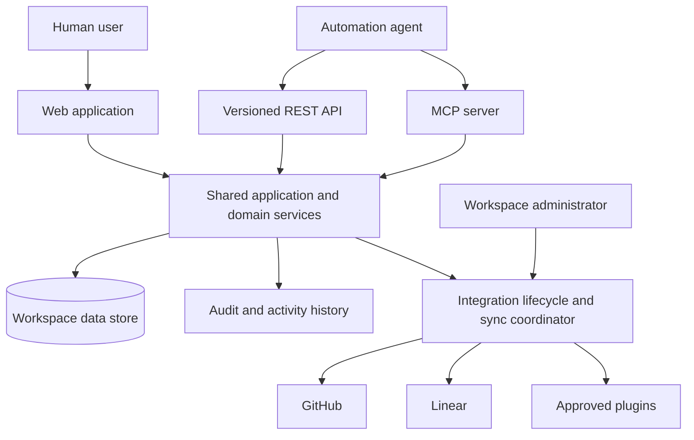
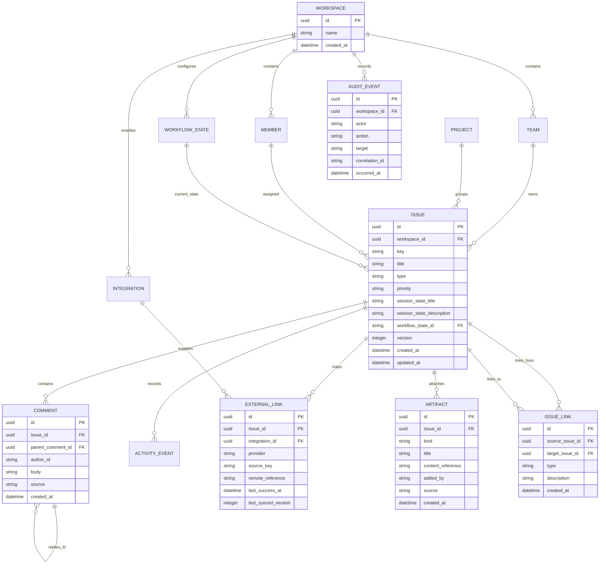

# Software Requirements Specification: Anvilboard

## 1. Document Information

| Field | Value |
|---|---|
| **Document ID** | SRS-ANV-001 |
| **Version** | 0.2 |
| **Author** | Anvilboard maintainers |
| **Reviewers** | Product, engineering, security, operations, and QA |
| **Date** | 2026-09-05 |
| **Status** | Draft |
| **Related PRD** | [`docs/anvilboard/prd.md`](prd.md) |

## 2. Revision History

| Version | Date | Author | Description of changes |
|---|---|---|---|
| 0.1 | 2026-03-25 | Anvilboard maintainers | Initial formal requirements for the future-state product. |
| 0.2 | 2026-09-05 | Anvilboard maintainers | Added archive, dependency projection, rich activity, and real-time requirements; unified lifecycle hooks; specified additive sync merging, GitHub pull-request artifacts, and plugin persistence. |

## 3. Introduction

### 3.1 Purpose

This SRS specifies the behavior and quality constraints of Anvilboard, a self-hosted, workspace-scoped work coordination product. It translates the product direction in the PRD into testable requirements for engineers, QA, product owners, operators, plugin authors, and pilot stakeholders. It covers the trusted core, integration platform, and automation surface. It does not prescribe a particular implementation except where a product constraint requires one.

### 3.2 Scope

Anvilboard shall provide authorized human and programmatic consumers with a unified workspace for local issues and selected externally synchronized issues. It shall support configurable but governed workflows, a web board and dashboard, safe integration administration, provenance and synchronization health, versioned automation interfaces, audit, and backup/restore. The product shall retain the low-operational-cost single-host deployment target.

This SRS excludes mandatory cloud hosting, broad enterprise portfolio management, unrestricted plug-in code execution, native mobile clients, and universal provider write-back. These exclusions match the PRD non-goals.

### 3.3 Definitions, Acronyms, and Abbreviations

| Term | Definition |
|---|---|
| SRS | Software Requirements Specification. |
| PRD | Product Requirements Document. |
| FR / NFR | Functional / non-functional requirement. |
| RTM | Requirements Traceability Matrix. |
| Workspace | Data-isolation and authorization boundary containing teams, people, configuration, and work. |
| Issue | A unit of tracked work with state, priority, ownership, activity, and optional external link. |
| Workflow | Ordered named states and the allowed transitions between them for a workspace. |
| Provider | An external work system such as GitHub or Linear. |
| Provenance | Provider, remote identity, mapping, and time metadata explaining an imported issue. |
| Sync condition | Machine- and human-readable condition of an integration or imported item, including freshness and safe failure detail. |
| MCP | Model Context Protocol, used as a stdio JSON-RPC automation interface. |
| Idempotency key | A client-provided mutation identifier used to prevent duplicate side effects on replay. |

### 3.4 References

| Document | Version | Date |
|---|---|---|
| [`ideas/anvilboard/draft.md`](../../ideas/anvilboard/draft.md) | 0.1 | 2026-09-05 |
| [`docs/project-anvilboard.md`](../project-anvilboard.md) | 0.1 | 2026-03-25 |
| [`docs/anvilboard/prd.md`](prd.md) | 0.1 | 2026-03-25 |
| [`docs/anvilboard/tech-design.md`](tech-design.md) | 0.1 | 2026-03-25 |

### 3.5 Overview

Section 4 places Anvilboard in its operating context. Section 5 defines functional requirements and use cases. Section 6 states measurable quality constraints. Sections 7 and 8 define data and interface requirements. Section 9 maps requirements to their PRD sources and planned verification artifacts. Open decisions remain explicitly identified rather than silently assumed.

## 4. Overall Description

### 4.1 Product Perspective

Anvilboard is the canonical local workspace for a team’s coordinated work, not a replacement for every external provider. The web application, REST API, CLI, and MCP server are equal consumers of a common application/domain layer. Provider adapters and approved plugins communicate with third-party services through managed integration lifecycles.

### 4.2 Product Functions

- Authenticate actors and authorize every request inside a workspace boundary.
- Configure workspaces, people, teams, roles, workflows, integrations, and plugin lifecycle settings.
- Create, find, filter, read, and mutate local work under workflow rules.
- Ingest approved provider data while retaining provenance, freshness, and health state.
- Present board, issue detail, dashboard, integration health, audit, and recovery views.
- Expose equivalent versioned REST/CLI/MCP operations with safe errors and mutation idempotency.
- Produce backups and permit authorized restore with integrity verification and audit.

### 4.3 User Characteristics

| User class | Characteristics | Required support |
|---|---|---|
| Workspace administrator | Configures access, workflow, integrations, secrets, and recovery; understands deployment responsibilities. | High-impact actions, safe diagnostics, audit, and least-privilege administration. |
| Delivery coordinator | Triage, prioritizes, monitors source freshness, and balances workload. | Fast board navigation, filters, grouping, source context, and dashboard drill-down. |
| Contributor | Updates assigned work and contributes discussion. | Focused issue UI, understandable transition validation, and activity context. |
| Automation agent | Uses REST or MCP programmatically and may be human supervised. | Versioned schemas, scoped credentials, symbolic values, stable errors, pagination, idempotency, and no secret access. |
| Plugin author | Implements approved extension points. | Published compatibility contract, lifecycle validation, bounded failure behavior, and safe logs. |

### 4.4 Constraints

- The supported initial deployment shall run as one application host with one durable local SQLite data store; no message broker or database server shall be mandatory.
- The web API, CLI, and MCP interfaces shall use shared domain/application operations rather than channel-specific business rules.
- Stdio MCP stdout shall be reserved for JSON-RPC protocol output; operational logging shall use stderr or configured logging sinks.
- Provider data use shall comply with each provider’s authentication, API, rate-limit, and webhook requirements.
- External provider write-back is out of scope unless separately enabled by a future approved requirement.

### 4.5 Assumptions and Dependencies

- A deployment administrator provides a secure host, persistent storage, system clock, and backup destination.
- A deployment has an approved identity/token approach before multi-user or agent access is enabled.
- GitHub and Linear credentials and API access are available when their integrations are enabled.
- Users understand that an imported issue may be read-only for provider-controlled fields in the initial release.
- The technical design will set exact credential storage, encryption, retention, RPO/RTO, and API version compatibility values for unresolved product decisions.

## 5. Functional Requirements

### 5.1 Workspace and access

#### FR-WS-001: Workspace-scoped authentication and authorization

| Field | Value |
|---|---|
| Priority | P0 |
| Source | PRD-ANV-001 |
| Description | The system shall authenticate every non-bootstrap human and programmatic request and authorize it against a workspace-scoped role before reading or mutating workspace data. |
| Acceptance criteria | (1) A request without valid credentials is rejected with a machine-readable authentication error. (2) A valid actor cannot read or mutate a workspace for which it lacks permission. (3) A role grants only documented operations. (4) Authorization decisions are auditable for mutations and security-relevant configuration actions. |

**Primary actor:** Human user or automation agent.

**Preconditions:** A workspace exists; the actor has a credential or the product is performing the explicit first-administrator bootstrap flow.

**Main flow:**
1. The actor submits a web, REST, CLI, or MCP request with credentials.
2. The system authenticates the credential and resolves the requested workspace.
3. The system evaluates the role permission for the operation.
4. The system processes the request only when authorized and returns the channel-appropriate structured result.

**Alternative flows:**
- **AF-1 Invalid or missing credential:** The system returns `AUTHENTICATION_REQUIRED` without exposing workspace existence.
- **AF-2 Valid credential, missing workspace permission:** The system returns `WORKSPACE_ACCESS_DENIED` and a correlation ID; it does not return workspace data.
- **AF-3 Credential revoked or expired:** The system returns `CREDENTIAL_INVALID_OR_EXPIRED`; an agent treats this as non-retryable until a human refreshes authorization.

#### FR-WS-002: Workspace configuration and workflow governance

| Field | Value |
|---|---|
| Priority | P0 |
| Source | PRD-ANV-002 |
| Description | An authorized administrator shall create and maintain workspace teams, members, roles, and a named ordered workflow with permitted transitions. |
| Acceptance criteria | (1) The system rejects duplicate stable state identifiers within a workspace. (2) At least one team and a valid initial workflow state exist before issue creation. (3) Removing a referenced configuration item requires reassignment, archival, or an explicit validation failure naming the dependency. (4) Every configuration mutation emits an audit event. |

#### FR-WS-003: Workflow transition enforcement

| Field | Value |
|---|---|
| Priority | P0 |
| Source | PRD-ANV-002, PRD-ANV-004 |
| Description | The system shall permit an issue state change only when the requested transition is allowed by that issue’s workspace workflow and the actor has mutation permission. |
| Acceptance criteria | (1) The response identifies the current state, requested state, and violated transition when denied. (2) The same transition result is produced through web, REST, CLI, and MCP channels. (3) A successful transition records activity, audit data, actor, timestamp, and correlation ID. |

#### FR-WS-004: Terminal workflow state declaration

| Field | Value |
|---|---|
| Priority | P1 |
| Source | PRD-ANV-002 |
| Description | The system shall let an administrator mark one or more configured workflow states as terminal ("finish") states within a workspace's free-form workflow, and every channel that renders workflow state shall present terminal states with a documented inactive/complete visual treatment. |
| Acceptance criteria | (1) A workflow state's terminal flag is part of its stable configuration and survives reordering/renaming of other states. (2) An issue in a terminal state is visually distinguished (e.g., muted/inactive styling) on the board, list view, and dashboard without changing its stored data. (3) Marking or unmarking a state terminal is an audited configuration change. (4) A workflow may declare more than one terminal state (e.g., "Done" and "Won't fix"). |

### 5.2 Board, issue, and dashboard

#### FR-WRK-001: Unified board query

| Field | Value |
|---|---|
| Priority | P0 |
| Source | PRD-ANV-003 |
| Description | The system shall return workspace issues to authorized users with filtering and grouping by team, workflow state, assignee, priority, project, label, provider, and synchronization condition. |
| Acceptance criteria | (1) Applied filters are represented in the request and response context. (2) A filter never returns data outside the actor’s workspace. (3) A no-result response is successful and identifies active filters. (4) Sorting and pagination use documented deterministic fields and cursor or page semantics. |

#### FR-WRK-002: Issue creation and mutation

| Field | Value |
|---|---|
| Priority | P0 |
| Source | PRD-ANV-004, PRD-ANV-007 |
| Description | The system shall permit an authorized actor to create a local issue and to update permitted local fields, assignment, priority, labels, comments, and workflow state using one shared business-operation contract. |
| Acceptance criteria | (1) Creation validates required workspace/team/workflow references and returns a stable issue identifier. (2) Field validation errors identify each invalid field and rule. (3) Provider-controlled fields on imported issues cannot be modified locally unless a future write-back policy explicitly permits them. (4) Successful mutations create activity and audit events. (5) Conditional updates detect stale versions and return `CONCURRENCY_CONFLICT` with refresh guidance. |

#### FR-WRK-003: Issue detail and activity

| Field | Value |
|---|---|
| Priority | P0 |
| Source | PRD-ANV-004, PRD-ANV-005 |
| Description | The system shall display an authorized issue’s current fields, comments, activity history, provenance, synchronization condition, and field ownership where applicable. |
| Acceptance criteria | (1) Activity includes actor, action, timestamp, target, and safe before/after summary. (2) Comments are ordered deterministically and access-controlled. (3) Provenance distinguishes local from provider-backed records. (4) Sensitive credentials and secret values never appear in detail or activity output. |

#### FR-WRK-004: Dashboard summaries and drill-down

| Field | Value |
|---|---|
| Priority | P1 |
| Source | PRD-ANV-009 |
| Description | The system shall provide authorized workspace dashboard summaries for workflow distribution, source distribution, freshness/sync exceptions, and assignee load, with drill-down queries that preserve scope. |
| Acceptance criteria | (1) Summary counts reconcile with the matching board query. (2) A drill-down includes the filter context that produced its count. (3) Empty or unavailable integration data is distinguished from zero work. |

#### FR-WRK-005: Free-form ticket taxonomy (type, priority, labels)

| Field | Value |
|---|---|
| Priority | P1 |
| Source | PRD-ANV-013 |
| Description | The system shall let an issue carry an optional, free-form Type value and shall generalize Priority to a workspace-configurable, free-form value; both fields, and issue labels, remain optional so the model fits ticketing sources with inconsistent or absent taxonomies. |
| Acceptance criteria | (1) Type and Priority are stored as free-form strings, not fixed enums, and may be null/absent on any issue. (2) A workspace may seed and manage a suggested value set (defaulting to None/Low/Medium/High/Urgent for Priority) that clients use for autocomplete/consistency without the system rejecting an unlisted value. (3) Filtering and grouping by Type, Priority, and label work identically whether or not a workspace has configured a suggested value set. (4) Existing issues created before this change continue to read/write successfully with their prior fixed-enum Priority value treated as a valid free-form value. |

#### FR-WRK-006: Session state sub-phase note

| Field | Value |
|---|---|
| Priority | P2 |
| Source | PRD-ANV-013 |
| Description | The system shall let an authorized actor or automation set an optional session-state note on an issue, consisting of a short title and description that describe current in-progress sub-phase work (e.g., "Reviewing — checking AST before continuing implementation"), shown alongside the issue's title and description on both the simple and detail views. |
| Acceptance criteria | (1) Session state is optional and independent of workflow state; clearing it removes the note without affecting workflow state. (2) Session-state updates are recorded as activity so the sub-phase history is auditable. (3) The list and detail views render session-state title/description distinctly from the issue title/description. |

#### FR-WRK-007: List view with grouping and ordering

| Field | Value |
|---|---|
| Priority | P1 |
| Source | PRD-ANV-014 |
| Description | The system shall provide a list view of the same authorized board query results as the kanban view, at minimum groupable by workflow phase and type, and orderable by configured fields including priority and task date, so it can be used as a denser triage alternative to the kanban board. |
| Acceptance criteria | (1) The list view and kanban view are two renderings of one shared, authorized query — they never diverge in which issues are included. (2) Grouping is selectable from at least workflow phase, type, and priority; ungrouped is a valid selection. (3) Ordering supports at least priority and task date (created or modified, see FR-WRK-008) in ascending/descending direction. (4) Switching between kanban and list view preserves the active filter and grouping context where applicable. |

#### FR-WRK-008: Distinguished created and modified task dates

| Field | Value |
|---|---|
| Priority | P2 |
| Source | PRD-ANV-014 |
| Description | The system shall track and expose an issue's creation timestamp and last-modified timestamp as distinct fields available for display, sorting, and grouping in both the kanban and list views. |
| Acceptance criteria | (1) Creation timestamp never changes after issue creation. (2) Last-modified timestamp updates on any tracked field mutation, including remote resynchronization, and is distinguishable from activity-log timestamps. (3) Both the board and list view can sort by either field independently. |

#### FR-WRK-009: Non-blocking team and owner fields

| Field | Value |
|---|---|
| Priority | P2 |
| Source | PRD-ANV-004 |
| Description | The system shall retain team and owner as optional, non-prominent fields on an issue for reference and filtering only; the system shall not use them to gate visibility, mutation authority, or notification routing, since the upstream provider remains the source of truth for assignment. |
| Acceptance criteria | (1) Any workspace member with issue mutation permission can update any issue regardless of its team/owner field value. (2) Team and owner are available as optional filter/group dimensions but are never required to create, view, or mutate an issue. (3) Removing or clearing a team/owner value never blocks a workflow transition. |

#### FR-WRK-010: Threaded comments

| Field | Value |
|---|---|
| Priority | P2 |
| Source | PRD-ANV-004 |
| Description | The system shall let an authorized actor or automation reply to an existing comment on an issue, forming a single level of threading (a reply references one parent comment), in addition to top-level comments. |
| Acceptance criteria | (1) A comment optionally references exactly one parent comment on the same issue; replying to a reply attaches to the same top-level thread rather than nesting indefinitely. (2) Deleting/archiving a parent comment does not delete its replies; replies are preserved and clearly show their thread context. (3) Comment read APIs return enough structure (parent reference) for a client to render threads without additional queries. |

#### FR-WRK-011: Explicit, idempotent issue archiving

| Field | Value |
|---|---|
| Priority | P2 |
| Source | PRD-ANV-019 |
| Description | The system shall let an authorized actor or automation archive and unarchive an issue as an explicit, idempotent lifecycle operation, excluding archived issues from default board/list/dashboard queries while preserving their comments, artifacts, links, and activity history, and shall raise housekeeping lifecycle events other components can observe. |
| Acceptance criteria | (1) Archiving an already-archived issue (or unarchiving an already-active issue) succeeds without error and does not duplicate activity/audit entries. (2) A default board/list/dashboard query excludes archived issues unless the caller explicitly requests archived/all issues. (3) Comments, artifacts, issue links, and activity history remain fully intact and independently retrievable on an archived issue. (4) Archive and unarchive transitions emit an activity/audit event and a lifecycle event other components (e.g., automation, housekeeping jobs) can subscribe to. |

#### FR-WRK-012: Advisory issue-dependency projection

| Field | Value |
|---|---|
| Priority | P2 |
| Source | PRD-ANV-016 |
| Description | The system shall derive `BlockedBy` and `Blocks` dependency markers for issue-detail display from `BLOCKS`-typed issue links (FR-LNK-001), presenting them to inform planning without gating or blocking any workflow transition. |
| Acceptance criteria | (1) An issue detail read model lists every issue that blocks it (`BlockedBy`) and every issue it blocks (`Blocks`), derived from the underlying directional links. (2) A workflow transition succeeds regardless of the state of a `BlockedBy` dependency; the marker is advisory only and never enforced. (3) Removing or changing the underlying `BLOCKS` link updates the derived projection without a separate synchronization step. |

#### FR-WRK-013: Rich, structured activity history

| Field | Value |
|---|---|
| Priority | P1 |
| Source | PRD-ANV-004 |
| Description | The system shall record issue activity using typed templates with structured cross-references (e.g., an issue-link reference) rather than flat opaque strings, so a client can render human-readable text such as "arjen linked COM-234" with `COM-234` as a navigable reference, and shall expose the same structure through the API rather than only pre-rendered text. |
| Acceptance criteria | (1) Every activity record identifies a template type and its structured parameters/references, not only a flattened display string. (2) An API response for activity includes enough structure for a client to render a navigable reference (e.g., issue ID/link) without additional lookups. (3) A rendered flat-text fallback is also available for clients that do not implement structured rendering. |

#### FR-WRK-014: Real-time post-commit change publication

| Field | Value |
|---|---|
| Priority | P1 |
| Source | PRD-ANV-020 |
| Description | The system shall publish a compact, versioned change event for every committed issue, comment/activity, and dashboard-summary mutation to connected authorized clients within the workspace, without the originating request waiting for delivery, connected-client acknowledgment, or a slow/disconnected transport. |
| Acceptance criteria | (1) A publish call is issued only after the originating mutation is durably committed and never blocks or fails the mutation's response on delivery outcome. (2) Published events are scoped to the mutation's workspace and carry enough identity/version information for a client to reconcile against its local state or trigger a targeted re-fetch. (3) A disconnected or slow client cannot cause the publisher to block, queue unbounded work, or delay other clients' delivery. (4) A client reconnecting after a gap can recover a consistent state through a documented re-fetch/backfill path rather than relying on unbounded event replay. |

### 5.3 Integration and plugin platform

#### FR-INT-001: Secure integration lifecycle

| Field | Value |
|---|---|
| Priority | P0 |
| Source | PRD-ANV-005, PRD-ANV-006 |
| Description | The system shall allow authorized administrators to configure, validate, enable, pause, test, and remove an approved integration without exposing stored secrets. |
| Acceptance criteria | (1) Secret input is write-only and redacted in every read, log, error, audit, and export surface. (2) A test action reports provider reachability and validation result without importing data unless explicitly requested. (3) A paused integration performs no scheduled polling or webhook processing. (4) Removal requires confirmation and defines whether retained imported data is archived or remains read-only. |

#### FR-INT-002: Provenance-preserving ingestion and synchronization

| Field | Value |
|---|---|
| Priority | P0 |
| Source | PRD-ANV-005 |
| Description | The system shall ingest records from enabled providers using a stable remote identity and retain provider, remote reference, last attempt, last success, freshness, and safe synchronization condition. |
| Acceptance criteria | (1) Repeated delivery of the same remote record does not create duplicates. (2) A provider record maps deterministically to one external link within a workspace. (3) Import failures retain the last-known usable record where safe and visibly mark staleness. (4) One failing integration does not block local work or unrelated integrations. (5) A health record exposes last attempt, last success, count, cursor/freshness, and safe error category. |

#### FR-INT-003: Plugin compatibility and bounded execution

| Field | Value |
|---|---|
| Priority | P1 |
| Source | PRD-ANV-010 |
| Description | The system shall support approved ingestion, webhook, and post-commit plugins through versioned manifests and contracts, while preventing plugin failure from corrupting or blocking core committed work. |
| Acceptance criteria | (1) Installation validates identity, supported contract version, declared capabilities, and configuration before activation. (2) Ingestion and webhook plugin outcomes are normalized before persistence. (3) A post-commit hook cannot veto an already committed core mutation. (4) Plugin failures are captured as health/audit diagnostics and isolated according to execution policy. |

#### FR-INT-004: Unified typed lifecycle hooks

| Field | Value |
|---|---|
| Priority | P1 |
| Source | PRD-ANV-017 |
| Description | The system shall expose a single generic, state-transition-shaped extension contract, `ILifecycleHook<TEvent>`, invoked at named `Pre*`/`Post*` pipeline points (e.g., `PreIngest`/`PostIngest`, `PreResync`/`PostResync`, `PrePhaseChange`/`PostPhaseChange`, `PreAddComment`/`PostAddComment`, `PreAddAttachment`/`PostAddAttachment`) with a strongly typed, point-specific event payload, so approved automation (e.g., an LLM performing intake research, proposing/gating a workflow transition, or expanding a linked Slack thread into an artifact) can participate in the same pipeline a human actor uses, without a separate one-off hook category per capability. |
| Acceptance criteria | (1) A `Pre*` hook executes before its associated mutation commits and may allow or veto it with a documented reason; a vetoed mutation is never partially applied. (2) A `Post*` hook executes only after its associated mutation is durably committed, is bounded and best-effort, cannot alter or roll back the already-committed result, and performs any further mutation (comment, artifact, link, proposed transition) through the same authorized domain services, validation, and audit path as an equivalent human-initiated action — there is no privileged bypass path. (3) Each hook point's event payload is a distinct, strongly typed shape (not an untyped bag), so a plugin author gets compile-time/schema safety while the pipeline itself stays generic across hook points. (4) A hook is installed and approved the same way as other plugins (manifest, version, declared capabilities) and can be independently enabled/disabled per workspace/integration/pipeline point. (5) A hook runs under a documented execution budget (timeout and/or step limit); a failure or budget breach is isolated and reported as a health/audit diagnostic without blocking or corrupting core issue mutations. (6) Hook-originated writes are attributed to the automation identity in activity/audit output, distinguishable from human-authored writes. (7) A workspace may configure a hook to run at a specific pipeline point (e.g., `PostPhaseChange` on entry to an "Intake" state) to support flows such as "ticket received → run intake research → add RCA comment → decide real-vs-not". |

#### FR-INT-005: Inbound sync conflict detection and resolution

| Field | Value |
|---|---|
| Priority | P1 |
| Source | PRD-ANV-018 |
| Description | The system shall detect when a linked provider record has changed upstream since the issue's last successful sync while the same issue also carries an unsynchronized local edit, and shall preserve both the local and remote data rather than silently overwriting either, pending explicit resolution by an authorized actor from the dashboard. |
| Acceptance criteria | (1) A resync compares the remote record's change against the issue's local edit state (tracked via the existing optimistic-concurrency version/updated-at fields) before applying provider-controlled field overwrites. (2) When both sides changed since last sync, the resync does not overwrite local fields; it records a `SYNC_CONFLICT` condition visible on the issue, board, and dashboard sync-health views. (3) An authorized actor can resolve a flagged conflict from the dashboard by explicitly choosing to keep local, accept remote, or manually merge; the resolution is recorded as activity/audit. (4) A local edit to a comment, artifact, or issue link — additive satellite data that is always merged as a list-union — never itself triggers a conflict; only overlapping edits to the same provider-synchronized, non-additive issue field(s) do. |

#### FR-INT-006: Outbound typed plugin event publishing

| Field | Value |
|---|---|
| Priority | P2 |
| Source | PRD-ANV-010 |
| Description | The system shall let a plugin publish its own typed domain events (e.g., `github.pull_request.merged`) through an `IPluginEventPublisher` abstraction for in-process subscribers and for relay to the real-time dashboard, independently of the lifecycle-hook dispatch pipeline (FR-INT-004). |
| Acceptance criteria | (1) A published plugin event carries a documented event-type identifier and a typed payload, distinct from lifecycle-hook invocation. (2) An in-process subscriber can observe the event without participating in or blocking the lifecycle-hook pipeline. (3) An event eligible for dashboard relay reaches connected clients through the same non-blocking real-time publication path as core issue/activity changes (FR-WRK-014). (4) A failure publishing or relaying a plugin event is isolated and reported as a health/audit diagnostic without blocking the originating plugin operation. |

#### FR-INT-007 and FR-INT-009: Plugin persistence and GitHub pull-request-as-artifact correlation

| Field | Value |
|---|---|
| Priority | P2 |
| Source | PRD-ANV-021 |
| Description | The system shall let the GitHub plugin correlate a pull request to an issue and attach/refresh it as a `PullRequest`-kind artifact carrying live status, and shall provide general `IPluginConfigStore` and `IPluginStateStore` abstractions any approved plugin can use to persist its own configuration and durable working state. |
| Acceptance criteria | (1) A correlated pull request appears on the issue as an artifact showing at minimum its identifier, title, current status (e.g., open/merged/closed), and a link to the provider. (2) A subsequent status change on the same pull request refreshes the existing artifact rather than creating a duplicate. (3) `IPluginConfigStore` and `IPluginStateStore` are general-purpose abstractions usable by any approved plugin, not GitHub-specific, and follow the same secret-redaction rules as other integration configuration (FR-INT-001) where applicable. (4) Plugin configuration/state persisted through these abstractions survives a process restart and is scoped per workspace/integration instance. |

### 5.4 Automation and operational accountability

#### FR-AUT-001: Versioned REST and MCP contracts

| Field | Value |
|---|---|
| Priority | P0 |
| Source | PRD-ANV-007 |
| Description | The system shall expose documented versioned REST and MCP operations for supported board, issue, dashboard, and integration-health actions, using symbolic domain values and stable schemas. |
| Acceptance criteria | (1) REST and MCP return documented symbolic workflow state, priority, provider, and sync-condition values rather than channel-specific numeric encodings. (2) Read operations support documented pagination, filtering, and ordering where result sets can grow. (3) Each response includes a schema/API version and correlation ID. (4) MCP stdout contains protocol responses only. |

#### FR-AUT-002: Idempotent, traceable automation mutations

| Field | Value |
|---|---|
| Priority | P0 |
| Source | PRD-ANV-007 |
| Description | The system shall require an idempotency key for supported automation mutations and shall associate each processed request with a correlation ID and audit/activity records. |
| Acceptance criteria | (1) The same actor, key, and equivalent request replay returns the original result without duplicate side effects. (2) Reuse of a key with a different request returns `IDEMPOTENCY_KEY_REUSED`. (3) A result identifies the correlation ID used to find its audit record. (4) Idempotency retention duration is documented and observable to clients. |

#### FR-AUT-003: Machine-readable errors and retry behavior

| Field | Value |
|---|---|
| Priority | P0 |
| Source | PRD-ANV-007 |
| Description | The system shall return anticipated automation failures as structured errors containing a stable code, safe cause, correlation ID, retryability indicator, and retry-after value when known. |
| Acceptance criteria | (1) Validation errors identify invalid field/rule. (2) missing references identify entity type and requested identifier without leaking unauthorized data. (3) authorization, concurrency, rate-limit, provider, and idempotency failures are distinguishable. (4) Agents can determine whether retry is safe without parsing prose. |

#### FR-OPS-001: Audit history

| Field | Value |
|---|---|
| Priority | P0 |
| Source | PRD-ANV-008 |
| Description | The system shall append an immutable audit record for authentication-relevant decisions, configuration changes, integrations, secrets metadata changes, issue mutations, automation mutations, backup, and restore operations. |
| Acceptance criteria | (1) Audit records include workspace, actor/principal, channel, action, target, timestamp, result, correlation ID, and safe contextual summary. (2) Normal users cannot edit or delete audit history. (3) Audit queries are workspace-scoped and permission-gated. (4) Secret values and authentication material are redacted. |

#### FR-OPS-002: Backup and restore

| Field | Value |
|---|---|
| Priority | P0 |
| Source | PRD-ANV-008 |
| Description | The system shall support an authorized backup operation and a documented restore workflow that verifies integrity before declaring a workspace usable. |
| Acceptance criteria | (1) Backup output contains enough metadata to identify workspace, time, product/schema version, and integrity result without containing exposed secrets in logs. (2) Restore requires elevated authorization and explicit target confirmation. (3) Restore verifies integrity and reports a specific failure cause. (4) Backup and restore actions emit audit events. |

### 5.5 Artifacts and issue relationships

#### FR-ART-001: Issue artifact attachment

| Field | Value |
|---|---|
| Priority | P1 |
| Source | PRD-ANV-015 |
| Description | The system shall let an authorized actor or automation attach an artifact (file, link, or deployment reference) to an issue, storing artifact content and metadata behind a persistence abstraction whose default implementation uses the workspace SQLite store. |
| Acceptance criteria | (1) An artifact records at minimum a kind (file/link/deployment), a title, a location or content reference, the attaching actor, and a timestamp. (2) Attaching, listing, and removing artifacts on an issue is available through web, REST, CLI, and MCP consistent with other issue sub-resources. (3) The persistence abstraction exposes a single store contract (e.g., store/retrieve/delete by reference) so a future filesystem- or object-storage-backed implementation requires no change to callers. (4) Artifact removal is audited; artifact content is not silently purged outside the documented retention/archive policy. |

#### FR-ART-002: Automated artifact expansion

| Field | Value |
|---|---|
| Priority | P2 |
| Source | PRD-ANV-015, PRD-ANV-017 |
| Description | The system shall let an approved `PostAddComment` or `PostIngest` lifecycle hook (FR-INT-004) expand a referenced external resource — for example a linked Slack thread — into artifact content attached to the originating issue. |
| Acceptance criteria | (1) Expansion runs through the applicable post-commit lifecycle-hook path and is subject to the same execution budget, authorization, and audit trail as other hook-originated writes. (2) The resulting artifact records its automated provenance (which hook/integration produced it) distinct from a manually attached artifact. (3) A failed expansion does not attach a partial or corrupted artifact and is reported as a health/audit diagnostic. |

#### FR-LNK-001: Typed, descriptive issue-to-issue linking

| Field | Value |
|---|---|
| Priority | P2 |
| Source | PRD-ANV-016 |
| Description | The system shall let an authorized actor or automation create a directional link between two issues with a free-form `Type` and optional human-readable `Description` (e.g., `RELATED` — "same parent", `PARENT` — empty description, `MENTIONED_IN`), without creating a formal sub-issue hierarchy, ownership cascade, or completion cascade. `BLOCKS` is a recognized link type used to project the advisory dependency markers in FR-WRK-012, but is not enforcement. |
| Acceptance criteria | (1) A link records source issue, target issue, a free-form `Type` string, and an optional `Description` string; the system may offer suggested types (e.g., `PARENT`, `CHILD`, `RELATED`, `SUB_ISSUE_OF`, `MENTIONED_IN`, `BLOCKS`) without rejecting an unlisted value. (2) Creating, listing, updating the type/description, and removing a link between two issues is available consistently with other issue sub-resources across web, REST, CLI, and MCP. (3) A `BLOCKS`-typed link produces the `BlockedBy`/`Blocks` detail projection defined by FR-WRK-012, but never blocks a workflow transition; all other link types remain informational/navigational only. (4) A link is directional (source → target) but the system exposes it from both linked issues' perspectives for discoverability. (5) Deleting either issue never cascades to delete the other issue; the associated link is removed or retained as a non-resolving historical reference according to the issue-retention policy. |

### 5.6 CRUD Matrix

| Entity | Create | Read | Update | Delete/archive | Primary actors |
|---|---|---|---|---|---|
| Workspace | Administrator bootstrap | Authorized member | Administrator | Archive only | Administrator |
| Team/member/role | Administrator | Authorized member | Administrator | Archive/remove with dependency validation | Administrator |
| Workflow state/transition | Administrator | Authorized member | Administrator | Archive after migration validation | Administrator |
| Issue | Contributor, coordinator, authorized agent | Authorized member/agent | Authorized actor under rules | Archive only; retention policy applies | Contributor, coordinator, agent |
| Comment (optionally threaded) | Authorized actor, authorized agent (enrichment hook) | Authorized member/agent | Policy-defined; initial release append-only preferred | Policy-defined archive | Contributor, coordinator, agent |
| Artifact | Authorized actor, authorized agent (enrichment hook) | Authorized member/agent | Metadata only (e.g., title); content is replace-by-new-attachment | Authorized actor; audited | Contributor, coordinator, agent |
| Issue link | Authorized actor, authorized agent | Authorized member/agent | Type and Description text | Authorized actor; audited | Contributor, coordinator, agent |
| Integration | Administrator | Administrator and authorized health readers | Administrator | Pause/remove | Administrator |
| Plugin (incl. enrichment hook) | Administrator | Administrator | Administrator | Deactivate/remove | Administrator |
| Audit event | System | Authorized auditor/administrator | Never | Retention-managed only | System |
| Backup | Administrator/system policy | Administrator | N/A | Retention-managed only | Administrator |

## 6. Non-Functional Requirements

### 6.1 Performance Requirements

#### NFR-PERF-001: Interactive query responsiveness

| Field | Value |
|---|---|
| Priority | P0 |
| Metric | Authorized board/list and issue-detail response time under pilot reference load |
| Target | p95 ≤ 2 seconds for board/list queries and ≤ 1 second for single-issue detail, excluding client network transfer |
| Threshold rationale | A coordinator must triage interactively; a two-second list threshold accommodates a single-host SQLite deployment without demanding enterprise infrastructure. |
| Measurement | Automated integration performance test on documented pilot reference data and host profile. |

The system shall keep long-running synchronization, backup, and plugin work off the interactive request path unless a caller explicitly requests a bounded synchronous test operation.

#### NFR-PERF-002: Real-time update responsiveness

| Field | Value |
|---|---|
| Priority | P1 |
| Metric | Post-commit real-time publication latency and mutation-path isolation under pilot reference load |
| Target | The server attempts publication of an eligible committed change within 500 ms p95; publication, transport delivery, coalescing, and a slow/disconnected client add no synchronous wait to the originating mutation response and must not create unbounded per-client queues. |
| Threshold rationale | Board and list views must visibly converge quickly during high-frequency activity while remaining stable and responsive rather than jittering or delaying writes for client transport. |
| Measurement | Automated integration test measures commit-to-publisher invocation and verifies a deliberately slow/disconnected client neither delays the mutation response nor causes unbounded queued work; browser-level testing verifies a burst is coalesced without avoidable full-list redraws. |

### 6.2 Security Requirements

#### NFR-SEC-001: Credential and secret protection

| Field | Value |
|---|---|
| Priority | P0 |
| Metric | Secret exposure paths |
| Target | Zero secret values in API responses, UI read models, logs, audit records, error bodies, and backup metadata. |
| Threshold rationale | Provider and workspace credentials are high-impact; partial redaction is not an acceptable production alternative. |
| Measurement | Security review, automated log/response tests, and restore/export inspection. |

The technical design shall define at-rest protection appropriate to the chosen deployment and the secure secret-provider abstraction.

#### NFR-SEC-002: Least privilege and tenant isolation

| Field | Value |
|---|---|
| Priority | P0 |
| Metric | Cross-workspace authorization test cases passing |
| Target | 100% of defined cross-workspace read/mutation attempts are denied and produce no protected data. |
| Threshold rationale | Workspace boundaries are the core safety model; a weaker target makes shared deployment unsafe. |
| Measurement | Automated authorization integration suite and security review. |

### 6.3 Reliability Requirements

#### NFR-REL-001: Data integrity and mutation durability

| Field | Value |
|---|---|
| Priority | P0 |
| Metric | Verified mutation outcomes and duplicate effects on replay |
| Target | Each successful mutation is atomic with its required issue/activity/audit records; zero duplicate side effects for supported idempotent replay. |
| Threshold rationale | Work history cannot be trusted if state, activity, and audit diverge or retries duplicate work. |
| Measurement | Transactional integration tests, fault-injection tests, and audit reconciliation checks. |

#### NFR-REL-002: Integration fault containment

| Field | Value |
|---|---|
| Priority | P0 |
| Metric | Impact of an integration/plugin failure |
| Target | A failed source cannot prevent local issue operations or scheduling of unrelated sources. |
| Threshold rationale | External API availability is outside product control; containment is the affordable alternative to high-availability infrastructure. |
| Measurement | Integration tests that inject provider and plugin faults. |

### 6.4 Availability Requirements

#### NFR-AVL-001: Supported single-host recovery

| Field | Value |
|---|---|
| Priority | P0 |
| Metric | Documented recovery drill |
| Target | A pilot workspace completes a verified backup/restore drill at least once per release candidate; target RPO/RTO remain open decisions until pilot requirements are agreed. |
| Threshold rationale | A recovery procedure proven once is the minimum evidence for a local-first product; fabricated availability percentages would not reflect the deployment model. |
| Measurement | Signed operational checklist and automated integrity verification output. |

### 6.5 Maintainability Requirements

#### NFR-MNT-001: Versioned extension and interface compatibility

| Field | Value |
|---|---|
| Priority | P1 |
| Metric | Published compatibility checks for public contracts |
| Target | API/MCP and plugin contracts declare versions; incompatible changes require a migration/compatibility note and contract-test update before release. |
| Threshold rationale | Extensibility can be safely deferred behind P0 core trust controls, but unversioned public contracts would quickly make provider/plugin support unmaintainable. |
| Measurement | CI contract tests, release checklist, and compatibility review. |

### 6.6 Portability Requirements

#### NFR-PRT-001: Supported deployability

| Field | Value |
|---|---|
| Priority | P1 |
| Metric | Clean-host deployment validation |
| Target | The documented supported host profile can deploy the application, persist data, configure a workspace, and execute backup/restore without a mandatory external database or message broker. |
| Threshold rationale | Low operational burden is a central differentiator, though a platform support matrix can mature after trusted core delivery. |
| Measurement | Release deployment smoke test and operations runbook review. |

### 6.7 Usability Requirements

#### NFR-USB-001: Clear operational feedback

| Field | Value |
|---|---|
| Priority | P0 |
| Metric | Completion of representative admin and triage tasks without ambiguous failure |
| Target | Pilot participants can identify source/freshness, active board filters, and specific validation/integration failure causes in observed task sessions. |
| Threshold rationale | Trust and safe recovery depend on clear feedback; generic failure messages make a small self-hosted product expensive to operate. |
| Measurement | Pilot usability sessions, accessibility review, and UI/API error-content tests. |

## 7. Data Requirements

### 7.1 Data Model

### 7.2 Data Dictionary

| Field | Type | Constraints | Description |
|---|---|---|---|
| workspace.id | UUID | PK, immutable | Workspace authorization/data boundary. |
| issue.id | UUID | PK, immutable | Internal issue identifier. |
| issue.key | String | Unique per workspace/team according to configured key policy | Human-readable issue reference. |
| issue.workflow_state_id | Stable string/UUID | Required FK to active or archived state mapping | Current workflow state. |
| issue.version | Integer | Required, monotonic | Optimistic concurrency token. |
| issue.type | String, nullable | Free-form; optional suggested-value set per workspace | Ticket taxonomy classification (bug/feature/task/etc.); not a fixed enum. |
| issue.priority | String, nullable | Free-form; optional suggested-value set per workspace, defaults to None/Low/Medium/High/Urgent | Generalized from a fixed enum to a workspace-configurable value. |
| issue.session_state_title / issue.session_state_description | String, nullable | Independent of workflow_state_id | Optional current sub-phase note, e.g. "Reviewing" / "Checking AST before continuing implementation". |
| issue.created_at | Timestamp | Immutable | Distinguished from updated_at for FR-WRK-008 sort/group support. |
| comment.parent_comment_id | UUID, nullable | FK to comment.id on the same issue; single level of threading | Forms one reply thread level per FR-WRK-010. |
| artifact.id | UUID | PK, immutable | Internal artifact identifier. |
| artifact.kind | String | One of file/link/deployment (extensible) | Artifact category. |
| artifact.content_reference | String | Opaque reference resolved via the persistence abstraction | Points at stored content; never a raw filesystem path assumption. |
| artifact.source | String | e.g. "manual" or an integration/enrichment-hook identity | Distinguishes manual attachment from automated expansion (FR-ART-002). |
| issue_link.id | UUID | PK, immutable | Internal issue-link identifier. |
| issue_link.type | String | Free-form; suggested vocabulary: PARENT, CHILD, RELATED, DUPLICATE, MENTIONED_IN, BLOCKS | Link type token; carries no cascade semantics. |
| issue_link.description | String, nullable | Free-form optional annotation | Human-readable link relationship details (e.g., `RELATED` — "same parent", `PARENT` — "", `BLOCKS` — "waiting on API completion"). |
| external_link.provider + source_key | String pair | Unique within workspace/provider integration mapping | Deduplication identity for imported record. |
| external_link.last_success_at | Timestamp | Nullable for never-successful import | Last successful synchronization time. |
| external_link.last_synced_version | Integer, nullable | Compared against issue.version to detect divergence | Snapshot of the local issue.version at the last successful sync, used for `SYNC_CONFLICT` detection (FR-INT-005). |
| external_link.sync_condition | Enumerated symbolic value (derived, not stored) | Required for linked item | Fresh, stale, paused, failed, conflicted, or other documented condition, derived at read time from provider health inputs rather than persisted. |
| integration.secret_reference | Opaque string | Write-only/read-redacted | Reference to protected credential material, never the raw secret. |
| audit_event.correlation_id | String | Required for request-caused event | Links results, audit, logs, and diagnostics. |
| idempotency_record.key | String | Unique by actor/workspace/operation within retention period | Prevents duplicate supported mutations. |

### 7.3 Data Lifecycle and Retention

- Issues, activity, and audit data are retained until workspace archival or an approved retention policy; ordinary users cannot hard-delete them.
- Configuration changes must preserve enough historical mapping to interpret prior issue state/activity after workflow evolution.
- Imported provider data is retained according to workspace policy and provider obligations; removal of an integration does not silently erase audit history.
- Idempotency records are retained for the published period and then may be expired; the response contract exposes that period.
- Backups must include schema/product version and integrity metadata. Secret material handling in backups is defined by the technical design and security decision.

## 8. External Interface Requirements

### 8.1 User Interfaces

The web application shall provide authenticated workspace selection; board/list filters and groups; issue detail, comments, activity, and provenance; dashboard drill-down; integration health; configuration; audit search; and backup/restore administration. It shall identify active filters, empty results, permission boundaries, freshness, and specific validation/sync failures. Responsive desktop-first presentation is required; native mobile is not.

### 8.2 Hardware Interfaces

No special hardware interface is required. Supported deployment hardware is a host capable of running the application runtime, retaining the data store and backups, and accessing configured external provider endpoints.

### 8.3 Software Interfaces

| Interface | Direction | Requirement |
|---|---|---|
| Versioned REST API | Consumer ↔ Anvilboard | HTTPS JSON interface with documented schemas, symbolic domain values, pagination, correlation IDs, idempotency for supported mutations, and structured errors. |
| MCP stdio JSON-RPC | Agent ↔ Anvilboard | Structured operations over stdio; stdout protocol-only; diagnostics routed away from stdout. |
| CLI | Operator/agent → Anvilboard | Uses the same application operations and error semantics as API/MCP; must not bypass authorization. |
| GitHub API/webhooks | Anvilboard ↔ GitHub | Provider adapter honors configured credentials, rate limits, and validation/signature rules. |
| Linear GraphQL/API | Anvilboard ↔ Linear | Provider adapter honors configured credentials, pagination/cursor semantics, and rate limits. |
| Plugin contracts | Plugin ↔ Anvilboard | Versioned manifest plus ingestion, webhook, and post-commit contracts subject to lifecycle validation. |

### 8.4 Communication Interfaces

- REST traffic shall use HTTPS in supported production deployments.
- REST errors shall be JSON with stable code, safe reason, correlation ID, retryability, and retry-after when known.
- MCP uses stdio JSON-RPC; it shall not emit non-protocol text to stdout.
- Provider communications shall use the provider-required secure transport and credential handling.
- Retry policies must be bounded and respect provider rate limits; non-transient business/authorization failures are not automatically retried.

## 9. Requirements Traceability Matrix

| SRS requirement | Source PRD requirement | Verification approach | Design/feature destination |
|---|---|---|---|
| FR-WS-001 | PRD-ANV-001 | Authorization integration and security tests | `tech-design.md` workspace boundary |
| FR-WS-002, FR-WS-003 | PRD-ANV-002 | Configuration and transition tests | `tech-design.md` workflow model |
| FR-WRK-001 | PRD-ANV-003 | Board/list integration and UI tests | `tech-design.md` query/read model |
| FR-WRK-002, FR-WRK-003 | PRD-ANV-004 | Domain/API/UI mutation tests | `tech-design.md` issue aggregate |
| FR-INT-001, FR-INT-002 | PRD-ANV-005, PRD-ANV-006 | Provider-adapter, secret-redaction, and health tests | `integration-and-plugin-platform.md` |
| FR-AUT-001, FR-AUT-002, FR-AUT-003 | PRD-ANV-007 | REST/MCP contract and idempotency tests | `agent-and-automation-surface.md` |
| FR-OPS-001, FR-OPS-002 | PRD-ANV-008 | Audit and backup/restore drills | `tech-design.md` operations |
| FR-WRK-004 | PRD-ANV-009 | Aggregate reconciliation and UI drill-down tests | `tech-design.md` dashboard/read model |
| FR-INT-003 | PRD-ANV-010 | Plugin lifecycle and fault-isolation tests | `integration-and-plugin-platform.md` |
| Future write-back policy | PRD-ANV-011 | Deferred | Future feature specification |
| Saved views/notifications | PRD-ANV-012 | Deferred | Future feature specification |
| FR-WS-004 | PRD-ANV-002 | Workflow configuration and board/list rendering tests | `workflow-engine.md` terminal state display |
| FR-WRK-005, FR-WRK-006, FR-WRK-009 | PRD-ANV-013 | Domain/API mutation and board/list rendering tests | `issue-board-service.md` taxonomy and session-state |
| FR-WRK-007, FR-WRK-008 | PRD-ANV-014 | List/kanban parity and sort/group UI tests | `issue-board-service.md` list view |
| FR-WRK-010 | PRD-ANV-004 | Comment thread API and UI tests | `issue-board-service.md` comment threading |
| FR-WRK-011 | PRD-ANV-019 | Archive/unarchive idempotency, default-query exclusion, retention, and lifecycle-event tests | `issue-board-service.md` archive lifecycle |
| FR-WRK-012 | PRD-ANV-016 | `BLOCKS` link projection and advisory-transition tests | `issue-board-service.md` dependency projection; `issue-linking.md` |
| FR-WRK-013 | PRD-ANV-004 | Typed activity-template, structured-reference, and rendering-fallback tests | `issue-board-service.md` rich activity |
| FR-WRK-014 | PRD-ANV-020 | Post-commit event, workspace isolation, reconnect, and slow-client isolation tests | `realtime-updates.md` |
| FR-ART-001, FR-ART-002 | PRD-ANV-015 | Artifact CRUD, persistence-abstraction contract, and lifecycle-hook expansion tests | `artifacts.md` |
| FR-LNK-001 | PRD-ANV-016 | Typed/descriptive issue-link CRUD, `BLOCKS` projection, and cross-reference tests | `issue-linking.md` |
| FR-INT-004 | PRD-ANV-017 | Pre/Post lifecycle-hook authorization, veto, audit, and execution-budget tests | `integration-and-plugin-platform.md` lifecycle hooks |
| FR-INT-005 | PRD-ANV-018 | Resync conflict detection, additive list-union merging, and dashboard resolution tests | `integration-and-plugin-platform.md` sync coordinator |
| FR-INT-006 | PRD-ANV-010 | Typed outbound-plugin-event dispatch, relay, and fault-isolation tests | `integration-and-plugin-platform.md` event publisher; `realtime-updates.md` |
| FR-INT-007 | PRD-ANV-021 | Plugin config/state persistence tests | `integration-and-plugin-platform.md` |
| FR-INT-009 | PRD-ANV-021 | Pull-request correlation/status-refresh tests | `integration-and-plugin-platform.md` |
| NFR-PERF-001, NFR-PERF-002 through NFR-USB-001 | PRD goals 001–005, PRD-ANV-020 | Performance, real-time, security, fault, recovery, deployability, and usability evidence | `tech-design.md` quality plan; `realtime-updates.md` |

## 10. Appendix

### A. Error Vocabulary

The exact public error catalog is a technical-design deliverable. At minimum it shall distinguish: `AUTHENTICATION_REQUIRED`, `CREDENTIAL_INVALID_OR_EXPIRED`, `WORKSPACE_ACCESS_DENIED`, `VALIDATION_FAILED`, `REFERENCED_ENTITY_NOT_FOUND`, `INVALID_WORKFLOW_TRANSITION`, `CONCURRENCY_CONFLICT`, `IDEMPOTENCY_KEY_REUSED`, `RATE_LIMITED`, `PROVIDER_UNAVAILABLE`, `INTEGRATION_PAUSED`, `SYNC_CONFLICT` (FR-INT-005), `ARTIFACT_STORE_UNAVAILABLE` (FR-ART-001), and `HOOK_BUDGET_EXCEEDED` (FR-INT-004).

### B. Open Questions

The open questions in PRD §19 remain binding downstream decisions. In particular, implementation shall not silently select an identity model, workflow freedom model, provider field-ownership policy, recovery objective, pilot cohort, or third-party plugin trust model without recording the decision in the technical design/ADR section.

### C. Requirement Quality Check

Each P0/P1 requirement above has a unique stable ID, source, declarative shall statement, observable acceptance criteria, and a verification destination. Unresolved numerical operational thresholds are deliberately labeled as decisions rather than invented.
