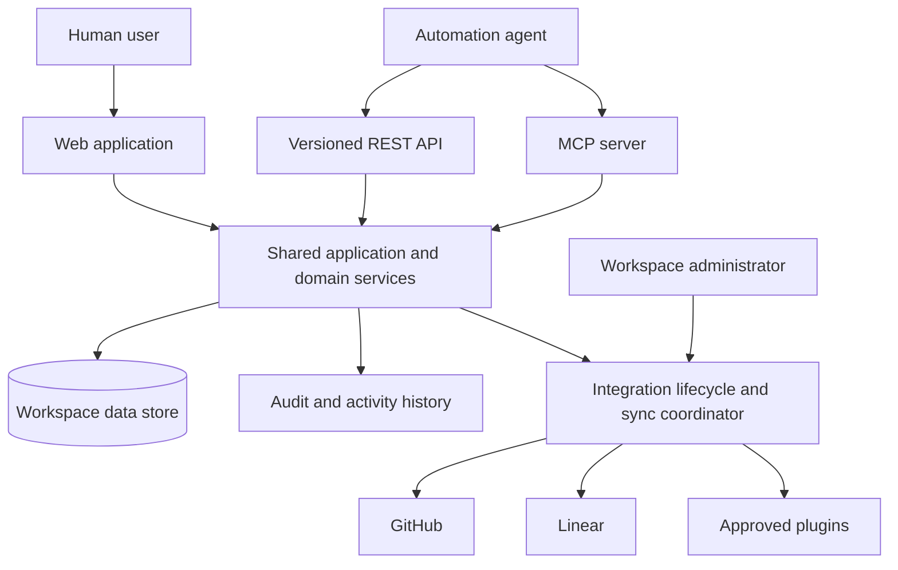
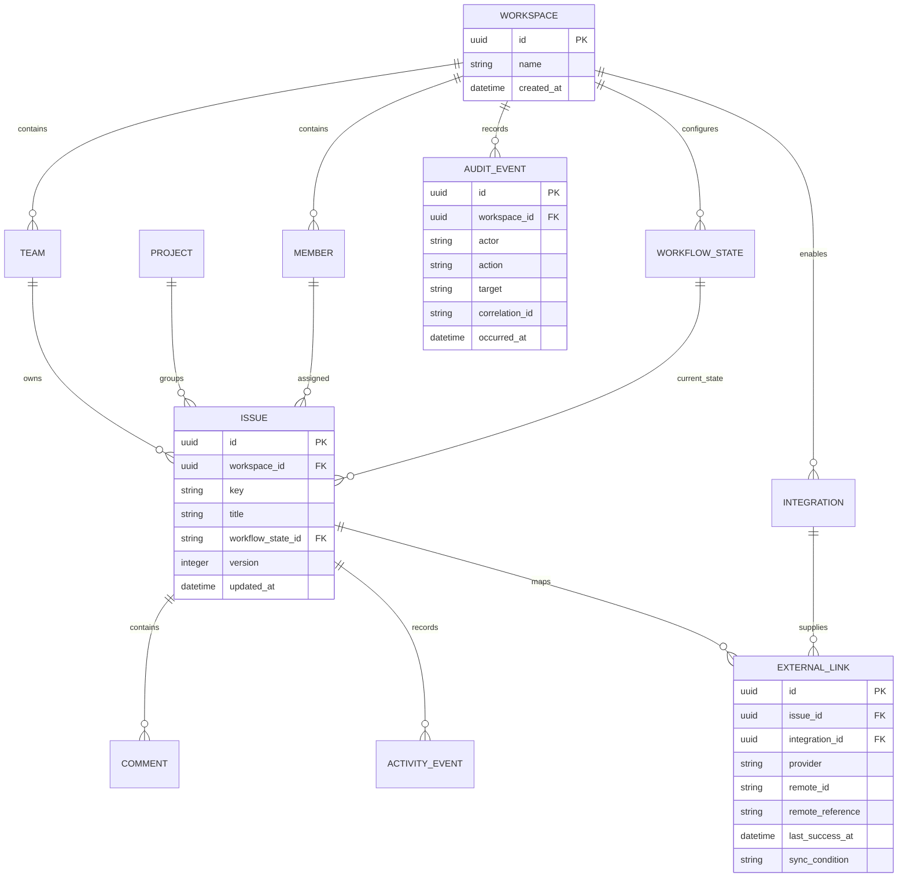

# Software Requirements Specification: Anvilboard

## 1. Document Information

| Field | Value |
|---|---|
| **Document ID** | SRS-ANV-001 |
| **Version** | 0.1 |
| **Author** | Anvilboard maintainers |
| **Reviewers** | Product, engineering, security, operations, and QA |
| **Date** | 2026-03-25 |
| **Status** | Draft |
| **Related PRD** | [`docs/anvilboard/prd.md`](prd.md) |

## 2. Revision History

| Version | Date | Author | Description of changes |
|---|---|---|---|
| 0.1 | 2026-03-25 | Anvilboard maintainers | Initial formal requirements for the future-state product. |

## 3. Introduction

### 3.1 Purpose

This SRS specifies the behavior and quality constraints of Anvilboard, a self-hosted, workspace-scoped work coordination product. It translates the product direction in the PRD into testable requirements for engineers, QA, product owners, operators, plugin authors, and pilot stakeholders. It covers the trusted core, integration platform, and automation surface. It does not prescribe a particular implementation except where a product constraint requires one.

### 3.2 Scope

Anvilboard shall provide authorized human and programmatic consumers with a unified workspace for local issues and selected externally synchronized issues. It shall support configurable but governed workflows, a web board and dashboard, safe integration administration, provenance and synchronization health, versioned automation interfaces, audit, and backup/restore. The product shall retain the low-operational-cost single-host deployment target.

This SRS excludes mandatory cloud hosting, broad enterprise portfolio management, unrestricted plug-in code execution, native mobile clients, and universal provider write-back. These exclusions match the PRD non-goals.

### 3.3 Definitions, Acronyms, and Abbreviations

| Term | Definition |
|---|---|
| SRS | Software Requirements Specification. |
| PRD | Product Requirements Document. |
| FR / NFR | Functional / non-functional requirement. |
| RTM | Requirements Traceability Matrix. |
| Workspace | Data-isolation and authorization boundary containing teams, people, configuration, and work. |
| Issue | A unit of tracked work with state, priority, ownership, activity, and optional external link. |
| Workflow | Ordered named states and the allowed transitions between them for a workspace. |
| Provider | An external work system such as GitHub or Linear. |
| Provenance | Provider, remote identity, mapping, and time metadata explaining an imported issue. |
| Sync condition | Machine- and human-readable condition of an integration or imported item, including freshness and safe failure detail. |
| MCP | Model Context Protocol, used as a stdio JSON-RPC automation interface. |
| Idempotency key | A client-provided mutation identifier used to prevent duplicate side effects on replay. |

### 3.4 References

| Document | Version | Date |
|---|---|---|
| [`ideas/anvilboard/draft.md`](../../ideas/anvilboard/draft.md) | 0.1 | 2026-09-05 |
| [`docs/project-anvilboard.md`](../project-anvilboard.md) | 0.1 | 2026-03-25 |
| [`docs/anvilboard/prd.md`](prd.md) | 0.1 | 2026-03-25 |
| [`docs/anvilboard/tech-design.md`](tech-design.md) | 0.1 | 2026-03-25 |

### 3.5 Overview

Section 4 places Anvilboard in its operating context. Section 5 defines functional requirements and use cases. Section 6 states measurable quality constraints. Sections 7 and 8 define data and interface requirements. Section 9 maps requirements to their PRD sources and planned verification artifacts. Open decisions remain explicitly identified rather than silently assumed.

## 4. Overall Description

### 4.1 Product Perspective

Anvilboard is the canonical local workspace for a team’s coordinated work, not a replacement for every external provider. The web application, REST API, CLI, and MCP server are equal consumers of a common application/domain layer. Provider adapters and approved plugins communicate with third-party services through managed integration lifecycles.

### 4.2 Product Functions

- Authenticate actors and authorize every request inside a workspace boundary.
- Configure workspaces, people, teams, roles, workflows, integrations, and plugin lifecycle settings.
- Create, find, filter, read, and mutate local work under workflow rules.
- Ingest approved provider data while retaining provenance, freshness, and health state.
- Present board, issue detail, dashboard, integration health, audit, and recovery views.
- Expose equivalent versioned REST/CLI/MCP operations with safe errors and mutation idempotency.
- Produce backups and permit authorized restore with integrity verification and audit.

### 4.3 User Characteristics

| User class | Characteristics | Required support |
|---|---|---|
| Workspace administrator | Configures access, workflow, integrations, secrets, and recovery; understands deployment responsibilities. | High-impact actions, safe diagnostics, audit, and least-privilege administration. |
| Delivery coordinator | Triage, prioritizes, monitors source freshness, and balances workload. | Fast board navigation, filters, grouping, source context, and dashboard drill-down. |
| Contributor | Updates assigned work and contributes discussion. | Focused issue UI, understandable transition validation, and activity context. |
| Automation agent | Uses REST or MCP programmatically and may be human supervised. | Versioned schemas, scoped credentials, symbolic values, stable errors, pagination, idempotency, and no secret access. |
| Plugin author | Implements approved extension points. | Published compatibility contract, lifecycle validation, bounded failure behavior, and safe logs. |

### 4.4 Constraints

- The supported initial deployment shall run as one application host with one durable local SQLite data store; no message broker or database server shall be mandatory.
- The web API, CLI, and MCP interfaces shall use shared domain/application operations rather than channel-specific business rules.
- Stdio MCP stdout shall be reserved for JSON-RPC protocol output; operational logging shall use stderr or configured logging sinks.
- Provider data use shall comply with each provider’s authentication, API, rate-limit, and webhook requirements.
- External provider write-back is out of scope unless separately enabled by a future approved requirement.

### 4.5 Assumptions and Dependencies

- A deployment administrator provides a secure host, persistent storage, system clock, and backup destination.
- A deployment has an approved identity/token approach before multi-user or agent access is enabled.
- GitHub and Linear credentials and API access are available when their integrations are enabled.
- Users understand that an imported issue may be read-only for provider-controlled fields in the initial release.
- The technical design will set exact credential storage, encryption, retention, RPO/RTO, and API version compatibility values for unresolved product decisions.

## 5. Functional Requirements

### 5.1 Workspace and access

#### FR-WS-001: Workspace-scoped authentication and authorization

| Field | Value |
|---|---|
| Priority | P0 |
| Source | PRD-ANV-001 |
| Description | The system shall authenticate every non-bootstrap human and programmatic request and authorize it against a workspace-scoped role before reading or mutating workspace data. |
| Acceptance criteria | (1) A request without valid credentials is rejected with a machine-readable authentication error. (2) A valid actor cannot read or mutate a workspace for which it lacks permission. (3) A role grants only documented operations. (4) Authorization decisions are auditable for mutations and security-relevant configuration actions. |

**Primary actor:** Human user or automation agent.

**Preconditions:** A workspace exists; the actor has a credential or the product is performing the explicit first-administrator bootstrap flow.

**Main flow:**
1. The actor submits a web, REST, CLI, or MCP request with credentials.
2. The system authenticates the credential and resolves the requested workspace.
3. The system evaluates the role permission for the operation.
4. The system processes the request only when authorized and returns the channel-appropriate structured result.

**Alternative flows:**
- **AF-1 Invalid or missing credential:** The system returns `AUTHENTICATION_REQUIRED` without exposing workspace existence.
- **AF-2 Valid credential, missing workspace permission:** The system returns `WORKSPACE_ACCESS_DENIED` and a correlation ID; it does not return workspace data.
- **AF-3 Credential revoked or expired:** The system returns `CREDENTIAL_INVALID_OR_EXPIRED`; an agent treats this as non-retryable until a human refreshes authorization.

#### FR-WS-002: Workspace configuration and workflow governance

| Field | Value |
|---|---|
| Priority | P0 |
| Source | PRD-ANV-002 |
| Description | An authorized administrator shall create and maintain workspace teams, members, roles, and a named ordered workflow with permitted transitions. |
| Acceptance criteria | (1) The system rejects duplicate stable state identifiers within a workspace. (2) At least one team and a valid initial workflow state exist before issue creation. (3) Removing a referenced configuration item requires reassignment, archival, or an explicit validation failure naming the dependency. (4) Every configuration mutation emits an audit event. |

#### FR-WS-003: Workflow transition enforcement

| Field | Value |
|---|---|
| Priority | P0 |
| Source | PRD-ANV-002, PRD-ANV-004 |
| Description | The system shall permit an issue state change only when the requested transition is allowed by that issue’s workspace workflow and the actor has mutation permission. |
| Acceptance criteria | (1) The response identifies the current state, requested state, and violated transition when denied. (2) The same transition result is produced through web, REST, CLI, and MCP channels. (3) A successful transition records activity, audit data, actor, timestamp, and correlation ID. |

### 5.2 Board, issue, and dashboard

#### FR-WRK-001: Unified board query

| Field | Value |
|---|---|
| Priority | P0 |
| Source | PRD-ANV-003 |
| Description | The system shall return workspace issues to authorized users with filtering and grouping by team, workflow state, assignee, priority, project, label, provider, and synchronization condition. |
| Acceptance criteria | (1) Applied filters are represented in the request and response context. (2) A filter never returns data outside the actor’s workspace. (3) A no-result response is successful and identifies active filters. (4) Sorting and pagination use documented deterministic fields and cursor or page semantics. |

#### FR-WRK-002: Issue creation and mutation

| Field | Value |
|---|---|
| Priority | P0 |
| Source | PRD-ANV-004, PRD-ANV-007 |
| Description | The system shall permit an authorized actor to create a local issue and to update permitted local fields, assignment, priority, labels, comments, and workflow state using one shared business-operation contract. |
| Acceptance criteria | (1) Creation validates required workspace/team/workflow references and returns a stable issue identifier. (2) Field validation errors identify each invalid field and rule. (3) Provider-controlled fields on imported issues cannot be modified locally unless a future write-back policy explicitly permits them. (4) Successful mutations create activity and audit events. (5) Conditional updates detect stale versions and return `CONCURRENCY_CONFLICT` with refresh guidance. |

#### FR-WRK-003: Issue detail and activity

| Field | Value |
|---|---|
| Priority | P0 |
| Source | PRD-ANV-004, PRD-ANV-005 |
| Description | The system shall display an authorized issue’s current fields, comments, activity history, provenance, synchronization condition, and field ownership where applicable. |
| Acceptance criteria | (1) Activity includes actor, action, timestamp, target, and safe before/after summary. (2) Comments are ordered deterministically and access-controlled. (3) Provenance distinguishes local from provider-backed records. (4) Sensitive credentials and secret values never appear in detail or activity output. |

#### FR-WRK-004: Dashboard summaries and drill-down

| Field | Value |
|---|---|
| Priority | P1 |
| Source | PRD-ANV-009 |
| Description | The system shall provide authorized workspace dashboard summaries for workflow distribution, source distribution, freshness/sync exceptions, and assignee load, with drill-down queries that preserve scope. |
| Acceptance criteria | (1) Summary counts reconcile with the matching board query. (2) A drill-down includes the filter context that produced its count. (3) Empty or unavailable integration data is distinguished from zero work. |

### 5.3 Integration and plugin platform

#### FR-INT-001: Secure integration lifecycle

| Field | Value |
|---|---|
| Priority | P0 |
| Source | PRD-ANV-005, PRD-ANV-006 |
| Description | The system shall allow authorized administrators to configure, validate, enable, pause, test, and remove an approved integration without exposing stored secrets. |
| Acceptance criteria | (1) Secret input is write-only and redacted in every read, log, error, audit, and export surface. (2) A test action reports provider reachability and validation result without importing data unless explicitly requested. (3) A paused integration performs no scheduled polling or webhook processing. (4) Removal requires confirmation and defines whether retained imported data is archived or remains read-only. |

#### FR-INT-002: Provenance-preserving ingestion and synchronization

| Field | Value |
|---|---|
| Priority | P0 |
| Source | PRD-ANV-005 |
| Description | The system shall ingest records from enabled providers using a stable remote identity and retain provider, remote reference, last attempt, last success, freshness, and safe synchronization condition. |
| Acceptance criteria | (1) Repeated delivery of the same remote record does not create duplicates. (2) A provider record maps deterministically to one external link within a workspace. (3) Import failures retain the last-known usable record where safe and visibly mark staleness. (4) One failing integration does not block local work or unrelated integrations. (5) A health record exposes last attempt, last success, count, cursor/freshness, and safe error category. |

#### FR-INT-003: Plugin compatibility and bounded execution

| Field | Value |
|---|---|
| Priority | P1 |
| Source | PRD-ANV-010 |
| Description | The system shall support approved ingestion, webhook, and post-commit plugins through versioned manifests and contracts, while preventing plugin failure from corrupting or blocking core committed work. |
| Acceptance criteria | (1) Installation validates identity, supported contract version, declared capabilities, and configuration before activation. (2) Ingestion and webhook plugin outcomes are normalized before persistence. (3) A post-commit hook cannot veto an already committed core mutation. (4) Plugin failures are captured as health/audit diagnostics and isolated according to execution policy. |

### 5.4 Automation and operational accountability

#### FR-AUT-001: Versioned REST and MCP contracts

| Field | Value |
|---|---|
| Priority | P0 |
| Source | PRD-ANV-007 |
| Description | The system shall expose documented versioned REST and MCP operations for supported board, issue, dashboard, and integration-health actions, using symbolic domain values and stable schemas. |
| Acceptance criteria | (1) REST and MCP return documented symbolic workflow state, priority, provider, and sync-condition values rather than channel-specific numeric encodings. (2) Read operations support documented pagination, filtering, and ordering where result sets can grow. (3) Each response includes a schema/API version and correlation ID. (4) MCP stdout contains protocol responses only. |

#### FR-AUT-002: Idempotent, traceable automation mutations

| Field | Value |
|---|---|
| Priority | P0 |
| Source | PRD-ANV-007 |
| Description | The system shall require an idempotency key for supported automation mutations and shall associate each processed request with a correlation ID and audit/activity records. |
| Acceptance criteria | (1) The same actor, key, and equivalent request replay returns the original result without duplicate side effects. (2) Reuse of a key with a different request returns `IDEMPOTENCY_KEY_REUSED`. (3) A result identifies the correlation ID used to find its audit record. (4) Idempotency retention duration is documented and observable to clients. |

#### FR-AUT-003: Machine-readable errors and retry behavior

| Field | Value |
|---|---|
| Priority | P0 |
| Source | PRD-ANV-007 |
| Description | The system shall return anticipated automation failures as structured errors containing a stable code, safe cause, correlation ID, retryability indicator, and retry-after value when known. |
| Acceptance criteria | (1) Validation errors identify invalid field/rule. (2) missing references identify entity type and requested identifier without leaking unauthorized data. (3) authorization, concurrency, rate-limit, provider, and idempotency failures are distinguishable. (4) Agents can determine whether retry is safe without parsing prose. |

#### FR-OPS-001: Audit history

| Field | Value |
|---|---|
| Priority | P0 |
| Source | PRD-ANV-008 |
| Description | The system shall append an immutable audit record for authentication-relevant decisions, configuration changes, integrations, secrets metadata changes, issue mutations, automation mutations, backup, and restore operations. |
| Acceptance criteria | (1) Audit records include workspace, actor/principal, channel, action, target, timestamp, result, correlation ID, and safe contextual summary. (2) Normal users cannot edit or delete audit history. (3) Audit queries are workspace-scoped and permission-gated. (4) Secret values and authentication material are redacted. |

#### FR-OPS-002: Backup and restore

| Field | Value |
|---|---|
| Priority | P0 |
| Source | PRD-ANV-008 |
| Description | The system shall support an authorized backup operation and a documented restore workflow that verifies integrity before declaring a workspace usable. |
| Acceptance criteria | (1) Backup output contains enough metadata to identify workspace, time, product/schema version, and integrity result without containing exposed secrets in logs. (2) Restore requires elevated authorization and explicit target confirmation. (3) Restore verifies integrity and reports a specific failure cause. (4) Backup and restore actions emit audit events. |

### 5.5 CRUD Matrix

| Entity | Create | Read | Update | Delete/archive | Primary actors |
|---|---|---|---|---|---|
| Workspace | Administrator bootstrap | Authorized member | Administrator | Archive only | Administrator |
| Team/member/role | Administrator | Authorized member | Administrator | Archive/remove with dependency validation | Administrator |
| Workflow state/transition | Administrator | Authorized member | Administrator | Archive after migration validation | Administrator |
| Issue | Contributor, coordinator, authorized agent | Authorized member/agent | Authorized actor under rules | Archive only; retention policy applies | Contributor, coordinator, agent |
| Comment | Authorized actor | Authorized member/agent | Policy-defined; initial release append-only preferred | Policy-defined archive | Contributor, coordinator, agent |
| Integration | Administrator | Administrator and authorized health readers | Administrator | Pause/remove | Administrator |
| Plugin | Administrator | Administrator | Administrator | Deactivate/remove | Administrator |
| Audit event | System | Authorized auditor/administrator | Never | Retention-managed only | System |
| Backup | Administrator/system policy | Administrator | N/A | Retention-managed only | Administrator |

## 6. Non-Functional Requirements

### 6.1 Performance Requirements

#### NFR-PERF-001: Interactive query responsiveness

| Field | Value |
|---|---|
| Priority | P0 |
| Metric | Authorized board/list and issue-detail response time under pilot reference load |
| Target | p95 ≤ 2 seconds for board/list queries and ≤ 1 second for single-issue detail, excluding client network transfer |
| Threshold rationale | A coordinator must triage interactively; a two-second list threshold accommodates a single-host SQLite deployment without demanding enterprise infrastructure. |
| Measurement | Automated integration performance test on documented pilot reference data and host profile. |

The system shall keep long-running synchronization, backup, and plugin work off the interactive request path unless a caller explicitly requests a bounded synchronous test operation.

### 6.2 Security Requirements

#### NFR-SEC-001: Credential and secret protection

| Field | Value |
|---|---|
| Priority | P0 |
| Metric | Secret exposure paths |
| Target | Zero secret values in API responses, UI read models, logs, audit records, error bodies, and backup metadata. |
| Threshold rationale | Provider and workspace credentials are high-impact; partial redaction is not an acceptable production alternative. |
| Measurement | Security review, automated log/response tests, and restore/export inspection. |

The technical design shall define at-rest protection appropriate to the chosen deployment and the secure secret-provider abstraction.

#### NFR-SEC-002: Least privilege and tenant isolation

| Field | Value |
|---|---|
| Priority | P0 |
| Metric | Cross-workspace authorization test cases passing |
| Target | 100% of defined cross-workspace read/mutation attempts are denied and produce no protected data. |
| Threshold rationale | Workspace boundaries are the core safety model; a weaker target makes shared deployment unsafe. |
| Measurement | Automated authorization integration suite and security review. |

### 6.3 Reliability Requirements

#### NFR-REL-001: Data integrity and mutation durability

| Field | Value |
|---|---|
| Priority | P0 |
| Metric | Verified mutation outcomes and duplicate effects on replay |
| Target | Each successful mutation is atomic with its required issue/activity/audit records; zero duplicate side effects for supported idempotent replay. |
| Threshold rationale | Work history cannot be trusted if state, activity, and audit diverge or retries duplicate work. |
| Measurement | Transactional integration tests, fault-injection tests, and audit reconciliation checks. |

#### NFR-REL-002: Integration fault containment

| Field | Value |
|---|---|
| Priority | P0 |
| Metric | Impact of an integration/plugin failure |
| Target | A failed source cannot prevent local issue operations or scheduling of unrelated sources. |
| Threshold rationale | External API availability is outside product control; containment is the affordable alternative to high-availability infrastructure. |
| Measurement | Integration tests that inject provider and plugin faults. |

### 6.4 Availability Requirements

#### NFR-AVL-001: Supported single-host recovery

| Field | Value |
|---|---|
| Priority | P0 |
| Metric | Documented recovery drill |
| Target | A pilot workspace completes a verified backup/restore drill at least once per release candidate; target RPO/RTO remain open decisions until pilot requirements are agreed. |
| Threshold rationale | A recovery procedure proven once is the minimum evidence for a local-first product; fabricated availability percentages would not reflect the deployment model. |
| Measurement | Signed operational checklist and automated integrity verification output. |

### 6.5 Maintainability Requirements

#### NFR-MNT-001: Versioned extension and interface compatibility

| Field | Value |
|---|---|
| Priority | P1 |
| Metric | Published compatibility checks for public contracts |
| Target | API/MCP and plugin contracts declare versions; incompatible changes require a migration/compatibility note and contract-test update before release. |
| Threshold rationale | Extensibility can be safely deferred behind P0 core trust controls, but unversioned public contracts would quickly make provider/plugin support unmaintainable. |
| Measurement | CI contract tests, release checklist, and compatibility review. |

### 6.6 Portability Requirements

#### NFR-PRT-001: Supported deployability

| Field | Value |
|---|---|
| Priority | P1 |
| Metric | Clean-host deployment validation |
| Target | The documented supported host profile can deploy the application, persist data, configure a workspace, and execute backup/restore without a mandatory external database or message broker. |
| Threshold rationale | Low operational burden is a central differentiator, though a platform support matrix can mature after trusted core delivery. |
| Measurement | Release deployment smoke test and operations runbook review. |

### 6.7 Usability Requirements

#### NFR-USB-001: Clear operational feedback

| Field | Value |
|---|---|
| Priority | P0 |
| Metric | Completion of representative admin and triage tasks without ambiguous failure |
| Target | Pilot participants can identify source/freshness, active board filters, and specific validation/integration failure causes in observed task sessions. |
| Threshold rationale | Trust and safe recovery depend on clear feedback; generic failure messages make a small self-hosted product expensive to operate. |
| Measurement | Pilot usability sessions, accessibility review, and UI/API error-content tests. |

## 7. Data Requirements

### 7.1 Data Model

### 7.2 Data Dictionary

| Field | Type | Constraints | Description |
|---|---|---|---|
| workspace.id | UUID | PK, immutable | Workspace authorization/data boundary. |
| issue.id | UUID | PK, immutable | Internal issue identifier. |
| issue.key | String | Unique per workspace/team according to configured key policy | Human-readable issue reference. |
| issue.workflow_state_id | Stable string/UUID | Required FK to active or archived state mapping | Current workflow state. |
| issue.version | Integer | Required, monotonic | Optimistic concurrency token. |
| external_link.provider + remote_id | String pair | Unique within workspace/provider integration mapping | Deduplication identity for imported record. |
| external_link.last_success_at | Timestamp | Nullable for never-successful import | Last successful synchronization time. |
| external_link.sync_condition | Enumerated symbolic value (derived, not stored) | Required for linked item | Fresh, stale, paused, failed, or other documented condition, derived at read time from provider health inputs rather than persisted. |
| integration.secret_reference | Opaque string | Write-only/read-redacted | Reference to protected credential material, never the raw secret. |
| audit_event.correlation_id | String | Required for request-caused event | Links results, audit, logs, and diagnostics. |
| idempotency_record.key | String | Unique by actor/workspace/operation within retention period | Prevents duplicate supported mutations. |

### 7.3 Data Lifecycle and Retention

- Issues, activity, and audit data are retained until workspace archival or an approved retention policy; ordinary users cannot hard-delete them.
- Configuration changes must preserve enough historical mapping to interpret prior issue state/activity after workflow evolution.
- Imported provider data is retained according to workspace policy and provider obligations; removal of an integration does not silently erase audit history.
- Idempotency records are retained for the published period and then may be expired; the response contract exposes that period.
- Backups must include schema/product version and integrity metadata. Secret material handling in backups is defined by the technical design and security decision.

## 8. External Interface Requirements

### 8.1 User Interfaces

The web application shall provide authenticated workspace selection; board/list filters and groups; issue detail, comments, activity, and provenance; dashboard drill-down; integration health; configuration; audit search; and backup/restore administration. It shall identify active filters, empty results, permission boundaries, freshness, and specific validation/sync failures. Responsive desktop-first presentation is required; native mobile is not.

### 8.2 Hardware Interfaces

No special hardware interface is required. Supported deployment hardware is a host capable of running the application runtime, retaining the data store and backups, and accessing configured external provider endpoints.

### 8.3 Software Interfaces

| Interface | Direction | Requirement |
|---|---|---|
| Versioned REST API | Consumer ↔ Anvilboard | HTTPS JSON interface with documented schemas, symbolic domain values, pagination, correlation IDs, idempotency for supported mutations, and structured errors. |
| MCP stdio JSON-RPC | Agent ↔ Anvilboard | Structured operations over stdio; stdout protocol-only; diagnostics routed away from stdout. |
| CLI | Operator/agent → Anvilboard | Uses the same application operations and error semantics as API/MCP; must not bypass authorization. |
| GitHub API/webhooks | Anvilboard ↔ GitHub | Provider adapter honors configured credentials, rate limits, and validation/signature rules. |
| Linear GraphQL/API | Anvilboard ↔ Linear | Provider adapter honors configured credentials, pagination/cursor semantics, and rate limits. |
| Plugin contracts | Plugin ↔ Anvilboard | Versioned manifest plus ingestion, webhook, and post-commit contracts subject to lifecycle validation. |

### 8.4 Communication Interfaces

- REST traffic shall use HTTPS in supported production deployments.
- REST errors shall be JSON with stable code, safe reason, correlation ID, retryability, and retry-after when known.
- MCP uses stdio JSON-RPC; it shall not emit non-protocol text to stdout.
- Provider communications shall use the provider-required secure transport and credential handling.
- Retry policies must be bounded and respect provider rate limits; non-transient business/authorization failures are not automatically retried.

## 9. Requirements Traceability Matrix

| SRS requirement | Source PRD requirement | Verification approach | Design/feature destination |
|---|---|---|---|
| FR-WS-001 | PRD-ANV-001 | Authorization integration and security tests | `tech-design.md` workspace boundary |
| FR-WS-002, FR-WS-003 | PRD-ANV-002 | Configuration and transition tests | `tech-design.md` workflow model |
| FR-WRK-001 | PRD-ANV-003 | Board/list integration and UI tests | `tech-design.md` query/read model |
| FR-WRK-002, FR-WRK-003 | PRD-ANV-004 | Domain/API/UI mutation tests | `tech-design.md` issue aggregate |
| FR-INT-001, FR-INT-002 | PRD-ANV-005, PRD-ANV-006 | Provider-adapter, secret-redaction, and health tests | `integration-and-plugin-platform.md` |
| FR-AUT-001, FR-AUT-002, FR-AUT-003 | PRD-ANV-007 | REST/MCP contract and idempotency tests | `agent-and-automation-surface.md` |
| FR-OPS-001, FR-OPS-002 | PRD-ANV-008 | Audit and backup/restore drills | `tech-design.md` operations |
| FR-WRK-004 | PRD-ANV-009 | Aggregate reconciliation and UI drill-down tests | `tech-design.md` dashboard/read model |
| FR-INT-003 | PRD-ANV-010 | Plugin lifecycle and fault-isolation tests | `integration-and-plugin-platform.md` |
| Future write-back policy | PRD-ANV-011 | Deferred | Future feature specification |
| Saved views/notifications | PRD-ANV-012 | Deferred | Future feature specification |
| NFR-PERF-001 through NFR-USB-001 | PRD goals 001–005 | Performance, security, fault, recovery, deployability, and usability evidence | `tech-design.md` quality plan |

## 10. Appendix

### A. Error Vocabulary

The exact public error catalog is a technical-design deliverable. At minimum it shall distinguish: `AUTHENTICATION_REQUIRED`, `CREDENTIAL_INVALID_OR_EXPIRED`, `WORKSPACE_ACCESS_DENIED`, `VALIDATION_FAILED`, `REFERENCED_ENTITY_NOT_FOUND`, `INVALID_WORKFLOW_TRANSITION`, `CONCURRENCY_CONFLICT`, `IDEMPOTENCY_KEY_REUSED`, `RATE_LIMITED`, `PROVIDER_UNAVAILABLE`, and `INTEGRATION_PAUSED`.

### B. Open Questions

The open questions in PRD §19 remain binding downstream decisions. In particular, implementation shall not silently select an identity model, workflow freedom model, provider field-ownership policy, recovery objective, pilot cohort, or third-party plugin trust model without recording the decision in the technical design/ADR section.

### C. Requirement Quality Check

Each P0/P1 requirement above has a unique stable ID, source, declarative shall statement, observable acceptance criteria, and a verification destination. Unresolved numerical operational thresholds are deliberately labeled as decisions rather than invented.
