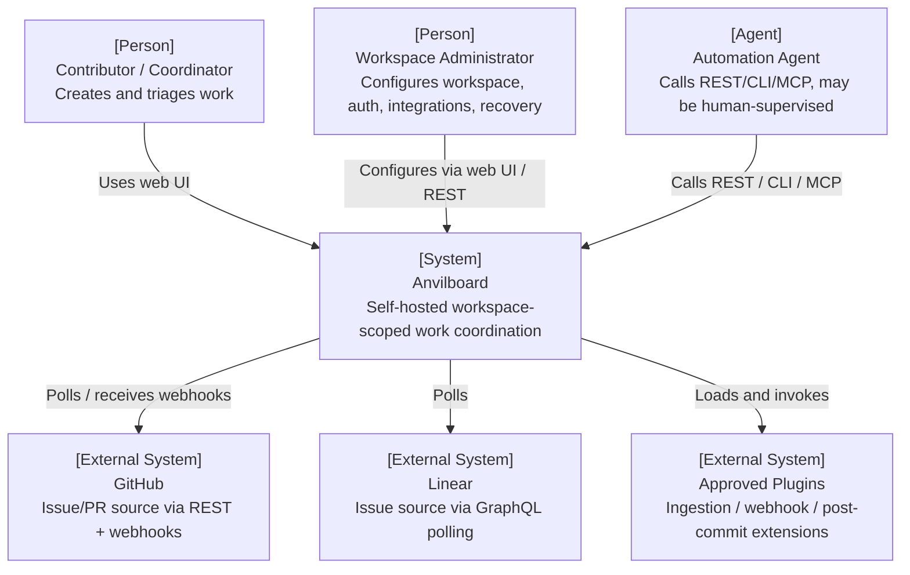
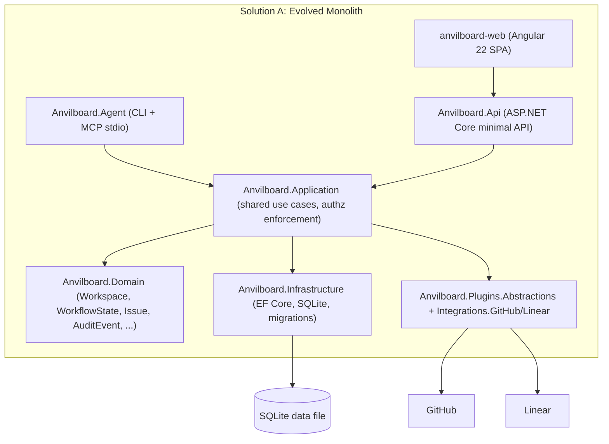
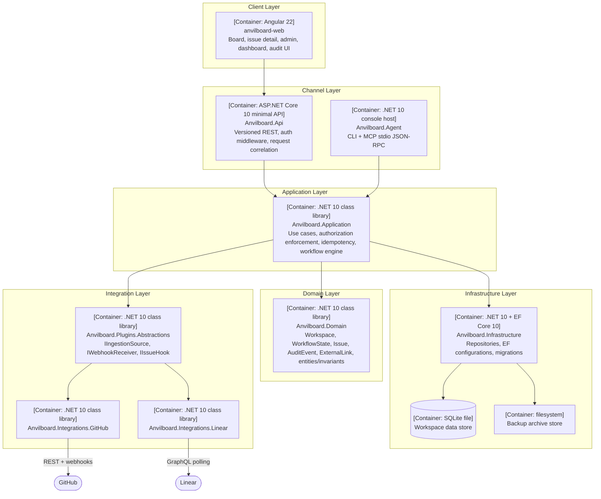
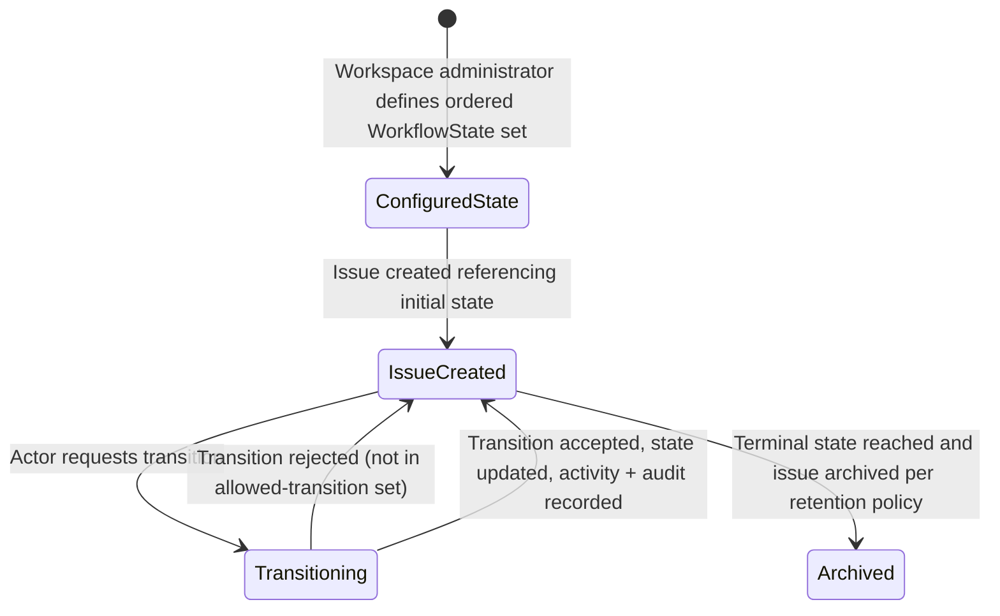
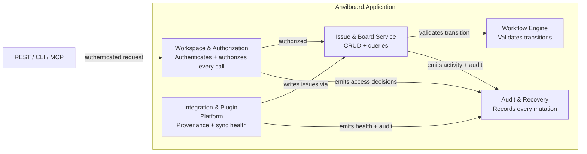
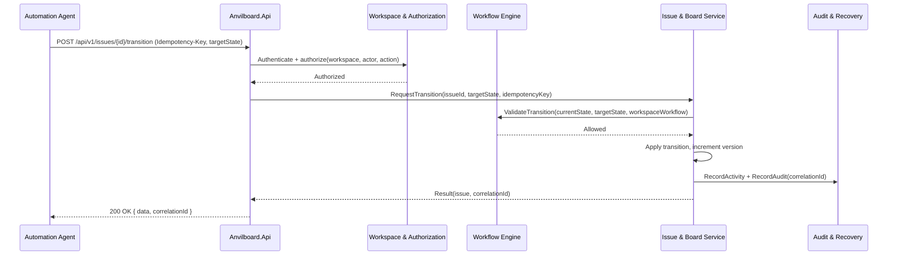
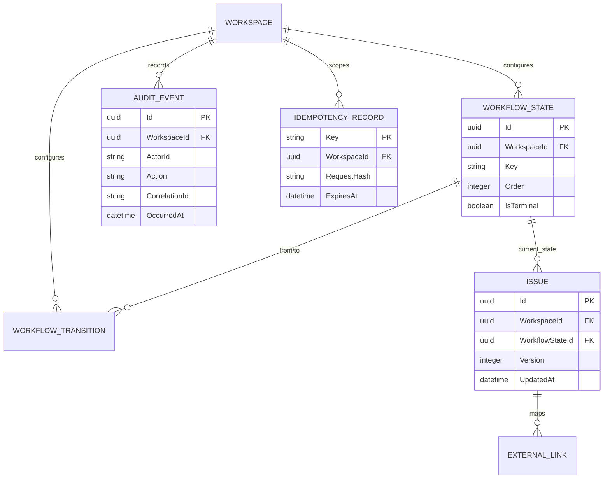

# Technical Design: Anvilboard

## 1. Document Information

| Field | Value |
|---|---|
| **Document ID** | TDD-ANV-001 |
| **Version** | 0.1 |
| **Author** | Anvilboard maintainers |
| **Reviewers** | Engineering, security, operations |
| **Date** | 2026-03-25 |
| **Status** | Draft |
| **Related PRD** | [`docs/anvilboard/prd.md`](prd.md) |
| **Related SRS** | [`docs/anvilboard/srs.md`](srs.md) |
| **Related project manifest** | [`docs/project-anvilboard.md`](../project-anvilboard.md) |

## 2. Revision History

| Version | Date | Author | Description |
|---|---|---|---|
| 0.1 | 2026-03-25 | Anvilboard maintainers | Initial technical design for the future-state product, superseding the PoC-era `SPEC.md`/`FUNCTIONAL_SPEC.md` as canonical architecture reference. |

## 3. Overview

### 3.1 Background

Anvilboard exists today (`src/`) as a working proof of concept: a .NET 10 minimal-API backend with EF Core/SQLite, an Angular 22 standalone-component SPA, GitHub and Linear polling adapters, and a CLI/MCP automation surface. The PoC validated the layered architecture (`Anvilboard.Domain` → `Anvilboard.Plugins.Abstractions` → `Anvilboard.Infrastructure` → `Anvilboard.Application` → `Anvilboard.Api`/`Anvilboard.Agent`/`anvilboard-web`) and the "shared application services power every channel" principle. It has known gaps against the future-state product defined in the PRD/SRS: no workspace-scoped multi-tenant authorization, a fixed global `IssueStatus` enum instead of configurable workflows, numeric enum serialization on the API versus symbolic serialization on the agent surface, no audit trail, no idempotency support for automation mutations, and no backup/restore workflow.

### 3.2 Goals

- Evolve the existing layered .NET/Angular architecture into the future-state design without a rewrite: extend `Anvilboard.Domain`, `Anvilboard.Application`, `Anvilboard.Infrastructure`, `Anvilboard.Api`, `Anvilboard.Agent`, and `anvilboard-web` in place.
- Introduce workspace-scoped authentication/authorization as the foundational cross-cutting concern (FR-WS-001).
- Replace the fixed `IssueStatus` enum with a configurable, migration-safe workflow model (FR-WS-002, FR-WS-003) while preserving existing data via a mapping migration.
- Normalize REST and MCP/CLI contracts onto one shared, versioned, symbolic schema (FR-AUT-001) and add idempotency, correlation IDs, and a structured error taxonomy (FR-AUT-002, FR-AUT-003).
- Add an append-only audit trail (FR-OPS-001) and a verified backup/restore workflow (FR-OPS-002).
- Preserve and formalize the existing integration/plugin architecture's fault-isolation properties (FR-INT-001–003) while adding provenance and sync-health surfacing.

### 3.3 Non-Goals

- Rewriting the persistence engine away from SQLite or introducing a mandatory external database/broker (matches PRD non-goal: single-host deployment).
- Implementing provider write-back, saved views, or notifications in this design pass (PRD-ANV-011, PRD-ANV-012 are deferred; see §17).
- Building a plugin sandboxing/untrusted-code execution model; only first-party-reviewed plugin packages are in scope.
- Multi-region or horizontally scaled deployment topologies.

### 3.4 Scope

In scope: workspace/auth model, configurable workflow engine, unified board/issue read-and-write model, integration/plugin lifecycle and sync-health model, REST/CLI/MCP contract normalization with idempotency and error taxonomy, audit trail, backup/restore, and the supporting data-model migrations. Out of scope: anything listed in §3.3, and any UI visual redesign beyond what is needed to surface new workflow/provenance/audit data.

### 3.5 User Scenarios

| # | Persona | Type | Goal | Steps | Success Condition |
|---|---|---|---|---|---|
| US-001 | Workspace administrator | Human | Configure an enforceable workspace workflow. | Create teams; define ordered states and allowed transitions; attempt to create an issue using an unconfigured state. | Valid configuration is persisted; the invalid request is rejected with a specific error and creates no issue. |
| US-002 | Coordinator | Human | Triage stale work on the unified board. | Filter by provider and sync condition; inspect stale imported issues; reassign a local issue. | The filter result is consistent between UI and REST; reassignment appears in issue activity and workspace audit. |
| US-003 | Automation agent | Agent | Create an issue safely despite a network retry. | Submit a mutation with an `Idempotency-Key`; lose the response; replay the byte-equivalent request with the same authenticated actor and key. | The replay returns the original result and correlation ID; exactly one issue, activity event, and audit event exist. |
| US-004 | Integration operator | Human | Continue work while one provider degrades. | Observe GitHub polling failures; inspect integration health; continue Linear sync and perform a local issue mutation. | GitHub is marked failed or stale with diagnostic context; Linear and local paths continue without waiting for GitHub recovery. |
| US-005 | Workspace administrator | Human | Restore a workspace safely. | Start restore on a fresh host; provide a backup artifact; allow integrity and compatibility validation to complete. | Only a verified compatible backup makes the workspace usable; a corrupt or incompatible artifact fails closed and creates an audit record. |

### 3.6 Acceptance Criteria

| AC-ID | Priority | Criterion | Scenario | Verification Method |
|---|---|---|---|---|
| AC-001 | P0 | An authenticated actor can read or mutate only workspaces for which its role grants the requested action. | US-001, US-002 | Authorization integration tests cover each role/action/workspace combination. |
| AC-002 | P0 | A request for another workspace is rejected as `WORKSPACE_ACCESS_DENIED` without leaking issue, member, or workspace data. | US-001 | Negative API, CLI, and MCP contract tests assert status, code, and absence of resource fields. |
| AC-003 | P0 | A workspace workflow accepts only configured states and explicitly allowed transitions. | US-001 | Workflow service tests and transition API integration tests. |
| AC-004 | P0 | A transition from an unconfigured state or to a disallowed state returns `INVALID_WORKFLOW_TRANSITION`, naming current state, requested state, and violated rule, with no version increment. | US-001 | Boundary/error integration tests assert error payload and unchanged persisted issue. |
| AC-005 | P0 | Board queries support the canonical filters (team, workflow state, assignee, priority, project, label, provider, sync condition) with identical symbolic values across UI, REST, CLI, and MCP. | US-002 | Cross-channel contract fixtures compare normalized query results. |
| AC-006 | P0 | A page request with `limit` 1–100 returns a stable ordered page and valid opaque cursor; `limit` 0, 101, or malformed cursor returns `VALIDATION_FAILED`. | US-002 | Boundary API tests at 0, 1, 100, and 101 plus malformed-cursor tests. |
| AC-007 | P0 | A supported automation mutation is atomic and idempotent for an identical actor, key, and canonical request payload. | US-003 | Integration test replays the request and counts issues, activities, audits, and idempotency records. |
| AC-008 | P0 | Reuse of an idempotency key with a different payload or actor returns `IDEMPOTENCY_KEY_REUSED` and performs no mutation. | US-003 | Negative integration tests vary payload and actor while retaining the key. |
| AC-009 | P1 | Provider sync health records last success, failure reason, and condition without blocking another provider or local issue mutations. | US-004 | Fault-injection integration tests hold GitHub unavailable while executing Linear and local operations. |
| AC-010 | P1 | Provider-controlled fields remain read-only locally unless a workspace write-back policy is explicitly enabled. | US-004 | Negative authorization/business-rule test against an externally linked issue. |
| AC-011 | P0 | Every configuration change, issue mutation, automation mutation, integration action, and backup or restore action produces one searchable audit record with actor, workspace, action, outcome, and correlation ID. | US-002, US-003, US-005 | Integration tests query audit records following each mutation category. |
| AC-012 | P0 | Restore validates artifact integrity and compatibility before activation; corrupt, incomplete, or incompatible artifacts fail closed with a specific non-500 error and leave the target workspace unusable. | US-005 | Restore integration tests inject corrupt, missing, and incompatible artifacts. |

### 3.7 Success Metrics

| Metric | Target | Source |
|---|---|---|
| Cross-workspace authorization test pass rate | 100% of defined test cases | NFR-SEC-002 |
| Board/list p95 response time | ≤ 2s on pilot reference data/host | NFR-PERF-001 |
| Duplicate side effects on supported mutation replay | 0 | NFR-REL-001 |
| Verified backup/restore drills per release candidate | ≥ 1 | NFR-AVL-001 |
| Secret exposure findings in API/UI/logs/audit/backup | 0 | NFR-SEC-001 |

## 4. System Context



Anvilboard is the system under design. Human users and automation agents are the only consumers; GitHub, Linear, and approved plugins are external systems the integration platform depends on. There is no external identity provider in the initial release — authentication is self-hosted (see §11.1 for the open decision on identity approach).

## 5. Solution Design

### 5.1 Solution A (Recommended): Evolve the existing layered monolith in place

**Description:**

Keep the current single-deployable, layered .NET solution and Angular SPA. Add a `Workspace`/`Role`/`Principal` authorization layer at the `Anvilboard.Application` boundary (enforced by API/Agent middleware, not duplicated per-endpoint). Replace the `IssueStatus` enum with a `WorkflowState` entity referenced by stable ID, with a data migration mapping each existing enum value to an equivalent seeded state per workspace. Add `AuditEvent`, `IdempotencyRecord`, and `IntegrationHealth`/sync-condition fields to the domain and persist them via new EF Core configurations and migrations, consistent with the existing `Persistence/Configurations` pattern. Normalize REST and MCP DTOs onto one shared contract module so both channels serialize workflow state, priority, provider, and sync condition symbolically. This solution reuses the current dependency-injection wiring, plugin abstraction (`IIngestionSource`, `IWebhookReceiver`, `IIssueHook`), and per-source sync loop isolation, extending rather than replacing them.

**Architecture:**



**Pros:**
- Reuses proven layering, DI wiring, and plugin fault-isolation already validated in the PoC.
- Lowest migration risk: one deployable, one data store, incremental EF Core migrations.
- Matches the PRD's single-host/low-operational-cost constraint directly.

**Cons:**
- Workspace-scoping touches nearly every existing query/repository; large one-time refactor.
- Workflow-state migration must be airtight or existing issues become unreachable/misclassified.

### 5.2 Solution B (Alternative): Extract auth/workflow into a separate service

**Description:** Stand up a dedicated identity/workspace-configuration service (with its own datastore) that `Anvilboard.Api`/`Anvilboard.Agent` call over an internal API, decoupling authorization and workflow configuration from the core issue-tracking service.

**Pros:** Clear service boundary; independent scaling/deployment of auth logic.

**Cons:** Violates the single-host/low-operational-cost constraint (PRD non-goal); adds a network hop and a second datastore/backup surface for a self-hosted small-team product; no demonstrated need for independent scaling at pilot scale.

### 5.3 Comparison Matrix

| Criterion | Solution A (Recommended) | Solution B |
|---|---|---|
| Matches single-host deployment constraint | Yes | No |
| Migration risk | Medium (workflow-state migration) | High (new service + data split) |
| Operational burden | Low | Higher (second service/datastore) |
| Reuses validated PoC architecture | Yes | Partial |
| Time to deliver P0 scope | Faster | Slower |

### 5.4 Decision & Rationale

Solution A is selected. The PRD explicitly constrains Anvilboard to a single-host, low-operational-cost deployment; introducing a second service and datastore for authorization/workflow contradicts that constraint without a demonstrated scaling need. The existing layered architecture already isolates domain, application, infrastructure, and channel concerns, so workspace scoping and workflow configurability are additive extensions rather than a structural rewrite.

## 6. Architecture Design



The container structure mirrors the current `src/` project layout. `Anvilboard.Application` becomes the single authorization/idempotency/workflow enforcement point so `Anvilboard.Api` and `Anvilboard.Agent` cannot diverge in business rules — closing the existing numeric-vs-symbolic serialization gap identified in the PoC review.

## 7. Technology Stack & Conventions

### 7.1 Technology Stack Decision

| Layer | Technology | Version | Rationale |
|---|---|---|---|
| Programming language (backend) | C# | .NET 10 (`net10.0`) | Already adopted across all backend projects; no migration cost. |
| Web framework | ASP.NET Core minimal APIs | 10.0.11 (`Microsoft.AspNetCore.OpenApi`) | Already in use in `Anvilboard.Api`; low overhead, native OpenAPI support. |
| ORM / data access | Entity Framework Core (Sqlite provider) | 10.0.11 | Already in use in `Anvilboard.Infrastructure`; supports migrations needed for workflow-state/audit additions. |
| Database | SQLite | Bundled via `Microsoft.EntityFrameworkCore.Sqlite` 10.0.11 | Matches the single-host/low-operational-cost constraint; already the persisted store. |
| Frontend framework | Angular (standalone components) | 22.1.0 | Already in use in `anvilboard-web`. |
| Frontend language | TypeScript | ~6.0.2 | Already pinned in `anvilboard-web/package.json`. |
| Agent/automation host | .NET console host (CLI + MCP stdio JSON-RPC) | .NET 10 | Already in use in `Anvilboard.Agent`; extended, not replaced. |
| Testing framework | xUnit (backend), existing Angular test runner (frontend) | Per existing project convention | Continue existing convention; no new framework introduced. |
| Containerization | Not currently containerized | N/A | Deployment packaging is an open decision (§17, OQ-005); single-host process deployment is the documented minimum. |

### 7.2 Naming Conventions

#### Code Naming

| Element | Convention | Example | Notes |
|---|---|---|---|
| C# namespaces/classes | PascalCase | `Anvilboard.Application.Workflows.WorkflowEngine` | Matches existing `Anvilboard.*` project naming. |
| C# methods/properties | PascalCase | `TransitionIssueAsync` | Matches existing `IssueService` convention. |
| Angular files/selectors | kebab-case | `issue-detail.ts`, `app-issue-detail` | Matches existing `anvilboard-web/src/app` layout. |
| Domain entity IDs | `Guid` (v7 preferred where ordering matters) | `Issue.Id` | Existing entities already use `Guid` identifiers. |

#### API Naming

| Element | Convention | Example |
|---|---|---|
| REST route segments | kebab-case, versioned prefix | `/api/v1/issues`, `/api/v1/workflow-states` |
| Query parameters | camelCase | `?workflowStateId=...&provider=github` |
| JSON fields | camelCase | `"workflowStateId"`, `"syncCondition"` |
| Enumerated values | UPPER_SNAKE_CASE symbolic strings | `"IN_PROGRESS"`, `"STALE"` |

#### Database Naming

| Element | Convention | Example |
|---|---|---|
| Tables | PascalCase (matches existing EF Core configuration output) | `Issues`, `WorkflowStates`, `AuditEvents` |
| Foreign keys | `{Entity}Id` | `WorkflowStateId`, `WorkspaceId` |
| Migrations | Timestamped EF Core migration names | `20260325_AddWorkflowStates` |

### 7.3 Parameter Validation & Input Parsing

#### Validation Rules Matrix

| Field | Rule | Error on violation |
|---|---|---|
| `workspaceId` | Must resolve to a workspace the caller is authorized for | `WORKSPACE_ACCESS_DENIED` |
| `workflowStateId` (on issue create/transition) | Must exist and be active for the issue's workspace | `REFERENCED_ENTITY_NOT_FOUND` / `INVALID_WORKFLOW_TRANSITION` |
| `title` (issue) | Required, 1–200 chars, trimmed | `VALIDATION_FAILED` |
| `idempotencyKey` (mutations) | Required for supported automation mutation endpoints; opaque string, 1–255 chars | `VALIDATION_FAILED` if missing/malformed; `IDEMPOTENCY_KEY_REUSED` if key reused with a different payload |
| `version` (optimistic concurrency) | Must match current stored version on update | `CONCURRENCY_CONFLICT` |
| Integration secret fields | Write-only; never echoed in response | Not applicable to input validation; enforced at serialization boundary |

#### Type Coercion Rules

- Symbolic enum values (workflow state, priority, provider, sync condition) are transmitted and accepted as strings, never numeric codes, across REST, CLI, and MCP.
- Timestamps are ISO-8601 UTC in all external interfaces.
- Pagination cursors are opaque, base64-encoded, server-generated tokens; clients must not construct or parse them.

#### Input Sanitization

- Free-text fields (title, description, comment body) are stored as-is and HTML-escaped only at render time in `anvilboard-web`, never mutated server-side beyond trimming and length enforcement.
- Provider webhook payloads are validated against the provider's documented signature/secret mechanism before being accepted (extends the existing `IWebhookReceiver` contract).

### 7.4 Boundary Values & Edge Cases

#### System Limits

| Limit | Value | Rationale |
|---|---|---|
| Board/list page size | Max 100 items per page (default 25) | Matches NFR-PERF-001 interactive target; consistent with template pagination defaults. |
| Idempotency key retention | Documented, finite window (exact value: open decision OQ-002) | Bounds storage growth while covering realistic client retry windows. |
| Workflow states per workspace | No hard cap; UI/validation warns above a practical threshold (e.g., 25) | Configurable workflows must not be artificially constrained, but extreme counts indicate misconfiguration. |

#### Edge Case Handling

- **Archiving a workflow state still referenced by open issues:** rejected with `VALIDATION_FAILED` naming the dependent issues/count unless the administrator supplies a replacement-state migration.
- **Duplicate provider delivery (webhook redelivery or poll overlap):** deduplicated via the `(provider, remoteId)` unique mapping on `ExternalLink`; second delivery updates the existing record rather than creating a new one.
- **Concurrent edits to the same issue:** the losing writer receives `CONCURRENCY_CONFLICT` with the current version and is expected to refetch and retry.
- **Idempotency key reused with a different request body:** rejected with `IDEMPOTENCY_KEY_REUSED`; the original result is not returned and no new mutation is applied.

### 7.5 Business Logic Rules

#### State Machine



The workflow engine validates every transition request against the workspace's configured allowed-transition set (an adjacency list keyed by `WorkflowState.Id`), not a hardcoded enum ordering. This directly replaces the PoC's fixed `IssueStatus` progression (`Backlog → Todo → InProgress → InReview → Done/Cancelled`), which becomes the default seeded workflow for migrated workspaces.

#### Computation Rules

- Dashboard counts are computed from the same filtered query used by the board endpoint (no separate aggregation path) to guarantee reconciliation (FR-WRK-004 acceptance criterion 1).
- Sync condition (`FRESH`/`STALE`/`PAUSED`/`FAILED`) is derived from `(lastAttemptAt, lastSuccessAt, integration.isPaused, lastErrorCategory)` at read time rather than stored redundantly, avoiding drift between health state and its inputs.

#### Conditional Logic

- Provider-controlled fields on an `ExternalLink`-backed issue are read-only in the local mutation path unless a future write-back policy (PRD-ANV-011, deferred) is enabled per workspace.
- Post-commit plugin hooks (`IIssueHook`) execute only after the core mutation is durably committed and cannot veto or roll back that mutation; hook failures are captured as diagnostics, not propagated as request failures.

### 7.6 Error Handling Strategy

#### Core Principles

Every anticipated failure (validation, authorization, workflow-transition, concurrency, idempotency, rate-limit, provider) returns a specific 4xx error with a stable code and a message naming the actual cause, per SRS FR-AUT-003. `500 INTERNAL_ERROR` is reserved for unanticipated faults. Lower-layer exceptions (EF Core `DbUpdateException`, unique-constraint violations, provider HTTP client errors) are caught at the `Anvilboard.Application` boundary and translated into the §7.7 catalog before reaching any channel; they never propagate as raw stack traces to REST, CLI, or MCP callers.

#### Database Constraint → Error Translation

| Constraint violation | HTTP status | Translated error | Client-safe cause |
|---|---:|---|---|
| UNIQUE `(WorkspaceId, Key)` on `Issues` | 409 | `RESOURCE_ALREADY_EXISTS` | Names the conflicting workspace key. |
| UNIQUE `(Provider, RemoteId)` on `ExternalLinks` | Not applicable | Upsert result, not an error | Provider identity already maps to the existing link. |
| FOREIGN KEY `WorkflowStateId` on `Issues` | 404 | `REFERENCED_ENTITY_NOT_FOUND` | Names the missing or unavailable workflow state. |
| FOREIGN KEY workspace/member/integration references | 404 | `REFERENCED_ENTITY_NOT_FOUND` | Names the required reference type and identifier. |
| CHECK active-state/transition or workspace ownership guard | 409 | `INVALID_WORKFLOW_TRANSITION` / `WORKSPACE_ACCESS_DENIED` | Names the prohibited transition or scope rule. |
| NOT NULL required issue/workflow/audit field | 400 | `VALIDATION_FAILED` | Names the missing field and requirement. |
| Optimistic concurrency token mismatch | 409 | `CONCURRENCY_CONFLICT` | Supplies current version for a refetch/retry. |

#### Error Taxonomy

The stable anticipated-failure codes, retry behavior, client-safe explanations, and SRS traceability are defined in §7.7. That catalog is the single reference for REST, CLI, MCP, UI, integration, and persistence-boundary error translation.

#### Retry & Circuit Breaker Configuration

- Outbound provider adapters (`Anvilboard.Integrations.GitHub`, `.Linear`) retry transient failures with bounded exponential backoff and honor provider `Retry-After`/rate-limit headers; non-transient (4xx business) provider errors are not retried.
- Each provider's per-source sync loop is isolated (existing PoC behavior, preserved): a failing loop does not block or delay other integrations' loops or local mutation paths (NFR-REL-002).

### 7.7 Error Catalog & Traceability

Every anticipated failure has a stable catalog entry. Implementations must return the listed 4xx/5xx contract, never raw provider, database, or framework exceptions. `INTERNAL_ERROR` is deliberately absent from API contracts because it is reserved exclusively for unanticipated faults. New anticipated failures must be added here and to SRS Appendix A in the same change.

| Code | HTTP status | Trigger / source | User-facing cause and corrective action | SRS trace |
|---|---:|---|---|---|
| `AUTHENTICATION_REQUIRED` | 401 | Missing credential on any protected channel entry point. | State that authentication is required; obtain a configured credential. | FR-WS-001, FR-AUT-003 |
| `CREDENTIAL_INVALID_OR_EXPIRED` | 401 | Invalid or expired REST, CLI, or MCP credential. | State that the credential is invalid or expired; renew or replace it. | FR-AUT-003 |
| `WORKSPACE_ACCESS_DENIED` | 403 | §7.3 workspace authorization check; cross-workspace or role-denied action. | State that the actor cannot perform that action in the requested workspace; do not disclose protected data. | FR-WS-001, NFR-SEC-002 |
| `VALIDATION_FAILED` | 400 | Required/malformed `title`, key, pagination, idempotency key, request body, or restore input; NOT NULL translation. | Name the invalid or missing field, accepted range/format, and correction. | FR-WRK-002, FR-AUT-003 |
| `REFERENCED_ENTITY_NOT_FOUND` | 404 | §7.3 workflow state/reference validation; externally reachable FOREIGN KEY translation. | Name the missing reference type and identifier without exposing unauthorized resources. | FR-WS-002, FR-WRK-003 |
| `INVALID_WORKFLOW_TRANSITION` | 409 | §7.5 state-machine guard; inactive state or prohibited transition; CHECK translation. | Name current state, requested state, and violated transition rule. | FR-WS-003 |
| `RESOURCE_ALREADY_EXISTS` | 409 | Duplicate issue workspace key; externally reachable UNIQUE translation. | Name the conflicting key and workspace scope. | FR-WRK-002 |
| `CONCURRENCY_CONFLICT` | 409 | Expected version does not equal the persisted version. | Provide current version and instruct caller to refetch before retrying. | FR-WRK-004, NFR-REL-001 |
| `IDEMPOTENCY_KEY_REUSED` | 409 | Same idempotency key used with a different canonical payload or actor. | State that the key belongs to a different request; generate a new key. | FR-AUT-002, NFR-REL-001 |
| `RATE_LIMITED` | 429 | Channel request limit exceeded. | Supply `Retry-After` and state when the caller can retry. | NFR-PERF-001, NFR-MNT-001 |
| `PROVIDER_UNAVAILABLE` | 502 | Provider timeout, transport failure, or retry budget exhaustion. | Identify provider and sync operation; retry only after bounded backoff. | FR-INT-002, NFR-REL-002 |
| `INTEGRATION_PAUSED` | 409 | Operator-paused integration receives a sync action. | State that synchronization is paused and must be resumed deliberately. | FR-INT-001 |
| `BACKUP_INTEGRITY_INVALID` | 422 | Restore artifact fails checksum, manifest, schema, or compatibility validation. | Identify failed integrity/compatibility check; select a verified compatible backup. | FR-OPS-002, NFR-AVL-001 |

## 8. Detailed Design

> Per-component implementation detail (method signatures, field mappings, state machine transitions, error handling specifics) lives in the generated feature specs under `docs/features/`. See [`docs/features/overview.md`](../features/overview.md).

### 8.1 Component Overview

| Component | Responsibility | Public Interface | Dependencies | Feature Spec |
|---|---|---|---|---|
| Workspace & Authorization | Authenticates actors, resolves workspace scope, enforces role permissions for every operation | `IWorkspaceAuthorizationService`, ASP.NET Core auth middleware, Agent credential resolver | Domain (`Workspace`, `Member`, `Role`) | [`docs/features/workspace-authorization.md`](../features/workspace-authorization.md) |
| Workflow Engine | Defines/validates configurable workflow states and transitions; migrates legacy `IssueStatus` values | `IWorkflowService` | Domain (`WorkflowState`), Infrastructure | [`docs/features/workflow-engine.md`](../features/workflow-engine.md) |
| Issue & Board Service | Issue CRUD, board/list query, filtering/grouping, dashboard aggregation | `IIssueService`, `IBoardQueryService` | Workflow Engine, Workspace & Authorization | [`docs/features/issue-board-service.md`](../features/issue-board-service.md) |
| Integration & Plugin Platform | Integration lifecycle, secret handling, ingestion/webhook/post-commit plugin execution, provenance and sync-health | `IIntegrationService`, `IIngestionSource`, `IWebhookReceiver`, `IIssueHook` | Issue & Board Service, external providers | [`docs/features/integration-and-plugin-platform.md`](../features/integration-and-plugin-platform.md) |
| Automation Surface (REST/CLI/MCP) | Versioned symbolic contracts, idempotency enforcement, correlation IDs, structured errors | REST controllers, CLI commands, MCP stdio handlers | All above via `Anvilboard.Application` | [`docs/features/agent-and-automation-surface.md`](../features/agent-and-automation-surface.md) |
| Audit & Recovery | Append-only audit trail; backup creation and verified restore | `IAuditService`, `IBackupService` | All mutating components | [`docs/features/audit-and-recovery.md`](../features/audit-and-recovery.md) |

### 8.2 Component Interaction



Every mutating request flows through Workspace & Authorization first; no component accepts a request that bypasses that check. The Issue & Board Service is the single write path for issue data, used both by direct user mutations and by integration ingestion, ensuring one set of business rules governs both origins.

### 8.3 Core Workflow



### 8.4 Data Flow

Ingestion follows a parallel path: a provider adapter (`Anvilboard.Integrations.GitHub`/`.Linear`) produces a normalized record, the Integration & Plugin Platform resolves it against an existing `ExternalLink` or creates one, and the record is written through the same Issue & Board Service write path used by direct user/agent mutations — guaranteeing identical validation, activity, and audit behavior regardless of origin.

## 9. API Design

### 9.1 API Overview

REST is versioned under `/api/v1/...`. CLI commands and MCP tool calls map one-to-one onto the same underlying application use cases and DTOs, differing only in transport. Full endpoint-level detail is delivered in [`docs/features/agent-and-automation-surface.md`](../features/agent-and-automation-surface.md); this section defines the shared conventions. Every listed code resolves to the anticipated-failure catalog in §7.7; `500` is intentionally not a contract response.

| Endpoint | Method | Description | Auth Required | Possible Error Codes |
|---|---|---|---|---|
| `/api/v1/issues` | GET | List workspace issues using board filters and pagination. | Yes | `AUTHENTICATION_REQUIRED`, `CREDENTIAL_INVALID_OR_EXPIRED`, `WORKSPACE_ACCESS_DENIED`, `VALIDATION_FAILED`, `RATE_LIMITED` |
| `/api/v1/issues` | POST | Create a local workspace issue. | Yes | `AUTHENTICATION_REQUIRED`, `CREDENTIAL_INVALID_OR_EXPIRED`, `WORKSPACE_ACCESS_DENIED`, `VALIDATION_FAILED`, `REFERENCED_ENTITY_NOT_FOUND`, `RESOURCE_ALREADY_EXISTS`, `RATE_LIMITED` |
| `/api/v1/issues/{id}/transition` | POST | Transition an issue state using an idempotent mutation. | Yes | `AUTHENTICATION_REQUIRED`, `CREDENTIAL_INVALID_OR_EXPIRED`, `WORKSPACE_ACCESS_DENIED`, `VALIDATION_FAILED`, `REFERENCED_ENTITY_NOT_FOUND`, `INVALID_WORKFLOW_TRANSITION`, `CONCURRENCY_CONFLICT`, `IDEMPOTENCY_KEY_REUSED`, `RATE_LIMITED` |
| `/api/v1/integrations/{id}/sync` | POST | Start or resume provider synchronization. | Yes | `AUTHENTICATION_REQUIRED`, `CREDENTIAL_INVALID_OR_EXPIRED`, `WORKSPACE_ACCESS_DENIED`, `REFERENCED_ENTITY_NOT_FOUND`, `INTEGRATION_PAUSED`, `PROVIDER_UNAVAILABLE`, `RATE_LIMITED` |
| `/api/v1/workspaces/{id}/restore` | POST | Validate and restore a workspace backup. | Yes | `AUTHENTICATION_REQUIRED`, `CREDENTIAL_INVALID_OR_EXPIRED`, `WORKSPACE_ACCESS_DENIED`, `VALIDATION_FAILED`, `BACKUP_INTEGRITY_INVALID`, `RATE_LIMITED` |

### 9.2 Detailed API Specifications

#### `GET /api/v1/issues`

**Description:** Returns a page of workspace issues matching the supplied board filters.

**Headers:**

| Header | Value | Required |
|---|---|---|
| Authorization | Bearer token or configured credential | Yes |
| X-Correlation-Id | Client-supplied or server-generated UUID | Recommended |

**Query Parameters:**

| Parameter | Type | Required | Default | Description |
|---|---|---|---|---|
| workspaceId | string (UUID) | Yes | — | Target workspace. |
| workflowStateId | string | No | — | Filter by workflow state. |
| assigneeId | string (UUID) | No | — | Filter by assignee. |
| provider | string | No | — | Filter by source provider (`LOCAL`, `GITHUB`, `LINEAR`). |
| syncCondition | string | No | — | Filter by sync health (`FRESH`, `STALE`, `PAUSED`, `FAILED`). |
| page | integer | No | 1 | Page number. |
| limit | integer | No | 25 | Items per page (max 100). |

**Response Body (200 OK):**

```json
{
  "data": [
    {
      "id": "b3b2...",
      "key": "ANV-142",
      "title": "Fix stale sync indicator",
      "workflowStateId": "wf-state-in-progress",
      "workflowState": "IN_PROGRESS",
      "priority": "HIGH",
      "provider": "GITHUB",
      "syncCondition": "FRESH",
      "version": 4,
      "updatedAt": "2026-03-24T10:15:00Z"
    }
  ],
  "pagination": { "page": 1, "limit": 25, "totalItems": 118, "totalPages": 5 },
  "correlationId": "b0c1..."
}
```

#### `POST /api/v1/issues/{id}/transition`

**Description:** Requests a workflow-state transition for an issue; requires an idempotency key.

**Headers:**

| Header | Value | Required |
|---|---|---|
| Authorization | Bearer token or configured credential | Yes |
| Idempotency-Key | Client-generated opaque string | Yes |

**Request Body:**

```json
{ "targetWorkflowStateId": "wf-state-done", "expectedVersion": 4 }
```

**Response Body (200 OK):**

```json
{ "data": { "id": "b3b2...", "workflowState": "DONE", "version": 5 }, "correlationId": "b0c1..." }
```

#### Error Codes

| HTTP Status | Code | When |
|---|---|---|
| 400 | `VALIDATION_FAILED` | Malformed request body/query. |
| 401 | `AUTHENTICATION_REQUIRED` / `CREDENTIAL_INVALID_OR_EXPIRED` | See §7.7 catalog. |
| 403 | `WORKSPACE_ACCESS_DENIED` | Actor lacks permission for workspace/action. |
| 404 | `REFERENCED_ENTITY_NOT_FOUND` | Issue or workflow state not found. |
| 409 | `INVALID_WORKFLOW_TRANSITION` / `CONCURRENCY_CONFLICT` / `IDEMPOTENCY_KEY_REUSED` | See §7.7 catalog. |
| 429 | `RATE_LIMITED` | Caller exceeded documented rate limit. |

## 10. Database Design

### 10.1 Schema Design

#### Table: `WorkflowStates` (new)

| Column | Type | Constraints |
|---|---|---|
| `Id` | TEXT (UUID) | PK |
| `WorkspaceId` | TEXT (UUID) | FK → `Workspaces.Id`, NOT NULL |
| `Key` | TEXT | NOT NULL, unique per `WorkspaceId` (stable identifier, e.g. `in_progress`) |
| `DisplayName` | TEXT | NOT NULL |
| `Order` | INTEGER | NOT NULL |
| `IsTerminal` | INTEGER (bool) | NOT NULL DEFAULT 0 |
| `IsArchived` | INTEGER (bool) | NOT NULL DEFAULT 0 |

#### Table: `WorkflowTransitions` (new)

| Column | Type | Constraints |
|---|---|---|
| `Id` | TEXT (UUID) | PK |
| `WorkspaceId` | TEXT (UUID) | FK → `Workspaces.Id`, NOT NULL |
| `FromStateId` | TEXT (UUID) | FK → `WorkflowStates.Id`, NOT NULL |
| `ToStateId` | TEXT (UUID) | FK → `WorkflowStates.Id`, NOT NULL |

#### Table: `AuditEvents` (new)

| Column | Type | Constraints |
|---|---|---|
| `Id` | TEXT (UUID) | PK |
| `WorkspaceId` | TEXT (UUID) | FK → `Workspaces.Id`, NOT NULL |
| `ActorId` | TEXT | NOT NULL (member ID or agent principal identifier) |
| `Channel` | TEXT | NOT NULL (`WEB`, `REST`, `CLI`, `MCP`, `SYSTEM`) |
| `Action` | TEXT | NOT NULL |
| `TargetType` | TEXT | NOT NULL |
| `TargetId` | TEXT | NOT NULL |
| `CorrelationId` | TEXT | NOT NULL |
| `OccurredAt` | TEXT (ISO-8601) | NOT NULL |
| `ResultSummary` | TEXT | NOT NULL, redacted of secret values |

#### Table: `IdempotencyRecords` (new)

| Column | Type | Constraints |
|---|---|---|
| `Key` | TEXT | PK (composite with `WorkspaceId`, `ActorId`, `Operation`) |
| `WorkspaceId` | TEXT (UUID) | NOT NULL |
| `ActorId` | TEXT | NOT NULL |
| `Operation` | TEXT | NOT NULL |
| `RequestHash` | TEXT | NOT NULL (detects key reuse with a different payload) |
| `ResultPayload` | TEXT | NOT NULL |
| `CreatedAt` | TEXT (ISO-8601) | NOT NULL |
| `ExpiresAt` | TEXT (ISO-8601) | NOT NULL |

#### Table: `Issues` (modified)

Adds `WorkflowStateId` (replacing the `IssueStatus` enum column) and `Version` (INTEGER, optimistic concurrency token). The prior `Status` column is retained temporarily during migration and dropped in a follow-up migration once the mapping is verified (see §10.4).

### 10.2 ER Diagram



### 10.3 Index Strategy

| Table | Index | Purpose |
|---|---|---|
| `Issues` | `(WorkspaceId, WorkflowStateId)` | Board filter by state within workspace. |
| `Issues` | `(WorkspaceId, Key)` unique | Deduplicate/lookup by human-readable key. |
| `ExternalLinks` | `(Provider, RemoteId)` unique | Deduplicate provider ingestion. |
| `AuditEvents` | `(WorkspaceId, OccurredAt)` | Chronological audit queries per workspace. |
| `IdempotencyRecords` | `(WorkspaceId, ActorId, Operation, Key)` unique | Idempotent replay lookup and reuse detection. |

### 10.4 Migration Strategy

1. Add new tables (`WorkflowStates`, `WorkflowTransitions`, `AuditEvents`, `IdempotencyRecords`) via an additive EF Core migration; no existing table is altered in this step.
2. Seed one default workflow per existing workspace whose states/order exactly mirror the current `IssueStatus` enum (`Backlog`, `Todo`, `InProgress`, `InReview`, `Done`, `Cancelled`), preserving stable keys so historical reports remain interpretable.
3. Add `Issues.WorkflowStateId` (nullable) and `Issues.Version` in a second migration; backfill `WorkflowStateId` from the existing `Status` column using the seeded mapping; then make `WorkflowStateId` NOT NULL.
4. Ship one release with both `Status` (deprecated) and `WorkflowStateId` populated and readable, to allow rollback.
5. Drop the `Status` column in a subsequent migration only after confirming no consumer depends on it (tracked as OQ-003).

## 11. Security Design

### 11.1 Authentication

- **Method:** Open decision (OQ-001). Candidates: local username/password with hashed credentials for the first release, or a pluggable credential provider abstraction to support future SSO. The PRD's small-team self-hosted framing favors starting with local credentials plus API tokens for agents.
- **Token format (agents):** Opaque workspace-scoped API tokens, hashed at rest; not JWTs unless a future SSO decision requires them.
- **Token storage (web):** HTTP-only secure session cookie for the SPA; bearer token for REST/CLI/MCP agent callers.
- **Token revocation:** Administrator can revoke a member's session or an agent's API token immediately; revocation is audited.

### 11.2 Authorization

- **Model:** RBAC, workspace-scoped.
- **Roles and Permissions:**

| Role | Permissions | Description |
|---|---|---|
| Administrator | Full workspace configuration, integration/plugin management, backup/restore, audit read | Manages the workspace. |
| Coordinator | Read/write issues, board/dashboard, integration health read | Triages and manages work. |
| Contributor | Read/write assigned or team-scoped issues, comments | Executes work. |
| Automation Agent | Scoped read/write per issued token's granted permissions; never secret read | Programmatic actor. |

- **Enforcement points:** Single enforcement point in `Anvilboard.Application` (not duplicated per-channel), invoked by REST middleware, CLI command dispatch, and MCP tool-call dispatch alike.
- **Resource-level access control:** Every query and mutation is scoped by `WorkspaceId` at the repository boundary; no query can span workspaces.

### 11.3 Data Encryption

**At Rest:** Integration secrets are stored via a secret-provider abstraction (not plaintext columns); exact algorithm/key-management choice is an open decision (OQ-004) since it depends on the deployment's ability to manage an external key store versus a local encrypted file. SQLite file-level encryption (e.g., host-disk encryption) is a documented deployment recommendation, not an application-layer guarantee, for the initial release.

**In Transit:** TLS 1.2+ is required for REST in supported production deployments; local/dev loopback exceptions are documented separately. Provider adapters use each provider's required TLS/webhook-signature scheme.

### 11.4 Audit Logging

- **Events logged:** Authentication decisions, authorization denials, configuration changes, integration lifecycle actions, issue mutations, automation mutations, backup/restore actions (matches FR-OPS-001).
- **Log format:** `AuditEvents` table fields per §10.1: workspace, actor, channel, action, target, correlation ID, timestamp, redacted result summary.
- **Retention:** Audit records are retained until workspace archival; no ordinary role can delete them (enforced at the repository/authorization layer, not just by UI omission).

## 12. Performance Design

### 12.1 Performance Targets

| Operation | Target | Source |
|---|---|---|
| Board/list query | p95 ≤ 2s | NFR-PERF-001 |
| Single-issue detail | p95 ≤ 1s | NFR-PERF-001 |

### 12.2 Caching Strategy

No application-level cache is introduced in this design pass; SQLite with the index strategy in §10.3 is expected to meet pilot-scale targets. Caching is deferred until measured load data justifies it (avoids premature complexity for a single-host deployment).

### 12.3 Optimization Plan

- Dashboard aggregation reuses the indexed board query (§7.5 Computation Rules) instead of a separate materialized view, avoiding a second optimization surface to maintain.
- If pilot measurements show the 2-second target is at risk, the first optimization to evaluate is targeted read-model indexes before introducing a cache layer.

## 13. Observability

### 13.1 Logging Strategy

Structured logging (existing `Microsoft.Extensions.Logging.Abstractions` dependency, already present in `Anvilboard.Infrastructure`) carries correlation ID, workspace ID (where authorized to log), actor, and action on every mutating operation. MCP diagnostics are routed to stderr/configured sinks, never stdout, preserving the existing stdio JSON-RPC contract.

### 13.2 Monitoring & Metrics

- Integration sync-health (last attempt, last success, failure count) is exposed both as product data (dashboard) and as an operational signal an administrator can inspect without a separate monitoring stack, consistent with the low-operational-cost constraint.
- Request-level metrics (latency, error rate by code) are recorded per channel (REST/CLI/MCP) to validate NFR-PERF-001 and the error catalog in §7.7.

### 13.3 Alerting Rules

Formal alerting infrastructure is out of scope for the initial release given the single-host deployment target; the dashboard's freshness/sync-exception view is the documented interim substitute. Revisit if pilot operations show this insufficient.

## 14. Deployment Plan

### 14.1 Environments

Development, pilot/staging, and production, all using the same single-host deployable; environment separation is by configuration (connection string, secret provider, log level), not by architecture.

### 14.2 CI/CD Pipeline

Extend the existing build/test pipeline to run EF Core migration verification (new migrations apply cleanly against a seeded PoC-shaped database) as a required check before merge, given the workflow-state migration risk identified in §5.4/§10.4.

### 14.3 Rollback Strategy

Because §10.4 retains the deprecated `Status` column for one release, a rollback to the prior release remains possible without data loss until that column is dropped. Backup/restore (FR-OPS-002) is the rollback mechanism for any change beyond that window.

## 15. Testing Strategy Overview

- **Unit tests:** Workflow transition validation, error-taxonomy translation, idempotency key reuse detection, authorization decision logic.
- **Integration tests:** REST/CLI/MCP contract equivalence (same symbolic values, same error codes), workspace isolation (cross-workspace access denial), EF Core migration correctness against seeded legacy-shaped data.
- **End-to-end tests:** Board filter → issue detail → transition → activity/audit reconciliation; GitHub/Linear sync-health degrade-and-recover scenario.
- **Performance tests:** Board/list p95 against pilot reference dataset (NFR-PERF-001).
- **Security tests:** Cross-workspace authorization suite (NFR-SEC-002), secret-redaction verification across API/UI/logs/audit/backup (NFR-SEC-001).

Detailed test cases are tracked separately; see [`docs/anvilboard/test-cases.md`](test-cases.md).

## 16. Milestones & Task Breakdown

| Milestone | Tasks | Estimate | Status |
|---|---|---|---|
| M1: Workspace & Auth Foundation | Workspace/role model, auth middleware, cross-workspace isolation tests | 3 weeks | Not Started |
| M2: Configurable Workflow | `WorkflowState`/`WorkflowTransition` model, migration from `IssueStatus`, transition enforcement | 2 weeks | Not Started |
| M3: Unified Board & Audit | Board/list/dashboard queries with new filters, `AuditEvents` wiring across all mutations | 2 weeks | Not Started |
| M4: Automation Contract Normalization | Shared symbolic DTOs across REST/CLI/MCP, idempotency records, error taxonomy | 2 weeks | Not Started |
| M5: Integration Provenance & Health | Sync-condition derivation, health surfacing on board/dashboard, secret redaction audit | 2 weeks | Not Started |
| M6: Backup/Restore | Backup export, restore integrity verification, audited recovery drill | 1 week | Not Started |
| M7: Hardening & Pilot Readiness | Security review, performance validation, documentation propagation | 1 week | Not Started |

## 17. Open Questions & Decision Records

| ID | Question / Decision | Status | Decision | Date |
|---|---|---|---|---|
| OQ-001 | Should unauthorized workspace access return 403 (`WORKSPACE_ACCESS_DENIED`) uniformly, or 404 to avoid confirming workspace existence in some contexts? | Open | — | — |
| OQ-002 | What is the exact idempotency-key retention window? | Open | — | — |
| OQ-003 | When is it safe to drop the deprecated `Issues.Status` column after the workflow-state migration? | Open | — | — |
| OQ-004 | What secret-at-rest storage mechanism is required for the target deployment profile (local encrypted file vs. external key management)? | Open | — | — |
| OQ-005 | Is container packaging (Docker) required for the initial release, or is a bare-process deployment sufficient? | Open | — | — |
| OQ-006 | What is the target pilot cohort size/profile used to validate NFR-PERF-001 and NFR-AVL-001? | Open | — | — |

These mirror the PRD §19 open questions and must be resolved before the corresponding milestone in §16 begins, not discovered mid-implementation.

## 18. Traceability

| SRS requirement | Design section | Feature spec |
|---|---|---|
| FR-WS-001, NFR-SEC-002 | §6, §8.1 Workspace & Authorization, §11.2 | [`docs/features/workspace-authorization.md`](../features/workspace-authorization.md) |
| FR-WS-002, FR-WS-003 | §7.5 State Machine, §10.4 Migration Strategy | [`docs/features/workflow-engine.md`](../features/workflow-engine.md) |
| FR-WRK-001, FR-WRK-002, FR-WRK-003, FR-WRK-004 | §8.1 Issue & Board Service, §9, §12 | [`docs/features/issue-board-service.md`](../features/issue-board-service.md) |
| FR-INT-001, FR-INT-002, FR-INT-003, NFR-REL-002 | §8.1 Integration & Plugin Platform, §7.6 Retry & Circuit Breaker | [`docs/features/integration-and-plugin-platform.md`](../features/integration-and-plugin-platform.md) |
| FR-AUT-001, FR-AUT-002, FR-AUT-003 | §7.3, §7.6, §9, §10.1 `IdempotencyRecords` | [`docs/features/agent-and-automation-surface.md`](../features/agent-and-automation-surface.md) |
| FR-OPS-001, FR-OPS-002, NFR-AVL-001 | §10.1 `AuditEvents`, §11.4, §14.3 | [`docs/features/audit-and-recovery.md`](../features/audit-and-recovery.md) |
| NFR-PERF-001 | §12 | [`docs/features/issue-board-service.md`](../features/issue-board-service.md) |
| NFR-SEC-001 | §11.3, §11.4 | [`docs/features/integration-and-plugin-platform.md`](../features/integration-and-plugin-platform.md) |
| NFR-MNT-001 | §9.1, §7.7 Error Catalog | [`docs/features/agent-and-automation-surface.md`](../features/agent-and-automation-surface.md) |
| NFR-PRT-001 | §14.1 | Not applicable to a single feature; covered at design level. |
| NFR-USB-001 | §3.6, dashboard/board UX described in Issue & Board Service | [`docs/features/issue-board-service.md`](../features/issue-board-service.md) |

Deferred PRD requirements (PRD-ANV-011 provider write-back, PRD-ANV-012 saved views/notifications) are intentionally not covered by this design; they require a future design revision once P0/P1 scope is delivered and validated.
