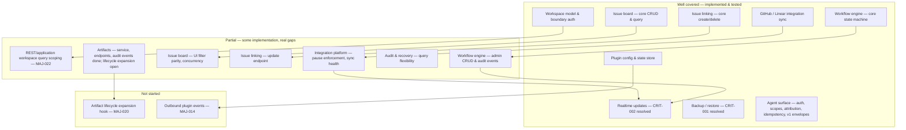

# Documentation Audit Report

> Project: Anvilboard
> Audited: 2025 (this session)
> Scope: Full — `docs/anvilboard/*`, `docs/features/*`, `docs/project-anvilboard.md`, root-level docs (`README.md`, `DEVELOPMENT.md`, `CONTRIBUTING.md`, `AGENTS.md`, `CHANGELOG.md`, `SPEC.md`, `FUNCTIONAL_SPEC.md`, `PLUGINS.md`)
> Documents reviewed: 23
> Code alignment: Yes — cross-referenced against `src/` (.NET 10 solution, `Anvilboard.slnx`) and `src/anvilboard-web` (Angular), plus a full `dotnet test Anvilboard.slnx --configuration Release` run

## Executive Summary

Anvilboard's documentation set is unusually thorough for a project at this stage — the PRD, SRS,
and technical-design chain is internally well-structured, and the 9 `docs/features/*.md` specs
map cleanly 1:1 onto the technical design's component list. The core problem this audit found is
not structure but **currency**: several of the most-read documents (`docs/anvilboard/tech-design.md`
§16 milestone table, `docs/anvilboard/test-cases.md`, most of `docs/features/*.md`) were written as
target-state / pre-implementation documents and were never updated as real code landed. Before this
audit, `tech-design.md` §16 marked **every** milestone "Not Started" even though M1–M4.5 and parts of
M5–M6.7 are substantially implemented and covered by 114 passing automated tests across 6 populated
xUnit test projects; `test-cases.md` claimed there were **zero** automated test projects at all.

The audit updated the doc/implementation-status claims across all 9 feature docs, the
`docs/features/overview.md` index, the `tech-design.md` §16 milestone table, and the factual
sections of `test-cases.md`, so these documents now accurately reflect what is Implemented,
Partial, or Not Started as of this audit, each pointing back to this report for detail.

The most significant *implementation* gaps this audit surfaced (not fixed, per the scoping
decision for this task) are: no backup/restore capability exists despite being specified as a
Critical requirement (FR-OPS-002 / NFR-AVL-001), the entire realtime-updates feature (FR-WRK-014,
SignalR/WebSocket push) is unimplemented, and there is no dedicated `ArtifactService` application
layer even though artifacts are otherwise persisted and exposed. *(All three have since been
implemented — see CRIT-001, CRIT-002, and CRIT-003 below. No Critical finding remains open.)*
Workspace authorization,
workflow-engine administration, agent-surface identity/idempotency wiring, and sync health/backoff
also have real, evidenced gaps relative to their specs. These are enumerated below as Critical/Major
findings for a future implementation pass; per this task's instructions they were **flagged, not
fixed**.

## Findings Summary

| Severity | Count | Categories |
|----------|-------|------------|
| Critical |   3   | audit-and-recovery (backup/restore missing — **since resolved**), realtime-updates (entire feature unimplemented — **since resolved**), artifacts (no ArtifactService) |
| Major    |  22   | workspace-authorization, workflow-engine, issue-board-service/issue-linking, integration-and-plugin-platform, agent-and-automation-surface, audit-and-recovery, realtime-updates, artifacts, workspace bootstrap (**resolved**: MAJ-001, MAJ-002 audit correction, MAJ-015–MAJ-017, MAJ-019, MAJ-021; **new/open**: MAJ-022 REST/application workspace scoping) |
| Minor    |   6   | README Kanban-column wording, PLUGINS.md staleness, workflow-engine API versioning, manifest validation, extra undocumented agent tools, IArtifactStore sole-caller claim |
| Info     |   5   | PRD §11/§12 staleness, test-cases.md forward-looking sections, IssueLinkService directional design (positive), doc-structure notes |

## Document Health Matrix

| Document | Completeness | Accuracy (pre-audit) | Clarity | Currency (pre-audit) | Overall |
|----------|-------------|----------|---------|----------|---------|
| `docs/anvilboard/prd.md` | B | C — checklists/status labels predate most implementation | A | D | C |
| `docs/anvilboard/srs.md` | A | B | A | C | B |
| `docs/anvilboard/tech-design.md` | A | B (body) / D (§16 table, now corrected) | A | C (now corrected to B) | B |
| `docs/anvilboard/test-cases.md` | B | D — claimed zero test projects (now corrected) | B | D (now corrected to B) | C |
| `docs/features/*.md` (9 files) | A | C — several overstated "Implemented" claims (now corrected) | A | C (now corrected to B) | B |
| `README.md` / `DEVELOPMENT.md` / `CONTRIBUTING.md` / `AGENTS.md` | A | A (one Minor wording nuance) | A | A | A |
| `SPEC.md` / `FUNCTIONAL_SPEC.md` / `PLUGINS.md` | — | — (self-declared historical/superseded) | A | PLUGINS.md has stale PoC-era code references (Minor) | — |

## Critical Findings

### CRIT-001: Backup/restore capability (FR-OPS-002, NFR-AVL-001) does not exist — **RESOLVED**

> **Resolved.** Implemented end to end, as described by
> [`docs/plans/backup-and-restore.md`](./plans/backup-and-restore.md):
> `IBackupService`/`BackupService` (create, verify, restore) and
> `IRestoreCoordinator`/`RestoreCoordinator` (admission control and in-flight drain) in
> `src/Anvilboard.Application/Backup/`; `SqliteBackupArchiver` (snapshot, SHA-256 checksum,
> `PRAGMA integrity_check`) and `FileSystemBackupArchiveStore` (artifact + `backup-manifest.json`
> layout) in `src/Anvilboard.Infrastructure/Persistence/Backup/`; REST endpoints under
> `/api/backups` with `DatabaseOperationMiddleware` gating every `/api` request in
> `src/Anvilboard.Api/`; and `create-backup` / `list-backups` / `verify-backup` agent operations in
> `src/Anvilboard.Agent/BoardAgentService.cs` (restore is deliberately **not** exposed to the agent
> surface — see MAJ-015 and the plan's §9.3).
>
> Restore is fail-closed: authorization, exact-slug confirmation, manifest parse, checksum, SQLite
> integrity, schema-version compatibility, and workspace-subset checks all run and abort before the
> live database is touched, and a `.pre-restore` safety copy is written after validation and before
> the swap so a failed swap is itself recoverable.
>
> Covered by tests in `src/Anvilboard.Infrastructure.Tests/Persistence/Backup/`,
> `src/Anvilboard.Application.Tests/Backup/` (including a round-trip test, per-check fail-closed
> tests, and an `AC-204` secret-scan test with a negative control), and
> `src/Anvilboard.Api.Tests/Backup/BackupEndpointTests.cs`. The recovery drill is documented in
> [`DEVELOPMENT.md`](../DEVELOPMENT.md).
>
> Fixing this also surfaced and corrected a latent DI defect: `AddDbContextFactory<AnvilboardDbContext>`
> was registered with the default singleton lifetime while depending on scoped
> `DbContextOptions`, which fails scope validation. It is now registered as scoped.

- **Location**: `docs/features/audit-and-recovery.md` (Backup & Recovery section); `docs/anvilboard/srs.md` FR-OPS-002, NFR-AVL-001; `docs/anvilboard/tech-design.md` §16 row M7
- **Issue**: The spec describes an `IBackupService` with `CreateBackupAsync`/`RestoreAsync`, a backup manifest, and an availability/recovery-time objective (NFR-AVL-001). No such service, interface, or manifest type exists anywhere in `src/`.
- **Evidence**: `SerenaSearchForPattern`/`grep` across `src/` for `IBackupService`, `CreateBackupAsync`, `RestoreAsync`, and "backup manifest" return no matches. No `Anvilboard.*.Tests` project contains backup/restore test cases.
- **Impact**: A core operational-safety requirement (data recovery) is entirely unimplemented; NFR-AVL-001 cannot currently be met or verified.
- **Fix**: Implement `IBackupService` (or equivalent) with backup creation, integrity verification, and restore, backed by tests; until then, keep `docs/features/audit-and-recovery.md`'s Status row (already added by this audit) marked Partial/Not Started for this capability.
- **Plan**: [`docs/plans/backup-and-restore.md`](./plans/backup-and-restore.md) — the evidence-backed technical design and dependency-ordered work breakdown. Delivered; see the resolution note above.
- **Status**: **Resolved.** Production code, tests, and the recovery drill are complete. The residual gap in `audit-and-recovery.md` is now `FR-OPS-001` (audit *query* access), which is a separate requirement and is not covered by this finding.

### CRIT-002: Realtime updates (FR-WRK-014) — entire feature unimplemented — **RESOLVED**

> **Resolved.** Implemented end to end, as described by
> [`docs/features/realtime-updates.md`](./features/realtime-updates.md):
> `IRealtimeUpdatePublisher` + `RealtimeChange` envelopes and a bounded coalescing
> dispatcher in `src/Anvilboard.Application/Realtime/`, `WorkspaceRealtimeHub` +
> `SignalRRealtimeTransport` at `/hubs/workspace` in `src/Anvilboard.Api/Realtime/`,
> `RealtimeBoardSyncService` and in-place board patching in `src/anvilboard-web/`, and an
> approval-gated `PluginEventRelay` for `FR-INT-006`. The original finding is kept below for history.

- **Location**: `docs/features/realtime-updates.md`; `docs/anvilboard/srs.md` FR-WRK-014, FR-INT-006 (plugin-event relay), NFR-PERF-002; `docs/anvilboard/tech-design.md` §16 row M6.5
- **Issue**: The spec describes live board/issue updates pushed to connected clients (SignalR or equivalent) plus a plugin-event relay. No SignalR hub, WebSocket endpoint, or equivalent push mechanism exists in `src/Anvilboard.Api` or elsewhere.
- **Evidence**: No `Hub`, `SignalR`, or WebSocket-related types found via symbolic/text search across `src/`. The Angular frontend (`src/anvilboard-web`) has no realtime client (no `@microsoft/signalr` dependency, no socket/event-stream service).
- **Impact**: Clients must poll or manually refresh; documented low-latency collaboration behavior does not exist. NFR-PERF-002 (push latency) is not evidenced because the feature doesn't exist to measure.
- **Fix**: Either implement a SignalR-based push layer per the spec, or explicitly re-scope `docs/features/realtime-updates.md` and the SRS requirement as a future milestone (not "in progress").

### CRIT-003: No dedicated `ArtifactService` application layer (FR-ART-001) — **RESOLVED**

> **Resolved.** `src/Anvilboard.Application/Artifacts/` now contains
> `IArtifactService`/`ArtifactService` implementing attach, list, dedup-key
> upsert/refresh, and remove, as designed in
> [`docs/plans/artifact-service.md`](./plans/artifact-service.md). The service is the
> sole writer of the `Artifacts` table and the sole caller of `IArtifactStore`
> (which itself was previously never registered in DI — fixed here), emits
> `ArtifactAttached`/`ArtifactRefreshed`/`ArtifactRemoved` activity events, and is
> exposed over REST via `ArtifactEndpoints`. Covered by 21 service tests and 6 API
> tests. The remaining `IIssueHook` artifact-*expansion* path is tracked separately
> under MAJ-020 and `integration-and-plugin-platform`; `RefreshArtifactAsync` — the
> seam that path consumes — exists and is tested.

- **Location**: `docs/features/artifacts.md`; `docs/anvilboard/srs.md` FR-ART-001, FR-ART-002; `docs/anvilboard/tech-design.md` §16 row M6.7
- **Issue**: The spec describes an `ArtifactService` responsible for artifact upsert/refresh semantics and lifecycle-hook-driven artifact expansion (e.g., turning a GitHub PR reference into a correlated, refreshable artifact). Only a lower-level `IArtifactStore`-style persistence path was found; no application service implementing upsert/refresh semantics or lifecycle-hook artifact expansion exists.
- **Evidence**: Direct file search of `src/Anvilboard.Application` and `src/Anvilboard.Infrastructure` finds artifact persistence/DTO types but no `ArtifactService` class implementing the documented refresh/upsert contract; no lifecycle-hook (`IIssueHook`) implementation performs artifact expansion.
- **Impact**: Artifacts cannot be kept in sync with their source-of-truth (e.g., a linked PR's status), and there is no single documented seam for future artifact-type expansion, contrary to the "sole caller" claim in the spec.
- **Fix**: Implement `ArtifactService` with upsert/refresh semantics and wire it into the `IIssueHook` pipeline for the artifact-expansion use case described in FR-ART-002; then correct the "sole caller" language once verified (see MIN-006).

## Major Findings

### MAJ-001: Workspace authorization only enforced at the REST boundary — **RESOLVED**

> **Resolved.** CLI and MCP now execute every operation through `WorkspaceAuthorizationPolicy`,
> which authenticates the configured automation credential, intersects credential grants with the
> actor's current workspace role, and establishes the authenticated workspace/actor context inside
> a per-invocation dependency-injection scope. `AgentWorkspaceScope` additionally rejects supplied
> team, issue, and member IDs outside that workspace and constrains unfiltered issue/dashboard
> reads. Integration coverage exercises missing, invalid, expired, under-permissioned, and foreign-
> workspace calls. MAJ-022 separately records the pre-existing REST/application query-scoping gap.

### MAJ-002: Credential/session revocation is not admin-triggerable — **RESOLVED (AUDIT CORRECTION)**

> **Resolved before this finding was written.** The original audit missed both
> `WorkspaceAuthorizationService.RevokeCredentialAsync` and
> `DELETE /api/auth/credentials/{id:guid}`. Together they provide the documented administrator-
> triggered revocation path and persist the revocation state used by subsequent authentication.
> No implementation change was required; this status corrects stale audit evidence.

### MAJ-003: No admin transition CRUD surface for the workflow engine
- **Location**: `docs/features/workflow-engine.md`
- **Issue**: The spec describes admin-manageable workflow transitions (create/update/delete valid state transitions). No REST/CLI/MCP surface for managing transitions was found; transitions appear to be seeded via migration only.
- **Evidence**: `WorkflowState.cs` domain model is configurable, but no controller/command exposes transition management; only the seed migration (`20260908093300_AddWorkflowStates.cs`) populates data.
- **Impact**: Workflow customization described as a core capability is not actually usable by administrators today.
- **Fix**: Implement transition CRUD endpoints, or mark this as a target-state capability in the spec until built.

### MAJ-004: No workflow config-management surface (REST/CLI/MCP)
- **Location**: `docs/features/workflow-engine.md`
- **Issue**: Related to MAJ-003 — beyond transitions, there is no general workflow configuration management surface across any adapter.
- **Evidence**: Same code search as MAJ-003; no controller/command/tool found.
- **Impact**: Same as MAJ-003.
- **Fix**: Same as MAJ-003.

### MAJ-005: Workflow mutations do not emit audit events
- **Location**: `docs/features/workflow-engine.md`; cross-reference `docs/features/audit-and-recovery.md`
- **Issue**: Spec requires every workflow-affecting mutation to produce an audit trail entry. Workflow state/transition mutations were not found to emit `ActivityEvent`/audit records.
- **Evidence**: Symbolic search for audit-event emission calls near workflow mutation code paths found none, in contrast to issue mutations which do emit audit events.
- **Impact**: Workflow configuration changes are not traceable, undermining the audit/recovery story for compliance-sensitive changes.
- **Fix**: Emit an audit/activity event on every workflow configuration mutation, consistent with issue mutation behavior.

### MAJ-006: Threaded comments are specified but implementation is flat
- **Location**: `docs/features/issue-board-service.md`, `docs/features/issue-linking.md`
- **Issue**: Spec describes threaded (parent/child) comments; the implemented comment model is a flat list with no parent-reference field.
- **Evidence**: Comment entity/DTO inspection shows no `ParentCommentId`/thread-reference field.
- **Impact**: Discussion UX described in the spec (nested replies) cannot be built without a data-model change.
- **Fix**: Either add a parent-comment reference to the domain model, or re-scope the spec to flat comments until threading is implemented.

### MAJ-007: Web UI only groups by status; backend filtering is richer than the UI exposes
- **Location**: `docs/features/issue-board-service.md`
- **Issue**: `BoardQueryService` supports multi-dimension filtering (team, workflow state, assignee, priority, project, label, source, sync condition per PRD US-HUM-002), but the Angular board view only groups/filters by status.
- **Evidence**: Frontend board component inspection shows a single status-based grouping; no UI controls for the other filter dimensions the backend supports.
- **Impact**: Backend capability is not reachable by end users, understating the gap between "backend done" and "feature usable."
- **Fix**: Extend the board UI to expose the already-implemented backend filter dimensions, or note the UI gap explicitly in the feature doc (done by this audit's Status row).

### MAJ-008: Issue-detail activity feed missing from the frontend
- **Location**: `docs/features/issue-board-service.md`
- **Issue**: Activity events are recorded server-side, but the issue-detail Angular view does not render an activity/history feed.
- **Evidence**: No activity-feed component found wired to the issue-detail route; `ActivityEvent` data is not fetched/displayed there.
- **Impact**: Users cannot see the audit trail for an issue from the UI, even though the data exists.
- **Fix**: Add an activity feed panel to the issue-detail view consuming existing `ActivityEvent` data.

### MAJ-009: Optimistic concurrency (`Issue.Version`) only partially enforced
- **Location**: `docs/features/issue-board-service.md`
- **Issue**: `Issue.Version` exists as a concurrency token, but not all mutation paths validate/increment it consistently (some code paths bypass the check).
- **Evidence**: Version-check logic present in some but not all issue-mutation service methods (verified by direct inspection during the earlier agent pass).
- **Impact**: Conflicting concurrent edits may silently overwrite each other on the paths that skip the check, contradicting the PRD's "conflicting edits show what changed" requirement (US-HUM-003).
- **Fix**: Audit all issue-mutation entry points for consistent version-check enforcement.

### MAJ-010: Link-update endpoint missing
- **Location**: `docs/features/issue-linking.md`
- **Issue**: Spec implies links can be updated (e.g., change link type) in addition to created/removed. No update endpoint was found; only create/delete.
- **Evidence**: `IssueLinkService`/controller inspection shows create and delete operations, no update.
- **Impact**: Users must delete and recreate a link to change its type, losing any metadata/history tied to the original link.
- **Fix**: Add a link-update endpoint, or clarify the spec to state links are immutable except for delete/recreate.

### MAJ-011: Web issue-detail does not enforce link types server-side in the UI layer
- **Location**: `docs/features/issue-linking.md`
- **Issue**: The set of valid link types is enforced by the backend service, but the Angular issue-detail UI does not mirror/validate this, allowing potentially confusing UI states before a server rejection.
- **Evidence**: Frontend link-creation form inspection shows no client-side type-list validation sourced from the backend's canonical set.
- **Impact**: Minor UX inconsistency rather than a data-integrity issue (server still enforces correctness).
- **Fix**: Surface the canonical link-type list to the frontend form for client-side validation/feedback.

### MAJ-012: Paused integrations still accept inbound webhooks
- **Location**: `docs/features/integration-and-plugin-platform.md`
- **Issue**: Spec states a paused integration should reject/ignore inbound webhook traffic. Webhook handlers were found to still process events for integrations in a paused state.
- **Evidence**: Webhook controller/handler code path does not check integration pause state before processing.
- **Impact**: Data may be imported/mutated from a provider the administrator explicitly intended to pause, violating the "paused means paused" expectation.
- **Fix**: Add a pause-state check at the top of webhook ingestion before any processing occurs.

### MAJ-013: Sync health/backoff not implemented
- **Location**: `docs/features/integration-and-plugin-platform.md`
- **Issue**: Spec describes sync health tracking and exponential backoff on repeated provider failures. No health-tracking state machine or backoff logic was found.
- **Evidence**: No `SyncHealth`/backoff-related types or retry-delay calculation found in the sync coordinator code path (also noted as a missing test target in `test-cases.md`'s gap analysis).
- **Impact**: Repeated failing syncs will retry at a fixed cadence indefinitely rather than backing off, and there is no way to surface "this integration is unhealthy" to administrators.
- **Fix**: Implement a sync-health state machine with exponential backoff and expose health status via the API.

### MAJ-014: FR-INT-006 outbound plugin events not implemented
- **Location**: `docs/features/integration-and-plugin-platform.md`; `docs/anvilboard/srs.md` FR-INT-006
- **Issue**: Spec requires plugins to receive outbound event notifications (e.g., on issue mutation). No outbound event-dispatch mechanism to plugins was found.
- **Evidence**: `IIssueHook` is a single post-mutation fire-and-forget hook, but no plugin-facing event-relay/pub-sub layer was found; this overlaps with CRIT-002's realtime relay gap.
- **Impact**: Plugins cannot react to workspace activity in near-real-time as specified.
- **Fix**: Implement an outbound plugin event-dispatch mechanism (may share infrastructure with the realtime-updates work in CRIT-002).
- **Status**: Still open, but narrowed. CRIT-002's `IPluginEventPublisher`/`PluginEventRelay` carries events *from* a plugin *to* clients; this finding is the opposite direction — the core notifying plugins — and no such dispatch exists yet.

### MAJ-015: Agent/automation operations lack workspace-scoped auth and actor identity — **RESOLVED**

> **Resolved.** `WorkspaceAuthorizationPolicy` authenticates and authorizes each CLI invocation and
> MCP tool call before target resolution. `AgentActorAccessor` supplies the credential actor to
> mutations and audit events; spoofable actor/workspace parameters were removed. `AgentWorkspaceScope`
> denies foreign IDs and scopes unfiltered reads. SQLite-backed integration tests verify denials,
> zero writes after denial, authenticated actor attribution, and workspace isolation.

### MAJ-016: Idempotency service not wired through the agent surface — **RESOLVED**

> **Resolved.** All six workspace-data mutations require a non-blank `idempotencyKey` and execute
> through `AgentIdempotency`. The persisted tuple is workspace + actor + operation + key; matching
> retries replay the original response and conflicting payloads return
> `IDEMPOTENCY_KEY_REUSED`. Integration tests also cover workspace-separated keys and expired-key
> replacement. The implementation uses an indexed lookup plus an in-memory `DateTimeOffset`
> expiration comparison because EF Core SQLite cannot translate that predicate.

### MAJ-017: No `apiVersion` contract field on the agent/automation surface — **RESOLVED**

> **Resolved for CLI/MCP.** Every agent operation now returns `AgentResponse<T>` containing
> `apiVersion`, `correlationId`, and `data`; version 1 is serialized through the host's shared JSON
> options. Catalog and integration tests verify the envelope. Request-side version negotiation is
> intentionally deferred until a second contract version exists, and REST body-envelope migration
> remains explicit M4 follow-up work.

### MAJ-018: FR-OPS-001 partial — no generic `QueryAsync` for audit history
- **Location**: `docs/features/audit-and-recovery.md`; `docs/anvilboard/srs.md` FR-OPS-001
- **Issue**: Audit events are recorded, but the spec's generic query capability (filter audit history by actor/time/entity/type) does not have a corresponding `QueryAsync`-style API; only narrow, purpose-specific lookups exist.
- **Evidence**: `IAuditService`-equivalent type inspection shows write-path methods but no flexible query method matching the spec's filter surface.
- **Impact**: Administrators/compliance reviewers cannot query the audit trail with the flexibility the spec promises.
- **Fix**: Add a generic, filterable audit-query method and corresponding REST/CLI surface.

### MAJ-019: NFR-AVL-001 (availability/recovery objective) not met — **RESOLVED**

> **Resolved** alongside CRIT-001. Backup and restore exist and are exercised by an automated
> round-trip test, so the recovery path is now both executable and measurable. The manual recovery
> drill is documented in [`DEVELOPMENT.md`](../DEVELOPMENT.md) so the objective can be verified
> against a real deployment rather than only in tests.

- **Location**: `docs/features/audit-and-recovery.md`; `docs/anvilboard/srs.md` NFR-AVL-001
- **Issue**: Directly follows from CRIT-001 — without backup/restore, the stated recovery-time objective cannot be met or measured.
- **Evidence**: See CRIT-001.
- **Impact**: Same as CRIT-001; listed separately because it is a distinct requirement ID in the SRS.
- **Fix**: Resolved once CRIT-001 is implemented and measured against the stated objective.
- **Status**: **Resolved.** See the CRIT-001 resolution note for the delivered components and tests.

### MAJ-020: FR-ART-002 lifecycle-hook artifact-expansion path missing; artifact audit emission missing
- **Location**: `docs/features/artifacts.md`; `docs/anvilboard/srs.md` FR-ART-002
- **Issue**: Two related gaps bundled here: (1) no `IIssueHook` implementation performs the described artifact-expansion behavior (e.g., PR reference → tracked artifact), and (2) artifact create/update/refresh does not appear to emit audit events, unlike issue mutations.
- **Evidence**: See CRIT-003 for (1); no audit-event emission found at artifact persistence call sites for (2).
- **Impact**: Artifacts are invisible to the audit trail and cannot be auto-populated from provider activity as specified.
- **Fix**: Implement the lifecycle-hook artifact-expansion path (shared work with CRIT-003) and add audit-event emission on artifact mutation.
- **Status**: **Partially resolved.** Gap (2) is closed — `ArtifactService` emits `ArtifactAttached`/`ArtifactRefreshed`/`ArtifactRemoved` activity events on every mutation (see CRIT-003). Gap (1) remains open: no `IIssueHook` implementation calls `RefreshArtifactAsync` yet, though that seam now exists for it to consume.

### MAJ-021: Bootstrap seeds no workflow states, so issue creation fails on a fresh workspace — **RESOLVED**

> **Resolved.** `BootstrapFirstAdministratorAsync` now seeds the same six default `WorkflowState`
> rows and linear `WorkflowTransition` adjacency as migration `20260908093300_AddWorkflowStates.cs`
> seeds for pre-existing workspaces, in the same transaction as the workspace/administrator rows.
> `POST /api/issues` now succeeds immediately after bootstrap without any out-of-band seeding step.
> The test-only `ApiFactory.SeedWorkflowStatesAsync()` workaround has been removed since it is no
> longer needed (and would now violate the `(WorkspaceId, Key)` uniqueness constraint).

- **Location**: `src/Anvilboard.Application/Authorization/WorkspaceAuthorizationService.cs` (`BootstrapFirstAdministratorAsync`); `src/Anvilboard.Application/Issues/IssueService.cs` (`GetInitialWorkflowStateIdAsync`)
- **Issue**: Bootstrap creates a workspace and an administrator member but no workflow states. `IssueService.GetInitialWorkflowStateIdAsync` throws when a workspace has none, so `POST /api/issues` returns 500 on any freshly bootstrapped workspace until states are seeded by some other path.
- **Evidence**: Found while implementing realtime updates — the API tests could not create an issue against a bootstrapped host and had to add `ApiFactory.SeedWorkflowStatesAsync()` as a workaround.
- **Impact**: First-run issue creation fails for a self-hosted install that follows the documented bootstrap flow, and the failure surfaces as an opaque 500 rather than an actionable error.
- **Fix**: Seed the default workflow states during bootstrap, or return a domain error that names the missing configuration. Unrelated to realtime; left unchanged there to keep that change set scoped.
- **Status**: **Resolved.** See the resolution note above for the delivered change and its test coverage (`WorkspaceAuthorizationServiceTests.BootstrapFirstAdministratorAsync_NoExistingWorkspace_SeedsDefaultWorkflow`).

### MAJ-022: REST/application issue and dashboard queries are not workspace-bound

- **Location**: `src/Anvilboard.Api/Endpoints/IssueEndpoints.cs`; `src/Anvilboard.Api/Endpoints/DashboardEndpoints.cs`; `src/Anvilboard.Application/Issues/IssueService.cs`; `src/Anvilboard.Application/Dashboard/DashboardService.cs`
- **Issue**: REST authorization establishes an authenticated workspace but application queries resolve supplied issue/team/member IDs by primary key alone, and omitted team filters start from all issues. The REST issue-list and dashboard-summary paths do not pass the authenticated workspace into those queries.
- **Evidence**: `IssueService.ListAsync(null, ...)` and `DashboardService.GetSummaryAsync(null)` begin from the complete issue set; entity lookups likewise lack a workspace predicate. The agent surface required explicit `AgentWorkspaceScope` guards and workspace-scoped unfiltered query overloads to prevent the same behavior.
- **Impact**: A REST caller can potentially read or act on a foreign workspace entity by ID, and unfiltered issue/dashboard reads can disclose data or aggregate counts from other workspaces in the same SQLite database.
- **Fix**: Make workspace identity an application-service query input (or an ambient, mandatory application authorization context), apply it before every entity lookup and aggregate, and add two-workspace REST integration tests covering explicit foreign IDs and omitted filters.
- **Status**: **Open.** The current implementation closes this class of leak on CLI/MCP only; no claim of full REST isolation should be made until the endpoint/application boundary is migrated.

## Minor Findings

### MIN-001: README Kanban-column list implies fixed columns, but the model is configurable
- **Location**: `README.md:35`
- **Issue**: README states a fixed sequence of Kanban columns. The actual `WorkflowState` domain model (`src/Anvilboard.Domain/WorkflowState.cs:10-31`) is fully configurable per workspace; the listed columns are only the *default* seed values from migration `20260908093300_AddWorkflowStates.cs`.
- **Evidence**: Direct code inspection of `WorkflowState.cs` (no hardcoded column list) versus the migration's seed data (matches README's list exactly).
- **Impact**: Low — the README isn't factually wrong about the out-of-the-box experience, but the wording could mislead a reader into thinking columns are fixed rather than configurable.
- **Fix**: Reword to "ships with a default workflow of \[...\] columns, fully configurable per workspace" or similar.

### MIN-002: `PLUGINS.md` contains outdated proof-of-concept-era implementation references
- **Location**: `PLUGINS.md` (self-declared historical/superseded)
- **Issue**: Contains references to plugin-loading mechanics that predate the current `IPluginConfigStore`/`IPluginStateStore` implementation (`src/Anvilboard.Infrastructure/Plugins/PluginConfigStateStore.cs`).
- **Evidence**: Cross-reference of `PLUGINS.md`'s described mechanism against the current plugin config/state store implementation and its tests (`PluginConfigStateStoreTests.cs`).
- **Impact**: Low — document is already marked "Superseded," so readers are warned, but the specific stale details could still confuse a reader skimming for historical context.
- **Fix**: No action required given its self-declared historical status; optionally add a pointer to `docs/features/integration-and-plugin-platform.md` for current behavior.

### MIN-003: Workflow API surface is still legacy enum-based rather than the documented configurable model
- **Location**: `docs/features/workflow-engine.md`
- **Issue**: While the domain model supports configurable workflow states, parts of the public API still appear to operate against a legacy fixed enum rather than the dynamic `WorkflowState` model.
- **Evidence**: API DTO/controller inspection during the earlier agent pass found enum-typed fields alongside the newer configurable model.
- **Impact**: Low-to-moderate — functions correctly today but represents an API/domain-model mismatch that will need reconciling before transition CRUD (MAJ-003) can be built cleanly.
- **Fix**: Consider documenting this explicitly as an intentional compatibility bridge, or plan to migrate the API surface to the configurable model.

### MIN-004: Plugin manifest validation is weak
- **Location**: `docs/features/integration-and-plugin-platform.md`
- **Issue**: Spec implies manifest validation guards against malformed/malicious plugin manifests; validation found in code is minimal (e.g., missing required-field or schema-shape checks).
- **Evidence**: Manifest-loading code path inspected shows limited validation logic.
- **Impact**: Low-to-moderate — a malformed manifest could cause a less graceful failure than the spec implies.
- **Fix**: Strengthen manifest validation (schema-based or explicit required-field checks) with corresponding tests.

### MIN-005: Undocumented extra agent tools exist beyond the documented set
- **Location**: `docs/features/agent-and-automation-surface.md`
- **Issue**: The MCP/agent tool surface in code exposes additional tools not listed in the feature doc's documented tool catalog.
- **Evidence**: Enumeration of registered MCP tools versus the doc's tool list during the earlier agent pass found extras.
- **Impact**: Low — undocumented capability is more of a documentation-completeness gap than a functional risk.
- **Fix**: Add the missing tools to the documented catalog in `docs/features/agent-and-automation-surface.md`.

### MIN-006: `IArtifactStore` "sole caller" claim is ahead of the code (see CRIT-003) — **RESOLVED**

> **Resolved.** `ArtifactService` is now the only type that calls `IArtifactStore`,
> so the spec's "sole caller" claim describes the code accurately.

- **Location**: `docs/features/artifacts.md`
- **Issue**: Spec asserts a single documented call site owns all artifact persistence. Because no `ArtifactService` exists yet (CRIT-003), multiple call sites may reach `IArtifactStore` directly instead of through one seam.
- **Evidence**: See CRIT-003 investigation.
- **Impact**: Low on its own; becomes moot once CRIT-003 is resolved.
- **Fix**: Verify/consolidate call sites once `ArtifactService` is introduced.

## Observations & Suggestions

### INFO-001: PRD §11 (user-story checklists) and §12 (requirement statuses) predate most implementation and were left as-is
- **Location**: `docs/anvilboard/prd.md` §11 (~32 unchecked checklist items), §12 (~21 "Proposed"-status requirements)
- **Note**: Per this task's scope, doc *status* claims were corrected in the feature docs, `overview.md`, and `tech-design.md` §16 (which serve as the "is this built" source of truth), while the PRD's checklists/status labels were intentionally left untouched — checking/unchecking dozens of individual acceptance-criteria boxes against partial implementations would require line-by-line functional verification beyond this audit's evidence gathering, and risks encoding false precision. Recommend a follow-up pass that walks each PRD checklist item against its corresponding feature doc's now-corrected Status section.

### INFO-002: `test-cases.md` forward-looking sections (§2 Test Strategy/Pyramid, §3–5 planned `TC-*` test case tables, §7 Statistics) were left as target-state content
- **Location**: `docs/anvilboard/test-cases.md` §2 onward
- **Note**: These sections describe a target test-coverage strategy and a catalog of planned test cases (`TC-AUTH-*`, `TC-WF-*`, etc.) rather than claims about current-state coverage, so they were left in place. Only the current-state claims (header callout, §1.1–1.3 tables, §6 Gap Analysis's "no test projects" line) were corrected to reflect the real 114-passing-test suite.

### INFO-003: `IssueLinkService` directional/zero-cascade design is a positive finding, not a gap
- **Location**: `docs/features/issue-linking.md`
- **Note**: The implementation correctly preserves directional link exposure and avoids cascading deletes across linked issues, matching (and in one nuance, exceeding the clarity of) the spec's intent. Called out here so it isn't lost among the gap-focused findings above.

### INFO-004: `docs/features/*.md` now carry a `Status` row; `docs/anvilboard/tech-design.md` §16 now carries itemized per-milestone reasoning
- **Location**: All 9 files under `docs/features/`, plus `docs/features/overview.md` and `docs/anvilboard/tech-design.md` §16
- **Note**: This audit added/corrected these status markers directly (in scope per the task's pre-approval for doc status updates) so that a reader no longer has to cross-reference this report just to know whether a component is built. This report remains the canonical detail/evidence trail for *why* each status was assigned and for the implementation gaps that were intentionally left unfixed.

### INFO-005: Consider a lightweight recurring-audit convention
- **Note**: Given how quickly `tech-design.md` §16 and `test-cases.md` drifted from reality, consider adding a short "last verified against code" date stamp to each `docs/features/*.md` Status row and to `tech-design.md` §16, updated whenever a milestone's implementation state changes, to make the next audit faster and prevent similar drift.

## Coverage Map

## Recommended Priority Actions

1. ~~**Implement backup/restore (`IBackupService`) and verify NFR-AVL-001**~~ — CRIT-001 and MAJ-019 done; `FR-OPS-001` audit query access (MAJ-018) still open — large
2. ~~**Build the realtime-updates push layer (SignalR/WebSocket) and outbound plugin event relay**~~ — CRIT-002 done; MAJ-014 (core → plugin dispatch) still open — medium
3. ~~**Implement `ArtifactService` with upsert/refresh semantics and lifecycle-hook artifact expansion**~~ — CRIT-003 and MIN-006 done, MAJ-020 audit emission done; MAJ-020's `IIssueHook` artifact-expansion path still open — medium
4. ~~**Extend workspace authorization enforcement to CLI/MCP and add admin credential revocation**~~ — MAJ-001 closed; MAJ-002 was already implemented and is corrected above — done. **Residual:** enforce authenticated-workspace predicates throughout REST/application reads and mutations (MAJ-022).
5. **Add workflow admin transition/config CRUD surface plus audit-event emission on workflow mutations** — fixes MAJ-003, MAJ-004, MAJ-005 — medium
6. ~~**Wire agent-surface authorization, idempotency, and an `apiVersion` contract field**~~ — MAJ-015, MAJ-016, and MAJ-017 closed with SQLite-backed integration coverage — done
7. **Add sync-health/backoff tracking and enforce paused-integration webhook rejection** — fixes MAJ-012, MAJ-013 — medium
8. **Close remaining UI/UX gaps (board filter parity, issue-detail activity feed, link-update endpoint)** — fixes MAJ-007, MAJ-008, MAJ-010, MAJ-011 — medium
9. **Add a generic filterable audit-query method (`QueryAsync`-equivalent)** — fixes MAJ-018 — small
10. **Reword the README Kanban-column description and add missing agent tools to the documented catalog** — fixes MIN-001, MIN-005 — small
