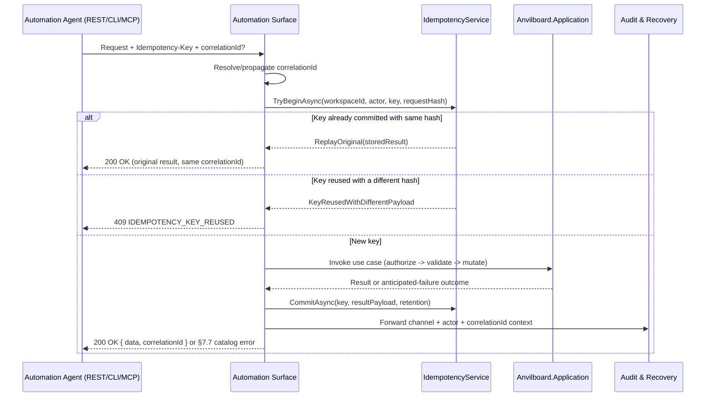

# Agent and Automation Surface

> Feature spec for code-forge implementation planning.
> Source: extracted from docs/anvilboard/tech-design.md §8.1, §7.3, §7.6, §9, §10.1
> Created: 2026-09-05

| Field | Value |
|-------|-------|
| Component | agent-and-automation-surface |
| Priority | P0 |
| SRS Refs | FR-AUT-001, FR-AUT-002, FR-AUT-003, NFR-MNT-001 |
| Tech Design Ref | §8.1 Component Overview — Automation Surface (REST/CLI/MCP) row; §7.3 Parameter Validation; §7.6 Error Handling Strategy; §9 API Design; §10.1 `IdempotencyRecords` |
| Depends On | workspace-authorization, workflow-engine, issue-board-service, integration-and-plugin-platform |
| Blocks | audit-and-recovery |

## Purpose

The Automation Surface is the single place where every externally callable operation — versioned REST (`/api/v1/...`), CLI, and MCP stdio — is defined once and rendered identically across channels. It exists so that a human using `anvilboard-web` and an automation agent calling REST/CLI/MCP never observe diverging symbolic values, error codes, or idempotency semantics, closing the numeric-vs-symbolic serialization gap the PoC review identified (see [`../anvilboard/tech-design.md`](../anvilboard/tech-design.md) §5.4, §6). It is the channel-facing shell around `Anvilboard.Application`; it does not itself decide authorization, workflow legality, or provider sync outcomes.

## Scope

**Included:**
- Versioned REST endpoint contracts under `/api/v1/...` (issues, transition, integration sync, workspace restore) as documented in tech-design §9
- CLI commands and MCP stdio tool operations exposed through the existing `dotnet-agent-surface`-based host (`Anvilboard.Agent`)
- `Idempotency-Key` enforcement and `IdempotencyRecords` persistence for every supported automation mutation (FR-AUT-002)
- Correlation ID generation, propagation, and inclusion in every response and the corresponding audit context (FR-AUT-001 criterion 3)
- Symbolic (string) enum serialization for workflow state, priority, provider, and sync condition across REST/CLI/MCP (FR-AUT-001 criterion 1)
- Structured, catalog-based error translation at the `Anvilboard.Application` boundary (§7.6, §7.7), channel-agnostic
- Pagination (`page`/`limit`, opaque cursor) and the §7.3 validation rules matrix as enforced at the channel boundary

**Excluded:**
- Workspace/role authorization decision logic (owned by `workspace-authorization`)
- Workflow transition legality (owned by `workflow-engine`)
- Persisting the audit record itself (owned by `audit-and-recovery`); this component only supplies the actor/channel/correlation context that gets recorded
- Provider sync execution and health derivation (owned by `integration-and-plugin-platform`); this component only exposes the `/api/v1/integrations/{id}/sync` contract
- Authentication credential issuance/storage (owned by `workspace-authorization`, tech-design §11.1)

## Core Responsibilities

1. **Versioned Contract Definition** — define and enforce the `/api/v1` REST route contracts and the mirrored CLI/MCP operation catalog so all three transports share one DTO shape.
2. **Idempotency Enforcement** — validate and persist `Idempotency-Key` + canonical request hash per actor/workspace/operation; replay committed results and reject conflicting reuse.
3. **Correlation & Channel Context** — generate or propagate a correlation ID per call and attach channel identity (`REST`/`CLI`/`MCP`) to every downstream call, including the audit context handed to `audit-and-recovery`.
4. **Error Translation** — catch `Anvilboard.Application` exceptions/anticipated-failure results and translate them into the stable §7.7 catalog codes, never letting a raw exception or stack trace reach a caller.
5. **Pagination & Symbolic Serialization** — implement page/limit or opaque-cursor pagination and the shared symbolic-enum JSON converters so no channel emits numeric wire values for domain enums.

## Interfaces

### Inputs
- **REST HTTP request** (caller) — method, versioned route, query parameters, JSON body, `Authorization`, `Idempotency-Key`, `X-Correlation-Id` headers.
- **CLI argv** (operator/agent shell) — command name plus flags mapped 1:1 onto the same DTOs as REST, via `dotnet-agent-surface`'s `OperationCommandLineAdapter`.
- **MCP JSON-RPC tool call** (agent host over stdio) — tool name plus structured arguments, via `dotnet-agent-surface`'s `McpOperationServer`/`McpOperationAdapter`.
- **`Idempotency-Key`** (caller-supplied, required for supported mutations) — opaque string, 1–255 chars (§7.3 Validation Rules Matrix).

### Outputs
- **REST JSON response** (caller) — `{ data, pagination?, correlationId }` on success, or a §7.7 catalog error body on anticipated failure.
- **CLI stdout JSON** (operator/agent shell) — rendered via `JsonAgentOutputRenderer`; diagnostics/logs are routed to stderr, never stdout.
- **MCP stdio JSON-RPC response** (agent host) — protocol-only; stdout carries no non-protocol text (existing invariant, `Anvilboard.Agent/Program.cs`).
- **`IdempotencyRecords` row** (`Anvilboard.Infrastructure`) — persisted only after the wrapped use case commits successfully.
- **Audit context** (to `audit-and-recovery`) — channel, actor, correlation ID, action, target, forwarded but not persisted by this component.

### Dependencies
- **`Anvilboard.Application`** (via `workspace-authorization`, `workflow-engine`, `issue-board-service`, `integration-and-plugin-platform`) — the use cases this surface invokes; it never bypasses their authorization/validation.
- **`Anvilboard.Infrastructure` / `AnvilboardDbContext`** — persistence for `IdempotencyRecords`.
- **`dotnet-agent-surface`** (`DotNetAgentSurface.Core`, `.CommandLine`, `.Mcp`) — `OperationCatalog`, `OperationInvoker`, `OperationCommandLineAdapter`, `McpOperationServer`; already referenced by [`../../src/Anvilboard.Agent/Anvilboard.Agent.csproj`](../../src/Anvilboard.Agent/Anvilboard.Agent.csproj).
- **`Anvilboard.Domain.Serialization.StronglyTypedIdJsonConverterFactory`** — existing converter this component extends for the new workflow-state/sync-condition enums.

## Data Flow



## Key Behaviors

### Idempotency Enforcement

```csharp
public interface IIdempotencyService
{
    Task<IdempotencyOutcome> TryBeginAsync(
        WorkspaceId workspaceId, string actorId, string operation, string idempotencyKey,
        string canonicalRequestHash, CancellationToken ct = default);

    Task CommitAsync(
        WorkspaceId workspaceId, string actorId, string operation, string idempotencyKey,
        string resultPayloadJson, TimeSpan retention, CancellationToken ct = default);
}

public enum IdempotencyOutcome { New, ReplayOriginal, KeyReusedWithDifferentPayload }
```

Logic steps for `TryBeginAsync`:
1. Compose the composite lookup key `(WorkspaceId, ActorId, Operation, Key)` matching the `IdempotencyRecords` unique index (§10.3 Index Strategy) and query the table.
2. If no record exists, return `New`; the caller proceeds to execute the use case.
3. If a record exists and its `RequestHash` matches the caller-supplied `canonicalRequestHash`, return `ReplayOriginal` carrying the stored `ResultPayload` — no mutation is re-executed (AC-007).
4. If a record exists and `RequestHash` differs, return `KeyReusedWithDifferentPayload`; the caller translates this to `IDEMPOTENCY_KEY_REUSED` (409) and performs no mutation (AC-008).
5. `CommitAsync` persists the row only once the wrapped use case has committed, setting `ExpiresAt = CreatedAt + retention` (the exact retention duration is open decision OQ-002; it must be documented and observable to clients per FR-AUT-002 criterion 4 regardless of the final value).

The canonical request hash is computed by serializing the request DTO with a stable, deterministic property order (existing `System.Text.Json` conventions, no incidental whitespace) and hashing with SHA-256; the actor identity is part of the same key tuple so two different actors sharing a key can never collide (§7.4 Edge Case Handling).

### Correlation ID Propagation

```csharp
public sealed class CorrelationContext
{
    public string CorrelationId { get; }

    public static CorrelationContext FromHeaderOrNew(string? clientSupplied) =>
        new(string.IsNullOrWhiteSpace(clientSupplied) ? Guid.NewGuid().ToString() : clientSupplied);
}
```

- **REST**: reads `X-Correlation-Id` if present (recommended header, §9.2), otherwise generates a new GUID; the same value is echoed in the response body's `correlationId` field and in the matching `AuditEvents.CorrelationId` row.
- **CLI**: generated once per invocation (no interactive header equivalent); included in the JSON result envelope written to stdout.
- **MCP**: generated once per tool call; never written to stdout outside the JSON-RPC response payload — the stdio transport reserves stdout exclusively for protocol traffic (`Anvilboard.Agent/Program.cs` invariant, tech-design §13.1).

### Error Catalog Translation

```csharp
public static class ErrorCatalogTranslator
{
    public static ProblemDetailsResult Translate(Exception ex, string correlationId) => ex switch
    {
        AuthenticationRequiredException => Build(401, "AUTHENTICATION_REQUIRED", correlationId),
        CredentialInvalidOrExpiredException => Build(401, "CREDENTIAL_INVALID_OR_EXPIRED", correlationId),
        WorkspaceAccessDeniedException => Build(403, "WORKSPACE_ACCESS_DENIED", correlationId),
        ValidationFailedException e => Build(400, "VALIDATION_FAILED", correlationId, e.Field),
        ReferencedEntityNotFoundException e => Build(404, "REFERENCED_ENTITY_NOT_FOUND", correlationId, e.EntityType),
        InvalidWorkflowTransitionException e => Build(409, "INVALID_WORKFLOW_TRANSITION", correlationId, e.FromState, e.ToState),
        ResourceAlreadyExistsException e => Build(409, "RESOURCE_ALREADY_EXISTS", correlationId, e.ConflictingKey),
        ConcurrencyConflictException e => Build(409, "CONCURRENCY_CONFLICT", correlationId, e.CurrentVersion),
        IdempotencyKeyReusedException => Build(409, "IDEMPOTENCY_KEY_REUSED", correlationId),
        IntegrationPausedException => Build(409, "INTEGRATION_PAUSED", correlationId),
        RateLimitedException e => Build(429, "RATE_LIMITED", correlationId, retryAfter: e.RetryAfter),
        ProviderUnavailableException e => Build(502, "PROVIDER_UNAVAILABLE", correlationId, e.Provider),
        BackupIntegrityInvalidException e => Build(422, "BACKUP_INTEGRITY_INVALID", correlationId, e.FailedCheck),
        _ => Build(500, "INTERNAL_ERROR", correlationId), // never a documented contract value (§7.7); logged only, not part of the public catalog
    };
}
```

- Single translation point invoked identically by REST minimal-API endpoint filters, the CLI `OperationInvoker`, and the MCP `McpOperationAdapter`, so no channel can diverge from the §7.6/§7.7 catalog.
- **Symbolic serialization**: extends the existing `StronglyTypedIdJsonConverterFactory`/`JsonStringEnumConverter` registrations already wired in [`../../src/Anvilboard.Api/Program.cs`](../../src/Anvilboard.Api/Program.cs) and [`../../src/Anvilboard.Agent/Program.cs`](../../src/Anvilboard.Agent/Program.cs) to cover the new `WorkflowState`, provider, and sync-condition symbolic values, so `"IN_PROGRESS"` is emitted rather than a numeric code on every channel.
- **Pagination**: `page`/`limit` query parameters validate `1 <= limit <= 100` (default `25`); an opaque cursor variant, if used for a given list, is a server-generated base64 token embedding no client-parseable ordering key (§7.3 Type Coercion Rules).

## Constraints

- **Protocol isolation**: MCP stdout is reserved exclusively for JSON-RPC responses; all logs/diagnostics go to stderr (existing invariant preserved, not renegotiated by this feature).
- **Idempotency retention**: the exact retention window is an open decision (OQ-002); implementation must keep it finite and documented regardless of the value chosen.
- **Error surface discipline**: `500 INTERNAL_ERROR` is reserved exclusively for unanticipated faults and is never a documented contract response; every anticipated failure has a stable §7.7 code.
- **Versioning**: REST routes are versioned under `/api/v1`; a breaking contract change requires a new version segment, not an in-place change (NFR-MNT-001).
- **Rate limiting**: `RATE_LIMITED` (429) responses must supply `Retry-After`; exact limit thresholds are deployment-configurable and out of scope for this spec.

## Acceptance Criteria

> P0 rows below map to tech-design §3.6 where an AC-ID exists; `AC-1xx` rows are component-specific additions not covered by an existing tech-design AC-ID.

| AC-ID | Priority | Criterion | Expected Result | Verification Method |
|-------|----------|-----------|-----------------|---------------------|
| AC-007 | P0 | Given a supported automation mutation with a fresh idempotency key — When the same actor replays the identical key and canonical payload — the mutation is atomic and idempotent. | Replay returns the original result; issue/activity/audit/idempotency record counts are unchanged from the first call. | Integration test replays the request and counts issues, activities, audits, and idempotency records. |
| AC-008 | P0 | Given a committed idempotency key — When it is reused with a different payload or actor — the request is rejected. | 409 `IDEMPOTENCY_KEY_REUSED`; no new mutation is applied. | Negative integration test varies payload and actor while retaining the key. |
| AC-101 | P0 | Given a supported automation mutation endpoint — When `Idempotency-Key` is missing or exceeds 255 chars/is malformed — the request is rejected before any mutation executes. | 400 `VALIDATION_FAILED` naming the `Idempotency-Key` field; no mutation, activity, or audit record is created. | Boundary integration test omits/malforms the header and asserts zero side effects. |
| AC-102 | P0 | Given the same logical operation invoked once via REST, once via CLI, and once via MCP — When results are compared — all three return identical symbolic domain values and a `correlationId`. | Byte-for-byte equal symbolic fields (`workflowState`, `priority`, `provider`, `syncCondition`) across channels. | Cross-channel contract fixture test compares normalized REST/CLI/MCP results for the same operation. |
| AC-103 | P0 | Given a REST caller that omits `X-Correlation-Id` — When the request completes — the response contains a server-generated `correlationId` usable to find the matching audit record. | Response `correlationId` is a non-empty value and a matching `AuditEvents` row is queryable by it. | Integration test omits the header, then queries audit by the returned ID. |
| AC-104 | P1 | Given an MCP session — When any tool call is invoked — stdout contains only JSON-RPC protocol frames. | No log line, diagnostic text, or stray output appears on stdout during the session. | MCP session integration test captures stdout and asserts it parses as JSON-RPC only. |
| AC-105 | P1 | Given any REST or MCP response (NFR-MNT-001) — When inspected — it includes a schema/API version identifier. | Response contains a non-empty `apiVersion` (or equivalent) field matching the currently served contract version. | Contract test asserts presence and value of the version field across sampled endpoints/tools. |

## Error Handling

Every anticipated failure returned by this surface resolves to exactly one row of the canonical §7.7 catalog; this component is the only place any of these codes is rendered to a caller (never a raw exception, provider error, or database exception):

| Code | HTTP status | Trigger relevant to this surface | Retry guidance |
|---|---:|---|---|
| `AUTHENTICATION_REQUIRED` | 401 | Missing credential on any protected REST/CLI/MCP entry point. | Not retryable until a credential is supplied. |
| `CREDENTIAL_INVALID_OR_EXPIRED` | 401 | Invalid/expired credential presented to any channel. | Not retryable until credential is renewed. |
| `VALIDATION_FAILED` | 400 | Malformed request body/query, missing/oversized `Idempotency-Key`. | Not retryable without correcting the field named in the error. |
| `INVALID_WORKFLOW_TRANSITION` | 409 | Forwarded from `workflow-engine`; rendered with current/requested state and violated rule. | Not retryable without a valid target state. |
| `CONCURRENCY_CONFLICT` | 409 | Forwarded from `issue-board-service`; expected version mismatch. | Retryable after refetching current version. |
| `IDEMPOTENCY_KEY_REUSED` | 409 | Same key reused with a different canonical payload/actor. | Not retryable with the same key; caller must mint a new one. |
| `RATE_LIMITED` | 429 | Channel request-rate limit exceeded. | Retryable after the supplied `Retry-After`. |
| `PROVIDER_UNAVAILABLE` | 502 | Forwarded from `integration-and-plugin-platform` sync endpoint. | Retryable after bounded backoff. |
| `INTEGRATION_PAUSED` | 409 | Forwarded from `integration-and-plugin-platform`. | Not retryable until the integration is resumed. |
| `BACKUP_INTEGRITY_INVALID` | 422 | Forwarded from `audit-and-recovery` restore endpoint. | Not retryable with the same artifact. |

`500 INTERNAL_ERROR` is deliberately absent from this table: it is never a documented contract response and indicates an unanticipated fault that must be logged, not translated as if it were an anticipated one (§7.6 Core Principles).

## File Structure

```
src/
├── Anvilboard.Api/
│   ├── Program.cs                              # existing; wires versioned endpoint groups + JSON options
│   └── Endpoints/
│       ├── V1/
│       │   ├── IssueEndpointsV1.cs             # planned: /api/v1/issues, /api/v1/issues/{id}/transition
│       │   └── IntegrationEndpointsV1.cs       # planned: /api/v1/integrations/{id}/sync
│       ├── IssueEndpoints.cs                   # existing unversioned /api/issues (superseded by V1)
│       ├── TeamEndpoints.cs                    # existing
│       ├── DashboardEndpoints.cs               # existing
│       └── WebhookEndpoints.cs                 # existing
├── Anvilboard.Agent/
│   ├── Program.cs                              # existing; CLI/MCP host bootstrap (stdout/stderr split)
│   └── BoardAgentService.cs                    # existing; extended with transition/sync operations
└── Anvilboard.Application/
    └── Automation/
        ├── IdempotencyService.cs               # planned: IIdempotencyService implementation
        ├── CorrelationContext.cs                # planned
        └── ErrorCatalogTranslator.cs            # planned: shared §7.7 translation point
```

## Test Module

**Test file**: `src/Anvilboard.Application.Tests/Automation/IdempotencyServiceTests.cs`

**Test scope**:
- **Unit**: `IdempotencyService.TryBeginAsync()` (new key, replay-same-hash, reuse-different-hash outcomes), `ErrorCatalogTranslator.Translate()` (one case per exception type mapped to its §7.7 code), `CorrelationContext.FromHeaderOrNew()`.
- **Integration**: `src/Anvilboard.Api.Tests/V1/AutomationSurfaceContractTests.cs` — REST `/api/v1/issues/{id}/transition` idempotency replay/reuse (AC-007, AC-008, AC-101), correlation ID round-trip (AC-103); `src/Anvilboard.Agent.Tests/ContractEquivalenceTests.cs` — CLI vs. MCP vs. REST symbolic-value equivalence for the same logical operation (AC-102) and MCP stdout protocol-purity (AC-104).
- **Fixtures / Mocks**: seeded workspace with an active workflow and one issue; a fake clock for `IdempotencyRecords.ExpiresAt` assertions; an MCP stdio test harness that captures raw stdout bytes for AC-104.
