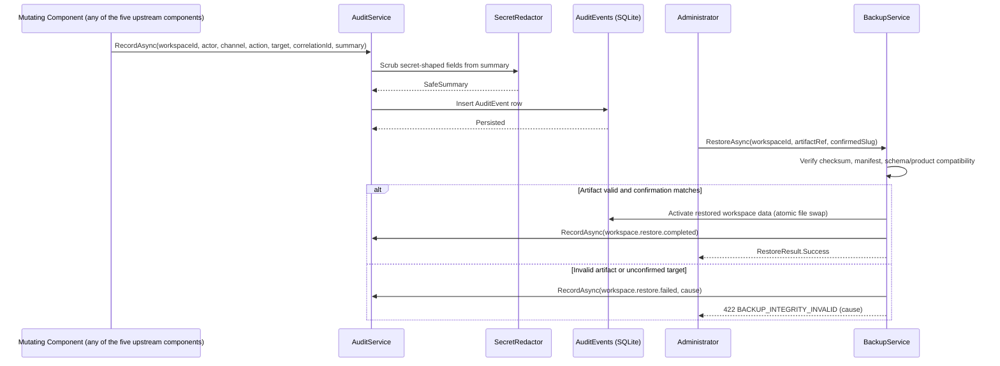

# Audit and Recovery

> Feature spec for Spec-Forge implementation planning.
> Source: extracted from docs/anvilboard/tech-design.md §8.1, §10.1, §11.4, §14.3
> Created: 2026-09-05

| Field | Value |
|-------|-------|
| Component | audit-and-recovery |
| Priority | P0 |
| Status | Partial — append-only audit recording, secret/credential redaction at write time, and backup/restore (FR-OPS-002, NFR-AVL-001) are implemented and tested. Workspace-scoped audit **query** access (FR-OPS-001) remains the residual gap: audit events are written and are readable only via direct database access, with no REST or agent query surface. See `docs/audit-report.md` for details. |
| Implementation Plan | [`../plans/backup-and-restore.md`](../plans/backup-and-restore.md) — delivered; closed CRIT-001, the only unresolved Critical audit finding. |
| SRS Refs | FR-OPS-001, FR-OPS-002, NFR-AVL-001, NFR-REL-001 |
| Tech Design Ref | §8.1 Component Overview — Audit & Recovery row; §10.1 `AuditEvents`; §11.4 Audit Logging; §14.3 Rollback Strategy |
| Depends On | workspace-authorization, workflow-engine, issue-board-service, integration-and-plugin-platform, agent-and-automation-surface |
| Blocks | — |

## Overview

### Purpose

Audit & Recovery is the append-only accountability layer for every mutating component and channel, plus the backup/restore mechanism that makes a self-hosted, single-host deployment recoverable. It exists so that every configuration change, issue mutation, automation mutation, integration action, and backup/restore action produces exactly one searchable audit record (FR-OPS-001), and so that a workspace can be verifiably backed up and restored without silently activating a corrupt or incompatible artifact (FR-OPS-002). It is the rollback safety net referenced by [`../anvilboard/tech-design.md`](../anvilboard/tech-design.md) §14.3 for any change beyond the deprecated-column retention window, and it is the audit trail that [`agent-and-automation-surface.md`](./agent-and-automation-surface.md) depends on to make every channel's mutations equally accountable.

## Scope

**Included:**
- `IAuditService.RecordAsync` accepting a normalized audit context from every mutating component/channel (workspace-authorization, workflow-engine, issue-board-service, integration-and-plugin-platform, agent-and-automation-surface)
- `AuditEvents` persistence, workspace-scoped and permission-gated query access (`IAuditService.QueryAsync`)
- Secret/credential redaction of `ResultSummary` at write time (zero exposure target, NFR-SEC-001)
- `IBackupService.CreateBackupAsync` producing a backup artifact plus integrity/compatibility manifest (workspace, timestamp, product/schema version, checksum)
- `IBackupService.RestoreAsync` validating integrity and compatibility before activation, with elevated authorization and explicit target confirmation, fail-closed on any invalid artifact

**Excluded:**
- Deciding *which* authorization/business-rule event is audit-worthy (owned by each respective mutating component); this component only records what it is told
- Secret-at-rest storage algorithm/key management for integration credentials themselves (owned by `integration-and-plugin-platform`; implemented through the `ISecretStore`/Data Protection decision in tech-design §11.3)
- Backup/restore administration UI (owned by `anvilboard-web`; this spec covers the backend service only)
- Automated backup scheduling policy (not part of the initial release; operators may schedule the supported export externally — see this spec's Constraints for the retention target and PRD §19 decision row 4; the RPO/RTO validation cohort is defined in tech-design §17, OQ-006)

## Core Responsibilities

1. **Append-Only Audit Recording** — persist one immutable `AuditEvent` per mutation category, with no code path that updates or deletes an existing row.
2. **Workspace-Scoped Audit Query** — expose audit history only within the caller's authorized workspace and only to an auditor/administrator permission.
3. **Secret Redaction at Write Time** — scrub `ResultSummary` (and backup manifests) of secret-shaped values before they are ever persisted.
4. **Backup Creation with Integrity Metadata** — snapshot the workspace's data store with a checksum and schema/product version manifest sufficient to validate restorability.
5. **Verified, Fail-Closed Restore** — validate integrity/compatibility and require elevated authorization plus explicit confirmation before activating any restored workspace.

## Interfaces

### Inputs
- **`AuditEventRequest`** (from workspace-authorization, workflow-engine, issue-board-service, integration-and-plugin-platform, agent-and-automation-surface) — workspace ID, actor ID, channel, action, target type/ID, correlation ID, result summary.
- **`CreateBackupRequest`** (Administrator, via automation surface or web UI) — workspace ID, requesting actor ID.
- **`RestoreRequest`** (Administrator only) — workspace ID, backup artifact reference, confirmed workspace slug, requesting actor ID.

### Outputs
- **`AuditEvents` row** (`Anvilboard.Infrastructure` via EF Core/SQLite) — persisted, queryable, never mutated after insert.
- **`AuditQueryResult`** (caller) — workspace-scoped, permission-gated page of audit records.
- **Backup archive + manifest** (filesystem backup store, tech-design §6) — timestamped copy of the data store plus `backup-manifest.json`.
- **`RestoreResult`** (caller) — success, or a specific `BACKUP_INTEGRITY_INVALID` cause; the target workspace is left unchanged on any failure.

### Dependencies
- **`Anvilboard.Infrastructure` / `AnvilboardDbContext`** — persistence for `AuditEvents`; the SQLite file itself is the backup/restore subject.
- **workspace-authorization** — elevated-role check (Administrator) for restore, and permission gating for audit query.
- **Filesystem backup store** — the `Backup` container in tech-design §6, holding archived database snapshots and manifests.
- **Secret-provider abstraction** (owned by integration-and-plugin-platform) — informs the redaction deny-list so newly introduced secret field names stay covered.

## Data Flow



## Key Behaviors

### Audit Recording & Redaction

```csharp
public interface IAuditService
{
    Task RecordAsync(AuditEventRequest request, CancellationToken ct = default);

    Task<IReadOnlyList<AuditEvent>> QueryAsync(
        WorkspaceId workspaceId, AuditQuery query, MemberId requestingActorId, CancellationToken ct = default);
}

public sealed record AuditEventRequest(
    WorkspaceId WorkspaceId, string ActorId, AuditChannel Channel, string Action,
    string TargetType, string TargetId, string CorrelationId, string ResultSummary);

public enum AuditChannel { Web, Rest, Cli, Mcp, System }
```

Logic steps for `RecordAsync`:
1. Redact `ResultSummary` via `SecretRedactor.Scrub(text)` — strips values keyed by a documented deny-list of field names (`secret`, `token`, `password`, `apiKey`, `credential`) plus a regex heuristic for long opaque base64/hex-shaped values, replacing each match with `"***REDACTED***"`.
2. Construct an `AuditEvent` with a newly minted `AuditEventId` and `OccurredAt = DateTimeOffset.UtcNow`.
3. Insert via `AnvilboardDbContext.AuditEvents.Add(...)` + `SaveChangesAsync` — extending the existing [`../../src/Anvilboard.Infrastructure/Persistence/AnvilboardDbContext.cs`](../../src/Anvilboard.Infrastructure/Persistence/AnvilboardDbContext.cs) with a new `DbSet<AuditEvent>`; the repository exposes no `Update`/`Remove` member for this aggregate, enforcing append-only at the code boundary rather than relying only on permissions or UI omission (FR-OPS-001 criterion 2).
4. `QueryAsync` filters by `WorkspaceId` first (a query can never span workspaces) and requires the requesting actor to hold an auditor/administrator permission, delegated to workspace-authorization's authorization check (FR-OPS-001 criterion 3).

Field mapping for the `AuditEvents` table (binding tech-design §10.1 to the implementation):

| Column | .NET type | Notes |
|---|---|---|
| `Id` | `AuditEventId` | Strongly-typed ID in [`../../src/Anvilboard.Domain/Ids.cs`](../../src/Anvilboard.Domain/Ids.cs) alongside the other ID types. |
| `WorkspaceId` | `WorkspaceId` | FK, required; existing strongly-typed ID. |
| `ActorId` | `string` | Member ID or agent-token principal identifier; plain string (not `MemberId`) because agent principals are not always members. |
| `Channel` | `AuditChannel` enum → `TEXT` | `WEB` / `REST` / `CLI` / `MCP` / `SYSTEM`. |
| `Action` | `string` | e.g. `"issue.transition"`, `"workspace.restore"`. |
| `TargetType` / `TargetId` | `string` / `string` | Polymorphic target reference (issue, integration, workspace, etc.). |
| `CorrelationId` | `string` | Matches the correlation ID emitted by `agent-and-automation-surface`. |
| `OccurredAt` | `DateTimeOffset` → `TEXT` ISO-8601 | Server clock, UTC. |
| `ResultSummary` | `string` | Redacted before persistence; never contains a raw secret value. |

### Backup Creation

```csharp
public interface IBackupService
{
    Task<BackupManifest> CreateBackupAsync(
        WorkspaceId workspaceId, string requestedByActorId, CancellationToken ct = default);

    Task<RestoreResult> RestoreAsync(
        WorkspaceId workspaceId, BackupArtifactRef artifact, string confirmedWorkspaceSlug,
        string requestedByActorId, CancellationToken ct = default);
}
```

Logic steps for `CreateBackupAsync`:
1. Checkpoint the SQLite write-ahead log to ensure a consistent on-disk snapshot before copying.
2. Copy the database file to the backup archive store (tech-design §6 `Backup` filesystem container) under a timestamped path.
3. Compute a SHA-256 checksum of the copied file.
4. Write `backup-manifest.json` containing `workspaceId`, `createdAt`, `productVersion`, `schemaVersion` (the latest applied EF Core migration name), and `checksum` — the exact metadata FR-OPS-002 criterion 1 requires, with no secret values included.
5. Emit an audit event (`workspace.backup.created`) referencing the manifest path.

Logic steps for `RestoreAsync` (fail-closed, per AC-012):
1. Require `requestedByActorId` to hold the Administrator role for `workspaceId` (elevated authorization, FR-OPS-002 criterion 2) — otherwise return `WORKSPACE_ACCESS_DENIED` and perform no further step.
2. Require `confirmedWorkspaceSlug` to exactly match the target workspace's `Slug` (explicit target confirmation) — otherwise return `VALIDATION_FAILED` naming the mismatch, preventing an accidental restore over the wrong workspace.
3. Validate the manifest is present and well-formed, validate the checksum against the artifact bytes, and validate `schemaVersion` is a migration the running binary can apply/read. Any failure returns `BACKUP_INTEGRITY_INVALID` (422) naming the specific failed check, and the target workspace is left exactly as it was — no partial write (FR-OPS-002 criterion 3, AC-012).
4. On success, apply the artifact via a temp-file-then-atomic-rename swap of the SQLite file (never restore in place without a recoverable fallback copy), then apply any pending migrations if the artifact's schema predates the current binary.
5. Emit an audit event (`workspace.restore.completed` or `workspace.restore.failed`) only after the outcome is known, so a restore failure is itself auditable without ever recording a misleadingly early "success" entry (FR-OPS-002 criterion 4).

## Constraints

- **Immutability**: no application code path exposes an update or delete operation for `AuditEvent`; retention lasts until workspace archival (SRS §7.3 Data Lifecycle and Retention).
- **Zero secret exposure**: `ResultSummary` and backup manifests are both in scope for the NFR-SEC-001 zero-exposure target; redaction happens before the first write, not at read time.
- **Fail-closed restore**: any integrity or compatibility failure must leave the target workspace unusable/unchanged rather than partially applied (AC-012); there is no "best-effort" restore path.
- **Elevated authorization + explicit confirmation**: restore requires both an Administrator-level role check and an explicit workspace-identifying confirmation value; neither alone is sufficient.
- **Recovery objectives**: pilot targets are RPO ≤ 24 hours and RTO ≤ 4 hours. When an operator schedules the supported export externally (per Scope above), the retention target is at least 7 daily and 4 weekly copies; a verified restore drill is required before each pilot release candidate.
- **Outcome-after-audit ordering**: backup/restore audit events are emitted after the outcome is determined, never speculatively before validation completes.

## Acceptance Criteria

> P0 rows below map to tech-design §3.6 where an AC-ID exists; `AC-2xx` rows are component-specific additions not covered by an existing tech-design AC-ID.

| AC-ID | Priority | Criterion | Expected Result | Verification Method |
|-------|----------|-----------|-----------------|---------------------|
| AC-011 | P0 | Given a configuration change, issue mutation, automation mutation, integration action, or backup/restore action — When the action completes — exactly one searchable `AuditEvents` row exists with actor, workspace, action, outcome, and correlation ID. | A queryable `AuditEvent` row with all required fields is present immediately after the triggering action commits. | Integration test invokes each mutation category then queries `AuditEvents` by the returned correlation ID. |
| AC-201 | P0 | Given a persisted `AuditEvent` — When any actor, including Administrator, attempts to edit or delete it via any channel — no route, method, or repository call exists to do so. | The attempt fails or the capability is absent (no endpoint/method); the row is byte-for-byte unchanged in the database. | Integration test asserts no update/delete route/repository member exists and that a direct DB read shows the row unchanged. |
| AC-202 | P0 | Given a backup created from a healthy workspace — When Restore is invoked by an Administrator with a matching workspace-slug confirmation — the workspace becomes usable again with data matching the backup's checkpoint. | `RestoreResult.Success = true`; post-restore queries return data identical to the pre-backup checkpoint; a `workspace.restore.completed` audit event is recorded. | Integration test: create backup → mutate workspace → restore → assert data equals the pre-mutation checkpoint. |
| AC-012 | P0 | Given a corrupt, incomplete, or schema/product-incompatible backup artifact — When Restore is invoked — the operation fails closed with `BACKUP_INTEGRITY_INVALID` naming the specific failed check, and the target workspace remains unusable/unchanged. | 422 `BACKUP_INTEGRITY_INVALID` with a specific failed-check cause in the response; workspace data identical to its pre-restore-attempt state. | Restore integration tests inject corrupt, truncated, and version-incompatible artifacts. |
| AC-203 | P0 | Given a non-Administrator actor, or an Administrator supplying a mismatched workspace-slug confirmation — When Restore is invoked — the request is rejected before any artifact validation proceeds. | `WORKSPACE_ACCESS_DENIED` (wrong role) or `VALIDATION_FAILED` (confirmation mismatch); no restore side effects of any kind. | Negative authorization/business-rule integration test covering both rejection paths. |
| AC-204 | P1 | Given any `AuditEvents.ResultSummary` row or backup manifest produced by this component — When inspected — no raw secret or credential value appears in either. | Zero secret-shaped matches across a representative corpus spanning every mutation category and a completed backup. | Automated secret-scan test over a generated `AuditEvents`/manifest fixture set (NFR-SEC-001). |

## Error Handling

| Code | HTTP status | Trigger relevant to this component | User-facing cause and corrective action |
|---|---:|---|---|
| `WORKSPACE_ACCESS_DENIED` | 403 | Restore requested by an actor without the Administrator role for the target workspace. | State that restore requires elevated (Administrator) permission in that workspace. |
| `VALIDATION_FAILED` | 400 | Restore's `confirmedWorkspaceSlug` does not match the target workspace's slug, or a malformed audit query filter. | Name the mismatched confirmation value and the workspace it must match. |
| `BACKUP_INTEGRITY_INVALID` | 422 | Restore artifact fails checksum, missing/malformed manifest, or schema/product-version incompatibility. | Identify the specific failed check (checksum / manifest / schema version) and instruct the caller to select a verified, compatible backup. |

`500 INTERNAL_ERROR` is not part of this component's contract surface; any unanticipated fault (e.g., filesystem I/O error while copying the backup archive) is logged and surfaced as `INTERNAL_ERROR` only by `agent-and-automation-surface`, never invented as a new anticipated code here (§7.6 Core Principles).

## File Structure

```
src/
├── Anvilboard.Domain/
│   ├── AuditEvent.cs                            # audit aggregate (workspace-scoped)
│   └── Ids.cs                                   # AuditEventId and the other strongly-typed IDs
├── Anvilboard.Application/
│   ├── Auditing/
│   │   ├── AuditService.cs                      # IAuditService implementation, redaction call site
│   │   ├── AuditEventRequest.cs                 # recording input contract
│   │   └── SecretRedactor.cs                    # deny-list + heuristic scrub used by AuditService
│   └── Backup/
│       ├── IBackupService.cs / BackupService.cs # create / verify / restore orchestration
│       ├── IRestoreCoordinator.cs               # admission control + drain around the swap
│       │   RestoreCoordinator.cs
│       ├── BackupManifest.cs                    # REST/agent-facing manifest contract
│       ├── BackupArtifactRef.cs                 # artifact reference, verification and restore
│       │   BackupVerification.cs                #   result contracts, and the enumerated
│       │   RestoreResult.cs                     #   integrity-failure causes
│       │   BackupFailedCheck.cs
│       ├── BackupOperationContext.cs            # actor / channel / correlation for audit
│       └── BackupOperationException.cs          # precondition failures (auth, validation, …)
└── Anvilboard.Infrastructure/
    └── Persistence/
        ├── Configurations/
        │   └── AuditEventConfiguration.cs       # EF Core configuration for AuditEvents
        └── Backup/
            ├── ISnapshotArchiver.cs             # SQLite file snapshot + checksum + integrity check
            │   SqliteBackupArchiver.cs
            ├── IBackupArchiveStore.cs           # on-disk artifact + manifest layout
            │   FileSystemBackupArchiveStore.cs
            ├── BackupManifestData.cs            # on-disk manifest shape (see note below)
            └── BackupStoreUnavailableException.cs
```

The manifest exists as two types on purpose. `Anvilboard.Application` depends on
`Anvilboard.Infrastructure` and never the reverse, so the on-disk `BackupManifestData` lives in
Infrastructure while the REST/agent-facing `BackupManifest` lives in Application; `BackupService`
maps between them.

The REST surface lives in
[`../../src/Anvilboard.Api/Endpoints/BackupEndpoints.cs`](../../src/Anvilboard.Api/Endpoints/BackupEndpoints.cs),
with
[`../../src/Anvilboard.Api/Middleware/DatabaseOperationMiddleware.cs`](../../src/Anvilboard.Api/Middleware/DatabaseOperationMiddleware.cs)
leasing each `/api` request through `IRestoreCoordinator` so in-flight work is drained before a
swap and new requests receive `429` while admission is closed. The agent surface
([`../../src/Anvilboard.Agent/BoardAgentService.cs`](../../src/Anvilboard.Agent/BoardAgentService.cs))
deliberately exposes create/list/verify but **no restore** operation.

## Test Module

**Test files**: `src/Anvilboard.Application.Tests/Audit/AuditServiceTests.cs` and
`src/Anvilboard.Application.Tests/Backup/`

**Test scope**:
- **Unit**: `SecretRedactor.Scrub()` against a deny-list/heuristic fixture corpus (AC-204); `AuditService.RecordAsync()` field mapping and redaction call ordering; `BackupServiceTests.cs` / `RestoreCoordinatorTests.cs` cover the fail-closed validation order, admission control, and drain behavior against test doubles.
- **Integration**: `Backup/BackupRoundTripTests.cs` — `CreateBackupAsync`/`RestoreAsync` round trip against a seeded SQLite database (AC-202); corrupt/truncated/incompatible-artifact injection asserting `BACKUP_INTEGRITY_INVALID` and unchanged target workspace data (AC-012); unauthorized/mismatched-confirmation restore rejection (AC-203). `Backup/BackupSecretScanTests.cs` scans a generated manifest and every backup/restore `ResultSummary` for secret-shaped values (AC-204), including a negative control proving the scan can fail. `src/Anvilboard.Api.Tests/Backup/BackupEndpointTests.cs` covers the REST surface and status-code mapping.
- **Fixtures / Mocks**: seeded workspace with at least one issue, one integration, and one prior audit event; a deliberately corrupted backup artifact fixture (bad checksum); a schema-incompatible manifest fixture (future `schemaVersion` string); a non-Administrator actor fixture for AC-203; `Backup/BackupTestDoubles.cs` provides an archive-store fake with a call log used to prove no artifact I/O occurs before a fail-closed gate.
