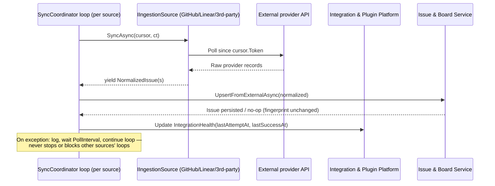

# Integration & Plugin Platform

> Feature spec for Spec-Forge implementation planning.
> Source: extracted from docs/anvilboard/tech-design.md §8.1
> Created: 2026-09-05

| Field | Value |
|-------|-------|
| Component | integration-and-plugin-platform |
| Priority | P0 |
| SRS Refs | FR-INT-001, FR-INT-002, FR-INT-003, NFR-REL-002, NFR-SEC-001 |
| Tech Design Ref | §8.1 — Integration & Plugin Platform row; also §7.6 Retry & Circuit Breaker Configuration, §11.3 Data Encryption |
| Depends On | issue-board-service, workspace-authorization |
| Blocks | agent-and-automation-surface, audit-and-recovery |

## Purpose

The Integration & Plugin Platform owns the lifecycle of external connectors (GitHub, Linear, and any approved third-party plugin): configuring and securing provider credentials, running per-source ingestion/webhook polling in fault-isolated loops, normalizing remote records into the shared `NormalizedIssue`/`NormalizedComment` shape, and surfacing provenance and synchronization health without ever leaking secret material. It never writes an `Issue` directly — every normalized record is written through `issue-board-service`'s `UpsertFromExternalAsync`, guaranteeing that provider-sourced and user/agent-sourced issues obey identical validation, activity, and audit rules (tech-design §8.4).

## Scope

**Included:**
- Integration lifecycle: configure, validate, enable, pause, test, and remove an approved integration (FR-INT-001).
- Secret handling: write-only credential input, redaction across every read/log/error/audit/export surface (FR-INT-001, NFR-SEC-001).
- Ingestion plugin execution (`IIngestionSource`): per-source polling loop, incremental sync via opaque cursors, fault isolation so one failing source never blocks another or local mutations (FR-INT-002, NFR-REL-002).
- Webhook plugin execution (`IWebhookReceiver`): signature verification, payload parsing, normalization into `NormalizedIssue`/`NormalizedComment`.
- Post-commit plugin execution (`IIssueHook`): reacting to already-committed issue mutations (owned jointly with `issue-board-service`'s hook-dispatch mechanics; this component owns hook *registration/discovery* and *manifest/compatibility validation*).
- Plugin discovery and manifest/version/capability validation (`IPluginRegistry`, `PluginManifest`) for both in-repo (GitHub, Linear) and reflection-loaded third-party plugins (FR-INT-003).
- Provenance and sync-health surfacing: `(provider, remoteId)` deduplication identity, last attempt/success timestamps, and a derived sync condition (`FRESH`/`STALE`/`PAUSED`/`FAILED`).
- Outbound retry/backoff and rate-limit honoring for provider adapters (`Anvilboard.Integrations.GitHub`/`.Linear`).

**Excluded:**
- Persisting or mutating `Issue`/`Comment` rows directly (owned by `issue-board-service`; this component only produces `NormalizedIssue`/`NormalizedComment` and calls its upsert path).
- Workflow-state legality and transition rules applied to synced issues (owned by `workflow-engine`; ingestion supplies only a *suggested* status/priority).
- Authenticating the administrator configuring an integration or authorizing which role may do so (owned by `workspace-authorization`; this component receives an already-authorized request).
- Audit-record persistence and retention (owned by `audit-and-recovery`; this component emits health/lifecycle events for that component to record).
- Untrusted/sandboxed plugin code execution — only first-party-reviewed plugin packages are in scope (tech-design §3.3 non-goal).

## Core Responsibilities

1. **Integration lifecycle management** — configure, validate, enable, pause, test-connect, and remove an integration without exposing stored secrets.
2. **Secret handling** — accept credentials write-only, store them via a secret-provider abstraction, and redact them from every read/log/audit/export path.
3. **Ingestion polling** — run one independent timer loop per registered `IIngestionSource`, upserting yielded records through `issue-board-service`.
4. **Webhook processing** — verify provider signatures, parse payloads, and normalize inbound pushes into upsertable records.
5. **Plugin discovery & compatibility validation** — enumerate first-class and reflection-loaded plugins uniformly; validate manifest identity, contract version, and declared capabilities before activation.
6. **Sync-health derivation** — compute and expose `(lastAttemptAt, lastSuccessAt, isPaused, lastErrorCategory)` → sync condition without storing the condition redundantly.
7. **Fault containment** — ensure a failing provider, webhook, or hook plugin cannot block or delay another integration's loop or any local issue mutation.

## Interfaces

### Inputs
- **Integration lifecycle requests** (`configure`, `validate`, `enable`, `pause`, `test`, `remove`) via `POST /api/v1/integrations/{id}/sync` and equivalent administrator-only CLI/MCP operations (tech-design §9.1).
- **Provider polling responses** — raw HTTP/GraphQL payloads fetched by `GitHubIngestionSource`/`LinearIngestionSource` on each `SyncAsync(SyncCursor, ct)` invocation.
- **Inbound webhook deliveries** — `WebhookRequest(Headers, RawBody)` routed by the host from `POST /webhooks/{provider}` to the matching `IWebhookReceiver.RoutePrefix`.
- **Plugin assemblies** — reflection-loaded from `PluginHostOptions.AssemblyPaths`, or DI-registered `IAnvilboardPlugin` instances from in-repo integrations.

### Outputs
- **`NormalizedIssue` / `NormalizedComment` records** — passed to `issue-board-service.UpsertFromExternalAsync` / the equivalent comment upsert path.
- **`ExternalLink` upsert requests** — `(Provider, SourceKey)` deduplication identity, URL, and sync fingerprint, persisted by `issue-board-service` alongside the issue it maps to.
- **Sync-health / condition data** — consumed by the board/dashboard read model (`issue-board-service`'s `syncCondition` filter) and the integrations administration UI.
- **Lifecycle/health diagnostic events** — consumed by `audit-and-recovery` for the audit trail (FR-OPS-001).

### Dependencies
- **`issue-board-service`** — the only write path this component uses to persist a synced issue/comment; this component never touches `AnvilboardDbContext.Issues` directly.
- **`workspace-authorization`** — supplies the authorized administrator context for lifecycle mutations; integration configuration is workspace-scoped like every other mutation.
- **External providers (GitHub REST API, Linear GraphQL API)** — outbound HTTP/GraphQL dependencies with provider-specific rate limits and signature schemes.
- **`Anvilboard.Plugins.Abstractions`** — the extension-point contracts (`IIngestionSource`, `IWebhookReceiver`, `IIssueHook`, `IPluginRegistry`, `PluginManifest`) this component implements against and validates.

## Data Flow



## Key Behaviors

### `SyncCoordinator.ExecuteAsync` / `RunSourceLoopAsync(IIngestionSource, ct)` (existing, `Anvilboard.Application/Sync/SyncCoordinator.cs`)

Runs one independent `while` loop per registered `IIngestionSource`, started together via `Task.WhenAll` in `ExecuteAsync`. Each iteration: reads `IngestionOptions` for that source's key; skips the poll (waits 1 minute) if disabled; otherwise calls `source.SyncAsync(cursor, ct)`, upserts each yielded record through `IssueService.UpsertFromExternalAsync`, advances the cursor from `normalized.SyncFingerprint`, and waits `options.PollInterval`. A caught, logged exception (excluding `OperationCanceledException`) does not stop the loop — it proceeds to the next `Delay`/iteration, which is the mechanism satisfying FR-INT-002 AC 4 ("one failing integration does not block local work or unrelated integrations") and NFR-REL-002.

Future-state additions required by tech-design §7.6:

1. **Bounded exponential backoff**: on a transient provider failure, wait an increasing bounded interval (not the fixed `PollInterval`) before the next attempt; reset to `PollInterval` after a successful sync.
2. **`Retry-After` / rate-limit honoring**: if the provider response includes a `Retry-After` header or rate-limit reset time, the next attempt must not occur before that time.
3. **Non-transient errors are not retried on the same cadence**: a 4xx business error (e.g., revoked token) should mark the integration `FAILED` immediately rather than retry-looping at the transient backoff cadence.
4. **`IntegrationHealth` write**: after every attempt (success or failure), update `lastAttemptAt`; on success, additionally update `lastSuccessAt` and clear `lastErrorCategory`; on failure, set `lastErrorCategory` to a safe, non-secret classification (`AUTH`, `RATE_LIMITED`, `TRANSPORT`, `UNKNOWN`).

### `GitHubIngestionSource.SyncAsync` / `LinearIngestionSource.SyncAsync` (existing)

Both implement `IIngestionSource.SyncAsync(SyncCursor, ct)` as an `IAsyncEnumerable<NormalizedIssue>`, using the cursor's opaque `Token` as a "since" bound (GitHub: `DateTimeOffset` parsed from the token; Linear: an equivalent incremental parameter). Each yields `NormalizedIssue` records mapped from the provider's DTO shape (`GitHubIssueDto`/Linear equivalent) via a manual `ToNormalizedIssue(...)` projection, including a `SyncFingerprint` used by `issue-board-service` to skip no-op re-syncs. No behavior change is required here for FR-INT-002; the fingerprint-based dedup and cursor-based incremental fetch already satisfy AC 1–3.

### `GitHubWebhookReceiver.HandleAsync` / `LinearWebhookReceiver.HandleAsync` (existing)

Both verify an HMAC signature header (`X-Hub-Signature-256` for GitHub, `Linear-Signature` for Linear) using `CryptographicOperations.FixedTimeEquals` before trusting the payload, returning `WebhookResult.Reject(reason)` — never throwing — on an invalid signature or malformed JSON. Accepted, relevant events are normalized into `NormalizedIssue` and returned via `WebhookResult.Accept(issues: [...])`; the host endpoint (`WebhookEndpoints.MapWebhookEndpoints`) then calls `IssueService.UpsertFromExternalAsync` for each. No behavior change required; this is the reference pattern any future first-class or third-party webhook receiver must follow.

### `IIntegrationService` (planned; new)

Tech-design §8.1 lists `IIntegrationService` as a public interface not yet implemented in the PoC. Required lifecycle operations per FR-INT-001:

| Method | Behavior | Error on violation |
|---|---|---|
| `ConfigureAsync(workspaceId, provider, credentials, settings)` | Validates and stores credentials via the secret-provider abstraction (write-only); persists non-secret settings (repositories, team key, poll interval). | `VALIDATION_FAILED` for malformed settings. |
| `ValidateAsync(integrationId)` / `TestAsync(integrationId)` | Performs a bounded connectivity/auth check against the provider without importing data unless explicitly requested (FR-INT-001 AC 2). | `PROVIDER_UNAVAILABLE` on unreachable/invalid credential. |
| `EnableAsync(integrationId)` / `PauseAsync(integrationId)` | Toggles whether `SyncCoordinator` schedules polling/webhook processing for that source; a paused integration performs zero scheduled work (FR-INT-001 AC 3). | `INTEGRATION_PAUSED` returned by a sync action against an already-paused integration. |
| `RemoveAsync(integrationId, confirm)` | Requires explicit confirmation; defines whether retained imported data is archived or remains read-only (FR-INT-001 AC 4). | `VALIDATION_FAILED` if `confirm` is absent. |

Secret storage: credentials are never returned by any read method; every DTO returned by `IIntegrationService` redacts secret fields (mirrors `GitHubOptions.Token`/`WebhookSecret` today, which must move from plaintext configuration into the secret-provider abstraction per tech-design §11.3, open decision OQ-004).

### Plugin manifest/compatibility validation (planned extension to `PluginRegistry`)

`PluginManifest(Key, DisplayName, Version)` currently carries no explicit contract-version or capability field. FR-INT-003 requires validating "identity, supported contract version, declared capabilities, and configuration before activation." Planned addition: extend `PluginManifest` with a `SupportedContractVersion` (or equivalent) field, and have `PluginRegistry`'s assembly-loading path (`Anvilboard.Infrastructure/Plugins/PluginRegistry.cs`) reject — log and skip, not crash the host — any plugin whose declared contract version is incompatible with the host's supported range, consistent with the existing per-plugin `try/catch` isolation already present in that loader.

### Sync condition derivation (planned)

`syncCondition` is not a stored column; it is computed at read time (tech-design §7.5) from an `IntegrationHealth` record:

```
FAILED   if lastErrorCategory is set and no success since
PAUSED   if integration.isPaused
STALE    if lastSuccessAt is older than the configured freshness threshold
FRESH    otherwise
```

This derivation must be implemented once, in this component, and reused by both the board query's `syncCondition` filter and the dashboard's freshness/exception summary — never duplicated.

## Constraints

- **No direct issue writes**: this component must call `issue-board-service`'s upsert path for every synced record; it must never call `AnvilboardDbContext.Issues` directly.
- **Fault isolation**: each `IIngestionSource`'s polling loop runs independently; an unhandled exception in one loop must be caught and logged without stopping that loop or any other (NFR-REL-002).
- **Post-commit hooks cannot veto**: `IIssueHook` implementations run only after a core mutation is durably committed and cannot roll it back; hook failures are diagnostics, not request failures (FR-INT-003 AC 3).
- **Secret write-only**: no method on `IIntegrationService` or any DTO it returns may echo a stored secret value, in success or error responses, logs, or audit summaries (NFR-SEC-001).
- **Deduplication identity**: `(Provider, SourceKey)` — mapped to the `(Provider, RemoteId)` unique index on `ExternalLinks` — is the sole dedup key; a second delivery of the same remote record must update, not duplicate.
- **Bounded retry**: outbound provider retries use bounded exponential backoff and honor `Retry-After`/rate-limit headers; non-transient (4xx business) provider errors are not retried (tech-design §7.6).
- **Untrusted code out of scope**: only first-party-reviewed plugin packages are supported; no plugin sandboxing/isolation model is required in this design pass.

## Acceptance Criteria

| AC-ID | Priority | Criterion | Expected Result | Verification Method |
|-------|----------|-----------|-----------------|---------------------|
| AC-009 | P1 | Given GitHub polling is failing while Linear polling and a local issue mutation proceed normally, when a fault-injection test holds GitHub unavailable. | GitHub integration health is marked `FAILED`/`STALE` with diagnostic context; Linear sync and the local mutation complete without waiting for GitHub recovery. | Integration — `SyncCoordinatorTests.OneSourceFailing_DoesNotBlockOtherSourcesOrLocalMutations`. |
| AC-010 | P1 | Given an `ExternalLink`-backed issue with no write-back policy enabled, when a local mutation attempts to change a provider-controlled field. | The mutation is rejected (delegated to `issue-board-service`'s business-rule check); the platform never issues the write itself. | Negative — `IntegrationPlatformTests.ProviderControlledField_NotWritableWithoutPolicy`. |
| AC-IPP-101 | P0 | Given repeated delivery of the same remote record (webhook redelivery or poll overlap), when both deliveries are processed. | Exactly one `ExternalLink` and one `Issue` exist for that `(Provider, SourceKey)`; the second delivery updates rather than duplicates. | Integration — `SyncCoordinatorTests.DuplicateDelivery_UpdatesNotDuplicates` (boundary for FR-INT-002 AC 1). |
| AC-IPP-102 | P0 | Given a webhook request with an invalid or missing signature, when `HandleAsync` processes it. | `WebhookResult.Reject(...)` is returned (never a thrown exception); no `NormalizedIssue` is produced and no upsert occurs. | Unit — `GitHubWebhookReceiverTests.InvalidSignature_RejectsWithoutProducingIssue` (negative). |
| AC-IPP-103 | P0 | Given integration secret configuration, when any read, log, error, audit, or export surface renders the integration's data. | The raw secret value never appears in any of those surfaces; only a redacted/opaque reference is present. | Security/Integration — `IntegrationServiceTests.SecretFields_NeverAppearInReadOrLogOutput` (NFR-SEC-001). |
| AC-IPP-104 | P1 | Given a plugin assembly whose manifest declares an unsupported contract version, when `PluginRegistry` loads it at startup. | The plugin is skipped and logged; the host starts successfully and all compatible plugins remain loaded. | Unit — `PluginRegistryTests.IncompatibleContractVersion_SkippedWithoutCrashingHost` (boundary for FR-INT-003 AC 1). |
| AC-IPP-105 | P1 | Given an `IIssueHook` that throws on every invocation, when a post-commit hook dispatch occurs after a successful ingestion upsert. | The upsert result is unaffected; the hook exception is logged, never propagated (negative — hook must not veto or roll back a committed mutation). | Unit — `IssueHookDispatchTests.ThrowingHook_DoesNotAffectCommittedUpsert`. |

## Error Handling

Every anticipated failure resolves to a §7.7 catalog code; no raw provider HTTP exception, GraphQL error, or webhook parsing exception may propagate past this component.

| Condition | Code | HTTP status | Notes |
|---|---:|---|---|
| Sync/test action against a paused integration | `INTEGRATION_PAUSED` | 409 | State that synchronization is paused and must be resumed deliberately. |
| Provider timeout, transport failure, or retry budget exhaustion | `PROVIDER_UNAVAILABLE` | 502 | Identifies provider and operation; retry only after bounded backoff. |
| Integration/workflow-state reference not found | `REFERENCED_ENTITY_NOT_FOUND` | 404 | E.g., sync request against a removed integration ID. |
| Malformed lifecycle request body (missing `confirm`, invalid settings) | `VALIDATION_FAILED` | 400 | Names the invalid/missing field. |
| Actor lacks permission for the integration's workspace | `WORKSPACE_ACCESS_DENIED` | 403 | Enforced by `workspace-authorization` upstream; this component never re-derives it. |
| Webhook signature invalid or payload malformed | *(no REST error code — `WebhookResult.Reject`)* | 400 (webhook endpoint only) | Returned as `{ error: rejectionReason }` per `WebhookEndpoints`; never a 5xx. |

## File Structure

```
src/
├── Anvilboard.Plugins.Abstractions/
│   ├── IIngestionSource.cs               # Existing
│   ├── IWebhookReceiver.cs               # Existing
│   ├── IIssueHook.cs                     # Existing
│   ├── IPluginRegistry.cs                # Existing
│   ├── NormalizedIssue.cs                # Existing
│   ├── PluginManifest.cs                 # Existing; planned: + SupportedContractVersion field
│   └── IIntegrationService.cs            # Planned: lifecycle contract (configure/validate/enable/pause/test/remove)
├── Anvilboard.Application/
│   └── Sync/
│       ├── SyncCoordinator.cs            # Existing; planned: backoff + IntegrationHealth writes
│       └── IntegrationHealthService.cs   # Planned: sync-condition derivation (FRESH/STALE/PAUSED/FAILED)
├── Anvilboard.Domain/
│   └── IntegrationHealth.cs              # Planned: lastAttemptAt/lastSuccessAt/isPaused/lastErrorCategory entity
├── Anvilboard.Integrations.GitHub/
│   ├── GitHubIngestionSource.cs          # Existing
│   ├── GitHubWebhookReceiver.cs          # Existing
│   └── GitHubOptions.cs                 # Existing; planned: Token/WebhookSecret move to secret-provider abstraction
├── Anvilboard.Integrations.Linear/
│   ├── LinearIngestionSource.cs          # Existing
│   ├── LinearWebhookReceiver.cs          # Existing
│   └── LinearOptions.cs                 # Existing; planned: ApiKey/WebhookSecret move to secret-provider abstraction
└── Anvilboard.Infrastructure/
    └── Plugins/
        ├── PluginRegistry.cs             # Existing; planned: contract-version compatibility check on load
        └── PluginHostOptions.cs          # Existing
```

## Test Module

**Test file**: `src/Anvilboard.Application.Tests/Sync/SyncCoordinatorTests.cs`

**Test scope**:
- **Unit**: `RunSourceLoopAsync()` fault-isolation behavior (one source's exception does not stop its own loop or any other source's loop), cursor advancement from `SyncFingerprint`, disabled-source skip behavior.
- **Integration**: `UpsertFromExternalAsync` dedupe-on-`(Provider, SourceKey)` via a seeded `IIngestionSource` test double producing overlapping/duplicate `NormalizedIssue`s; fault-injection test holding one source's `SyncAsync` throwing while asserting another source's loop and a concurrent local `IssueService.CreateAsync` both complete.
- **Fixtures / Mocks**: fake `IIngestionSource` implementations with configurable yield/throw behavior per call; seeded `AnvilboardDbContext`.

**Test file**: `src/Anvilboard.Integrations.GitHub.Tests/GitHubWebhookReceiverTests.cs` (and equivalent `Anvilboard.Integrations.Linear.Tests/LinearWebhookReceiverTests.cs`)

**Test scope**:
- **Unit**: `HandleAsync()` signature verification (valid, invalid, and missing signature header), malformed-JSON rejection, correct `NormalizedIssue` mapping for an accepted `issues`/`Issue` event, and non-issue event types acknowledged without producing an issue.
- **Fixtures / Mocks**: HMAC-signed sample payloads computed with a known test secret; `IOptionsMonitor<GitHubOptions>`/`<LinearOptions>` stub returning that secret.

**Test file**: `src/Anvilboard.Infrastructure.Tests/Plugins/PluginRegistryTests.cs`

**Test scope**:
- **Unit**: assembly-loading path with a compatible plugin (loads and appears in `All`/`IngestionSources`/etc.), an incompatible-contract-version plugin (skipped, logged, host continues), and a plugin type that throws during construction (skipped, logged, other plugins still load).
- **Fixtures / Mocks**: small test-only plugin assemblies built as part of the test project, each implementing a distinct combination of `IIngestionSource`/`IWebhookReceiver`/`IIssueHook`.
