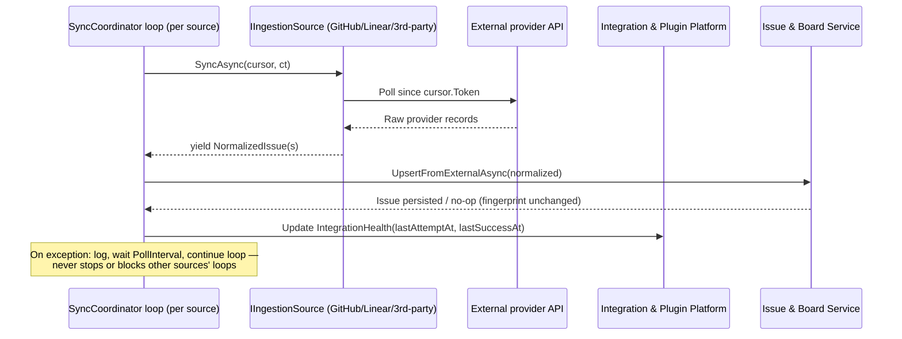
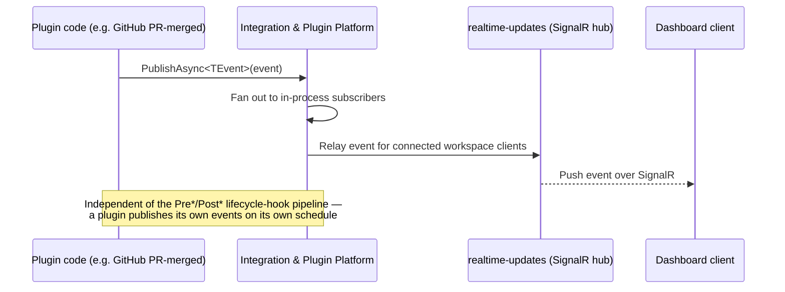

# Integration & Plugin Platform

> Feature spec for Spec-Forge implementation planning.
> Source: extracted from docs/anvilboard/tech-design.md §8.1
> Created: 2026-09-05

| Field | Value |
|-------|-------|
| Component | integration-and-plugin-platform |
| Priority | P0 |
| SRS Refs | FR-INT-001, FR-INT-002, FR-INT-003, FR-INT-004, FR-INT-005, FR-INT-006, FR-INT-007, FR-INT-009, NFR-REL-002, NFR-SEC-001 |
| Tech Design Ref | §8.1 — Integration & Plugin Platform row; also §7.6 Retry & Circuit Breaker Configuration, §7.7 Error Catalog, §11.3 Data Encryption |
| Depends On | issue-board-service, workspace-authorization, artifacts, realtime-updates |
| Blocks | agent-and-automation-surface, audit-and-recovery |

## Purpose

The Integration & Plugin Platform owns the lifecycle of external connectors (GitHub, Linear, and any approved third-party plugin): configuring and securing provider credentials, running per-source ingestion/webhook polling in fault-isolated loops, normalizing remote records into the shared `NormalizedIssue`/`NormalizedComment` shape, and surfacing provenance and synchronization health without ever leaking secret material. It never writes an `Issue` directly — every normalized record is written through `issue-board-service`'s `UpsertFromExternalAsync`, guaranteeing that provider-sourced and user/agent-sourced issues obey identical validation, activity, and audit rules (tech-design §8.4).

## Scope

**Included:**
- Integration lifecycle: configure, validate, enable, pause, test, and remove an approved integration (FR-INT-001).
- Secret handling: write-only credential input, redaction across every read/log/error/audit/export surface (FR-INT-001, NFR-SEC-001).
- Ingestion plugin execution (`IIngestionSource`): per-source polling loop, incremental sync via opaque cursors, fault isolation so one failing source never blocks another or local mutations (FR-INT-002, NFR-REL-002).
- Webhook plugin execution (`IWebhookReceiver`): signature verification, payload parsing, normalization into `NormalizedIssue`/`NormalizedComment`.
- Unified lifecycle-hook execution (`ILifecycleHook<TEvent>`): a single generic, state-transition-shaped hook contract invoked at named `Pre*`/`Post*` pipeline points (`PreIngest`/`PostIngest`, `PreResync`/`PostResync`, `PrePhaseChange`/`PostPhaseChange`, `PreAddComment`/`PostAddComment`, `PreAddAttachment`/`PostAddAttachment`) — this component owns hook *registration/discovery*, *manifest/compatibility validation*, and *dispatch* (FR-INT-003, FR-INT-004).
- Plugin discovery and manifest/version/capability validation (`IPluginRegistry`, `PluginManifest`) for both in-repo (GitHub, Linear) and reflection-loaded third-party plugins (FR-INT-003).
- Provenance and sync-health surfacing: `(provider, sourceKey)` deduplication identity, last attempt/success timestamps, and a derived sync condition (`FRESH`/`STALE`/`PAUSED`/`FAILED`).
- Outbound retry/backoff and rate-limit honoring for provider adapters (`Anvilboard.Integrations.GitHub`/`.Linear`).
- `Pre*` gating hooks: veto-capable hooks (e.g., `PreIngestHook` filtering which remote records are even admitted, `PrePhaseChangeHook` gating a transition) that run before a mutation commits and may deny it with a reason (FR-INT-004).
- `Post*` reactive hooks: mutation-capable hooks (e.g., `PostIngestHook`, `PostPhaseChangeHook`) that run after a mutation is durably committed and may add comments, artifacts, links, or session-state updates through the ordinary authorized service surface (FR-INT-004).
- Artifact-expansion as a `PostAddComment`/`PostIngest` hook realization: a hook that recognizes a linked resource (e.g., a Slack thread URL pasted into a comment or description) and calls `IArtifactService` to fetch and attach it as a durable `Artifact` (FR-INT-004, lifecycle-hook realization example).
- Sync-conflict detection: on resync, comparing local `Issue.Version` against `ExternalLink.LastSyncedVersion` to detect a local edit that raced a remote change, raising a conflict for resolution instead of silently overwriting — additive sub-resources (comments, artifacts, issue links) are excluded from conflict detection entirely and always merge as a list-union (FR-INT-005).
- Outbound plugin event publishing (`IPluginEventPublisher`): plugins may publish their own typed domain events (e.g., `github.pull_request.merged`) for in-process subscribers and for relay to the real-time dashboard, independent of the lifecycle-hook pipeline (FR-INT-006).
- GitHub pull-request-as-artifact support: correlating a PR to an issue and attaching/refreshing it as a `PullRequest`-kind `Artifact` with live status, plus a general plugin config/state persistence abstraction (`IPluginConfigStore`/`IPluginStateStore`) any plugin can use (FR-INT-007, FR-INT-009).

**Excluded:**
- Persisting or mutating `Issue`/`Comment` rows directly (owned by `issue-board-service`; this component only produces `NormalizedIssue`/`NormalizedComment` and calls its upsert path, including enrichment-hook-driven mutations, which route through the same service).
- Workflow-state legality and transition rules applied to synced issues (owned by `workflow-engine`; ingestion supplies only a *suggested* status/priority).
- Authenticating the administrator configuring an integration or authorizing which role may do so (owned by `workspace-authorization`; this component receives an already-authorized request).
- Audit-record persistence and retention (owned by `audit-and-recovery`; this component emits health/lifecycle events for that component to record).
- Untrusted/sandboxed plugin code execution — only first-party-reviewed plugin packages are in scope (tech-design §3.3 non-goal).
- Artifact content storage/retrieval mechanics (owned by `artifacts.md`; this component only calls `IArtifactService` from within an enrichment hook).
- Sync-conflict resolution UI/decision logic (owned by `issue-board-service`'s `/sync-conflicts/{conflictId}/resolve` endpoint; this component only detects and raises the conflict).

## Core Responsibilities

1. **Integration lifecycle management** — configure, validate, enable, pause, test-connect, and remove an integration without exposing stored secrets.
2. **Secret handling** — accept credentials write-only, store them via a secret-provider abstraction, and redact them from every read/log/audit/export path.
3. **Ingestion polling** — run one independent timer loop per registered `IIngestionSource`, upserting yielded records through `issue-board-service`.
4. **Webhook processing** — verify provider signatures, parse payloads, and normalize inbound pushes into upsertable records.
5. **Plugin discovery & compatibility validation** — enumerate first-class and reflection-loaded plugins uniformly; validate manifest identity, contract version, and declared capabilities before activation.
6. **Sync-health derivation** — compute and expose `(lastAttemptAt, lastSuccessAt, isPaused, lastErrorCategory)` → sync condition without storing the condition redundantly.
7. **Fault containment** — ensure a failing provider, webhook, or hook plugin cannot block or delay another integration's loop or any local issue mutation.
8. **Lifecycle-hook dispatch** — invoke registered `ILifecycleHook<TEvent>` implementations at defined `Pre*`/`Post*` pipeline points (ingest, resync, phase change, add-comment, add-attachment), enforcing a bounded per-hook execution budget and, for `Pre*` hooks, a veto/allow decision; every `Post*` mutation the hook makes routes through the same authorized service calls (`IIssueService`, `IArtifactService`) any other actor uses.
9. **Sync-conflict detection** — on each resync of an `ExternalLink`-backed issue, compare local `Issue.Version` against `ExternalLink.LastSyncedVersion` and the incoming remote payload to distinguish a clean update from a conflicting concurrent local edit; additive sub-resources (comments, artifacts, issue links) are excluded from this comparison and are always merged, never flagged.
10. **Outbound plugin event publishing** — accept a plugin-declared, strongly-typed event via `IPluginEventPublisher.PublishAsync<TEvent>`, fan it out to in-process subscribers, and relay it to the real-time dashboard channel (`realtime-updates`) for connected clients.
11. **Plugin config/state persistence** — provide every plugin a namespaced key-value config store (`IPluginConfigStore`, admin-writable, secret-aware) and state store (`IPluginStateStore`, plugin-writable) so provider-specific data (e.g., a GitHub PR-to-issue correlation cache) survives host restarts without the plugin owning its own schema.

## Interfaces

### Inputs
- **Integration lifecycle requests** (`configure`, `validate`, `enable`, `pause`, `test`, `remove`) via `POST /api/v1/integrations/{id}/sync` and equivalent administrator-only CLI/MCP operations (tech-design §9.1).
- **Provider polling responses** — raw HTTP/GraphQL payloads fetched by `GitHubIngestionSource`/`LinearIngestionSource` on each `SyncAsync(SyncCursor, ct)` invocation.
- **Inbound webhook deliveries** — `WebhookRequest(Headers, RawBody)` routed by the host from `POST /webhooks/{provider}` to the matching `IWebhookReceiver.RoutePrefix`.
- **Plugin assemblies** — reflection-loaded from `PluginHostOptions.AssemblyPaths`, or DI-registered `IAnvilboardPlugin` instances from in-repo integrations.
- **`ILifecycleHook<TEvent>` registrations** — DI-registered or reflection-loaded, invoked with a typed `HookContext<TEvent, TMetadata>(issue, trigger, metadata, ct)` at the `Pre*`/`Post*` pipeline points defined below (FR-INT-004).
- **Resync payloads for already-linked issues** — the same `NormalizedIssue` shape as first-sync, but compared against `ExternalLink.LastSyncedVersion` to detect conflicts (FR-INT-005).
- **Plugin-published outbound events** — `PublishAsync<TEvent>(TEvent)` calls made by plugin code (e.g., a GitHub PR-merged notification) (FR-INT-006).
- **Plugin config/state reads and writes** — namespaced `IPluginConfigStore`/`IPluginStateStore` calls scoped to the calling plugin's manifest identity (FR-INT-007).

### Outputs
- **`NormalizedIssue` / `NormalizedComment` records** — passed to `issue-board-service.UpsertFromExternalAsync` / the equivalent comment upsert path.
- **`ExternalLink` upsert requests** — `(Provider, SourceKey)` deduplication identity, URL, sync fingerprint, and `LastSyncedVersion`, persisted by `issue-board-service` alongside the issue it maps to.
- **Sync-health / condition data** — consumed by the board/dashboard read model (`issue-board-service`'s `syncCondition` filter) and the integrations administration UI.
- **Lifecycle/health diagnostic events** — consumed by `audit-and-recovery` for the audit trail (FR-OPS-001).
- **`Post*` hook mutations** — comments, artifacts, links, and session-state updates, all issued as ordinary `IIssueService`/`IArtifactService`/`IIssueLinkService` calls (never a direct `DbContext` write) so they carry the same actor/audit/validation envelope as any other caller (FR-INT-004).
- **`Pre*` hook veto decisions** — an `Allow`/`Deny(reason)` result returned to the caller *before* the gated mutation commits; a deny short-circuits the mutation and surfaces the reason to the initiating caller (FR-INT-004).
- **`SYNC_CONFLICT` events** — raised to `issue-board-service` when a resync detects a diverged local edit on a non-additive field; surfaced to the caller as a 409 rather than applied silently. Additive sub-resources never raise this event — they merge automatically (FR-INT-005).
- **Relayed plugin events** — forwarded to `realtime-updates` for broadcast to subscribed dashboard clients (FR-INT-006).
- **`PullRequest` artifact upserts** — GitHub PR correlation results passed to `artifacts.md`'s `IArtifactService` as a refreshable `PullRequest`-kind artifact (FR-INT-007).

### Dependencies
- **`issue-board-service`** — the only write path this component uses to persist a synced issue/comment; this component never touches `AnvilboardDbContext.Issues` directly. `Post*` hooks route through its `IIssueService`/`IArtifactService`/`IIssueLinkService` surfaces exclusively.
- **`workspace-authorization`** — supplies the authorized administrator context for lifecycle mutations; integration configuration is workspace-scoped like every other mutation.
- **External providers (GitHub REST API, Linear GraphQL API)** — outbound HTTP/GraphQL dependencies with provider-specific rate limits and signature schemes.
- **`artifacts.md` (`IArtifactService`)** — the interface a `Post*` artifact-expansion hook, or the GitHub PR-correlation feature, calls to persist a fetched/refreshed external resource as a durable `Artifact`.
- **`realtime-updates`** — the channel this component relays plugin-published outbound events to for dashboard broadcast (FR-INT-006).
- **`Anvilboard.Plugins.Abstractions`** — the extension-point contracts (`IIngestionSource`, `IWebhookReceiver`, `ILifecycleHook<TEvent>`, `IPluginEventPublisher`, `IPluginConfigStore`, `IPluginStateStore`, `IPluginRegistry`, `PluginManifest`) this component implements against and validates.

## Data Flow



**Resync with lifecycle hooks and additive-merge conflict detection:**

```mermaid
sequenceDiagram
    participant Source as IIngestionSource
    participant IP as Integration & Plugin Platform
    participant IBS as Issue & Board Service
    participant Hook as ILifecycleHook<TEvent>

    Source-->>IP: yield NormalizedIssue (already-linked ExternalLink)
    IP->>Hook: Invoke PreResync hooks(issue, incoming) — may Deny(reason)
    Hook-->>IP: Allow
    IP->>IBS: Merge additive sub-resources (comments, artifacts, links) as list-union — always, no comparison
    alt Local Version (non-additive fields) unchanged since last sync
        IP->>IBS: UpsertFromExternalAsync(normalized) — applies cleanly
        IBS-->>IP: Issue updated; ExternalLink.LastSyncedVersion advanced
        IP->>Hook: Invoke PostResync hooks(issue, trigger=Resync)
        Hook->>IBS: AddCommentAsync / AttachArtifactAsync / UpdateSessionStateAsync (as issue-service caller)
        IBS-->>Hook: Mutation applied with normal authorization/audit
    else Local Version (non-additive fields) changed since last sync (concurrent local edit)
        IP->>IBS: Raise SYNC_CONFLICT(issueId, localVersion, remotePayload) — non-additive fields only
        IBS-->>IP: Conflict recorded; remote payload preserved, not applied
        Note over IP,IBS: Resolvable from the dashboard via POST /api/v1/issues/{id}/sync-conflicts/{conflictId}/resolve<br/>(keep-local / apply-remote / merge)
    end
```

**Outbound plugin event publishing and dashboard relay:**



## Key Behaviors

### `SyncCoordinator.ExecuteAsync` / `RunSourceLoopAsync(IIngestionSource, ct)` (existing, `Anvilboard.Application/Sync/SyncCoordinator.cs`)

Runs one independent `while` loop per registered `IIngestionSource`, started together via `Task.WhenAll` in `ExecuteAsync`. Each iteration: reads `IngestionOptions` for that source's key; skips the poll (waits 1 minute) if disabled; otherwise calls `source.SyncAsync(cursor, ct)`, upserts each yielded record through `IssueService.UpsertFromExternalAsync`, advances the cursor from `normalized.SyncFingerprint`, and waits `options.PollInterval`. A caught, logged exception (excluding `OperationCanceledException`) does not stop the loop — it proceeds to the next `Delay`/iteration, which is the mechanism satisfying FR-INT-002 AC 4 ("one failing integration does not block local work or unrelated integrations") and NFR-REL-002.

Future-state additions required by tech-design §7.6:

1. **Bounded exponential backoff**: on a transient provider failure, wait an increasing bounded interval (not the fixed `PollInterval`) before the next attempt; reset to `PollInterval` after a successful sync.
2. **`Retry-After` / rate-limit honoring**: if the provider response includes a `Retry-After` header or rate-limit reset time, the next attempt must not occur before that time.
3. **Non-transient errors are not retried on the same cadence**: a 4xx business error (e.g., revoked token) should mark the integration `FAILED` immediately rather than retry-looping at the transient backoff cadence.
4. **`IntegrationHealth` write**: after every attempt (success or failure), update `lastAttemptAt`; on success, additionally update `lastSuccessAt` and clear `lastErrorCategory`; on failure, set `lastErrorCategory` to a safe, non-secret classification (`AUTH`, `RATE_LIMITED`, `TRANSPORT`, `UNKNOWN`).

### `GitHubIngestionSource.SyncAsync` / `LinearIngestionSource.SyncAsync` (existing)

Both implement `IIngestionSource.SyncAsync(SyncCursor, ct)` as an `IAsyncEnumerable<NormalizedIssue>`, using the cursor's opaque `Token` as a "since" bound (GitHub: `DateTimeOffset` parsed from the token; Linear: an equivalent incremental parameter). Each yields `NormalizedIssue` records mapped from the provider's DTO shape (`GitHubIssueDto`/Linear equivalent) via a manual `ToNormalizedIssue(...)` projection, including a `SyncFingerprint` used by `issue-board-service` to skip no-op re-syncs. No behavior change is required here for FR-INT-002; the fingerprint-based dedup and cursor-based incremental fetch already satisfy AC 1–3.

### `GitHubWebhookReceiver.HandleAsync` / `LinearWebhookReceiver.HandleAsync` (existing)

Both verify an HMAC signature header (`X-Hub-Signature-256` for GitHub, `Linear-Signature` for Linear) using `CryptographicOperations.FixedTimeEquals` before trusting the payload, returning `WebhookResult.Reject(reason)` — never throwing — on an invalid signature or malformed JSON. Accepted, relevant events are normalized into `NormalizedIssue` and returned via `WebhookResult.Accept(issues: [...])`; the host endpoint (`WebhookEndpoints.MapWebhookEndpoints`) then calls `IssueService.UpsertFromExternalAsync` for each. No behavior change required; this is the reference pattern any future first-class or third-party webhook receiver must follow.

### `IIntegrationService` (planned; new)

Tech-design §8.1 lists `IIntegrationService` as a public interface not yet implemented in the PoC. Required lifecycle operations per FR-INT-001:

| Method | Behavior | Error on violation |
|---|---|---|
| `ConfigureAsync(workspaceId, provider, credentials, settings)` | Validates and stores credentials via the secret-provider abstraction (write-only); persists non-secret settings (repositories, team key, poll interval). | `VALIDATION_FAILED` for malformed settings. |
| `ValidateAsync(integrationId)` / `TestAsync(integrationId)` | Performs a bounded connectivity/auth check against the provider without importing data unless explicitly requested (FR-INT-001 AC 2). | `PROVIDER_UNAVAILABLE` on unreachable/invalid credential. |
| `EnableAsync(integrationId)` / `PauseAsync(integrationId)` | Toggles whether `SyncCoordinator` schedules polling/webhook processing for that source; a paused integration performs zero scheduled work (FR-INT-001 AC 3). | `INTEGRATION_PAUSED` returned by a sync action against an already-paused integration. |
| `RemoveAsync(integrationId, confirm)` | Requires explicit confirmation; defines whether retained imported data is archived or remains read-only (FR-INT-001 AC 4). | `VALIDATION_FAILED` if `confirm` is absent. |

Secret storage: credentials are never returned by any read method; every DTO returned by `IIntegrationService` redacts secret fields (mirrors `GitHubOptions.Token`/`WebhookSecret` today, which must move from plaintext configuration into the secret-provider abstraction per tech-design §11.3, open decision OQ-004).

### Plugin manifest/compatibility validation (planned extension to `PluginRegistry`)

`PluginManifest(Key, DisplayName, Version)` currently carries no explicit contract-version or capability field. FR-INT-003 requires validating "identity, supported contract version, declared capabilities, and configuration before activation." Planned addition: extend `PluginManifest` with a `SupportedContractVersion` (or equivalent) field, and have `PluginRegistry`'s assembly-loading path (`Anvilboard.Infrastructure/Plugins/PluginRegistry.cs`) reject — log and skip, not crash the host — any plugin whose declared contract version is incompatible with the host's supported range, consistent with the existing per-plugin `try/catch` isolation already present in that loader.

### Sync condition derivation (planned)

`syncCondition` is not a stored column; it is computed at read time (tech-design §7.5) from an `IntegrationHealth` record:

```
FAILED   if lastErrorCategory is set and no success since
PAUSED   if integration.isPaused
STALE    if lastSuccessAt is older than the configured freshness threshold
FRESH    otherwise
```

This derivation must be implemented once, in this component, and reused by both the board query's `syncCondition` filter and the dashboard's freshness/exception summary — never duplicated.

### `ILifecycleHook<TEvent>` (planned; new, FR-INT-004)

A single generic hook contract, shaped around named state-transition pipeline points rather than one interface per concern. Implementations are distinguished by which named point they register for and whether that point is `Pre*` (gating) or `Post*` (reactive):

| Contract element | Behavior |
|---|---|
| `Task<HookResult> HandleAsync(HookContext<TEvent> ctx, CancellationToken ct)` | `ctx` carries the issue snapshot, the named pipeline point (e.g., `PrePhaseChange`, `PostAddAttachment`), and a strongly-typed, event-specific metadata payload (`TEvent`, e.g. `PhaseChangeMetadata(FromPhase, ToPhase)`, `AttachmentMetadata(ArtifactKind, ContentReference)`) — generic per pipeline point, but every point's metadata shape is a concrete type, not a loose bag, so plugin authors get compile-time safety while the host stays generic over `TEvent`. Callers available on the context are `IServiceScope`-scoped (`IIssueService`, `IArtifactService`, `IIssueLinkService`) — never raw `DbContext` access. |
| Named pipeline points | `PreIngest`/`PostIngest`, `PreResync`/`PostResync`, `PrePhaseChange`/`PostPhaseChange`, `PreAddComment`/`PostAddComment`, `PreAddAttachment`/`PostAddAttachment`, `PreAddLink`/`PostAddLink`. Each point has its own `TEvent` metadata type; a plugin registers only for the points it needs. |
| `Pre*` semantics | Runs **before** the mutation commits. Returns `HookResult.Allow()` or `HookResult.Deny(reason)`; a deny short-circuits the mutation and the reason is surfaced to the initiating caller (e.g., a webhook ingest, a dashboard phase-change request). Multiple `Pre*` hooks for the same point run sequentially in registration order; the first `Deny` short-circuits remaining hooks. |
| `Post*` semantics | Runs **after** the mutation is durably committed. May mutate — add comments, artifacts, links, session-state updates, or trigger a further phase transition — but every mutation is issued through the same authorized service call (`IIssueService`, `IArtifactService`, `IWorkflowTransitionService`) any other actor uses; there is no privileged "hook bypass" path. This is where LLM-driven/scripted processing (e.g., "research whether this is really a bug," "summarize a linked Slack thread," "draft an RCA comment") lives. |
| Execution budget | Each hook invocation (`Pre*` or `Post*`) is time- and mutation-bounded (tech-design §7.7 `LifecycleHookOptions`: max duration, max mutation count per invocation). Exceeding the budget cancels the hook's remaining work, logs `HOOK_BUDGET_EXCEEDED`, and — for `Post*` — keeps mutations already committed (no rollback of prior partial work, each mutation is its own committed call); for `Pre*`, a budget-exceeded is treated as `Deny("budget exceeded")` so a runaway gate cannot silently let a mutation through. |
| Authorization/audit routing | Every mutation a hook performs is validated, versioned, and audit-logged identically to a human/API caller. A hook acts as a distinguished actor (`ActorType = Hook`, `ActorId = hookKey`) for audit attribution. |
| Registration | DI-registered or reflection-loaded, keyed by pipeline point and optionally a filter predicate (e.g., "only when `ToPhase == Intake`") so a workspace can opt a hook into only the transitions it cares about. |
| Ordering/failure isolation | Hooks for the same pipeline point run sequentially in registration order. For `Post*`, an unhandled exception in one hook is caught, logged, and does not prevent subsequent hooks or the triggering mutation's already-committed state from standing. For `Pre*`, an unhandled exception is treated as `Deny("hook faulted")` — a broken gate fails closed, never open. |

Example realization — **intake triage hook**: a `PostIngest` hook for issues landing in the workspace's configured intake phase calls an LLM to research the repository, then calls `AddCommentAsync` with an RCA summary and, if the hook concludes the ticket is actionable, calls `IWorkflowTransitionService` to move it to Triage — all as ordinary authorized `issue-board-service`/`workflow-engine` calls.

### Artifact-expansion hook pattern

A `PostAddComment`/`PostIngest` hook realization of FR-INT-004 (lifecycle-hook contract) that recognizes a linked external resource referenced in an issue's description or a comment (e.g., a Slack thread permalink, a deployment URL) and expands it into a durable `Artifact`:

1. Hook inspects new/changed text content (description, comment body) for a recognized URL pattern (per-provider matcher, e.g., `SlackThreadUrlMatcher`).
2. On a match, the hook fetches the linked content (Slack thread messages, deployment metadata) via the relevant provider client.
3. Hook calls `IArtifactService.AttachAsync(issueId, ArtifactKind.Link or .File, contentReference, metadata)` (see `artifacts.md`) to persist the expansion as an `Artifact` linked to the issue — never writing directly to artifact storage.
4. Expansion is idempotent: a second match on the same source URL updates the existing `Artifact`'s content reference rather than creating a duplicate (dedup key: `(IssueId, SourceUrl)`).

### Sync-conflict detection and dashboard resolution (planned; new, FR-INT-005)

On every resync of an already-linked issue (an `ExternalLink` already exists for `(Provider, SourceKey)`), before applying `UpsertFromExternalAsync`:

1. **Additive sub-resources merge unconditionally, first, with no comparison.** Incoming comments, artifacts, and issue links are appended as a list-union against the local set (dedup by provider-supplied external ID where available). Because these are additive-only by convention, there is no collision to detect — a local comment and a remote comment both simply exist afterward. This step never raises `SYNC_CONFLICT` and is not gated by the `Version` check below.
2. Compare the issue's current `Version` against `ExternalLink.LastSyncedVersion` (the `Version` observed the last time a remote payload was successfully applied) — this comparison covers only non-additive, mutable fields (title, description, priority, labels, phase, `SessionState` is explicitly excluded).
3. If unchanged (no local edit occurred since the last successful sync), apply the remote update normally and advance `LastSyncedVersion` to the issue's new `Version` after the write.
4. If changed (a local edit — e.g., a workflow transition or field edit — occurred since the last sync), do **not** silently overwrite. Instead:
   - Persist the incoming remote payload as a pending conflict record (fields: `issueId`, `provider`, `remotePayloadSnapshot`, `detectedAt`).
   - Return/raise `SYNC_CONFLICT` rather than a normal upsert result; the local issue's non-additive fields are left untouched (the additive merge from step 1 has already applied regardless).
   - The conflict is surfaced on the dashboard (a visible "resolve conflict" affordance on the issue) and resolved via `POST /api/v1/issues/{id}/sync-conflicts/{conflictId}/resolve` (tech-design §9.1), which lets the resolving actor choose `keep-local`, `apply-remote`, or `merge` (field-by-field); resolution advances `LastSyncedVersion` and clears the pending conflict.
5. A local-only edit that never conflicts with a remote change (e.g., editing `SessionState`, which bypasses `Issue.Version`, or adding a comment/artifact/link, which always merges per step 1) does not by itself trigger a conflict — only edits to non-additive fields that advance `Issue.Version` are considered for conflict comparison, consistent with `issue-board-service`'s optimistic-concurrency design.

### Outbound plugin event publishing (planned; new, FR-INT-006)

`IPluginEventPublisher.PublishAsync<TEvent>(TEvent domainEvent)` lets any plugin — independent of the `ILifecycleHook<TEvent>` pipeline — declare and emit its own typed event (e.g., `GitHubPullRequestMergedEvent(PullRequestUrl, IssueId, MergedAt)`). The platform fans the event out to in-process subscribers and relays it to `realtime-updates` for broadcast to connected dashboard clients on the owning workspace's channel. Publishing is fire-and-forget from the plugin's perspective (bounded, logged-on-failure; a relay failure never blocks the plugin's own processing).

### Plugin config/state persistence (planned; new, FR-INT-007)

Two small namespaced key-value abstractions any plugin can depend on without owning its own schema/migration:

| Abstraction | Scope | Behavior |
|---|---|---|
| `IPluginConfigStore` | Per-`(workspaceId, pluginKey)` | Admin-writable configuration (e.g., a GitHub plugin's "which repositories to correlate PRs against"); secret-aware fields route through the same secret-provider abstraction as integration credentials; never returned unredacted. |
| `IPluginStateStore` | Per-`(workspaceId, pluginKey)` | Plugin-writable runtime state (e.g., a PR-to-issue correlation cache, an incremental cursor for a custom source) that must survive host restarts; opaque to the host beyond a size/quota bound. |

### GitHub pull-request-as-artifact correlation (planned; new, FR-INT-009)

The GitHub plugin correlates a pull request to an issue (via a recognized issue reference in the PR title/body/branch name, or an explicit link) and attaches it as a `PullRequest`-kind `Artifact` (see `artifacts.md`):

1. On PR-opened webhook or ingestion poll, the plugin resolves the correlated `IssueId` and calls `IArtifactService.AttachAsync(issueId, ArtifactKind.PullRequest, prUrl, metadata: { number, state, checksStatus })`.
2. On subsequent PR webhook events (synchronize, review, check-run completed, merged, closed), the plugin refreshes the existing `PullRequest` artifact's status fields in place (dedup key: `(IssueId, PrUrl)`) rather than creating a duplicate artifact, so the dashboard always shows current PR status.
3. The correlation cache (which PR maps to which issue) is persisted via `IPluginStateStore` so a host restart does not require re-deriving every mapping from scratch.

## Constraints

- **No direct issue writes**: this component must call `issue-board-service`'s upsert path for every synced record; it must never call `AnvilboardDbContext.Issues` directly.
- **Fault isolation**: each `IIngestionSource`'s polling loop runs independently; an unhandled exception in one loop must be caught and logged without stopping that loop or any other (NFR-REL-002).
- **`Post*` hooks cannot veto; `Pre*` hooks fail closed**: `Post*` hooks run only after a core mutation is durably committed and cannot roll it back; hook failures there are diagnostics, not request failures. `Pre*` hooks run before the mutation and may `Deny`; an unhandled exception or budget breach in a `Pre*` hook is treated as `Deny`, never as silent `Allow` (FR-INT-003 AC 3, FR-INT-004).
- **Secret write-only**: no method on `IIntegrationService` or any DTO it returns may echo a stored secret value, in success or error responses, logs, or audit summaries (NFR-SEC-001).
- **Deduplication identity**: `(Provider, SourceKey)` — the unique index on `ExternalLinks` — is the sole dedup key; a second delivery of the same remote record must update, not duplicate.
- **Bounded retry**: outbound provider retries use bounded exponential backoff and honor `Retry-After`/rate-limit headers; non-transient (4xx business) provider errors are not retried (tech-design §7.6).
- **Untrusted code out of scope**: only first-party-reviewed plugin packages are supported; no plugin sandboxing/isolation model is required in this design pass.
- **No hook authorization bypass**: `Post*` hook mutations must go through `IIssueService`/`IArtifactService`/`IIssueLinkService`; a hook must never receive or use direct `DbContext` access (FR-INT-004).
- **Bounded hook execution**: every `ILifecycleHook<TEvent>` invocation is subject to a configured max-duration and max-mutation-count budget; exceeding either stops further mutation attempts for that invocation and logs `HOOK_BUDGET_EXCEEDED` — for `Post*` without rolling back mutations already committed, for `Pre*` by forcing `Deny`.
- **Conflict-safe resync, additive-first**: additive sub-resources (comments, artifacts, issue links) always merge as a list-union and never raise a conflict; a resync of non-additive fields must never silently overwrite a local edit that occurred since the last successful sync — it must raise `SYNC_CONFLICT`, preserve the local state, and remain resolvable from the dashboard (keep-local/apply-remote/merge) until explicit resolution (FR-INT-005).
- **Outbound events are best-effort and decoupled**: a `realtime-updates` relay failure must never block or fail the publishing plugin's own operation; publishing is fire-and-forget from the plugin's perspective (FR-INT-006).
- **Plugin config/state isolation**: `IPluginConfigStore`/`IPluginStateStore` reads and writes are scoped to `(workspaceId, pluginKey)`; a plugin must never read or write another plugin's namespaced config/state (FR-INT-007).

## Acceptance Criteria

| AC-ID | Priority | Criterion | Expected Result | Verification Method |
|-------|----------|-----------|-----------------|---------------------|
| AC-009 | P1 | Given GitHub polling is failing while Linear polling and a local issue mutation proceed normally, when a fault-injection test holds GitHub unavailable. | GitHub integration health is marked `FAILED`/`STALE` with diagnostic context; Linear sync and the local mutation complete without waiting for GitHub recovery. | Integration — `SyncCoordinatorTests.OneSourceFailing_DoesNotBlockOtherSourcesOrLocalMutations`. |
| AC-010 | P1 | Given an `ExternalLink`-backed issue with no write-back policy enabled, when a local mutation attempts to change a provider-controlled field. | The mutation is rejected (delegated to `issue-board-service`'s business-rule check); the platform never issues the write itself. | Negative — `IntegrationPlatformTests.ProviderControlledField_NotWritableWithoutPolicy`. |
| AC-IPP-101 | P0 | Given repeated delivery of the same remote record (webhook redelivery or poll overlap), when both deliveries are processed. | Exactly one `ExternalLink` and one `Issue` exist for that `(Provider, SourceKey)`; the second delivery updates rather than duplicates. | Integration — `SyncCoordinatorTests.DuplicateDelivery_UpdatesNotDuplicates` (boundary for FR-INT-002 AC 1). |
| AC-IPP-102 | P0 | Given a webhook request with an invalid or missing signature, when `HandleAsync` processes it. | `WebhookResult.Reject(...)` is returned (never a thrown exception); no `NormalizedIssue` is produced and no upsert occurs. | Unit — `GitHubWebhookReceiverTests.InvalidSignature_RejectsWithoutProducingIssue` (negative). |
| AC-IPP-103 | P0 | Given integration secret configuration, when any read, log, error, audit, or export surface renders the integration's data. | The raw secret value never appears in any of those surfaces; only a redacted/opaque reference is present. | Security/Integration — `IntegrationServiceTests.SecretFields_NeverAppearInReadOrLogOutput` (NFR-SEC-001). |
| AC-IPP-104 | P1 | Given a plugin assembly whose manifest declares an unsupported contract version, when `PluginRegistry` loads it at startup. | The plugin is skipped and logged; the host starts successfully and all compatible plugins remain loaded. | Unit — `PluginRegistryTests.IncompatibleContractVersion_SkippedWithoutCrashingHost` (boundary for FR-INT-003 AC 1). |
| AC-IPP-105 | P1 | Given a `Post*` hook (e.g. `PostIngest`) that throws on every invocation, when hook dispatch occurs after a successful ingestion upsert. | The upsert result is unaffected; the hook exception is logged, never propagated (negative — a `Post*` hook must not veto or roll back a committed mutation). | Unit — `LifecycleHookDispatchTests.ThrowingPostHook_DoesNotAffectCommittedUpsert`. |
| AC-IPP-106 | P0 | Given an `ILifecycleHook<TEvent>` registered for `PostIngest`, when it calls `AddCommentAsync`/`AttachArtifactAsync` during handling. | The mutation is recorded with `ActorType = Hook` and passes through the same validation/versioning/audit path as any other caller; no direct `DbContext` write occurs. | Integration — `LifecycleHookTests.PostHookMutation_RoutesThroughAuthorizedServiceCalls` (FR-INT-004). |
| AC-IPP-107 | P1 | Given a hook whose work exceeds the configured max-duration/max-mutation budget, when it is invoked. | For a `Post*` hook: remaining work is cancelled, `HOOK_BUDGET_EXCEEDED` is logged, and mutations already committed before the budget was hit remain in place (no rollback). For a `Pre*` hook: the budget breach is treated as `Deny` and the gated operation does not proceed. | Unit — `LifecycleHookTests.BudgetExceeded_StopsPostMutationsOrForcesPreDeny` (boundary). |
| AC-IPP-108 | P2 | Given an issue description containing a recognized Slack-thread URL, when a `PostAddComment`/`PostIngest` hook realization processes it. | An `Artifact` of kind Link/File is attached to the issue via `IArtifactService`; a second occurrence of the same source URL updates rather than duplicates the artifact. | Integration — `ArtifactExpansionHookTests.SlackThreadUrl_ExpandsToIdempotentArtifact`. |
| AC-IPP-109 | P0 | Given an `ExternalLink`-backed issue with no local edits since the last successful sync, when a resync delivers an updated remote payload. | The update is applied normally and `ExternalLink.LastSyncedVersion` advances to match the issue's new `Version`. | Integration — `SyncConflictTests.NoLocalEdit_AppliesRemoteUpdateCleanly` (FR-INT-005). |
| AC-IPP-110 | P0 | Given an `ExternalLink`-backed issue with a local edit made to a non-additive field (e.g. title) after the last successful sync (advancing `Issue.Version`), when a resync delivers a remote payload. | The local issue is left untouched, a pending conflict record is created, and `SYNC_CONFLICT` is raised instead of a silent overwrite. | Integration — `SyncConflictTests.ConcurrentLocalEdit_RaisesConflictInsteadOfOverwriting` (negative, boundary for FR-INT-005). |
| AC-IPP-111 | P2 | Given a pending sync conflict, when the resolving actor calls `POST /api/v1/issues/{id}/sync-conflicts/{conflictId}/resolve` choosing "apply remote". | The remote payload is applied, `LastSyncedVersion` advances, and the conflict record is cleared. | Integration — `SyncConflictTests.ResolveApplyRemote_ClearsConflictAndAdvancesVersion`. |
| AC-IPP-112 | P1 | Given a remote-added comment and a local-added comment on the same `ExternalLink`-backed issue since the last sync, when a resync runs. | Both comments are present after resync (list-union merge); no `SYNC_CONFLICT` is raised for the additive comment set. | Integration — `SyncConflictTests.AdditiveComments_MergeWithoutConflict` (FR-INT-005). |
| AC-IPP-113 | P2 | Given a plugin calling `IPluginEventPublisher.PublishAsync<TEvent>`, when `realtime-updates` is temporarily unavailable. | The publish call still returns successfully to the plugin (fire-and-forget); the relay failure is logged but never surfaces as an error to the publishing plugin. | Unit — `PluginEventPublisherTests.RelayUnavailable_PublishStillSucceedsForPlugin` (FR-INT-006). |
| AC-IPP-114 | P1 | Given a plugin writing to `IPluginConfigStore`/`IPluginStateStore` under its own `(workspaceId, pluginKey)`, when another plugin attempts to read that same key. | The read returns nothing/is denied; only the owning plugin can read or write its namespaced config/state. | Unit — `PluginConfigStoreTests.CrossPluginRead_IsDenied` (negative, FR-INT-007). |
| AC-IPP-115 | P0 | Given a GitHub pull request linked to an issue via a recognized reference (branch name, PR description, or commit message), when the GitHub plugin polls or receives a webhook for that PR. | A `PullRequest`-kind `Artifact` is attached/updated on the issue with current status (open/merged/closed) and idempotently refreshed on subsequent updates (no duplicate artifact). | Integration — `GitHubPullRequestArtifactTests.LinkedPr_AttachesAndRefreshesIdempotently` (FR-INT-007). |

## Error Handling

Every anticipated failure resolves to a §7.7 catalog code; no raw provider HTTP exception, GraphQL error, or webhook parsing exception may propagate past this component.

| Condition | Code | HTTP status | Notes |
|---|---:|---|---|
| Sync/test action against a paused integration | `INTEGRATION_PAUSED` | 409 | State that synchronization is paused and must be resumed deliberately. |
| Provider timeout, transport failure, or retry budget exhaustion | `PROVIDER_UNAVAILABLE` | 502 | Identifies provider and operation; retry only after bounded backoff. |
| Integration/workflow-state reference not found | `REFERENCED_ENTITY_NOT_FOUND` | 404 | E.g., sync request against a removed integration ID. |
| Malformed lifecycle request body (missing `confirm`, invalid settings) | `VALIDATION_FAILED` | 400 | Names the invalid/missing field. |
| Actor lacks permission for the integration's workspace | `WORKSPACE_ACCESS_DENIED` | 403 | Enforced by `workspace-authorization` upstream; this component never re-derives it. |
| Webhook signature invalid or payload malformed | *(no REST error code — `WebhookResult.Reject`)* | 400 (webhook endpoint only) | Returned as `{ error: rejectionReason }` per `WebhookEndpoints`; never a 5xx. |
| Resync detects a local edit to a non-additive field made since the last successful sync | `SYNC_CONFLICT` | 409 | Local issue is left untouched; additive sub-resources (comments/artifacts/links) are still merged as list-union; a pending conflict record is created for resolution via the sync-conflicts resolve endpoint. |
| `Post*` hook exceeds its configured max-duration/max-mutation budget | `HOOK_BUDGET_EXCEEDED` | *(logged only — not a caller-facing REST error)* | Diagnostic/audit-only; mutations already committed before the budget was hit are retained. |
| `Pre*` hook denies the gated operation, or exceeds its budget (treated as `Deny`) | `VALIDATION_FAILED` | 409 | Names the denying hook and its stated reason; the gated operation (e.g. phase change, attachment add) does not proceed. |
| Plugin reads/writes config or state outside its own `(workspaceId, pluginKey)` namespace | `PLUGIN_NAMESPACE_VIOLATION` | 403 | Enforced by `IPluginConfigStore`/`IPluginStateStore`; never bypassed via direct `DbContext` access (FR-INT-007). |
| `IPluginEventPublisher.PublishAsync` relay to `realtime-updates` fails | *(no caller-facing error — logged only)* | *(n/a)* | Fire-and-forget; the publishing plugin's own call still returns success (FR-INT-006). |

## File Structure

```
src/
├── Anvilboard.Plugins.Abstractions/
│   ├── IIngestionSource.cs               # Existing
│   ├── IWebhookReceiver.cs               # Existing
│   ├── IPluginRegistry.cs                # Existing
│   ├── NormalizedIssue.cs                # Existing
│   ├── PluginManifest.cs                 # Existing; planned: + SupportedContractVersion field
│   ├── IIntegrationService.cs            # Planned: lifecycle contract (configure/validate/enable/pause/test/remove)
│   ├── ILifecycleHook.cs                 # Planned: generic Pre*/Post* hook contract (FR-INT-004)
│   ├── HookContext.cs                    # Planned: typed per-point metadata envelope + HookDecision (Allow/Deny)
│   ├── IPluginEventPublisher.cs          # Planned: outbound plugin event publishing contract (FR-INT-006)
│   ├── IPluginConfigStore.cs             # Planned: admin-writable, secret-aware plugin config contract (FR-INT-007)
│   └── IPluginStateStore.cs              # Planned: plugin-writable runtime state contract (FR-INT-007)
├── Anvilboard.Application/
│   └── Sync/
│       ├── SyncCoordinator.cs            # Existing; planned: backoff + IntegrationHealth writes + conflict detection
│       ├── IntegrationHealthService.cs   # Planned: sync-condition derivation (FRESH/STALE/PAUSED/FAILED)
│       ├── SyncConflictDetector.cs       # Planned: additive list-union merge + Issue.Version vs ExternalLink.LastSyncedVersion comparison (FR-INT-005)
│       └── LifecycleHookDispatcher.cs    # Planned: budget-bounded ILifecycleHook<TEvent> invocation, Pre*/Post* routing (FR-INT-004)
├── Anvilboard.Domain/
│   ├── IntegrationHealth.cs              # Planned: lastAttemptAt/lastSuccessAt/isPaused/lastErrorCategory entity
│   └── SyncConflict.cs                   # Planned: issueId/provider/remotePayloadSnapshot/detectedAt entity
├── Anvilboard.Integrations.GitHub/
│   ├── GitHubIngestionSource.cs          # Existing
│   ├── GitHubWebhookReceiver.cs          # Existing
│   ├── GitHubOptions.cs                  # Existing; planned: Token/WebhookSecret move to secret-provider abstraction
│   └── GitHubPullRequestArtifactSync.cs  # Planned: PR-to-issue correlation, PullRequest artifact upsert (FR-INT-007)
├── Anvilboard.Integrations.Linear/
│   ├── LinearIngestionSource.cs          # Existing
│   ├── LinearWebhookReceiver.cs          # Existing
│   └── LinearOptions.cs                 # Existing; planned: ApiKey/WebhookSecret move to secret-provider abstraction
└── Anvilboard.Infrastructure/
    └── Plugins/
        ├── PluginRegistry.cs             # Existing; planned: contract-version compatibility check on load
        ├── PluginHostOptions.cs          # Existing
        ├── PluginEventPublisher.cs       # Planned: IPluginEventPublisher impl, relays to realtime-updates (FR-INT-006)
        └── PluginConfigStateStore.cs     # Planned: IPluginConfigStore/IPluginStateStore impl, (workspaceId, pluginKey)-scoped (FR-INT-007)
```

## Test Module

**Test file**: `src/Anvilboard.Application.Tests/Sync/SyncCoordinatorTests.cs`

**Test scope**:
- **Unit**: `RunSourceLoopAsync()` fault-isolation behavior (one source's exception does not stop its own loop or any other source's loop), cursor advancement from `SyncFingerprint`, disabled-source skip behavior.
- **Integration**: `UpsertFromExternalAsync` dedupe-on-`(Provider, SourceKey)` via a seeded `IIngestionSource` test double producing overlapping/duplicate `NormalizedIssue`s; fault-injection test holding one source's `SyncAsync` throwing while asserting another source's loop and a concurrent local `IssueService.CreateAsync` both complete.
- **Fixtures / Mocks**: fake `IIngestionSource` implementations with configurable yield/throw behavior per call; seeded `AnvilboardDbContext`.

**Test file**: `src/Anvilboard.Integrations.GitHub.Tests/GitHubWebhookReceiverTests.cs` (and equivalent `Anvilboard.Integrations.Linear.Tests/LinearWebhookReceiverTests.cs`)

**Test scope**:
- **Unit**: `HandleAsync()` signature verification (valid, invalid, and missing signature header), malformed-JSON rejection, correct `NormalizedIssue` mapping for an accepted `issues`/`Issue` event, and non-issue event types acknowledged without producing an issue.
- **Fixtures / Mocks**: HMAC-signed sample payloads computed with a known test secret; `IOptionsMonitor<GitHubOptions>`/`<LinearOptions>` stub returning that secret.

**Test file**: `src/Anvilboard.Infrastructure.Tests/Plugins/PluginRegistryTests.cs`

**Test scope**:
- **Unit**: assembly-loading path with a compatible plugin (loads and appears in `All`/`IngestionSources`/etc.), an incompatible-contract-version plugin (skipped, logged, host continues), and a plugin type that throws during construction (skipped, logged, other plugins still load).
- **Fixtures / Mocks**: small test-only plugin assemblies built as part of the test project, each implementing a distinct combination of `IIngestionSource`/`IWebhookReceiver`/`ILifecycleHook<TEvent>`.

**Test file**: `src/Anvilboard.Application.Tests/Sync/LifecycleHookDispatcherTests.cs`

**Test scope**:
- **Unit**: budget enforcement (max-duration and max-mutation-count cutoffs each independently tested) for both `Pre*` and `Post*` hooks, `HOOK_BUDGET_EXCEEDED` logging without rollback of prior committed mutations for `Post*`, budget breach forcing `Deny` for `Pre*`, sequential ordering of multiple hooks registered for the same pipeline point, isolation of a throwing `Post*` hook from subsequent hooks/the triggering operation, and a throwing/denying `Pre*` hook short-circuiting the gated operation as `Deny`.
- **Integration**: a fake `Post*` `ILifecycleHook<TEvent>` that calls real `IIssueService.AddCommentAsync`/`IArtifactService.AttachAsync` to assert the mutation is validated, versioned, and audit-attributed as `ActorType = Hook` identically to a non-hook caller; a fake `Pre*` hook (e.g. `PrePhaseChange`) that denies, asserting the phase change does not commit.
- **Fixtures / Mocks**: configurable fake hooks (sleep-to-exceed-duration, mutate-N-times-to-exceed-count, throw-on-invoke, always-deny); `LifecycleHookOptions` test configuration with small budgets for fast, deterministic tests.

**Test file**: `src/Anvilboard.Application.Tests/Sync/SyncConflictDetectorTests.cs`

**Test scope**:
- **Unit**: additive sub-resources (comments/artifacts/links added both locally and remotely since last sync) always merge as list-union without raising a conflict; `Issue.Version == ExternalLink.LastSyncedVersion` on non-additive fields (clean apply, `LastSyncedVersion` advances) vs. `Version` diverged on a non-additive field (conflict raised, local issue untouched, pending `SyncConflict` persisted); a `SessionState`-only local edit (which bypasses `Issue.Version`) does not itself trigger a false-positive conflict.
- **Integration**: end-to-end resync through `SyncCoordinator` producing a `SYNC_CONFLICT` for a diverged non-additive field, followed by a call to the sync-conflicts resolve endpoint asserting "apply remote" clears the conflict and advances `LastSyncedVersion`, "keep local" clears the conflict without applying the remote payload, and "merge" applies a field-by-field selection.
- **Fixtures / Mocks**: seeded `ExternalLink` rows with controllable `LastSyncedVersion`; a fake `IIngestionSource` yielding a remote payload matching an already-linked issue, including additive-only and non-additive-diverging variants.

**Test file**: `src/Anvilboard.Infrastructure.Tests/Plugins/PluginEventPublisherTests.cs`

**Test scope**:
- **Unit**: `PublishAsync<TEvent>` fans out to in-process subscribers and relays to `realtime-updates`; relay failure is logged but the publish call still returns success to the calling plugin (fire-and-forget, FR-INT-006).
- **Fixtures / Mocks**: fake `realtime-updates` relay client with configurable success/failure/latency.

**Test file**: `src/Anvilboard.Infrastructure.Tests/Plugins/PluginConfigStateStoreTests.cs`

**Test scope**:
- **Unit**: reads/writes are scoped to `(workspaceId, pluginKey)`; a plugin attempting to read/write another plugin's namespaced config/state is denied; secret-aware fields in `IPluginConfigStore` are never echoed in plain form on read (FR-INT-007).
- **Fixtures / Mocks**: two distinct fake `pluginKey` namespaces seeded with config/state to assert isolation.

**Test file**: `src/Anvilboard.Integrations.GitHub.Tests/GitHubPullRequestArtifactSyncTests.cs`

**Test scope**:
- **Integration**: a PR referencing a linked issue (via branch name/description/commit message) results in a `PullRequest`-kind `Artifact` attached to the issue; a subsequent status change (open → merged) updates the same artifact idempotently rather than creating a duplicate (FR-INT-007).
- **Fixtures / Mocks**: seeded GitHub PR payloads (webhook and poll variants) referencing a known issue.
