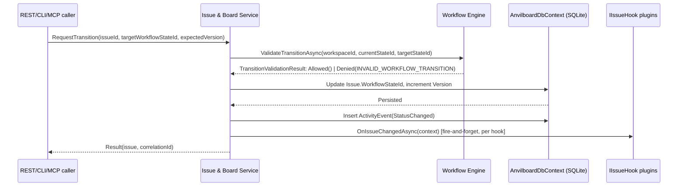

# Issue & Board Service

> Feature spec for Spec-Forge implementation planning.
> Source: extracted from docs/anvilboard/tech-design.md §8.1
> Created: 2026-09-05

| Field | Value |
|-------|-------|
| Component | issue-board-service |
| Priority | P0 |
| SRS Refs | FR-WRK-001, FR-WRK-002, FR-WRK-003, FR-WRK-004, NFR-PERF-001, NFR-USB-001 |
| Tech Design Ref | §8.1 — Issue & Board Service row; also §7.5 Computation Rules, §9 API Design, §12 Performance Design |
| Depends On | workflow-engine, workspace-authorization |
| Blocks | integration-and-plugin-platform, agent-and-automation-surface, audit-and-recovery |

## Purpose

The Issue & Board Service is the single read/write path for issue data in Anvilboard: it creates and mutates issues, answers board/list/dashboard queries, and enforces every issue-level business rule (workflow-transition validation, optimistic concurrency, workspace scoping) exactly once so the web UI, REST API, CLI, and MCP surfaces can never observe divergent behavior. It is the write path used both by direct user/agent mutations and by the Integration & Plugin Platform's ingestion pipeline (`UpsertFromExternalAsync`), which is what guarantees identical validation, activity, and audit behavior regardless of an issue's origin (§8.4 Data Flow).

## Scope

**Included:**
- Issue CRUD: create, read, list, update assignment, add comments.
- Workflow-state transition requests, delegating transition legality to the Workflow Engine (`IWorkflowService`) and applying the resulting state/version change.
- Board/list query with filtering and grouping by team, workflow state, assignee, priority, project, label, provider, and synchronization condition (FR-WRK-001).
- Dashboard summary aggregation (workflow distribution, source distribution, freshness/sync exceptions, assignee load) computed from the same filtered query as the board endpoint (FR-WRK-004).
- Pagination (page/limit, opaque cursor) over board/list results.
- Upserting issues produced by ingestion plugins via `NormalizedIssue`, deduplicated on `(Provider, SourceKey)`.
- Recording `ActivityEvent`s and dispatching post-commit `IIssueHook`s after every mutation.

**Excluded:**
- Workflow state/transition *definition* and legality rules (owned by `workflow-engine`; this component only calls `IWorkflowService`).
- Actor authentication and workspace/role permission evaluation (owned by `workspace-authorization`; this component receives an already-authorized `WorkspaceId`/actor).
- Provider polling, webhook signature verification, and plugin discovery (owned by `integration-and-plugin-platform`; this component only exposes the upsert path those components call into).
- Idempotency-key storage/replay and REST/CLI/MCP contract shaping (owned by `agent-and-automation-surface`).
- Audit-record persistence and retention (owned by `audit-and-recovery`; this component only emits the domain event that component records).

## Core Responsibilities

1. **Issue CRUD** — create a local issue, fetch one issue, list issues by filter, change assignment, add a comment.
2. **Workflow-state transition** — validate a requested transition through the Workflow Engine, apply it, and increment the optimistic-concurrency version.
3. **Board/list query** — return a filtered, paginated, deterministically ordered set of issues scoped to one workspace.
4. **Dashboard aggregation** — compute workflow/source/freshness/assignee summaries by reusing the board query's filter predicate.
5. **External upsert** — deduplicate and persist issues/comments produced by ingestion plugins, on the same write path as direct mutations.
6. **Activity + hook dispatch** — record an `ActivityEvent` for every mutation and invoke registered `IIssueHook`s without letting a hook failure affect the mutation's result.

## Interfaces

### Inputs
- **`CreateAsync` / `ChangeStatusAsync` / `AssignAsync` / `AddCommentAsync` calls** (REST controllers, CLI commands, MCP tool handlers, all via `Anvilboard.Application`) — authenticated, workspace-scoped mutation requests.
- **Board/list query parameters** (`workspaceId`, `workflowStateId`, `assigneeId`, `provider`, `syncCondition`, `page`, `limit`) — from `GET /api/v1/issues` and the equivalent CLI/MCP list operations (tech-design §9.2).
- **`NormalizedIssue` / `NormalizedComment` records** (from `integration-and-plugin-platform`'s `IIngestionSource.SyncAsync` and `IWebhookReceiver.HandleAsync` results) — provider-agnostic upsert input.
- **Transition requests** (`targetWorkflowStateId`, `expectedVersion`, `Idempotency-Key`) — from `POST /api/v1/issues/{id}/transition`.

### Outputs
- **`Issue` / `Comment` domain entities** — returned to callers and persisted via `AnvilboardDbContext`.
- **`ActivityEvent` records** — persisted per mutation; consumed by `audit-and-recovery` for the audit trail and by the UI's activity timeline (FR-WRK-003).
- **`DashboardSummary`** — read model consumed by the dashboard endpoint/UI.
- **Board/list result page** — `{ data[], pagination, correlationId }` shape consumed by REST/CLI/MCP (tech-design §9.2).

### Dependencies
- **`workflow-engine` (`IWorkflowService.ValidateTransitionAsync`)** — validates whether a requested transition is legal for the issue's workspace workflow; returns a `TransitionValidationResult` (`Allowed`/`Denied(INVALID_WORKFLOW_TRANSITION, ...)`) this component never overrides.
- **`workspace-authorization`** — supplies the authorized `WorkspaceId`/actor context this component scopes every query and mutation by; never queried span-workspace.
- **`Anvilboard.Plugins.Abstractions` (`IPluginRegistry`, `IIssueHook`)** — post-commit hook dispatch after a mutation is durably committed.
- **`Anvilboard.Infrastructure.Persistence` (`AnvilboardDbContext`)** — EF Core/SQLite persistence.

## Data Flow



## Key Behaviors

### `CreateAsync(WorkspaceId, TeamId, title, description?, priority?, projectId?, assigneeId?, createdById?, ct)`

Current implementation (`Anvilboard.Application/Issues/IssueService.cs`) validates `title` is non-empty, loads the `Team` to mint the next `"{TeamKey}-{N}"` key, and inserts an `Issue` with `Source = IntegrationProvider.Local`. Future-state additions required by FR-WS-001/FR-WRK-002:

1. Accept and validate `WorkspaceId` first; reject with `WORKSPACE_ACCESS_DENIED` if the caller is not authorized for it (delegated to `workspace-authorization`, enforced before this method is reached).
2. Resolve `WorkflowStateId` (not the fixed `IssueStatus` enum) for the issue's initial state; a missing/inactive state returns `REFERENCED_ENTITY_NOT_FOUND`.
3. Validate `idempotencyKey` (required for the automation surface's create endpoint per FR-AUT-002) is well-formed; the automation-surface layer owns replay detection, but this method must accept and forward the resolved key so its result can be cached against it.
4. Initialize `Issue.Version = 1` (new `Version` column, tech-design §10.1).
5. Persist and call `RecordAndDispatchAsync(issue, ActivityEventType.Created, ...)`.

### `RequestTransitionAsync(IssueId, targetWorkflowStateId, expectedVersion, actorId, ct)` (planned; replaces `ChangeStatusAsync`)

Replaces the current enum-based `ChangeStatusAsync(IssueId, IssueStatus, ...)` with a `WorkflowStateId`-based transition per tech-design §7.5/§8.3:

1. Load the issue; if not found, return `REFERENCED_ENTITY_NOT_FOUND`.
2. If `issue.Version != expectedVersion`, return `CONCURRENCY_CONFLICT` with the current version.
3. Call `IWorkflowService.ValidateTransitionAsync(workspaceId, issue.WorkflowStateId, targetWorkflowStateId, ct)`; on `Denied(INVALID_WORKFLOW_TRANSITION, ...)` return that result unchanged — naming current state, requested state, and the violated rule — with no version increment (tech-design AC-004; `workflow-engine.md` AC-004).
4. Apply `issue.WorkflowStateId = targetWorkflowStateId`, increment `issue.Version`, set `issue.UpdatedAt`; if the target state `IsTerminal`, set `CompletedAt` (mirrors the existing `IsTerminal()` logic in `IssueStatusExtensions`, moved to operate on `WorkflowState.IsTerminal`).
5. Persist within one transaction, then `RecordAndDispatchAsync(issue, ActivityEventType.StatusChanged, ...)`.

### `ListAsync` → planned `IBoardQueryService.QueryAsync(BoardQuery query, ct)`

The current `ListAsync(TeamId?, IssueStatus?, MemberId?, ct)` filters only by team/status/assignee and sorts client-side (documented as acceptable only "at this project's target scale"). FR-WRK-001 requires filtering/grouping by team, workflow state, assignee, priority, project, label, provider, and sync condition, plus deterministic pagination (tech-design AC-005/AC-006):

| Filter field | Type | Behavior |
|---|---|---|
| `workspaceId` | required | Always applied first; no query may span workspaces. |
| `workflowStateId` | optional | Exact match against `Issue.WorkflowStateId`. |
| `assigneeId`, `provider`, `projectId`, `priority`, `labelId` | optional | Exact/contains match as applicable. |
| `syncCondition` | optional | Derived filter (see below), not a stored column. |
| `page`, `limit` | optional, default `page=1`, `limit=25`, max `limit=100` | `limit` outside `1..100` or a malformed cursor returns `VALIDATION_FAILED` (tech-design AC-006). |

`syncCondition` (`FRESH`/`STALE`/`PAUSED`/`FAILED`) is not persisted on `Issue`; it is derived at read time from the linked `IntegrationHealth`/`ExternalLink` record's `(lastAttemptAt, lastSuccessAt, integration.isPaused, lastErrorCategory)`, per tech-design §7.5 Computation Rules, to avoid drift between health state and its inputs. A no-result page is a successful response that still echoes the active filters (SRS FR-WRK-001 AC 3).

### `DashboardService.GetSummaryAsync` (existing, `Anvilboard.Application/Dashboard/DashboardService.cs`)

Conceptually part of this component's dashboard-aggregation responsibility (tech-design §8.1 row). The existing implementation materializes the filtered `Issues` set client-side and computes `byStatus`, `bySource`, 7-day created/completed counts, and per-assignee open-issue load. Future-state requirement (FR-WRK-004): the aggregation query predicate must be the *same* predicate object/expression the board endpoint uses (not a parallel hand-written filter), so summary counts reconcile with the matching board query by construction rather than by convention.

### `UpsertFromExternalAsync(NormalizedIssue, ct)` (existing)

Unchanged write-path contract: resolves an existing `ExternalLink` by `(Provider, SourceKey)`; if none exists, creates the `Issue` and `ExternalLink` together; if one exists and `SyncFingerprint` is unchanged, no-ops; otherwise updates title/description and the link's fingerprint/timestamp. This is the single call site `integration-and-plugin-platform`'s `SyncCoordinator` and webhook endpoints use — it must remain the *only* path that creates or mutates a provider-sourced `Issue`, so validation and activity/audit recording cannot diverge from direct mutations (tech-design §8.4).

### `RecordAndDispatchAsync(issue, type, actorId, data, ct)` (existing)

Persists one `ActivityEvent`, then invokes every registered `IIssueHook` concurrently via `Task.WhenAll`, catching and logging (never propagating) each hook's exception. Future-state addition: after persisting the `ActivityEvent`, also emit the audit event `audit-and-recovery` requires (workspace, actor, channel, action, target, correlation ID, timestamp) — this component owns triggering that emission but not its storage/retention.

## Constraints

- **Single write path**: no component other than Issue & Board Service may insert or update an `Issue` row; ingestion, webhooks, and direct mutations all funnel through `CreateAsync`/`RequestTransitionAsync`/`UpsertFromExternalAsync`.
- **Workspace scoping**: every query and mutation must be scoped by `WorkspaceId` at the repository boundary (NFR-SEC-002); this component trusts but does not itself perform authorization — it requires an already-resolved, authorized `WorkspaceId`.
- **No separate aggregation path**: dashboard counts must reuse the board query's filter, not a hand-maintained duplicate (tech-design §7.5).
- **Post-commit hooks cannot veto**: `IIssueHook` invocation happens strictly after the mutating transaction commits and its failure must never surface as a request failure (FR-INT-003 AC 3).
- **Performance**: board/list query p95 ≤ 2s, single-issue detail p95 ≤ 1s under pilot reference load (NFR-PERF-001); the `(WorkspaceId, WorkflowStateId)` and `(WorkspaceId, Key)` indexes (tech-design §10.3) are required, not optional, for this target.
- **Provider-controlled fields**: fields on an `ExternalLink`-backed issue are read-only in the local mutation path unless a workspace write-back policy is explicitly enabled (deferred; PRD-ANV-011).

## Acceptance Criteria

| AC-ID | Priority | Criterion | Expected Result | Verification Method |
|-------|----------|-----------|-----------------|---------------------|
| AC-005 | P0 | Given a workspace with issues across multiple teams/states/providers, when a board query supplies team, workflow state, assignee, priority, project, label, provider, and sync-condition filters, the returned page contains only matching issues. | Result set matches the filter predicate exactly; identical symbolic filter values are accepted across UI, REST, CLI, and MCP fixtures. | Integration — `BoardQueryServiceTests`, cross-channel contract fixture comparison. |
| AC-006 | P0 | Given `limit` values of 0, 1, 100, and 101, and a malformed opaque cursor, when a board query is issued. | `limit` 1 and 100 return a stable ordered page with a valid cursor; `limit` 0, `limit` 101, and the malformed cursor each return `VALIDATION_FAILED` naming the field. | Integration — boundary tests at 0/1/100/101 plus malformed-cursor test. |
| AC-004 | P0 | Given an issue whose current workflow state has no allowed transition to the requested target state, when a transition is requested. | Response is `INVALID_WORKFLOW_TRANSITION` naming current state, requested state, and violated rule; `Issue.Version` is unchanged. | Integration — `IssueServiceTests.RequestTransition_DisallowedTarget_ReturnsInvalidTransition`, asserting error payload and unchanged persisted version. |
| AC-007 | P0 | Given a create or transition mutation submitted with a valid idempotency key, when the identical request is replayed by the same actor. | Exactly one `Issue`/`ActivityEvent` pair exists after both calls; the replay returns the original result and correlation ID. | Integration — `IssueServiceTests.Create_ReplayedWithSameKey_ProducesNoDuplicate`. |
| AC-011 | P0 | Given any successful create, transition, assignment, or comment mutation, when the mutation completes. | Exactly one `ActivityEvent` is recorded with actor, action, timestamp, target, and a before/after summary containing no secret values. | Unit — `IssueServiceTests.Mutate_RecordsSingleActivityEvent`. |
| AC-IBS-101 | P1 | Given a dashboard summary request and a board query using the identical filter, when both are executed against the same data. | The dashboard's per-status/per-source counts equal the board query's matching row count (reconciliation, FR-WRK-004). | Integration — `DashboardServiceTests.Summary_ReconcilesWithBoardQuery`. |
| AC-IBS-102 | P0 | Given a hook registered via `IPluginRegistry` that throws on every invocation, when an issue mutation completes. | The mutation still returns success and its `ActivityEvent` is persisted; the hook exception is logged, never propagated to the caller. | Unit — `IssueServiceTests.Mutate_HookThrows_MutationStillSucceeds` (negative — must NOT propagate). |
| AC-IBS-103 | P1 | Given a board query for a workspace the actor is not authorized for, when the query executes. | No issue rows for that workspace are returned or leaked, regardless of matching filters (defense in depth alongside `workspace-authorization`). | Integration — negative authorization-boundary test asserting empty/denied result and no data leakage. |

## Error Handling

Every anticipated failure resolves to a §7.7 catalog code; no raw EF Core or provider exception may propagate past this component.

| Condition | Code | HTTP status | Notes |
|---|---:|---|---|
| Missing/malformed `title`, pagination, or idempotency key | `VALIDATION_FAILED` | 400 | Names the invalid/missing field and requirement. |
| `workflowStateId` does not exist or is inactive for the workspace | `REFERENCED_ENTITY_NOT_FOUND` | 404 | Applies to create and transition. |
| Requested transition not in the workspace's allowed-transition set | `INVALID_WORKFLOW_TRANSITION` | 409 | Names current state, requested state, violated rule; no version increment. |
| `expectedVersion` does not match persisted `Issue.Version` | `CONCURRENCY_CONFLICT` | 409 | Response supplies current version for refetch/retry. |
| Duplicate `(WorkspaceId, Key)` on issue creation | `RESOURCE_ALREADY_EXISTS` | 409 | UNIQUE constraint translation (tech-design §7.6). |
| Idempotency key reused with a different payload/actor | `IDEMPOTENCY_KEY_REUSED` | 409 | Detected via the automation surface's `IdempotencyRecords`; this component must not apply a second mutation. |
| Query/mutation for a workspace the actor cannot access | `WORKSPACE_ACCESS_DENIED` | 403 | Enforced by `workspace-authorization` upstream of this component; this component never re-derives it independently. |

## File Structure

```
src/
├── Anvilboard.Application/
│   ├── Issues/
│   │   ├── IssueService.cs              # Existing: CRUD, transition, comment, external upsert
│   │   ├── IIssueService.cs              # Planned: extracted interface for DI/testability
│   │   ├── BoardQueryService.cs          # Planned: filtered/paginated board & list queries
│   │   └── IBoardQueryService.cs         # Planned: public interface per tech-design §8.1
│   └── Dashboard/
│       └── DashboardService.cs           # Existing: dashboard aggregation, reused predicate (planned change)
├── Anvilboard.Domain/
│   ├── Issue.cs                          # Existing; planned: WorkflowStateId + Version columns replace Status
│   └── ActivityEvent.cs                  # Existing
└── Anvilboard.Infrastructure/
    └── Persistence/
        └── Configurations/
            └── IssueConfiguration.cs      # Existing; planned: WorkflowStateId FK + Version concurrency token mapping
```

## Test Module

**Test file**: `src/Anvilboard.Application.Tests/Issues/IssueServiceTests.cs`

**Test scope**:
- **Unit**: `CreateAsync()`, `RequestTransitionAsync()` (transition legality delegation, version increment, `CONCURRENCY_CONFLICT` boundary), `AssignAsync()`, `AddCommentAsync()`, `RecordAndDispatchAsync()` hook-failure isolation.
- **Integration**: `BoardQueryService`/`IssueService` list queries against a seeded SQLite database — filter combinations (team, workflow state, assignee, priority, project, label, provider, sync condition), pagination boundaries (0/1/100/101, malformed cursor), and `UpsertFromExternalAsync()` dedupe-on-`(Provider, SourceKey)` behavior.
- **Fixtures / Mocks**: in-memory or file-based SQLite `AnvilboardDbContext` seeded with a multi-team, multi-workspace dataset; a fake `IWorkflowService` returning configurable allow/deny decisions; a fake `IIssueHook` that always throws, to verify isolation.

**Test file**: `src/Anvilboard.Application.Tests/Dashboard/DashboardServiceTests.cs`

**Test scope**:
- **Unit**: `GetSummaryAsync()` count computation per status/source/assignee bucket.
- **Integration**: reconciliation test asserting dashboard summary counts equal the equivalent board query's row count for the same filter.
- **Fixtures / Mocks**: same seeded `AnvilboardDbContext` as above, reused across both test files to keep fixture data consistent between board and dashboard assertions.
