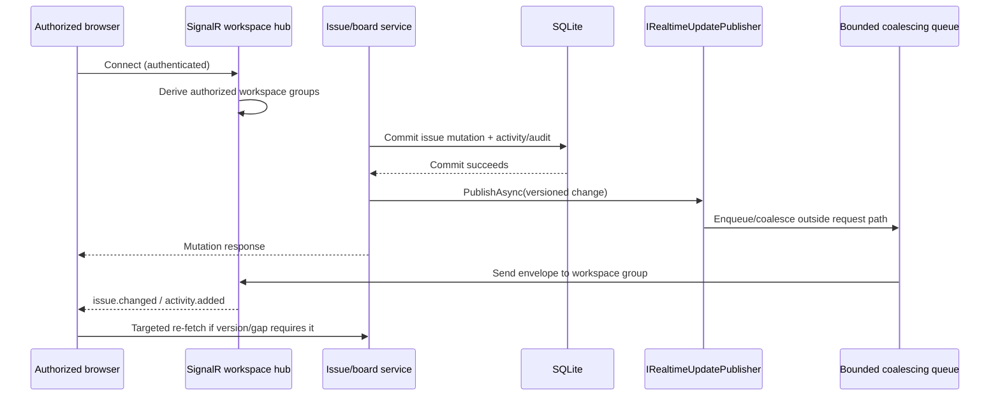

# Real-time Updates

> Feature spec for Spec-Forge implementation planning.
> Source: `docs/anvilboard/srs.md` FR-WRK-014, FR-INT-006, NFR-PERF-002.
> Created: 2026-09-05

| Field | Value |
|-------|-------|
| Component | realtime-updates |
| Priority | P1 |
| Status | **Implemented** — transport-neutral publisher, coalescing dispatcher, SignalR hub, Angular client, and the approved-plugin-event relay are all in `src/`. |
| SRS Refs | FR-WRK-014, FR-INT-006, NFR-PERF-002 |
| Tech Design Ref | §8.1 Component Overview; §9 API Design; §12 Performance Design |
| Depends On | workspace-authorization, issue-board-service |
| Blocks | Web board/list/dashboard live refresh |

## Purpose

Real-time Updates delivers compact, workspace-scoped post-commit changes from the trusted core and approved plugins to authorized dashboard clients. It makes board, list, issue-detail, and dashboard views converge quickly without coupling a committed mutation to transport delivery, client acknowledgement, or a particular client connection. SignalR is the default transport for the self-hosted web application; the component boundary keeps its publisher and event envelopes transport-neutral.

## Scope

**Included:**
- `IRealtimeUpdatePublisher` for non-blocking publication after a successful domain commit.
- Versioned issue, activity, dashboard-summary, and eligible plugin-event envelopes.
- SignalR workspace groups authorized at connection and subscription time.
- Bounded burst coalescing/debouncing so an active board updates incrementally without avoidable full-list redraws or visual jitter.
- Client reconnect recovery by targeted re-fetch using issue/version identifiers and normal board/list/dashboard queries.
- Operational metrics for publication latency, dropped/coalesced events, connection count, and slow-client isolation.

**Excluded:**
- A durable event-sourcing or unbounded replay system.
- Cross-workspace broadcasts, unauthenticated subscriptions, and a public provider webhook transport.
- Replacing REST/MCP/CLI reads and mutations; those remain the authoritative query and command paths.
- Guaranteeing delivery to an individual disconnected client.

## Core Responsibilities

1. **Publish only committed changes** — accept domain events only after the originating write is durable; never emit speculative pre-commit state.
2. **Scope and authorize** — map a client connection to only its authorized workspace groups and reject arbitrary group joins.
3. **Bound transport work** — enqueue/batch delivery outside the mutation request path and shed/coalesce stale presentation updates before unbounded buffering occurs.
4. **Preserve reconciliation data** — include workspace, entity identity, version, change kind, and correlation metadata so a client can apply a small update or fetch authoritative data.
5. **Relay approved plugin events** — publish `IPluginEventPublisher` events eligible for UI visibility without making plugin dispatch part of lifecycle-hook execution.
6. **Recover after a gap** — signal that reconnecting clients must re-fetch their visible board/list/issue/dashboard projections rather than depend on replaying every missed event.

## Interfaces

```csharp
public interface IRealtimeUpdatePublisher
{
    ValueTask PublishAsync(RealtimeChange change, CancellationToken ct = default);
}

public abstract record RealtimeChange(
    WorkspaceId WorkspaceId,
    string EventType,
    string CorrelationId,
    DateTimeOffset OccurredAt);

public sealed record RealtimeIssueChange(
    WorkspaceId WorkspaceId,
    IssueId IssueId,
    long Version,
    RealtimeIssueChangeKind ChangeKind,
    string CorrelationId,
    DateTimeOffset OccurredAt)
    : RealtimeChange(WorkspaceId, "issue.changed", CorrelationId, OccurredAt);

public sealed record RealtimeActivityChange(
    WorkspaceId WorkspaceId,
    IssueId IssueId,
    ActivityEventId ActivityEventId,
    long IssueVersion,
    string CorrelationId,
    DateTimeOffset OccurredAt)
    : RealtimeChange(WorkspaceId, "activity.added", CorrelationId, OccurredAt);

public sealed record RealtimeDashboardChange(
    WorkspaceId WorkspaceId,
    string SummaryVersion,
    string CorrelationId,
    DateTimeOffset OccurredAt)
    : RealtimeChange(WorkspaceId, "dashboard.changed", CorrelationId, OccurredAt);
```

The SignalR hub exposes no client-supplied workspace identifier for authorization. Authorization happens one step earlier than this spec originally implied: the hub is mapped with `.RequirePermission(Permission.ReadBoard)`, so the existing `WorkspaceAuthorizationMiddleware` refuses an unauthenticated or unauthorized negotiate/connect request before SignalR ever runs hub code. This keeps the middleware the single enforcement point and is also the only placement an unauthorized client can actually observe — rejecting inside `OnConnectedAsync` (via `Context.Abort()` or a `HubException`) happens *after* the handshake completed, so the client's `start()` still resolves successfully. `WorkspaceRealtimeHub.OnConnectedAsync` therefore only reads the already-authorized `ActorContext` and adds the connection to the server-derived `workspace:{workspaceId}` group. A client receives envelopes from that group only.

`IPluginEventPublisher` may translate an approved, UI-eligible typed plugin event to a `RealtimeChange`; this is separate from `ILifecycleHook<TEvent>` dispatch and has independent fault isolation.

## Data Flow



## Key Behaviors

### Post-commit, non-blocking dispatch

The Issue & Board Service creates `RealtimeChange` values only after its transaction commits. `PublishAsync` is not awaited as a client-delivery acknowledgement by the mutation handler: it performs a bounded handoff and records any publication failure as health/audit telemetry. A full queue applies documented coalescing/drop policy to obsolete presentation notifications; it never rolls back or fails the domain mutation.

### Coalescing without visual jitter

The publisher coalesces bursty changes by `(workspaceId, issueId)` over a short bounded window. For a given issue, only the highest known version needs delivery; activity changes retain enough identity for an open issue-detail view to fetch new activity. Dashboard-summary notifications may be coalesced per workspace because clients refresh the authoritative aggregate. The client applies an in-place update for a visible issue when possible, preserves current selection/scroll position, and schedules at most one re-fetch/render per debounce window. A phase move may update the affected cards/rows, but does not mandate a full board reload.

### Reconnect and version gaps

The transport makes at-most-once best-effort delivery, not a durable replay guarantee. On reconnect, a client re-fetches the active board/list query, the selected issue detail if applicable, and dashboard summaries. On an event gap, unknown event type, or version discontinuity, it performs the same targeted re-fetch. REST query results remain authoritative.

When the hub connection drops and SignalR's own automatic-reconnect gives up, `RealtimeBoardSyncService` falls back to a manual retry loop with a bounded exponential backoff (starting at 1s, doubling per consecutive failure, capped at 30s) rather than retrying every second indefinitely; a successful connection resets the delay back to 1s. This keeps a prolonged API/hub outage from having every open browser tab hammer the hub with a fresh negotiate/start attempt each second.

### Slow and disconnected clients

Each connection uses bounded outbound work. A slow client may receive a coalesced latest change or be disconnected according to SignalR transport policy; it cannot accumulate an unbounded queue, delay another workspace/client, or delay the originating mutation. Metrics distinguish coalesced, dropped, and failed sends from core write failures.

## Constraints

- Every envelope is workspace-scoped and must pass authorization before group membership or delivery.
- The publisher must not expose secret configuration, provider credentials, raw audit payloads, or data from another workspace.
- Event schemas are versioned and additive; clients ignore unknown optional fields and re-fetch on an unknown required event type.
- Publication uses the post-commit path only. `Pre*` lifecycle hooks never publish a change representing an uncommitted mutation.
- SignalR is the initial web transport, but `IRealtimeUpdatePublisher` must not depend on a web-controller type so a future transport can consume the same change envelopes.

### Known limitation: connection lifetime vs. mid-session revocation

`WorkspaceAuthorizationMiddleware` authorizes only the SignalR negotiate/connect handshake (see
"Data Flow" above); an already-established hub connection is not re-checked afterward. If a
member's workspace access is revoked (removed from the workspace, permission downgraded, session
invalidated) while their browser holds an open connection, that connection keeps receiving
envelopes for groups it joined before the revocation until the client disconnects on its own — a
tab close, an explicit logout that tears down the connection client-side, or the process restarting
the underlying transport session. There is no server-initiated "kick this connection out of its
groups" path today.

This is accepted as a known gap rather than an in-scope fix: revoking a live SignalR connection
requires tracking membership from actor/session to `HubConnectionContext` and forcibly removing it
from groups (or aborting it) the moment the authorization state changes elsewhere in the system —
a cross-cutting change to session/permission management, not a `realtime-updates`-local one. Until
that lands, deployments with a strict revocation requirement should keep the exposure window small
(e.g., short-lived sessions) rather than relying on this component to enforce it.

### Configuration

Bound from the `Realtime` section (`RealtimeOptions`):

| Key | Default | Meaning |
|---|---|---|
| `Realtime:DebounceWindow` | `00:00:00.100` | How long the dispatcher waits after the first buffered change before draining, so a burst collapses into one send. |
| `Realtime:QueueCapacity` | `1024` | Maximum number of *distinct* pending coalescing keys. A change whose key is already pending always fits; only a genuinely new key can be dropped. |
| `Realtime:SendTimeout` | `00:00:05` | Maximum time a single transport send may block the dispatcher. |
| `Realtime:ShutdownFlushTimeout` | `00:00:10` | Maximum time spent sending buffered updates while the host shuts down. |
| `Realtime:RelayedPluginEventTypes` | *(empty)* | Plugin event types approved for relay, e.g. `github.pull_request.merged`. Empty means no plugin event reaches a browser, so adding an event type to a plugin is never sufficient on its own. |

## Acceptance Criteria

- **AC-RT-001:** A committed issue mutation produces a workspace-scoped, versioned `RealtimeIssueChange`; a rolled-back mutation produces none.
- **AC-RT-002:** A client authorized only for workspace A cannot subscribe to, receive, or infer any event for workspace B.
- **AC-RT-003:** Under pilot reference load, the system attempts eligible event publication within 500 ms p95 of commit, and a deliberately slow/disconnected client does not delay the mutation response.
- **AC-RT-004:** A burst of updates to the same issue yields bounded/coalesced notifications and does not force a full board/list redraw for every source mutation.
- **AC-RT-005:** A reconnecting client reaches a consistent view by documented re-fetch behavior without server-side unbounded event replay.
- **AC-RT-006:** An approved `github.pull_request.merged` plugin event can be relayed to the appropriate workspace without invoking or blocking lifecycle hooks.

## Error Handling

| Condition | Behavior | Observable result |
|---|---|---|
| Realtime handoff fails | Preserve committed mutation; record diagnostic/audit telemetry; apply bounded retry only if safe. | Mutation succeeds; operational health signal records failure. |
| Queue full | Coalesce a superseded presentation change or drop it according to policy; never grow unbounded. | Metric records coalesced/dropped event; client reconciles on next event/re-fetch. |
| Unauthorized hub connection/group | Reject connection or withhold group membership. | `WORKSPACE_ACCESS_DENIED`; no event data leaks. |
| Event version gap/unknown schema | Client discards local incremental assumption and re-fetches authoritative projection. | Consistent UI without replay dependence. |
| Client transport failure | Isolate/disconnect the client without impacting other clients or mutations. | Connection/transport metric; client reconnect path applies. |

## File Structure

> The SignalR types live in `Anvilboard.Api`, not `Anvilboard.Infrastructure` as originally
> sketched: `Anvilboard.Application` references `Anvilboard.Infrastructure` (not the reverse), and
> `Anvilboard.Infrastructure` builds on `Microsoft.NET.Sdk`, so it can neither see the
> transport-neutral seams nor pull in ASP.NET Core's SignalR. `Anvilboard.Api` is the only project
> that already depends on both.

```text
src/Anvilboard.Application/Realtime/
  RealtimeChange.cs                      # envelopes: issue, activity, dashboard, plugin event
  IRealtimeUpdatePublisher.cs            # post-commit handoff seam (+ null default)
  IRealtimeTransport.cs                  # dispatcher -> clients seam (+ null default)
  RealtimeOptions.cs                     # debounce window, queue capacity, approved plugin events
  RealtimeChangeBuffer.cs                # bounded, key-coalescing buffer
  CoalescingRealtimeUpdatePublisher.cs   # buffering publisher
  RealtimeDispatcher.cs                  # background drain loop
  RealtimeMetrics.cs                     # published/coalesced/dropped/latency counters
  PluginEventRelay.cs                    # IPluginEventPublisher -> realtime, approved types only
src/Anvilboard.Api/Realtime/
  WorkspaceRealtimeHub.cs                # /hubs/workspace, joins the workspace:{id} group
  SignalRRealtimeTransport.cs            # IRealtimeTransport over IHubContext
  RealtimeChangeEnvelope.cs              # flat, additive-only wire shape
src/Anvilboard.Plugins.Abstractions/
  IPluginEventPublisher.cs               # PluginEvent + publisher a plugin host can call
src/anvilboard-web/src/app/core/
  realtime-board-sync.service.ts         # owns the HubConnection; changes + resyncRequired streams
```

## Test Module

```text
src/Anvilboard.Application.Tests/Realtime/
  RealtimeChangeBufferTests.cs           # coalescing, capacity, merge precedence
  IssueServiceRealtimePublicationTests.cs# post-commit publication and fault isolation
  PluginEventRelayTests.cs               # approved-only relay, no lifecycle hooks
src/Anvilboard.Api.Tests/Realtime/
  WorkspaceRealtimeHubTests.cs           # hub authorization, group scoping, end-to-end delivery
src/Anvilboard.Integrations.GitHub.Tests/
  GitHubWebhookReceiverTests.cs          # merged-pull-request event reporting
src/anvilboard-web/src/app/core/
  realtime-board-sync.service.spec.ts    # start idempotency, reconnect, connect-failure tolerance
src/anvilboard-web/src/app/board/board-page/
  board-page.spec.ts                     # in-place patch, selection preservation, resync fallbacks
```
