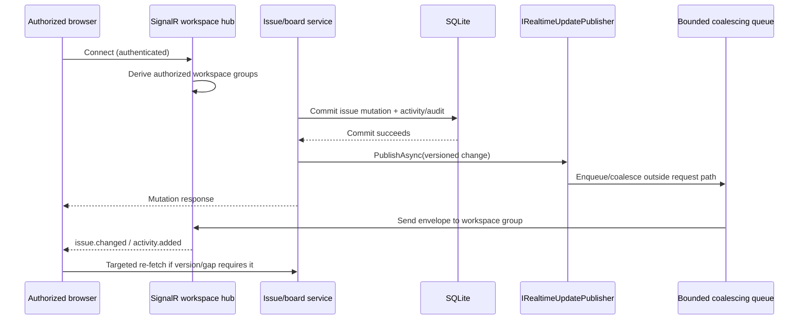

# Real-time Updates

> Feature spec for Spec-Forge implementation planning.
> Source: `docs/anvilboard/srs.md` FR-WRK-014, FR-INT-006, NFR-PERF-002.
> Created: 2026-09-05

| Field | Value |
|-------|-------|
| Component | realtime-updates |
| Priority | P1 |
| SRS Refs | FR-WRK-014, FR-INT-006, NFR-PERF-002 |
| Tech Design Ref | §8.1 Component Overview; §9 API Design; §12 Performance Design |
| Depends On | workspace-authorization, issue-board-service |
| Blocks | Web board/list/dashboard live refresh |

## Purpose

Real-time Updates delivers compact, workspace-scoped post-commit changes from the trusted core and approved plugins to authorized dashboard clients. It makes board, list, issue-detail, and dashboard views converge quickly without coupling a committed mutation to transport delivery, client acknowledgement, or a particular client connection. SignalR is the default transport for the self-hosted web application; the component boundary keeps its publisher and event envelopes transport-neutral.

## Scope

**Included:**
- `IRealtimeUpdatePublisher` for non-blocking publication after a successful domain commit.
- Versioned issue, activity, dashboard-summary, and eligible plugin-event envelopes.
- SignalR workspace groups authorized at connection and subscription time.
- Bounded burst coalescing/debouncing so an active board updates incrementally without avoidable full-list redraws or visual jitter.
- Client reconnect recovery by targeted re-fetch using issue/version identifiers and normal board/list/dashboard queries.
- Operational metrics for publication latency, dropped/coalesced events, connection count, and slow-client isolation.

**Excluded:**
- A durable event-sourcing or unbounded replay system.
- Cross-workspace broadcasts, unauthenticated subscriptions, and a public provider webhook transport.
- Replacing REST/MCP/CLI reads and mutations; those remain the authoritative query and command paths.
- Guaranteeing delivery to an individual disconnected client.

## Core Responsibilities

1. **Publish only committed changes** — accept domain events only after the originating write is durable; never emit speculative pre-commit state.
2. **Scope and authorize** — map a client connection to only its authorized workspace groups and reject arbitrary group joins.
3. **Bound transport work** — enqueue/batch delivery outside the mutation request path and shed/coalesce stale presentation updates before unbounded buffering occurs.
4. **Preserve reconciliation data** — include workspace, entity identity, version, change kind, and correlation metadata so a client can apply a small update or fetch authoritative data.
5. **Relay approved plugin events** — publish `IPluginEventPublisher` events eligible for UI visibility without making plugin dispatch part of lifecycle-hook execution.
6. **Recover after a gap** — signal that reconnecting clients must re-fetch their visible board/list/issue/dashboard projections rather than depend on replaying every missed event.

## Interfaces

```csharp
public interface IRealtimeUpdatePublisher
{
    ValueTask PublishAsync(RealtimeChange change, CancellationToken ct = default);
}

public abstract record RealtimeChange(
    WorkspaceId WorkspaceId,
    string EventType,
    string CorrelationId,
    DateTimeOffset OccurredAt);

public sealed record RealtimeIssueChange(
    WorkspaceId WorkspaceId,
    IssueId IssueId,
    long Version,
    RealtimeIssueChangeKind ChangeKind,
    string CorrelationId,
    DateTimeOffset OccurredAt)
    : RealtimeChange(WorkspaceId, "issue.changed", CorrelationId, OccurredAt);

public sealed record RealtimeActivityChange(
    WorkspaceId WorkspaceId,
    IssueId IssueId,
    ActivityEventId ActivityEventId,
    long IssueVersion,
    string CorrelationId,
    DateTimeOffset OccurredAt)
    : RealtimeChange(WorkspaceId, "activity.added", CorrelationId, OccurredAt);

public sealed record RealtimeDashboardChange(
    WorkspaceId WorkspaceId,
    string SummaryVersion,
    string CorrelationId,
    DateTimeOffset OccurredAt)
    : RealtimeChange(WorkspaceId, "dashboard.changed", CorrelationId, OccurredAt);
```

The SignalR hub exposes no client-supplied workspace identifier for authorization. On connection, `WorkspaceRealtimeHub` resolves the authenticated actor's workspace memberships through Workspace Authorization and adds the connection to server-derived `workspace:{workspaceId}` groups. A client receives envelopes from those groups only.

`IPluginEventPublisher` may translate an approved, UI-eligible typed plugin event to a `RealtimeChange`; this is separate from `ILifecycleHook<TEvent>` dispatch and has independent fault isolation.

## Data Flow



## Key Behaviors

### Post-commit, non-blocking dispatch

The Issue & Board Service creates `RealtimeChange` values only after its transaction commits. `PublishAsync` is not awaited as a client-delivery acknowledgement by the mutation handler: it performs a bounded handoff and records any publication failure as health/audit telemetry. A full queue applies documented coalescing/drop policy to obsolete presentation notifications; it never rolls back or fails the domain mutation.

### Coalescing without visual jitter

The publisher coalesces bursty changes by `(workspaceId, issueId)` over a short bounded window. For a given issue, only the highest known version needs delivery; activity changes retain enough identity for an open issue-detail view to fetch new activity. Dashboard-summary notifications may be coalesced per workspace because clients refresh the authoritative aggregate. The client applies an in-place update for a visible issue when possible, preserves current selection/scroll position, and schedules at most one re-fetch/render per debounce window. A phase move may update the affected cards/rows, but does not mandate a full board reload.

### Reconnect and version gaps

The transport makes at-most-once best-effort delivery, not a durable replay guarantee. On reconnect, a client re-fetches the active board/list query, the selected issue detail if applicable, and dashboard summaries. On an event gap, unknown event type, or version discontinuity, it performs the same targeted re-fetch. REST query results remain authoritative.

### Slow and disconnected clients

Each connection uses bounded outbound work. A slow client may receive a coalesced latest change or be disconnected according to SignalR transport policy; it cannot accumulate an unbounded queue, delay another workspace/client, or delay the originating mutation. Metrics distinguish coalesced, dropped, and failed sends from core write failures.

## Constraints

- Every envelope is workspace-scoped and must pass authorization before group membership or delivery.
- The publisher must not expose secret configuration, provider credentials, raw audit payloads, or data from another workspace.
- Event schemas are versioned and additive; clients ignore unknown optional fields and re-fetch on an unknown required event type.
- Publication uses the post-commit path only. `Pre*` lifecycle hooks never publish a change representing an uncommitted mutation.
- SignalR is the initial web transport, but `IRealtimeUpdatePublisher` must not depend on a web-controller type so a future transport can consume the same change envelopes.

## Acceptance Criteria

- **AC-RT-001:** A committed issue mutation produces a workspace-scoped, versioned `RealtimeIssueChange`; a rolled-back mutation produces none.
- **AC-RT-002:** A client authorized only for workspace A cannot subscribe to, receive, or infer any event for workspace B.
- **AC-RT-003:** Under pilot reference load, the system attempts eligible event publication within 500 ms p95 of commit, and a deliberately slow/disconnected client does not delay the mutation response.
- **AC-RT-004:** A burst of updates to the same issue yields bounded/coalesced notifications and does not force a full board/list redraw for every source mutation.
- **AC-RT-005:** A reconnecting client reaches a consistent view by documented re-fetch behavior without server-side unbounded event replay.
- **AC-RT-006:** An approved `github.pull_request.merged` plugin event can be relayed to the appropriate workspace without invoking or blocking lifecycle hooks.

## Error Handling

| Condition | Behavior | Observable result |
|---|---|---|
| Realtime handoff fails | Preserve committed mutation; record diagnostic/audit telemetry; apply bounded retry only if safe. | Mutation succeeds; operational health signal records failure. |
| Queue full | Coalesce a superseded presentation change or drop it according to policy; never grow unbounded. | Metric records coalesced/dropped event; client reconciles on next event/re-fetch. |
| Unauthorized hub connection/group | Reject connection or withhold group membership. | `WORKSPACE_ACCESS_DENIED`; no event data leaks. |
| Event version gap/unknown schema | Client discards local incremental assumption and re-fetches authoritative projection. | Consistent UI without replay dependence. |
| Client transport failure | Isolate/disconnect the client without impacting other clients or mutations. | Connection/transport metric; client reconnect path applies. |

## File Structure

```text
src/Anvilboard.Application/Realtime/
  IRealtimeUpdatePublisher.cs
  RealtimeChange.cs
  RealtimeChangeCoalescer.cs
src/Anvilboard.Infrastructure/Realtime/
  SignalRRealtimeUpdatePublisher.cs
  WorkspaceRealtimeHub.cs
src/Anvilboard.Web/Features/Board/
  realtimeBoardSync.ts
```

## Test Module

```text
tests/Anvilboard.IntegrationTests/Realtime/
  RealtimeIssuePublicationTests.cs
  WorkspaceHubAuthorizationTests.cs
  RealtimeCoalescingTests.cs
  RealtimeSlowClientIsolationTests.cs
tests/Anvilboard.Web.Tests/board/
  realtimeBoardSync.test.ts
```
