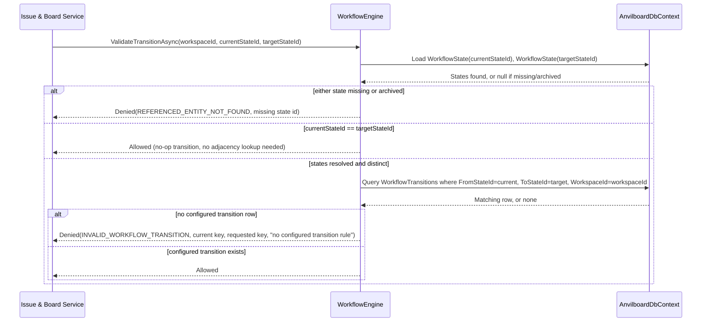
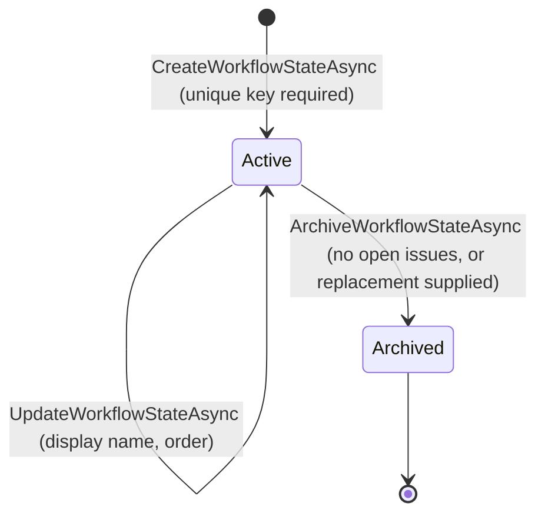

# Workflow Engine

> Feature spec for code-forge implementation planning.
> Source: extracted from docs/anvilboard/tech-design.md §8.1
> Created: 2026-09-05

| Field | Value |
|-------|-------|
| Component | workflow-engine |
| Priority | P0 |
| SRS Refs | FR-WS-002, FR-WS-003 |
| Tech Design Ref | §8.1 Workflow Engine; §7.5 State Machine; §10.4 Migration Strategy |
| Depends On | — |
| Blocks | issue-board-service |

## Purpose

The Workflow Engine defines and validates a workspace's configurable, ordered `WorkflowState` set and its allowed-transition adjacency list, and it migrates each existing workspace's fixed `IssueStatus` enum value onto an equivalent seeded `WorkflowState`. It replaces the PoC's hardcoded `Backlog → Todo → InProgress → InReview → Done/Cancelled` progression with a per-workspace configuration that the Issue & Board Service consults before applying any state change, so no component enforces workflow rules from a hardcoded enum ordering ever again (`docs/anvilboard/tech-design.md` §7.5).

## Scope

**Included:**
- Creating, updating, and archiving `WorkflowState` rows scoped to a workspace, including the duplicate-key rejection required by FR-WS-002 AC1.
- Creating and removing `WorkflowTransition` adjacency entries (`FromStateId` → `ToStateId`) scoped to a workspace.
- `ValidateTransitionAsync` — the guard the Issue & Board Service calls before persisting any workflow-state change on an `Issue`.
- The one-time legacy `IssueStatus` → seeded `WorkflowState` migration and backfill described in §10.4.
- The dependency guard that blocks archiving a state still referenced by open issues unless a replacement state is supplied (§7.4 Edge Case Handling).

**Excluded:**
- Authorizing *who* may configure a workflow or request a transition — enforced upstream by `workspace-authorization.md` before this component is ever called.
- Persisting the `Issue.WorkflowStateId`/`Issue.Version` change itself, or emitting the resulting activity/audit event — both are the Issue & Board Service's responsibility (`issue-board-service.md`); this component only returns Allowed/Denied.
- Dashboard aggregation over workflow states (`issue-board-service.md`).

## Core Responsibilities

1. **Workflow configuration management** — create/update the ordered `WorkflowState` set and the `WorkflowTransition` adjacency list for a workspace.
2. **Transition validation** — evaluate a requested `(currentStateId, targetStateId)` pair against the workspace's configured adjacency list and return a specific Allowed/Denied decision.
3. **Legacy status migration** — seed the default six-state workflow per existing workspace and backfill `Issues.WorkflowStateId` from the deprecated `Issues.Status` column (§10.4).
4. **Dependency-guarded archival** — refuse to archive a state referenced by open issues unless the caller supplies a replacement state.

## Interfaces

### Inputs
- **Workflow configuration requests** (from an already-authorized administrator, via `Anvilboard.Api`/`Anvilboard.Agent`) — create/update/archive `WorkflowState`, create/remove `WorkflowTransition`.
- **`ValidateTransitionAsync(workspaceId, currentStateId, targetStateId)`** (from `issue-board-service.md`) — called once per transition request, strictly before any `Issue` row is mutated.
- **Legacy migration trigger** (from the EF Core migration pipeline, §10.4 step 2) — runs once per workspace during the additive-migration release.

### Outputs
- **`WorkflowState`/`WorkflowTransition` persisted rows** — the configured workflow, read by board/list queries (`issue-board-service.md`) and by this component itself on validation.
- **`TransitionValidationResult`** (to `issue-board-service.md`) — `Allowed` or `Denied` carrying the violated-rule detail needed for `INVALID_WORKFLOW_TRANSITION` (current state, requested state, rule).
- **Seeded default workflow** (one-time, per migrated workspace) — six `WorkflowState` rows with stable keys plus their adjacency, mirroring the legacy enum order.

### Dependencies
- **Domain** (`WorkflowState`, `WorkflowTransition`, legacy `IssueStatus`) — the entities this component reads, writes, and migrates from.
- **Anvilboard.Infrastructure** (`AnvilboardDbContext`, EF Core migrations) — persistence and the migration pipeline that invokes the legacy-status backfill.

## Data Flow



## Key Behaviors

### `ValidateTransitionAsync`

`Task<TransitionValidationResult> ValidateTransitionAsync(WorkspaceId workspaceId, WorkflowStateId currentStateId, WorkflowStateId targetStateId, CancellationToken ct = default)`

1. Load `currentStateId` and `targetStateId` from `WorkflowStates` scoped to `workspaceId`. If either row does not exist, or exists with `IsArchived == true` (an archived state is never a valid current or target state) → return `TransitionValidationResult.Denied(REFERENCED_ENTITY_NOT_FOUND, missingStateId)`.
2. If `currentStateId == targetStateId` → return `TransitionValidationResult.Allowed()` as a no-op. This mirrors the existing `IssueService.ChangeStatusAsync` early-return behavior (`src/Anvilboard.Application/Issues/IssueService.cs`), which already treats an identical old/new status as a no-op with no activity emitted; the workflow engine preserves that precedent rather than treating a same-state request as an unconfigured transition.
3. Otherwise, query `WorkflowTransitions` for a row where `FromStateId == currentStateId AND ToStateId == targetStateId AND WorkspaceId == workspaceId`.
4. If no row is found → return `TransitionValidationResult.Denied(INVALID_WORKFLOW_TRANSITION, currentState.Key, targetState.Key, "no configured transition rule")`. The caller (Issue & Board Service) must not increment `Issue.Version` or persist any change on this outcome (tech-design AC-004).
5. If a row is found → return `TransitionValidationResult.Allowed()`.

### `CreateWorkflowStateAsync`

`Task<WorkflowState> CreateWorkflowStateAsync(WorkspaceId workspaceId, string key, string displayName, int order, bool isTerminal, CancellationToken ct = default)`

1. Validate `key`: required, trimmed, 1–100 chars, matches `^[a-z0-9_]+$` (stable lower-snake identifier convention, e.g. `in_progress`).
2. Check uniqueness of `(WorkspaceId, Key)`. If a row already exists → return/throw `VALIDATION_FAILED` naming the duplicate key (FR-WS-002 AC1).
3. Validate `displayName`: required, 1–200 chars (matches the existing `title` length convention in §7.3).
4. Persist the new `WorkflowState` with `IsArchived = false`, the given `Order`, and `IsTerminal`.

### `ArchiveWorkflowStateAsync`

`Task ArchiveWorkflowStateAsync(WorkspaceId workspaceId, WorkflowStateId stateId, WorkflowStateId? replacementStateId, CancellationToken ct = default)`

1. Count open (non-archived-issue) `Issues` referencing `stateId` within `workspaceId`.
2. If the count is greater than zero and `replacementStateId` is `null` → return/throw `VALIDATION_FAILED` naming the dependent issue count and the state key (§7.4 Edge Case Handling: "Archiving a workflow state still referenced by open issues").
3. If `replacementStateId` is supplied, validate it exists, is active, and is not `stateId` itself; reassign the dependent issues to it through the Issue & Board Service's mutation path (each reassignment produces its own activity/audit event there — this component does not write `Issues` rows directly).
4. Set `IsArchived = true` on the `WorkflowState` row. An archived state can no longer be returned as valid by step 1 of `ValidateTransitionAsync`, and is excluded from future `WorkflowTransition` creation.

### Legacy status migration (`MigrateLegacyStatusAsync`, one-time per workspace, §10.4 steps 1–3)

1. Add the new `WorkflowStates`, `WorkflowTransitions` tables via an additive EF Core migration; no existing table is altered in this step.
2. For each existing `Workspace`, seed exactly six `WorkflowState` rows using the field mapping below, preserving the stable keys so historical reports remain interpretable.
3. Seed the default `WorkflowTransition` adjacency mirroring the legacy linear progression (`backlog→todo`, `todo→in_progress`, `in_progress→in_review`, `in_review→done`, `in_review→cancelled`, plus any state may transition to `cancelled`), so migrated workspaces are immediately usable without administrator configuration.
4. Add `Issues.WorkflowStateId` (nullable) and `Issues.Version` in a second migration; backfill `WorkflowStateId` from `Issues.Status` using the mapping below, then make `WorkflowStateId` `NOT NULL`.
5. Ship one release with both `Status` (deprecated) and `WorkflowStateId` populated and readable, to allow rollback; `Status` is dropped only in a later migration once no consumer depends on it (tracked as OQ-003).

**Field mapping — legacy `IssueStatus` → seeded `WorkflowState`:**

| `IssueStatus` (legacy enum value) | `WorkflowState.Key` | `Order` | `IsTerminal` |
|---|---|---:|---|
| `Backlog` (0) | `backlog` | 0 | `false` |
| `Todo` (1) | `todo` | 1 | `false` |
| `InProgress` (2) | `in_progress` | 2 | `false` |
| `InReview` (3) | `in_review` | 3 | `false` |
| `Done` (4) | `done` | 4 | `true` |
| `Cancelled` (5) | `cancelled` | 5 | `true` |

### `WorkflowState` lifecycle



Archiving with open issues and no replacement is rejected (`VALIDATION_FAILED`) and leaves the state in `Active`; that guard is not represented as a diagram transition because no state change occurs.

### Symbolic serialization

`WorkflowState.Key` is the stable, lower-snake internal identifier persisted and referenced by `WorkflowTransition`/`Issue.WorkflowStateId`. External REST/CLI/MCP responses serialize the *symbolic* value as `Key.ToUpperInvariant()` (e.g., `in_progress` → `"IN_PROGRESS"`), matching the `"workflowState": "IN_PROGRESS"` example in `docs/anvilboard/tech-design.md` §9.2 and the UPPER_SNAKE_CASE convention in §7.2 API Naming. `WorkflowStateId` (the GUID) and `Key`/symbolic value are always transmitted together so a client never has to invert the transform.

## Constraints

- **No hardcoded enum ordering**: transitions are validated only against the adjacency list in `WorkflowTransitions`; a hardcoded `IssueStatus`-shaped ordering must never reappear in this component (§7.5).
- **No hard cap on states per workspace**; UI/validation surfaces a warning above a practical threshold (e.g., 25) but does not reject (§7.4 System Limits).
- **Authorization is not this component's concern**: every configuration or transition request reaching `WorkflowEngine` has already passed `workspace-authorization.md`'s `AuthorizeAsync`; this component does not re-check role permissions.
- **Migration is rollback-safe**: both `Issues.Status` (deprecated) and `Issues.WorkflowStateId` remain populated for one full release before `Status` is dropped (§10.4 step 4/5, OQ-003).
- **Ordering guarantee**: the Issue & Board Service must call and receive `Allowed` from `ValidateTransitionAsync` strictly before persisting any `Issue.WorkflowStateId`/`Issue.Version` change — this component never mutates `Issues` itself, so the guarantee is enforced by call order, not by a shared transaction.
- **Audit emission is downstream**: a successful transition's activity/audit record (actor, timestamp, correlation ID — FR-WS-003 AC3) is written by the Issue & Board Service after this component returns `Allowed`, not by the Workflow Engine.

## Acceptance Criteria

> Rows AC-003/AC-004 are mapped from `docs/anvilboard/tech-design.md` §3.6. All other rows are component-specific.

| AC-ID | Priority | Criterion | Expected Result | Verification Method |
|-------|----------|-----------|-----------------|---------------------|
| AC-003 | P0 | Given a workspace workflow with `WorkflowTransition(from=A, to=B)` configured, when `ValidateTransitionAsync(workspaceId, A, B)` is called | Returns `Allowed()` | Unit: `WorkflowEngineTests.ValidateTransitionAsync_ConfiguredTransition_ReturnsAllowed` |
| AC-004 | P0 | Given no `WorkflowTransition(from=A, to=C)` is configured, when `ValidateTransitionAsync(workspaceId, A, C)` is called | Returns `Denied(INVALID_WORKFLOW_TRANSITION)` naming state `A`'s key, state `C`'s key, and "no configured transition rule"; caller applies no version increment | Integration: transition API test asserts 409 body fields and unchanged persisted `Issue.Version` |
| AC-201 | P0 | Given a `WorkflowState` with key `in_progress` already exists in a workspace, when `CreateWorkflowStateAsync` is called again with `key="in_progress"` in the same workspace | Returns/throws `VALIDATION_FAILED` naming the duplicate key; no second row is persisted | Unit: `CreateWorkflowStateAsync_DuplicateKey_ThrowsValidationFailed` |
| AC-202 | P0 | Given `currentStateId` does not exist (or is archived) in the workspace, when `ValidateTransitionAsync` is called | Returns `Denied(REFERENCED_ENTITY_NOT_FOUND)` naming the missing/archived state id | Unit: `ValidateTransitionAsync_UnknownOrArchivedState_ReturnsReferencedEntityNotFound` |
| AC-203 | P1 | Given `currentStateId == targetStateId` for an active state, when `ValidateTransitionAsync` is called | Returns `Allowed()` as a no-op; no `WorkflowTransitions` lookup is performed | Unit: `ValidateTransitionAsync_SameState_ReturnsAllowedNoOp` |
| AC-204 | P0 | Given at least one open issue references a `WorkflowState`, when `ArchiveWorkflowStateAsync` is called with `replacementStateId = null` | Returns/throws `VALIDATION_FAILED` naming the dependent issue count; the state remains `IsArchived = false` | Negative integration test: seed dependent issue, assert rejection and unchanged `IsArchived` |
| AC-205 | P1 | Given the same dependent-issue scenario as AC-204 but `replacementStateId` supplied and valid | Dependent issues are reassigned to the replacement state and the original state becomes `IsArchived = true` | Integration test: assert reassignment count and archived flag |
| AC-206 | P0 | Given a workspace with legacy `IssueStatus`-only data, when the legacy migration runs | Exactly six `WorkflowState` rows are seeded with the keys/order/`IsTerminal` values in the field-mapping table, and every `Issue.WorkflowStateId` is backfilled to match its prior `Status` | Integration: `LegacyStatusMigrationTests` against seeded legacy-shaped SQLite data |
| AC-207 | P1 | Given a `WorkflowState` with `Key = "in_progress"`, when it is serialized on any REST/CLI/MCP response | The symbolic value `"IN_PROGRESS"` is produced identically across all three channels | Cross-channel contract test comparing REST/CLI/MCP serialized output for the same state |
| AC-208 | P1 | Given any configuration mutation (create/update/archive state, or create/remove transition) | The caller emits exactly one audit event carrying the mutation type and affected id, consumed by `audit-and-recovery.md` | Integration: assert one `IAuditService` call per configuration mutation |

## Error Handling

- **`VALIDATION_FAILED`** (400) — duplicate `WorkflowState.Key` within a workspace; malformed `key`/`displayName`/`order`; archiving a state with open dependents and no `replacementStateId`; attempting to bootstrap issue creation with no active initial workflow state configured (FR-WS-002 AC2).
- **`REFERENCED_ENTITY_NOT_FOUND`** (404) — `currentStateId` or `targetStateId` does not exist, or exists but is archived, within the workspace.
- **`INVALID_WORKFLOW_TRANSITION`** (409) — the requested `(currentStateId, targetStateId)` pair has no configured `WorkflowTransition` row; the message names the current state key, requested state key, and the violated-rule text so both a human UI and an agent can render a specific correction.
- No anticipated failure above ever surfaces as `500`; any EF Core exception encountered while resolving states/transitions is caught and translated at the `Anvilboard.Application` boundary per §7.6 before reaching `issue-board-service.md` or any channel.

## File Structure

```
src/
├── Anvilboard.Domain/
│   ├── WorkflowState.cs                              # New: workspace-scoped ordered workflow state entity
│   ├── WorkflowTransition.cs                         # New: (WorkspaceId, FromStateId, ToStateId) adjacency entry
│   ├── IssueStatus.cs                                # Modified: retained only as the legacy migration source; superseded by WorkflowState
│   └── Ids.cs                                        # Modified: adds WorkflowStateId, WorkflowTransitionId
├── Anvilboard.Application/
│   └── Workflows/
│       ├── IWorkflowService.cs                       # New: ValidateTransitionAsync / CreateWorkflowStateAsync / ArchiveWorkflowStateAsync contract
│       ├── WorkflowEngine.cs                         # New: implementation, see Key Behaviors
│       ├── TransitionValidationResult.cs             # New: Allowed/Denied result + violated-rule detail
│       └── LegacyStatusMigration.cs                  # New: one-time seeding/backfill helper (§10.4)
├── Anvilboard.Infrastructure/
│   ├── Persistence/
│   │   ├── AnvilboardDbContext.cs                    # Modified: adds WorkflowStates, WorkflowTransitions DbSets
│   │   └── Configurations/
│   │       ├── WorkflowStateConfiguration.cs         # New: unique index on (WorkspaceId, Key)
│   │       └── WorkflowTransitionConfiguration.cs    # New: composite key/index on (WorkspaceId, FromStateId, ToStateId)
│   └── Migrations/
│       ├── {timestamp}_AddWorkflowStates.cs          # New: additive WorkflowStates/WorkflowTransitions tables (§10.4 step 1)
│       └── {timestamp}_AddIssueWorkflowStateId.cs    # New: Issues.WorkflowStateId + Issues.Version, backfill (§10.4 step 3)
```

## Test Module

**Test file**: `src/Anvilboard.Application.Tests/Workflows/WorkflowEngineTests.cs`

**Test scope**:
- **Unit**: `ValidateTransitionAsync()` (configured transition, unconfigured transition, same-state no-op, missing/archived state), `CreateWorkflowStateAsync()` (duplicate key, valid create), `ArchiveWorkflowStateAsync()` (blocked by open dependents, allowed with replacement).
- **Integration**: `src/Anvilboard.Infrastructure.Tests/Migrations/LegacyStatusMigrationTests.cs` — seeds a legacy-shaped SQLite database (issues at every `IssueStatus` value, no `WorkflowStates` rows) and asserts the migration produces exactly the six seeded states and a correct `Issues.WorkflowStateId` backfill per the field-mapping table.
- **Fixtures / Mocks**: `AnvilboardDbContext` backed by a fresh `Microsoft.Data.Sqlite` in-memory or file-based connection per test, seeded with one workspace, a default workflow (matching the field-mapping table), and issues referencing each seeded state for dependency-guard tests.
