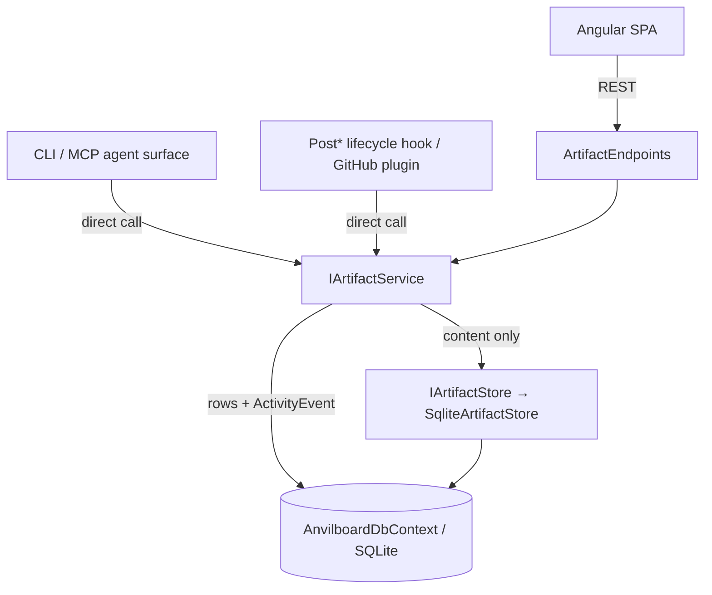

# Implementation Plan: Artifact Service

> Feature-level technical design and execution plan for the one remaining **Critical**
> unimplemented capability in Anvilboard.
> Canonical chain: [`prd.md`](../anvilboard/prd.md) → [`srs.md`](../anvilboard/srs.md) →
> [`tech-design.md`](../anvilboard/tech-design.md) → [`artifacts.md`](../features/artifacts.md).

## 1. Document Information

| Field | Value |
|---|---|
| Document | Implementation Plan — Artifact Service |
| Feature component | [`artifacts`](../features/artifacts.md) |
| Milestone | [`tech-design.md`](../anvilboard/tech-design.md) §16 **M6.7: GitHub PR Artifacts & Plugin Persistence** |
| Audit finding | [`audit-report.md`](../audit-report.md) **CRIT-003** (and **MIN-006** "sole caller" language) |
| SRS refs | `FR-ART-001` (primary), `FR-ART-002` (primary), `NFR-SEC-001` + `NFR-REL-001` (touched) |
| Acceptance criteria | `FR-ART-001 AC1`, `FR-ART-001 AC2`, `FR-ART-002 AC1`, `FR-ART-002 AC3` |
| Status | **Implemented** — delivered as designed; 21 service tests + 6 API tests green. One deviation from this plan is recorded in §14 (`DR-ART-006`). |
| Created | 2026-09-12 |

## 2. Why this feature was selected

The backlog lives in the feature index and audit report, not in GitHub issues
(`gh issue list --state open` → none). Selecting "the next feature" therefore means selecting the
largest verified gap. The evidence:

| Signal | Finding |
|---|---|
| Open GitHub issues | `gh issue list --state open` → none. |
| Unresolved Critical findings | **CRIT-003 only.** CRIT-001 (backup/restore) and CRIT-002 (realtime) are both marked **RESOLVED** in [`audit-report.md`](../audit-report.md). |
| Code evidence | `Anvilboard.Application/Artifacts/` contains **only** `ArtifactException.cs`. No `IArtifactService`, no `ArtifactService`, no `ArtifactEndpoints.cs`, no artifact tests anywhere in `src/`. |
| Milestone status | M6.7 is the last `Partial` P1 row whose *capability* (not just polish) is missing. |
| Blocking relationship | [`artifacts.md`](../features/artifacts.md) front-matter lists it as **Blocks** `integration-and-plugin-platform` (artifact-expansion hook) and `agent-and-automation-surface`. It is the only remaining feature that gates other components. |

Unlike the other `Partial` rows — which are mostly *surface* gaps (a CLI adapter here, a UI view
there) over working services — artifacts has working **persistence** and **no service at all**.
The `Artifact` entity, the `Artifacts`/`ArtifactBlobs` tables and their migration, the
`IArtifactStore`/`SqliteArtifactStore` pair, the `ActivityEventType.ArtifactAttached`/
`ArtifactRefreshed`/`ArtifactRemoved` enum members, and the `ARTIFACT_STORE_UNAVAILABLE` entry in
`ErrorCodeCatalog` are **all already in place and unused**. This plan connects existing, tested
plumbing rather than introducing a new subsystem — a high-value, low-risk change.

### 2.1 Verified current state

| Layer | Artifact status | Evidence |
|---|---|---|
| Domain | ✅ Present | `src/Anvilboard.Domain/Artifact.cs` — `Artifact`, `ArtifactKind`, `ArtifactBlob`, `ArtifactKindConverter` |
| Schema | ✅ Present | `20260909080213_AddArtifacts` migration; `ArtifactConfiguration` (incl. unique filtered index on `(IssueId, DedupKey)`), `ArtifactBlobConfiguration` |
| Store | ✅ Present | `Anvilboard.Infrastructure/Artifacts/{IArtifactStore,SqliteArtifactStore}.cs` |
| Activity events | ✅ Enum present, never emitted | `ActivityEventType.ArtifactAttached`/`ArtifactRefreshed`/`ArtifactRemoved` |
| Error catalog | ✅ Present | `ErrorCodeCatalog`: `ARTIFACT_STORE_UNAVAILABLE` → 502 |
| Exception type | ✅ Present | `Anvilboard.Application/Artifacts/ArtifactException.cs` |
| **Application service** | ❌ **Missing** | No `IArtifactService`/`ArtifactService` |
| **DI registration** | ❌ **Missing** | `IArtifactStore` is not registered in `Anvilboard.Infrastructure/ServiceCollectionExtensions.cs` |
| **REST surface** | ❌ **Missing** | No `ArtifactEndpoints.cs` |
| **Tests** | ❌ **Missing** | No artifact tests in any test project |

> Note the DI gap: `SqliteArtifactStore` exists but is **never registered**, so even the
> implemented half is currently unreachable at runtime. This plan fixes that as part of task T3.

## 3. Overview

### 3.1 Background

`FR-ART-001` requires that an authorized actor or automation attach a file, link, deployment, or
pull-request reference to an issue, and list/remove those artifacts consistently across web, REST,
CLI, and MCP. `FR-ART-002` requires automated artifact expansion through an approved `Post*`
lifecycle hook, using the *same* authorization/budget/audit path as a human caller.

Today an artifact can be persisted only by writing to `DbContext` directly — which no production
code does. There is no upsert/refresh semantics for the refreshable `pull_request` kind, so a
linked PR's status can never be kept current, and no `ArtifactAttached` activity ever reaches the
dashboard's activity feed.

### 3.2 Goals

1. **G1** — A single `IArtifactService` seam that is the sole writer of the `Artifacts` table and
   the sole caller of `IArtifactStore`, making [`artifacts.md`](../features/artifacts.md)'s
   "sole caller" claim true (closes **MIN-006**).
2. **G2** — Attach / list / remove artifacts with the documented validation and error catalog
   mapping (`FR-ART-001 AC1`, `AC2`).
3. **G3** — Idempotent `RefreshArtifactAsync` upsert keyed on `(IssueId, Kind, DedupKey)` so
   repeated PR events update in place rather than duplicating rows (`FR-ART-001` idempotent upsert).
4. **G4** — Fail-closed store semantics: a store failure never leaves a partial or corrupt
   `Artifact` row (`FR-ART-002 AC3`).
5. **G5** — Every artifact mutation emits its `ActivityEvent`, with automation provenance
   (`Source` ≠ `"local"`, `AddedById` null) distinguishable from manual provenance
   (`FR-ART-002 AC1`).

### 3.3 Non-Goals

- **Deciding *which* external resources to expand or how to fetch them.** URL matching and provider
  fetch clients live in the Integration & Plugin Platform's expansion hook. This plan provides the
  seam that hook calls; it does not write the hook.
- **Deciding *how* a PR is correlated to an issue.** Reference parsing lives in the GitHub plugin.
- **A filesystem/object-storage `IArtifactStore`.** The SQLite BLOB implementation already exists
  and ships as-is; alternate implementations are a future swap behind the same interface.
- **Rendering/previewing artifact content in the Angular UI.** Presentation-layer concern; this plan
  stops at the REST contract. (A follow-up UI task is noted in §16.)
- **Multipart file upload plumbing.** The REST surface accepts inline base64 content for the `file`
  kind; a streaming upload endpoint is out of scope.
- **Changing the `Artifact` entity, schema, or migration.** All are already correct.

### 3.4 Scope

**In scope:** `IArtifactService` + `ArtifactService` + `ArtifactDto`; DI registration for both the
service and the previously-unregistered `IArtifactStore`; `ArtifactEndpoints` (GET/POST/DELETE);
unit tests; doc/status updates.

**Out of scope:** CLI/MCP adapters (the agent surface's `[AgentOperation]` wiring is a separate
component's task — but the service is deliberately shaped so that surface can call it directly with
no REST dependency), the expansion hook itself, and the GitHub correlation logic.

### 3.5 User Scenarios

1. **Manual attach (human, web/REST).** A contributor pastes a deployment URL onto an issue. The
   artifact appears in the issue's artifact list with `source = "local"` and their member id, and an
   `ArtifactAttached` activity lands on the feed.
2. **Automated expansion (hook).** An approved `PostAddComment` hook recognizes a Slack permalink
   and calls `AttachArtifactAsync` with `source = "slack-thread-expansion"` and no actor. The
   artifact is distinguishable as automation-attached in the returned DTO.
3. **PR correlation (plugin, repeated).** The GitHub plugin calls `RefreshArtifactAsync` on
   PR-opened; no artifact matches the dedup key, so one is attached. On PR-review-requested and
   PR-merged it calls again with the same dedup key; the same row's `Metadata` is updated in place
   and `ArtifactRefreshed` is emitted — the board always shows current PR state, never duplicates.
4. **Store outage (fail-closed).** A `file` attach arrives while the store is failing. The caller
   receives `ARTIFACT_STORE_UNAVAILABLE` (502) and **no** `Artifact` row exists afterwards.

### 3.6 Acceptance Criteria

| ID | Criterion | Verified by |
|---|---|---|
| `AC-ART-001` | Attaching with a valid kind/title/contentReference persists a row and returns a DTO carrying kind, title, source, actor, and timestamps. | `AttachArtifactAsync_PersistsArtifactAndActivityEvent` |
| `AC-ART-002` | An invalid kind, empty title, or empty contentReference yields `VALIDATION_FAILED` naming the offending field, and persists nothing. | `AttachArtifactAsync_RejectsInvalid*` |
| `AC-ART-003` | An `issueId` that is unknown, or that resolves to no team (and therefore to no workspace), yields `REFERENCED_ENTITY_NOT_FOUND` and persists nothing. | `AttachArtifactAsync_RejectsUnknownIssue`, `AttachArtifactAsync_RejectsIssueNotReachableThroughATeam` |
| `AC-ART-004` | Inline content is stored through `IArtifactStore` and the row's `ContentReference` is the returned opaque reference — never the raw bytes. | `AttachArtifactAsync_StoresInlineContentThroughStore` |
| `AC-ART-005` | A store failure surfaces `ARTIFACT_STORE_UNAVAILABLE` and leaves **zero** `Artifact` rows (fail-closed). | `AttachArtifactAsync_StoreFailurePersistsNothing` |
| `AC-ART-006` | `ListArtifactsAsync` returns the issue's artifacts ordered by `CreatedAt` ascending. | `ListArtifactsAsync_ReturnsOldestFirst` |
| `AC-ART-007` | `RefreshArtifactAsync` with no existing match attaches a new row and emits `ArtifactAttached`. | `RefreshArtifactAsync_FirstEventAttaches` |
| `AC-ART-008` | `RefreshArtifactAsync` with a matching `(issueId, kind, dedupKey)` updates in place — same `Id`/`CreatedAt`/`AddedById`, one row total — and emits `ArtifactRefreshed`. | `RefreshArtifactAsync_SubsequentEventUpdatesInPlace` |
| `AC-ART-009` | `RefreshArtifactAsync` on a non-refreshable kind yields `VALIDATION_FAILED` naming the kind. | `RefreshArtifactAsync_RejectsNonRefreshableKind` |
| `AC-ART-010` | `RemoveArtifactAsync` deletes the row, purges the associated BLOB, and emits `ArtifactRemoved`; an artifact not belonging to the issue yields `REFERENCED_ENTITY_NOT_FOUND`. | `RemoveArtifactAsync_*` |
| `AC-ART-011` | Automation provenance (`source` ≠ `"local"`, null actor) round-trips distinguishably from manual provenance. | `AttachArtifactAsync_AutomationProvenanceIsDistinguishable` |

## 4. System Context



The service is the only node with an edge into the `Artifacts` table. Hooks and the agent surface
call the **same** method a REST request does — there is no privileged automation path, satisfying
`FR-ART-002 AC1`.

## 5. Solution Design

### 5.1 Solution A (Recommended) — One service, dedup-key upsert, store-before-row ordering

`ArtifactService` takes `AnvilboardDbContext` and `IArtifactStore` (mirroring `IssueLinkService`'s
constructor-injected `DbContext` shape). Attach validates, optionally stores content, then persists
the row and its `ActivityEvent` in **one** `SaveChangesAsync`. Refresh queries
`(IssueId, Kind, DedupKey)` and either updates in place or delegates to the attach path.

**Store-before-row ordering is the key fail-closed decision.** `SqliteArtifactStore.StoreAsync`
calls `SaveChangesAsync` itself, so it cannot participate in the caller's unit of work. By storing
content *first* and persisting the row *second*, a store failure throws before any `Artifact` row is
added — leaving nothing partial (`AC-ART-005`). The inverse ordering could leave a row pointing at
content that was never written, which is exactly the corrupt state `FR-ART-002 AC3` forbids.

The residual failure mode is an **orphaned BLOB** (content stored, row-persist then fails). This is
deliberately accepted: an orphaned BLOB is invisible to every read path (all reads start from an
`Artifact` row) and wastes only bytes, whereas an orphaned *row* is a user-visible broken artifact.
Documented in §7.5 as a known, bounded trade-off.

### 5.2 Solution B (Alternative) — Transactional store participation

Give `IArtifactStore` an overload that enlists in the caller's transaction so the BLOB and the row
commit atomically, eliminating orphaned BLOBs.

**Rejected.** It leaks a persistence-transaction concept into an interface whose entire purpose is
to be swappable for a filesystem or object store — neither of which can enlist in a SQLite
transaction. It would make the abstraction *less* swappable to solve a wasted-bytes problem.

### 5.3 Comparison Matrix

| Criterion | A: store-first, separate saves | B: transactional store |
|---|---|---|
| Never persists a corrupt row (`AC-ART-005`) | ✅ | ✅ |
| `IArtifactStore` stays storage-agnostic | ✅ | ❌ couples to DB transactions |
| Orphaned BLOB possible | ⚠️ yes (invisible, bytes only) | ✅ no |
| Change to existing shipped interface | ✅ none | ❌ breaking |
| Implementation cost | Low | High |

### 5.4 Decision & Rationale

**Solution A.** It satisfies every acceptance criterion, requires no change to already-shipped
domain/infrastructure types, and preserves the swappability that is the documented reason
`IArtifactStore` exists. The orphan trade-off is bounded and invisible to users.

## 6. Architecture Design

```
src/
├── Anvilboard.Application/
│   └── Artifacts/
│       ├── ArtifactException.cs      # EXISTS — unchanged
│       ├── IArtifactService.cs       # NEW — contract
│       ├── ArtifactService.cs        # NEW — implementation
│       └── ArtifactDto.cs            # NEW — DTO + FromArtifact mapper
├── Anvilboard.Api/
│   └── Endpoints/
│       └── ArtifactEndpoints.cs      # NEW — REST adapter
└── Anvilboard.Application.Tests/
    └── Artifacts/
        └── ArtifactServiceTests.cs   # NEW — unit tests + fixture
```

Modified: `Anvilboard.Application/ServiceCollectionExtensions.cs` (register the service),
`Anvilboard.Infrastructure/ServiceCollectionExtensions.cs` (register the **missing**
`IArtifactStore`), `Anvilboard.Api/Program.cs` (map the endpoints).

## 7. Technology Stack & Conventions

### 7.1 Stack

No new dependencies. .NET 10, EF Core + SQLite, xUnit with in-memory SQLite
(`Data Source=:memory:` + `EnsureCreatedAsync`), exactly as `IssueLinkServiceTests` does.

### 7.2 Naming Conventions

Follows `IssueLinkService` precedent: primary-constructor service
(`ArtifactService(AnvilboardDbContext db, IArtifactStore store)`), `sealed record` DTO with a static
`FromArtifact` mapper, `CancellationToken ct = default` trailing parameter, and a private
`RecordActivityAsync` helper that `Add`s the event without saving (the caller's single
`SaveChangesAsync` commits both).

### 7.3 Parameter Validation & Input Parsing

| Parameter | Rule | Failure |
|---|---|---|
| `issueId` | Must resolve to an issue whose team's workspace is reachable by the caller | `REFERENCED_ENTITY_NOT_FOUND` |
| `kind` | Must be a defined `ArtifactKind` | `VALIDATION_FAILED` naming the value |
| `title` | Non-empty after trim; ≤ 500 chars (matches column) | `VALIDATION_FAILED` naming `title` |
| `contentReference` | Non-empty after trim (when no inline content supplied) | `VALIDATION_FAILED` naming `contentReference` |
| `source` | Defaults to `"local"`; ≤ 100 chars (matches column) | `VALIDATION_FAILED` naming `source` |
| `dedupKey` | Required by refresh; ≤ 500 chars (matches column) | `VALIDATION_FAILED` naming `dedupKey` |
| `metadata` | Opaque; bounded at 8 KiB, shape never inspected | `VALIDATION_FAILED` naming `metadata` |

Length bounds mirror the existing `ArtifactConfiguration` `HasMaxLength` values so validation fails
with a catalog error instead of an EF/SQLite truncation error.

### 7.4 Boundary Values & Edge Cases

- Whitespace-only `title`/`contentReference` are treated as empty.
- `metadata` at exactly 8 KiB is accepted; 8 KiB + 1 byte is rejected.
- Inline content of zero bytes is still stored (an empty file is a legitimate artifact).
- Two artifacts on the same issue with **null** `DedupKey` are both allowed — the unique index is
  filtered on `DedupKey IS NOT NULL`.
- The same `DedupKey` on **different** issues is allowed (the index is per-issue).

### 7.5 Business Logic Rules

1. `source` defaults to `"local"` only when omitted; an explicit automation source is preserved
   verbatim and never coerced.
2. `AddedById` is null for automation callers; the service never invents an actor.
3. `CreatedAt`/`AddedById` are immutable across refreshes — only `ContentReference`, `Metadata`,
   `Title`, and `UpdatedAt` change.
4. Refresh is restricted to `ArtifactKind.PullRequest` (the only refreshable kind today).
5. Remove purges the BLOB **after** the row is deleted; a purge failure does not resurrect the row
   (the artifact is gone from the user's perspective either way). Orphaned BLOBs are an accepted,
   invisible trade-off (§5.1).
6. `Artifact` is a sub-resource of an issue, not an aggregate: no independent version/concurrency
   control.

### 7.6 Error Handling Strategy

All anticipated failures throw `ArtifactException(errorCode, message)`. The REST adapter maps the
code through `ErrorCodeCatalog.HttpStatusFor` rather than a hand-written switch, so the endpoint can
never drift from §7.7. Store exceptions are caught and re-thrown as
`ArtifactException("ARTIFACT_STORE_UNAVAILABLE", …)` so raw I/O exceptions never escape.

### 7.7 Error Catalog & Traceability

| Condition | Code | HTTP | Source |
|---|---:|---|---|
| Issue/artifact not found, or issue resolves to no team | `REFERENCED_ENTITY_NOT_FOUND` | 404 | Catalog (exists) |
| Invalid kind/title/contentReference/metadata | `VALIDATION_FAILED` | 400 | Catalog (exists) |
| Refresh on non-refreshable kind | `VALIDATION_FAILED` | 400 | Catalog (exists) |
| Store unreachable | `ARTIFACT_STORE_UNAVAILABLE` | 502 | Catalog (exists) |
| Caller lacks permission | `WORKSPACE_ACCESS_DENIED` | 403 | Enforced upstream by middleware |

No catalog additions are required — every code this feature needs is already registered.

## 8. Detailed Design

### 8.1 Contracts

```csharp
public interface IArtifactService
{
    Task<ArtifactDto> AttachArtifactAsync(
        IssueId issueId,
        ArtifactKind kind,
        string title,
        string? contentReference = null,
        ArtifactInlineContent? inlineContent = null,
        string? source = null,
        MemberId? actorId = null,
        string? dedupKey = null,
        string? metadata = null,
        CancellationToken ct = default);

    Task<IReadOnlyList<ArtifactDto>> ListArtifactsAsync(IssueId issueId, CancellationToken ct = default);

    Task<ArtifactDto> RefreshArtifactAsync(
        IssueId issueId,
        ArtifactKind kind,
        string dedupKey,
        string title,
        string contentReference,
        string? metadata = null,
        string source = "github",
        CancellationToken ct = default);

    Task RemoveArtifactAsync(
        IssueId issueId,
        ArtifactId artifactId,
        MemberId? actorId = null,
        CancellationToken ct = default);
}

/// <summary>Bytes the caller wants durably stored, rather than an already-external URL.</summary>
public sealed record ArtifactInlineContent(byte[] Bytes, string? ContentType);

public sealed record ArtifactDto(
    Guid Id, Guid IssueId, string Kind, string Title, string ContentReference,
    string Source, Guid? AddedById, string? DedupKey, string? Metadata,
    DateTimeOffset CreatedAt, DateTimeOffset UpdatedAt)
{
    public static ArtifactDto FromArtifact(Artifact artifact) => /* … */;
}
```

`Kind` is exposed as the wire string (`"pull_request"`) via the existing `ArtifactKindConverter`,
matching how the column is already persisted — the enum name never leaks to the wire.

### 8.2 Core Workflow — `AttachArtifactAsync`

1. Resolve the issue by joining `Issues → Teams` for the workspace id (the `IssueLinkService`
   pattern); throw `REFERENCED_ENTITY_NOT_FOUND` if absent.
2. Validate kind / title / contentReference / source / metadata per §7.3.
3. If `inlineContent` is supplied, `await store.StoreAsync(...)` inside a try/catch that converts
   any exception to `ARTIFACT_STORE_UNAVAILABLE`; the returned opaque reference becomes
   `ContentReference`. Otherwise use the caller-supplied `contentReference`.
4. `db.Artifacts.Add(artifact)`; `RecordActivityAsync(ArtifactAttached)`; one `SaveChangesAsync`.
5. Return `ArtifactDto.FromArtifact(artifact)`.

### 8.3 Core Workflow — `RefreshArtifactAsync`

1. Resolve the issue (as above).
2. Reject any kind other than `PullRequest` with `VALIDATION_FAILED`.
3. Validate `dedupKey`, `title`, `contentReference`, `metadata`.
4. `FirstOrDefaultAsync(a => a.IssueId == issueId && a.Kind == kind && a.DedupKey == dedupKey)`.
5. **Found** → mutate `ContentReference`/`Metadata`/`Title`/`UpdatedAt`; emit `ArtifactRefreshed`.
   **Not found** → build a new row exactly as attach does; emit `ArtifactAttached`.
6. One `SaveChangesAsync`; return the DTO.

Because `Artifact` uses `init`-only properties, the in-place update path needs those four properties
to become settable (`{ get; set; }`), matching the mutable-entity convention already used by
`Issue` (`Title`/`Status`/`Version` are all `get; set;`). `Id`, `IssueId`, `Kind`, `AddedById`, and
`CreatedAt` stay `init`-only, which encodes rule §7.5.3 in the type system.

### 8.4 Core Workflow — `RemoveArtifactAsync`

1. Load the artifact; throw `REFERENCED_ENTITY_NOT_FOUND` if missing **or** if its `IssueId` differs
   from the supplied issue.
2. `db.Artifacts.Remove(...)`; emit `ArtifactRemoved`; `SaveChangesAsync`.
3. `await store.DeleteAsync(artifact.ContentReference)` — a no-op for external URLs, since the store
   ignores references it does not own.

## 9. API Design

### 9.1 Overview

| Method | Route | Permission | Success |
|---|---|---|---|
| `GET` | `/api/issues/{id}/artifacts` | `ReadBoard` (group default) | 200 + `ArtifactDto[]` |
| `POST` | `/api/issues/{id}/artifacts` | `ReadWriteIssues` \| `ReadWriteAssignedIssues` | 201 + `ArtifactDto` |
| `DELETE` | `/api/issues/{id}/artifacts/{artifactId}` | `ReadWriteIssues` \| `ReadWriteAssignedIssues` | 204 |

Routes are added to the **existing** `/api/issues` group in `IssueEndpoints`-adjacent style so they
inherit the group's `ReadBoard` requirement and the workspace-authorization middleware, exactly like
the `links` sub-resource. Mutation verbs carry the same dual-permission requirement the spec
mandates ("the same authorization the issue mutation itself requires — there is no separate artifact
admin role").

`RefreshArtifactAsync` is deliberately **not** exposed over REST: the spec states refresh "is
reachable only from the owning plugin's correlation logic, never from a public write path."

### 9.2 Request Contract

```jsonc
// POST /api/issues/{id}/artifacts
{
  "kind": "link",                 // file | link | deployment | pull_request
  "title": "Deployment",
  "contentReference": "https://…",// mutually exclusive with contentBase64
  "contentBase64": null,          // inline bytes for kind=file
  "contentType": null,
  "source": null,                 // defaults to "local"
  "actorId": null,
  "metadata": null
}
```

Errors return `Results.Problem(title: errorCode, detail: message, statusCode:
ErrorCodeCatalog.HttpStatusFor(errorCode))`.

## 10. Data & Storage Design

No schema change, no new migration. The existing `Artifacts` and `ArtifactBlobs` tables, the
`IX_Artifacts_IssueId` index, and the filtered unique `IX_Artifacts_IssueId_DedupKey` index already
match this design — the latter is precisely the constraint that makes the refresh upsert safe under
concurrent PR events.

## 11. Security Design

- **Authorization** is enforced upstream by `WorkspaceAuthorizationMiddleware` via the route group's
  `RequirePermission`; the service never re-derives it, per the spec's "receives an already
  authorized request."
- **Cross-workspace isolation** over REST is enforced upstream, the same way it is for issues,
  comments, and links: the middleware resolves the caller's workspace before the endpoint runs.
  The service takes an `IssueId` and no `WorkspaceId`, matching `IssueService`/`IssueLinkService`,
  so it verifies only that the issue exists and is reachable through a team. A **direct**
  (CLI/MCP/hook) caller that already holds an arbitrary `IssueId` is therefore not workspace-checked
  by this service — that is the pre-existing, repo-wide gap tracked as audit findings MAJ-001 and
  MAJ-015, and closing it belongs to that work, not to this feature.
- **No raw content in audit/activity payloads** — `DataJson` carries only
  `{ artifactId, kind, source, title }`, never bytes or the opaque reference's contents.
- **`metadata` is opaque and bounded** (8 KiB) so a misbehaving plugin cannot use it as unbounded
  storage.

## 12. Testing Strategy

`src/Anvilboard.Application.Tests/Artifacts/ArtifactServiceTests.cs`, using an in-memory SQLite
fixture modeled on `IssueLinkFixture` (real schema via `EnsureCreatedAsync`, so the unique dedup
index is genuinely exercised) plus two `IArtifactStore` test doubles: a recording in-memory store
and an always-throwing store for the fail-closed case.

Coverage maps 1:1 to `AC-ART-001` … `AC-ART-011` (§3.6). Verification command:

```powershell
dotnet test src\Anvilboard.Application.Tests\Anvilboard.Application.Tests.csproj --configuration Debug
```

followed by a full `dotnet build Anvilboard.slnx` to confirm no regression in the other projects.

## 13. Milestones & Task Breakdown

| # | Task | Files | Depends on |
|---|---|---|---|
| **T1** | `ArtifactDto` + `ArtifactInlineContent` + `IArtifactService` | `Application/Artifacts/{ArtifactDto,IArtifactService}.cs` | — |
| **T2** | `ArtifactService` (attach/list/refresh/remove, validation, fail-closed store, activity events); make the four refreshable `Artifact` properties settable | `Application/Artifacts/ArtifactService.cs`, `Domain/Artifact.cs` | T1 |
| **T3** | DI: register `IArtifactService`; register the **missing** `IArtifactStore → SqliteArtifactStore` | both `ServiceCollectionExtensions.cs` | T2 |
| **T4** | `ArtifactEndpoints` + `MapArtifactEndpoints` call in `Program.cs` | `Api/Endpoints/ArtifactEndpoints.cs`, `Api/Program.cs` | T3 |
| **T5** | Tests for `AC-ART-001`…`AC-ART-011`, plus API-level tests covering routing, DI, auth, and JSON shape | `Application.Tests/Artifacts/ArtifactServiceTests.cs`, `Api.Tests/Artifacts/ArtifactEndpointTests.cs` | T2, T4 |
| **T6** | Docs: flip statuses, resolve CRIT-003/MIN-006 | see §13.1 | T5 |

### 13.1 Canonical documents to update on completion

| Document | Change |
|---|---|
| [`docs/features/artifacts.md`](../features/artifacts.md) | Status row `Partial` → `Implemented`; drop "(planned; new)" markers from the implemented method headings. |
| [`docs/features/overview.md`](../features/overview.md) | Row 8 status `Partial` → `Implemented`. |
| [`docs/audit-report.md`](../audit-report.md) | Mark **CRIT-003** RESOLVED (keeping the original finding for history, as CRIT-001/CRIT-002 do); note **MIN-006**'s "sole caller" language is now accurate. |
| [`docs/anvilboard/tech-design.md`](../anvilboard/tech-design.md) | §16 row M6.7 → Implemented. |
| [`CHANGELOG.md`](../../CHANGELOG.md) | Add the artifact service/REST entry. |

### 13.2 Deliberate follow-ups (not this plan)

1. **Angular artifact UI** — list/attach/remove in the issue detail panel (presentation layer,
   §3.3).
2. **CLI/MCP `[AgentOperation]` adapters** — owned by `agent-and-automation-surface`; the service
   contract is already host-agnostic.
3. **The expansion hook + GitHub PR correlation** — owned by
   `integration-and-plugin-platform`; both are now unblocked because the seam they call exists.

## 14. Open Questions & Decision Records

| ID | Question | Decision |
|---|---|---|
| `DR-ART-001` | Should the store enlist in the caller's transaction? | **No** — store-first ordering (§5.1/§5.4). Orphaned BLOBs accepted as invisible and bounded. |
| `DR-ART-002` | Expose `RefreshArtifactAsync` over REST? | **No** — spec forbids a public refresh write path (§9.1). |
| `DR-ART-003` | Multipart upload for `file` artifacts? | **No** — inline base64 for now; streaming upload is a separate concern (§3.3). |
| `DR-ART-004` | Which permission guards artifact mutation? | The issue's own mutation permissions; no artifact-admin role (§9.1). |
| `DR-ART-005` | Bound on `metadata`? | 8 KiB, shape uninspected (§7.3) — the spec requires "a size bound" without fixing a value. |
| `DR-ART-006` | How is `ListArtifactsAsync` ordered? | **Client-side, after materialization.** The plan assumed a server-side `ORDER BY CreatedAt`; implementing it produced `SQLite does not support expressions of type 'DateTimeOffset' in ORDER BY clauses` at runtime. `ToListAsync` then `OrderBy` in memory, matching what `IssueLinkService.ListLinksAsync` already does. This is a repo-wide constraint on any `DateTimeOffset` ordering, not an artifact-specific quirk. |
