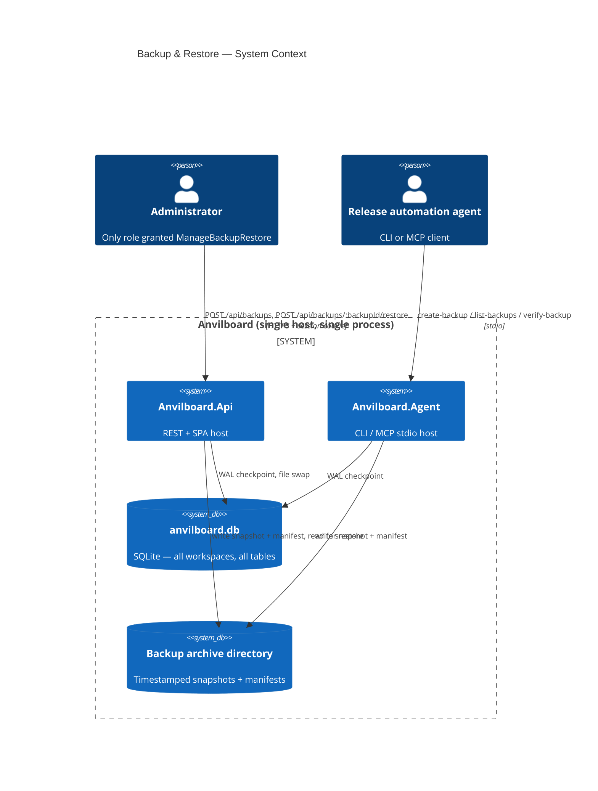
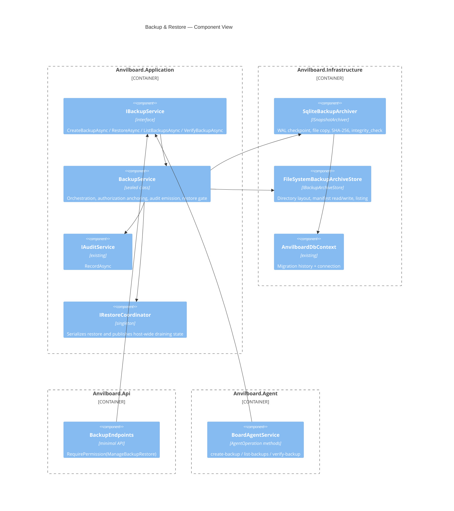
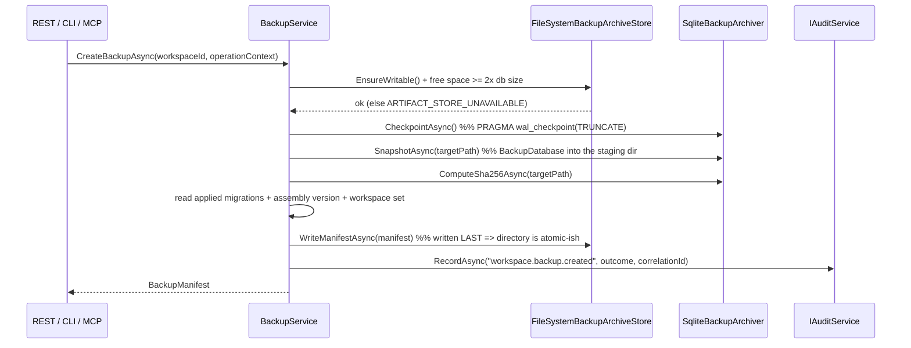

# Implementation Plan: Workspace Backup & Restore

> Feature-level technical design and execution plan for what was, at the time of writing,
> the one remaining **Critical** unimplemented capability in Anvilboard. **Delivered** — this
> document is retained as the design record behind milestone M7; the canonical description of
> the shipped behavior is [`audit-and-recovery.md`](../features/audit-and-recovery.md).
> Generated with Spec-Forge `tech-design-generation` against the canonical chain:
> [`prd.md`](../anvilboard/prd.md) → [`srs.md`](../anvilboard/srs.md) →
> [`tech-design.md`](../anvilboard/tech-design.md) → [`audit-and-recovery.md`](../features/audit-and-recovery.md).

## 1. Document Information

| Field | Value |
|---|---|
| Document | Implementation Plan — Workspace Backup & Restore |
| Feature component | [`audit-and-recovery`](../features/audit-and-recovery.md) (backup/restore half) |
| Milestone | [`tech-design.md`](../anvilboard/tech-design.md) §16 **M7: Backup/Restore** |
| Audit finding | [`audit-report.md`](../audit-report.md) **CRIT-001** (and **MAJ-019** NFR-AVL-001 not met) |
| SRS refs | `FR-OPS-002` (primary), `NFR-AVL-001` (primary), `FR-OPS-001` + `NFR-REL-001` + `NFR-SEC-001` (touched) |
| Acceptance criteria | `AC-011`, `AC-012`, `AC-202`, `AC-203`, `AC-204` (from [`audit-and-recovery.md`](../features/audit-and-recovery.md)) |
| Status | **Delivered** — `IBackupService` create/verify/restore, `IRestoreCoordinator`, `/api/backups` endpoints, and agent create/list/verify operations are implemented and tested (CRIT-001 and MAJ-019 both RESOLVED) |
| Created | 2026-09-10 |

## 2. Why this feature was selected

Every entry in [`docs/features/overview.md`](../features/overview.md) is `Partial` except
`realtime-updates.md` (`Implemented`). Selecting "the next feature" therefore means selecting the
largest verified gap, not the next unstarted row. The evidence:

| Signal | Finding |
|---|---|
| Open GitHub issues | `gh issue list --state open` → none. The backlog lives in the feature index + audit report. |
| Unresolved Critical findings | **CRIT-001 only** *(as of this plan's writing)*. CRIT-002 (realtime) is marked RESOLVED; CRIT-003 (dedicated `ArtifactService`) was assessed here as a refactor rather than a missing capability — a file inventory later disproved that, see [`audit-report.md`](../audit-report.md) CRIT-003. CRIT-003 has since been implemented and is also RESOLVED, so no Critical finding remains open. |
| Code evidence | `rg -il "IBackupService\|CreateBackupAsync\|RestoreAsync\|BackupManifest" src` → **zero matches.** No partial implementation to extend. |
| Milestone status | M7 is the only row in §16 reading **Not Started** other than M8 (hardening, which depends on M7). |
| Requirement priority | `FR-OPS-002` and `NFR-AVL-001` are both **P0**. |

M7 is also the gate on M8: "Hardening & Pilot Readiness" cannot complete a recovery drill
(`NFR-AVL-001` explicitly requires "a verified backup/restore drill at least once per release
candidate") while no backup mechanism exists.

## 3. Overview

### 3.1 Background

Anvilboard persists the entire product state — 20 `DbSet`s including `Issues`, `AuditEvents`,
`Artifacts`, `ArtifactBlobs`, and `IdempotencyRecords` — in a single SQLite file whose path comes
from `AnvilboardDbOptions.DatabasePath`. [`AnvilboardDbContext`](../../src/Anvilboard.Infrastructure/Persistence/AnvilboardDbContext.cs)
documents this as a deliberate property: "the entire board's state is one file that can be backed
up by copying it."

That sentence is currently aspirational. There is no supported copy operation, no integrity
metadata, no restore path, and no audit trail for either. An operator's only recourse is an
out-of-band `cp` of a file that may have uncheckpointed WAL content, with no way to tell afterwards
whether the copy is restorable or which schema version produced it.

The authorization hook for this work already exists:
[`Permission.ManageBackupRestore`](../../src/Anvilboard.Domain/Permission.cs) is defined
("Trigger a backup or restore of the workspace's data") and granted to `Administrator` only in
`RolePermissionMap`. It has zero call sites.

### 3.2 Goals

| ID | Goal |
|---|---|
| G-1 | An Administrator can create a verified, restorable snapshot through REST, CLI, and MCP. |
| G-2 | Every snapshot carries integrity + provenance metadata sufficient to decide restorability *before* restoring (`FR-OPS-002` criterion 1). |
| G-3 | Restore is fail-closed: a corrupt, truncated, or schema-incompatible artifact leaves the live database byte-for-byte unchanged (`AC-012`). |
| G-4 | Restore requires elevated authorization **and** explicit target confirmation (`FR-OPS-002` criterion 2, `AC-203`). |
| G-5 | Both operations emit exactly one audit event each, after the outcome is known (`FR-OPS-002` criterion 4, `AC-011`). |
| G-6 | Manifests and audit summaries contain zero secret-shaped values (`AC-204`, `NFR-SEC-001`). |
| G-7 | A repeatable recovery drill demonstrates RPO ≤ 24 h and RTO ≤ 4 h (`NFR-AVL-001`), closing MAJ-019. |

### 3.3 Non-Goals

- **Automated/scheduled backup.** Explicitly excluded by [`audit-and-recovery.md`](../features/audit-and-recovery.md)'s Scope
  section and PRD §19 decision row 4. Operators schedule the supported export externally.
- **Retention enforcement.** The ≥ 7 daily + 4 weekly target is an operator policy; the service
  neither prunes nor enforces it. A read-only `ListBackupsAsync` is in scope so an external
  scheduler can implement retention; deletion is not.
- **Backup administration UI.** Owned by `anvilboard-web`; this plan covers backend + agent surface.
- **Off-host / remote backup targets** (S3, network share). The `Backup` container in
  tech-design §6 is a local filesystem directory. An `IBackupArchiveStore` seam is introduced so a
  remote implementation is additive later, but only the filesystem implementation ships.
- **`FR-OPS-001` audit query (`IAuditService.QueryAsync`).** A real gap (MAJ-018) in the same
  feature spec, but independently shippable. Tracked separately; see §17 OQ-P4.
- **Encryption of backup artifacts at rest.** Out of scope pending a key-management decision; §11.3
  records the mitigation (filesystem permissions + documented operator responsibility).

### 3.4 Scope

In scope: `IBackupService` + manifest/result types in `Anvilboard.Application`; a SQLite-specific
archiver and filesystem archive store in `Anvilboard.Infrastructure`; a `BackupDirectory` option;
four REST endpoints; three agent operations; host-wide restore coordination; audit emission; unit +
integration tests; and in-place doc updates to the four canonical documents that currently record
this as missing.

Out of scope: everything in §3.3, plus any change to the `AuditEvents` schema — `AuditEvent` and
`AuditEventId` already exist in [`Ids.cs`](../../src/Anvilboard.Domain/Ids.cs) and need no migration.
**This feature ships with zero EF Core migrations.**

### 3.5 User Scenarios

| # | Persona | Type | Goal | Steps | Success Condition |
|---|---|---|---|---|---|
| US-B1 | Administrator | Human | Take a snapshot before a risky upgrade | 1. Opens admin surface / calls `POST /api/backups`<br>2. Receives a manifest with id, timestamp, checksum, schema version | A manifest is returned in < 5 s for a pilot-scale database; `workspace.backup.created` audit row exists with the response's correlation ID |
| US-B2 | Administrator | Human | Recover after a bad migration or data loss | 1. Calls `GET /api/backups` and picks a backup id<br>2. Calls `POST /api/backups/:backupId/restore` with `confirmedWorkspaceSlug`<br>3. Reads `RestoreResult` | Post-restore queries return the pre-backup checkpoint data; `workspace.restore.completed` audit row exists |
| US-B3 | Administrator | Human | Refuse to restore a bad artifact | 1. Restore is invoked against a truncated/corrupt/foreign-schema artifact | `422 BACKUP_INTEGRITY_INVALID` naming the exact failed check; live database unchanged; `workspace.restore.failed` audit row exists |
| US-B4 | Team member (non-admin) | Human | (Negative) Attempt a restore | 1. Calls the restore endpoint with a Member session | `403 WORKSPACE_ACCESS_DENIED` before any artifact I/O occurs; no `.pre-restore` safety copy is written |
| US-B5 | Release-automation agent | Agent | Snapshot before an automated release, as a drill step | 1. `anvilboard create-backup`<br>2. Parses the JSON manifest from stdout<br>3. Asserts `integrity.verified == true` | Exit code 0, machine-parseable manifest on stdout, no secret-shaped token anywhere in the output |
| US-B6 | Release-automation agent | Agent | Verify a known backup is still restorable, without restoring | 1. `anvilboard verify-backup backupId=...`<br>2. Reads `verified` + `failedCheck` | Deterministic verdict with a stable machine-readable `failedCheck` code; zero mutations of any kind |

### 3.6 Acceptance Criteria

This feature does **not** introduce new AC-IDs. It implements the ones already defined in
[`audit-and-recovery.md`](../features/audit-and-recovery.md) that are currently unverifiable, and
adds boundary/negative rows under existing IDs.

| AC-ID | Priority | Criterion | Scenario | Verification Method |
|---|---|---|---|---|
| AC-202 | P0 | Create backup → mutate workspace → restore with matching slug → workspace data equals the pre-mutation checkpoint; `RestoreResult.Success == true`; `workspace.restore.completed` audit row present. | US-B2 | `BackupServiceTests` integration round trip on a seeded SQLite file. |
| AC-012 (a) | P0 | Restore of an artifact whose SHA-256 does not match its manifest fails with `BACKUP_INTEGRITY_INVALID` / `failedCheck = "checksum_mismatch"`; live DB unchanged. | US-B3 | Corrupt-byte injection fixture. |
| AC-012 (b) | P0 | Restore of a truncated artifact (not a valid SQLite file) fails with `failedCheck = "sqlite_integrity_check_failed"`; live DB unchanged. | US-B3 | Truncated-file fixture. |
| AC-012 (c) | P0 | Restore of an artifact whose manifest `schemaVersion` is not a known applied migration of this build fails with `failedCheck = "schema_version_incompatible"`; live DB unchanged. | US-B3 | Manifest with a fabricated future migration name. |
| AC-012 (d) | P0 | Restore of an artifact with a missing or malformed `backup-manifest.json` fails with `failedCheck = "manifest_missing_or_malformed"`; live DB unchanged. | US-B3 | Deleted / non-JSON manifest fixture. |
| AC-203 (a) | P0 | A non-Administrator actor invoking restore is rejected with `WORKSPACE_ACCESS_DENIED` **before** any artifact validation, file read, or safety copy occurs. | US-B4 | `ApiFactory` integration test asserting status **and** that the archive directory mtime is unchanged. |
| AC-203 (b) | P0 | An Administrator supplying a `confirmedWorkspaceSlug` that does not match the target workspace is rejected with `VALIDATION_FAILED`; no restore side effects. | US-B2 negative | Integration test with a deliberately wrong slug. |
| AC-011 | P0 | Each of backup-created, restore-completed, and restore-failed produces **exactly one** `AuditEvents` row carrying actor, workspace, action, outcome, and the request's correlation ID. | US-B1, US-B2, US-B3 | Query `AuditEvents` by correlation ID after each operation; assert count == 1. |
| AC-204 | P1 | No secret-shaped value appears in any `backup-manifest.json` or in any backup/restore `ResultSummary`. | US-B5 | `SecretRedactor`-based scan over a generated manifest + audit corpus. |
| AC-012 (e) | P0 | Restore attempted while another restore is in flight is rejected; the second caller never observes a half-swapped file. | — | Concurrency test issuing two overlapping restores. |
| AC-202 (b) | P1 | `CreateBackupAsync` on a database with pending uncheckpointed WAL content produces an artifact containing those committed writes. | US-B1 boundary | Write → do not checkpoint → back up → restore into a fresh path → assert the write is present. |

### 3.7 Success Metrics

| Metric | Baseline | Target | Measurement |
|---|---|---|---|
| `FR-OPS-002` implementation coverage | 0 % (CRIT-001) | 100 % of the four SRS acceptance criteria demonstrably tested | Traceability matrix §18.D + green test run |
| Recovery drill RPO | Undefined — no backup exists | ≤ 24 h (bounded by operator schedule frequency, which the CLI now makes schedulable) | Documented drill in `DEVELOPMENT.md` |
| Recovery drill RTO | Undefined | ≤ 4 h; measured restore step target **< 60 s** for a pilot-scale (≤ 200 MB) database | Timed drill; integration test asserts the mechanical step, not the human procedure |
| Backup/restore audit coverage | 0 events | 3 distinct actions emitted (`workspace.backup.created`, `workspace.restore.completed`, `workspace.restore.failed`) | AC-011 tests |
| New EF migrations required | — | **0** | `dotnet ef migrations list` unchanged |
| Net new test count | 0 backup tests | ≥ 18 (11 AC rows above, plus archiver/store/option unit tests) | `dotnet test Anvilboard.slnx` |

## 4. System Context



Both hosts call `AddAnvilboardInfrastructure` and `AddAnvilboardApplication`, so registering the
backup service in the existing DI extensions gives the CLI/MCP surface the same implementation the
REST surface uses — the "shared application services power every channel" principle from
tech-design §3.

## 5. Solution Design

The one genuine design decision here is **what a "backup" is**, because the interface signature in
[`audit-and-recovery.md`](../features/audit-and-recovery.md) takes a `WorkspaceId` while the
persistence model is one SQLite file shared by all workspaces. The plan must resolve that tension
explicitly rather than inherit it.

### 5.1 Solution A (Recommended) — Whole-file snapshot, workspace-anchored authorization

Back up the entire SQLite file. The `WorkspaceId` parameter is the **authorization and confirmation
anchor**, not a filter: it identifies who may trigger the operation, which workspace's audit trail
records it, and which slug must be typed to confirm a restore. The manifest enumerates *every*
workspace contained in the artifact, so an operator can always see the true blast radius.

Restore swaps the whole file. To prevent silently destroying a workspace created after the
snapshot, restore compares the live workspace set against the artifact's:

- artifact set ⊇ live set → proceed.
- live set contains workspaces absent from the artifact → fail closed with
  `BACKUP_INTEGRITY_INVALID` / `failedCheck = "workspace_set_mismatch"`, listing the slugs that
  would be lost. There is no API override in this milestone; intentional destructive recovery from
  such an artifact remains an offline operator procedure using the retained safety copy.

**Pros:** referentially complete by construction (no dangling FKs, no partial `ArtifactBlobs`,
audit history and idempotency records preserved); matches the `AnvilboardDbContext` doc comment and
the PRD's single-host constraint; no export/import engine to write or version; restore is
verifiable by opening the artifact as a SQLite database.

**Cons:** restore is instance-wide, so the word "workspace" in the API is about scoping authority,
not about scoping data — this must be documented loudly in the endpoint description and the CLI
help text or it is a footgun.

### 5.2 Solution B (Alternative) — Logical per-workspace export

Serialize one workspace's rows (issues, comments, activity, artifacts, audit, links, integrations,
workflow states) into a portable archive, and restore by deleting and re-inserting that workspace's
rows inside a transaction.

**Pros:** genuinely per-workspace; portable across schema versions with a mapping layer; could
later support workspace transfer between hosts.

**Cons:** requires a hand-maintained, ordered export/import graph across all 20 `DbSet`s that must
be updated on every schema change — precisely the maintenance trap tech-design §7 warns about;
strongly-typed-ID and `ArtifactBlobs` BLOB handling multiply the surface; partial-restore failure
modes are much harder to make fail-closed than an atomic file swap (`AC-012` becomes a
transaction-scope problem across ~20 tables rather than a file-rename problem); no requirement in
`FR-OPS-002` or `NFR-AVL-001` asks for workspace portability. `NFR-AVL-001` asks for *single-host
recovery*.

### 5.3 Comparison Matrix

| Criterion | A: whole-file snapshot | B: logical export |
|---|---|---|
| Satisfies `NFR-AVL-001` (single-host recovery) | Yes | Yes |
| Referential completeness | Guaranteed by construction | Must be hand-maintained per schema change |
| Fail-closed restore (`AC-012`) | Atomic file swap + safety copy | Multi-table transaction across 20 sets |
| Cost to implement | ~1 week (matches §16 M7 estimate) | 3–4 weeks |
| Maintenance cost per future migration | Zero | Export map must be updated |
| Per-workspace granularity | No (documented) | Yes |
| Matches existing `AnvilboardDbContext` design intent | Yes (verbatim) | No |
| Requires new EF migrations | No | No |

### 5.4 Decision & Rationale

**Solution A is selected.** `FR-OPS-002` asks for "an authorized backup operation and a documented
restore workflow that verifies integrity before declaring a workspace usable", and `NFR-AVL-001`
asks for a *single-host recovery drill*. Neither requires per-workspace data granularity. Solution B
buys granularity nobody asked for at 3–4× the cost and introduces a permanent per-migration
maintenance tax, while making the P0 fail-closed guarantee (`AC-012`) strictly harder to prove.

The residual risk of Solution A — an operator restoring an artifact that predates another
workspace's creation — is mitigated by the explicit `workspace_set_mismatch` check, which is a far
cheaper and more auditable mitigation than a logical export engine. The `IBackupService` signature
from the feature spec is preserved verbatim so no downstream doc reference breaks; only its
semantics are now documented.

## 6. Architecture Design



**Layering rule check.** `Anvilboard.Application` already references
`Anvilboard.Infrastructure` (e.g. `AuditService` takes `AnvilboardDbContext` directly), so placing
`BackupService` in `Application` and the SQLite/filesystem mechanics in `Infrastructure` follows the
existing dependency direction rather than inverting it.

## 7. Technology Stack & Conventions

### 7.1 Technology Stack Decision

| Concern | Choice | Rationale |
|---|---|---|
| Snapshot mechanism | `PRAGMA wal_checkpoint(TRUNCATE)` + SQLite Online Backup API (`SqliteConnection.BackupDatabase`) | Available in `Microsoft.Data.Sqlite`, produces a consistent snapshot under concurrent writers, and matches the feature-spec checkpoint requirement without a new dependency. |
| Rejected fallback | Checkpoint + `File.Copy` | Safe only while cross-process writers are excluded; retaining a second snapshot path would increase test and recovery complexity without improving the primary design. |
| Checksum | SHA-256 via `System.Security.Cryptography.SHA256`, streamed | BCL; matches the feature spec. |
| Manifest format | JSON via `System.Text.Json` | Already the host serializer; human-inspectable, which `FR-OPS-002` criterion 1 implicitly requires. |
| Archive layout | Plain directory per backup (no zip) | Keeps the artifact openable as a SQLite database for verification without extraction; simpler failure modes. |
| Schema version source | Latest row of `__EFMigrationsHistory` via `db.Database.GetAppliedMigrationsAsync()` | Already available; no new schema. |
| Product version source | `Assembly.GetEntryAssembly()!.GetName().Version` / informational version | No new dependency. |

> **§7.1 note — snapshot mechanism.** `SqliteConnection.BackupDatabase` is preferred because it
> produces a consistent snapshot even with a concurrent writer and does not require exclusive access.
> `PRAGMA wal_checkpoint(TRUNCATE)` is still executed first so the source file and the snapshot agree
> on WAL state, satisfying the feature spec's step 1 literally and making `AC-202 (b)` meaningful.

### 7.2 Naming Conventions

| Element | Convention | Example |
|---|---|---|
| Service interface | Interface name starts with `I` and ends with `Service`, in `Anvilboard.Application/Backup/` | `IBackupService` |
| Infrastructure impl | Technology plus responsibility in `Anvilboard.Infrastructure/Persistence/Backup/` | `SqliteBackupArchiver`, `FileSystemBackupArchiveStore` |
| REST route | Plural noun, kebab-case, under `/api` (matching existing `/api/issues`, `/api/auth`) | `/api/backups`, `/api/backups/:backupId/restore` |
| Agent operation | kebab-case verb-noun, `Category = "backup"` | `create-backup`, `list-backups`, `verify-backup` |
| Audit action | `workspace.` prefix, subject, then past-tense outcome (matches existing `authorization.decision`) | `workspace.backup.created`, `workspace.restore.completed`, `workspace.restore.failed` |
| Archive directory | UTC compact timestamp, hyphen, then compact backup GUID beneath `BackupDirectory` | `backups/20260910T141233Z-7f3c…/` |
| Files within | `anvilboard.db` + `backup-manifest.json` | fixed names |

> The existing REST surface has **no** `/v1` segment despite tech-design §9.1 listing
> `/api/v1/...`. This plan matches the **code**, not the doc, and §17 OQ-P1 records versioning as a
> pre-existing cross-cutting discrepancy that must not be silently "fixed" by one feature.

### 7.3 Parameter Validation & Input Parsing

| Parameter | Rule | Error on violation |
|---|---|---|
| `workspaceId` | Must resolve to a workspace the caller is authorized for | `WORKSPACE_ACCESS_DENIED` |
| `backupId` | Required; must be a GUID that resolves to an existing archive directory | `REFERENCED_ENTITY_NOT_FOUND` |
| `confirmedWorkspaceSlug` | Required, 1–100 chars, **ordinal case-sensitive** exact match to the target workspace's `Slug` | `VALIDATION_FAILED` |
| `BackupDirectory` (config) | Must be a writable directory path; created on first use | Startup fails fast with a named configuration error |

Validation order for restore is fixed and load-bearing for `AC-203 (a)`: **authorization →
confirmation match → artifact existence → integrity**. No file is opened and no safety copy is
written until the first two pass.

### 7.4 Boundary Values & Edge Cases

| Case | Behavior |
|---|---|
| Backup directory does not exist | Created on first backup; a creation failure surfaces as `ARTIFACT_STORE_UNAVAILABLE` (502) — reusing the existing catalog entry for "configured store cannot read/write". |
| Insufficient disk space | Pre-flight check: free space ≥ 2 × current DB size. Fails with `ARTIFACT_STORE_UNAVAILABLE` naming the shortfall, before any partial file is written. |
| Empty database (fresh install, zero issues) | Valid backup; manifest records `workspaces: []` only if no workspace exists, which cannot occur post-bootstrap. |
| Uncheckpointed WAL | Covered by `AC-202 (b)`. |
| Artifact from a *newer* build | `schema_version_incompatible` — the migration name is not in this build's applied set. |
| Artifact from an *older* build | Permitted: after the swap, a fresh service scope and `IDbContextFactory<AnvilboardDbContext>` context run `MigrateAsync()` before the host reopens to traffic. The manifest's `schemaVersion` is recorded in the audit summary so the roll-forward is traceable. |
| Concurrent restores | Serialized by `IRestoreCoordinator`; second caller gets `RATE_LIMITED` with `Retry-After`. Covered by `AC-012 (e)`. |
| Restore of the backup that is currently being written | Impossible: the manifest is written last and `ListBackupsAsync` only surfaces directories containing a complete manifest. |
| Host crash mid-swap | The `.pre-restore` safety copy plus the staged file both survive; startup logs a recoverable-state warning naming both paths. |

### 7.5 Business Logic Rules

1. A backup never mutates the live database (the WAL checkpoint is the sole exception and is a
   no-op in terms of logical content).
2. Restore is fail-closed. Any failed check aborts before the swap; the live file is untouched.
3. Restore always writes a `.pre-restore` safety copy of the live database *after* validation
   succeeds and *before* the swap, so a failed swap is itself recoverable.
4. Audit is emitted after the outcome is determined, never speculatively — this is an explicit
   constraint in [`audit-and-recovery.md`](../features/audit-and-recovery.md).
5. The restore audit event is written to the **restored** database. Because the swap replaces the
   file, the completed-restore event is recorded after the new file is live, which means it lands in
   the restored history where an auditor will actually look for it. The failed-restore event is
   written to the untouched live database.
6. Manifests are written through `SecretRedactor.Scrub` even though they contain no free-form text,
   so a future manifest field cannot regress `AC-204` silently.

### 7.6 Error Handling Strategy

No new error codes are introduced. Every failure maps to an existing tech-design §7.7 catalog entry:

| Situation | Code | HTTP |
|---|---|---|
| Non-admin, or admin lacking `ManageBackupRestore` | `WORKSPACE_ACCESS_DENIED` | 403 |
| Slug confirmation mismatch, malformed body | `VALIDATION_FAILED` | 400 |
| Unknown `backupId` | `REFERENCED_ENTITY_NOT_FOUND` | 404 |
| Checksum / integrity / manifest / schema / workspace-set failure | `BACKUP_INTEGRITY_INVALID` | 422 |
| Backup directory unwritable, unreadable, or out of space | `ARTIFACT_STORE_UNAVAILABLE` | 502 |
| Restore already in progress | `RATE_LIMITED` (+ `Retry-After`) | 429 |

> **Deliberate reuse of `RATE_LIMITED` for the restore-in-progress window.** The alternative is a new
> `RESTORE_IN_PROGRESS` code, which per §7.7's own rule ("New anticipated failures must be added here
> and to SRS Appendix A in the same change") would require edits to two upstream canonical documents.
> `RATE_LIMITED` + `Retry-After` conveys the correct client action ("retry shortly"). Recorded as
> §17 OQ-P2 so the choice is revisitable rather than accidental.

### 7.7 Error Catalog & Traceability

| Code | New? | SRS trace | Verified by |
|---|---|---|---|
| `BACKUP_INTEGRITY_INVALID` | No — §7.7 row already exists, currently unreachable | `FR-OPS-002`, `NFR-AVL-001` | AC-012 (a)–(d) |
| `WORKSPACE_ACCESS_DENIED` | No | `FR-WS-001`, `NFR-SEC-002` | AC-203 (a) |
| `VALIDATION_FAILED` | No | `FR-OPS-002` criterion 2 | AC-203 (b) |
| `ARTIFACT_STORE_UNAVAILABLE` | No | `FR-ART-001` (reused) | Unit test on the store |
| `RATE_LIMITED` | No | `NFR-PERF-001` | AC-012 (e) |

`BACKUP_INTEGRITY_INVALID` is currently a catalog entry with no producer anywhere in `src/`. This
feature makes it reachable, which is itself a small doc-accuracy win.

## 8. Detailed Design

### 8.1 Component Overview

| Component | Project | Responsibility |
|---|---|---|
| `IBackupService` / `BackupService` | `Anvilboard.Application/Backup/` | Orchestration, ordering guarantees, audit emission |
| `BackupManifest`, `BackupArtifactRef`, `RestoreResult`, `BackupIntegrityFailure` | `Anvilboard.Application/Backup/` | Contract types (also the REST/agent response shapes) |
| `IRestoreCoordinator` / `RestoreCoordinator` | `Anvilboard.Application/Backup/` | Singleton restore lock plus host-wide `AcceptingDatabaseWork`/active-operation drain state |
| `DatabaseOperationMiddleware` | `Anvilboard.Api/Middleware/` | Registers each DB-backed request with the coordinator; returns `RATE_LIMITED` during restore drain/swap |
| `ISnapshotArchiver` / `SqliteBackupArchiver` | `Anvilboard.Infrastructure/Persistence/Backup/` | Checkpoint, snapshot, checksum, `PRAGMA integrity_check`, atomic swap |
| `IBackupArchiveStore` / `FileSystemBackupArchiveStore` | `Anvilboard.Infrastructure/Persistence/Backup/` | Directory layout, manifest (de)serialization, enumeration, free-space pre-flight |
| `BackupEndpoints` | `Anvilboard.Api/Endpoints/` | Minimal-API surface, `RequirePermission(ManageBackupRestore)` |
| `BoardAgentService` additions | `Anvilboard.Agent/` | `create-backup`, `list-backups`, `verify-backup` |
| `AnvilboardDbOptions.BackupDirectory` | `Anvilboard.Infrastructure/Persistence/` | New option, defaults next to `DatabasePath` |

### 8.2 Contracts

```csharp
namespace Anvilboard.Application.Backup;

public sealed record BackupOperationContext(
    string ActorId,
    AuditChannel Channel,
    string CorrelationId);

/// <summary>
/// Snapshot and recovery for the single SQLite file that holds the whole instance. The
/// <paramref name="workspaceId"/> on every member is the authorization and confirmation anchor,
/// not a data filter: a snapshot always contains every workspace on the host (see the plan's §5.4).
/// </summary>
public interface IBackupService
{
    Task<BackupManifest> CreateBackupAsync(
        WorkspaceId workspaceId, BackupOperationContext operation, CancellationToken ct = default);

    Task<RestoreResult> RestoreAsync(
        WorkspaceId workspaceId, BackupArtifactRef artifact, string confirmedWorkspaceSlug,
        BackupOperationContext operation, CancellationToken ct = default);

    Task<IReadOnlyList<BackupManifest>> ListBackupsAsync(
        WorkspaceId workspaceId, CancellationToken ct = default);

    Task<BackupVerification> VerifyBackupAsync(
        WorkspaceId workspaceId, BackupArtifactRef artifact, CancellationToken ct = default);
}

public sealed record BackupArtifactRef(Guid BackupId);

public sealed record BackupManifest(
    Guid BackupId,
    WorkspaceId RequestedForWorkspaceId,
    string RequestedForWorkspaceSlug,
    IReadOnlyList<BackupWorkspaceRef> Workspaces,   // full blast radius, per §5.1
    DateTimeOffset CreatedAt,
    string ProductVersion,
    string SchemaVersion,                            // latest applied EF migration name
    string ChecksumSha256,
    long SizeBytes);

public sealed record BackupWorkspaceRef(WorkspaceId Id, string Slug);

public sealed record BackupVerification(bool Verified, string? FailedCheck, string? Detail);

public sealed record RestoreResult(
    bool Success,
    Guid BackupId,
    DateTimeOffset RestoredAt,
    string? FailedCheck,
    string? Detail);
```

`FailedCheck` is a stable machine-readable enum-like string — one of `checksum_mismatch`,
`sqlite_integrity_check_failed`, `manifest_missing_or_malformed`, `schema_version_incompatible`,
`workspace_set_mismatch` — so `US-B6`'s agent can branch on it without parsing prose.

`RestoreResult` carries one additional value, `post_swap_failure`, that is deliberately not part of
the `BackupVerification` catalog above. The five values are all *pre-swap integrity checks*: they
are reachable by `VerifyBackupAsync` without mutating anything, and every one of them leaves the
live database untouched. `post_swap_failure` is reported only when all five have already passed and
the restore then failed after the file swap (see §8.4), at which point the safety-copy rollback —
not the artifact — is what determines the outcome. Keeping it out of the verification catalog
preserves the invariant that a `BackupVerification` failure always names a property of the
artifact.

The feature spec's `CreateBackupAsync` and `RestoreAsync` shapes remain recognizable, but the actor
string is promoted to `BackupOperationContext` so the calling adapter supplies the authenticated
actor ID, exact `AuditChannel`, and correlation ID explicitly. `BackupService` must not infer the
channel from runtime type or ambient process mode. `ListBackupsAsync` and `VerifyBackupAsync` are
additive (needed by US-B2 step 1 and US-B6, and by any external retention scheduler given that
automated scheduling is a non-goal). The canonical feature spec is aligned to this context type in
T17 before implementation is marked complete.

### 8.3 Core Workflow — `CreateBackupAsync`



Failure at any step before the manifest write leaves an incomplete directory that
`ListBackupsAsync` ignores (no manifest ⇒ not a backup) and emits a `workspace.backup.failed` audit
event. The incomplete directory is deleted on a best-effort basis; a deletion failure is logged and
never fails the operation.

### 8.4 Core Workflow — `RestoreAsync` (fail-closed)

```mermaid
sequenceDiagram
    participant Caller
    participant MW as WorkspaceAuthorizationMiddleware
    participant BS as BackupService
    participant Coord as IRestoreCoordinator
    participant Store
    participant Arch as SqliteBackupArchiver
    participant Scope as Fresh service scope
    participant Audit

    Caller->>MW: POST /api/backups/:backupId/restore
    MW->>MW: RequirePermission(ManageBackupRestore)
    Note over MW: AC-203(a) — denial happens here, before any file I/O
    MW->>BS: RestoreAsync(...)
    BS->>BS: confirmedWorkspaceSlug == workspace.Slug ?  %% AC-203(b) VALIDATION_FAILED
    BS->>Coord: TryAcquireRestore()                       %% else RATE_LIMITED (AC-012e)
    BS->>Store: ReadManifestAsync(backupId)              %% manifest_missing_or_malformed
    BS->>Arch: ComputeSha256 == manifest.ChecksumSha256? %% checksum_mismatch
    BS->>Arch: PRAGMA integrity_check on the artifact    %% sqlite_integrity_check_failed
    BS->>BS: manifest.SchemaVersion in applied migrations?%% schema_version_incompatible
    BS->>BS: live workspace set subset of manifest set?  %% workspace_set_mismatch
    Note over BS: every check above aborts WITHOUT touching the live DB (AC-012)
    BS->>Coord: Stop admission; wait for active DB operations to drain
    BS->>Arch: Acquire exclusive SQLite control or fail closed
    BS->>Arch: copy live db -> pre-restore safety path
    BS->>Arch: ClearAllPools(); swap staged file into DatabasePath; delete stale -wal/-shm
    BS->>Scope: Create scope + factory context; MigrateAsync() if older
    Scope->>Audit: RecordAsync("workspace.restore.completed") in restored DB
    alt post-swap migration or audit fails
        BS->>Arch: Roll back safety copy while admission stays closed
        BS->>Scope: Create another fresh scope; record restore failure
    end
    BS->>Coord: Reopen admission; release restore lease
    BS-->>Caller: RestoreResult
```

`SqliteConnection.ClearAllPools()` before the swap is mandatory — the existing
[`ApiFactory`](../../src/Anvilboard.Api.Tests/Testing/ApiFactory.cs) disposal path already proves
that pooled handles otherwise keep the file locked on Windows. A semaphore by itself is **not** a
quiesce mechanism: `DatabaseOperationMiddleware` must acquire a short-lived operation lease for
every request that can resolve `AnvilboardDbContext`; restore closes admission and waits for all
leases to drain before clearing pools. The restore request is marked as the coordinator owner so it
does not lease itself. Agent restore is not exposed, so the API host is the only online swap path.
The coordinator cannot drain an independently running agent or CLI process. Online restore thus
requires the API host to be the only process accessing the database during the drain/swap window.
After the in-process drain and before the safety copy, preflight opens the database with SQLite
exclusive locking and a zero busy timeout; a busy/locked result maps to
`ARTIFACT_STORE_UNAVAILABLE` and no live file is touched. The recovery drill must stop separate
agent/CLI processes and exercise this precondition on Windows, where external handles would also
prevent atomic replacement.

After replacement, neither `BackupService` nor `IAuditService` may reuse a scoped context created
before the swap. Restore creates a new service scope and a fresh
`IDbContextFactory<AnvilboardDbContext>` context to migrate the restored database and write the
success audit row. Admission reopens only after migration and audit commit succeed. A failure after
the swap triggers immediate rollback from the safety copy while admission remains closed; failure
audit is then written through another fresh context into the recovered live database.

## 9. API Design

### 9.1 API Overview

| Route | Method | Permission | Errors |
|---|---|---|---|
| `/api/backups` | GET | `ManageBackupRestore` | `AUTHENTICATION_REQUIRED`, `WORKSPACE_ACCESS_DENIED`, `ARTIFACT_STORE_UNAVAILABLE` |
| `/api/backups` | POST | `ManageBackupRestore` | + `ARTIFACT_STORE_UNAVAILABLE` |
| `/api/backups/{backupId:guid}/verify` | POST | `ManageBackupRestore` | + `REFERENCED_ENTITY_NOT_FOUND`, `BACKUP_INTEGRITY_INVALID` |
| `/api/backups/{backupId:guid}/restore` | POST | `ManageBackupRestore` | + `VALIDATION_FAILED`, `BACKUP_INTEGRITY_INVALID`, `RATE_LIMITED` |

### 9.2 Detailed Specifications

```http
POST /api/backups
X-Correlation-Id: 6f1c…            # optional; CorrelationContext.FromHeaderOrNew otherwise
→ 201 Created
{
  "backupId": "7f3c…", "requestedForWorkspaceId": "…", "requestedForWorkspaceSlug": "acme",
  "workspaces": [{ "id": "…", "slug": "acme" }],
  "createdAt": "2026-09-10T14:12:33Z",
  "productVersion": "1.4.0", "schemaVersion": "20260909124004_AddPluginConfigAndState",
  "checksumSha256": "b1946ac9…", "sizeBytes": 4194304
}
```

```http
POST /api/backups/7f3c…/restore
{ "confirmedWorkspaceSlug": "acme" }
→ 200 { "success": true,  "backupId": "7f3c…", "restoredAt": "…" }
→ 400 VALIDATION_FAILED            (slug mismatch)
→ 403 WORKSPACE_ACCESS_DENIED      (not an Administrator)
→ 422 BACKUP_INTEGRITY_INVALID     { "failedCheck": "checksum_mismatch", "detail": "…" }
→ 429 RATE_LIMITED                 (restore already in flight)
```

Registered as `app.MapBackupEndpoints();` alongside the existing five groups in
[`Program.cs`](../../src/Anvilboard.Api/Program.cs), after `UseMiddleware<WorkspaceAuthorizationMiddleware>()`
so the single enforcement point (tech-design §11.2) is preserved.

### 9.3 Agent / CLI / MCP surface

Three methods decorated with `AgentOperationAttribute` on [`BoardAgentService`](../../src/Anvilboard.Agent/BoardAgentService.cs),
which makes them simultaneously CLI commands and MCP tools:

```csharp
[AgentOperation("create-backup", "Creates a verified snapshot of the instance database",
    Category = "backup", Examples = ["create-backup"])]
[AgentOperation("list-backups", "Lists available verified backups, newest first",
    Category = "backup", IsIdempotent = true)]
[AgentOperation("verify-backup", "Verifies a backup's integrity without restoring it",
    Category = "backup", IsIdempotent = true, Examples = ["verify-backup backupId=7f3c..."])]
```

`restore` is deliberately **not** exposed to the agent surface in this milestone: MAJ-015 records
that agent/automation operations currently lack workspace-scoped authorization and actor identity,
so exposing an instance-wide destructive operation there would be a privilege escalation. Recorded
as §17 OQ-P3, gated on MAJ-015.

## 10. Data & Storage Design

### 10.1 Schema

**No database schema changes and no EF Core migration.** `AuditEvents` already stores everything
this feature records, and `AuditEventId` already exists in
[`Ids.cs`](../../src/Anvilboard.Domain/Ids.cs) — the feature spec's "planned: add `AuditEventId`" note
is stale and is corrected as part of this plan's doc updates.

### 10.2 Configuration

```csharp
public sealed class AnvilboardDbOptions
{
    public string DatabasePath { get; set; } = "anvilboard.db";

    /// <summary>Directory holding backup snapshots. Defaults to a "backups" folder next to
    /// <see cref="DatabasePath"/> so a published single-file deployment needs no extra config.</summary>
    public string? BackupDirectory { get; set; }
}
```

Resolution: `BackupDirectory ?? Path.Combine(Path.GetDirectoryName(Path.GetFullPath(DatabasePath)) ?? ".", "backups")`.
Bound from the existing `Database` configuration section — no new section, no new binding call.

### 10.3 On-disk layout

```
{BackupDirectory}/
└── 20260910T141233Z-7f3c9a1e.../
    ├── anvilboard.db            # the snapshot
    └── backup-manifest.json     # written last; its presence marks the backup complete
{DatabasePath}.pre-restore-20260910T151500Z   # safety copy, written only on a validated restore
```

## 11. Security Design

### 11.1 / 11.2 Authentication & Authorization

Handled entirely by the existing single enforcement point. `.RequirePermission(Permission.ManageBackupRestore)`
on the endpoint group; `RolePermissionMap` already grants it to `Administrator` alone, so no
permission-map change is needed. Restore additionally requires the slug confirmation described in
§7.3 — defense in depth, satisfying `FR-OPS-002` criterion 2's "explicit target confirmation".

### 11.3 Data protection

Backup artifacts are **byte-identical copies of the live database**, so they contain everything the
live database contains — including Data-Protection-encrypted integration secrets. Two consequences
that must be documented for operators:

1. The backup directory inherits the same confidentiality requirement as the database file itself.
   The implementation creates it with default (inherited) ACLs and does **not** attempt to harden
   them; `DEVELOPMENT.md`/`README.md` must state that the operator owns backup-directory permissions.
2. An artifact restored on a **different host** cannot decrypt integration secrets, because ASP.NET
   Core Data Protection keys are host-scoped. This is correct-by-default (secrets do not leak across
   hosts) but surprising, so the manifest's `productVersion`/host context and the restore result
   documentation call it out. Cross-host portability is a non-goal (§3.3).

Manifests contain only identifiers, timestamps, versions, a checksum, and a byte count — no
credential material — and are run through `SecretRedactor` defensively (§7.5 rule 6).

### 11.4 Audit logging

| Action | When | `TargetType` / `TargetId` | `ResultSummary` (redacted) |
|---|---|---|---|
| `workspace.backup.created` | After the manifest is durably written | `backup` / `{backupId}` | `schemaVersion`, `sizeBytes`, checksum prefix |
| `workspace.backup.failed` | After a failed snapshot | `backup` / `{backupId}` | failure category |
| `workspace.restore.completed` | After a successful swap, written into the restored DB | `backup` / `{backupId}` | source `createdAt`, `schemaVersion`, roll-forward applied yes/no |
| `workspace.restore.failed` | After any failed check, into the untouched live DB | `backup` / `{backupId}` | `failedCheck` |

All emitted via the existing `IAuditService.RecordAsync(AuditEventRequest)`. The endpoint or agent
adapter constructs `BackupOperationContext` from the authenticated actor, its explicit channel
(`Rest`, `Cli`, or `Mcp`), and the `CorrelationContext` value. `BackupService` copies those values
into `AuditEventRequest`; it never guesses the channel. This explicit propagation is what makes the
AC-011 "query by correlation ID" assertion work. For the current unauthenticated agent host,
non-destructive operations use its configured automation actor ID; destructive restore remains
REST-only until MAJ-015 is closed.

## 12. Performance Design

| Target | Value | Rationale |
|---|---|---|
| Backup wall-clock, pilot-scale DB (≤ 200 MB) | < 5 s | Dominated by a sequential file copy + one SHA-256 pass. |
| Restore mechanical step | < 60 s | Supports the `NFR-AVL-001` RTO ≤ 4 h with three orders of magnitude of headroom for the human procedure. |
| Live-request impact during backup | None blocking | `BackupDatabase` does not require exclusive access. |
| Live-request impact during restore | DB-backed requests are drained and admission remains closed through swap, migration, and success audit (< 60 s target) | Callers receive `RATE_LIMITED` + `Retry-After`, not a partially swapped or unmigrated read. |
| Checksum memory | O(1) | Streamed, never `File.ReadAllBytes`. |

No caching is introduced (consistent with tech-design §12.2's "no application-level cache in this
design pass").

## 13. Observability

- **Logging** — `ILogger<BackupService>` structured events at `Information` for started/completed
  with `backupId`, `sizeBytes`, `durationMs`; `Warning` for a failed integrity check including
  `failedCheck`; `Error` for store unavailability. Never log a path containing user content beyond
  the configured directory, and never log manifest contents verbatim.
- **Startup check** — on host start, if a `.pre-restore-*` file exists alongside `DatabasePath`, log
  a `Warning` naming it so an operator can tell a crash-interrupted restore from a clean one.
- **Metrics** — deferred; the repo has no metrics pipeline today and this plan does not introduce
  one. The audit trail is the durable record.

## 14. Deployment & Rollback

Additive only: no migration, no configuration that must be set (the `BackupDirectory` default is
derived), no change to existing routes. Rolling back the feature is deleting the endpoints and the
service; previously created artifacts remain valid plain SQLite files that an operator can restore
by hand, which is itself a useful property.

This feature *is* the mechanism tech-design §14.3 "Rollback Strategy" assumes exists for changes
beyond the deprecated-column retention window — implementing it closes that circular reference.

## 15. Testing Strategy

| Layer | Project | Coverage |
|---|---|---|
| Unit | `Anvilboard.Infrastructure.Tests/Persistence/Backup/` | `SqliteBackupArchiver` checkpoint + snapshot + checksum determinism; `PRAGMA integrity_check` on corrupt/truncated fixtures; `FileSystemBackupArchiveStore` layout, manifest round trip, incomplete-directory exclusion, free-space pre-flight; `BackupDirectory` default resolution |
| Unit | `Anvilboard.Application.Tests/Backup/BackupServiceTests.cs` | Validation ordering (AC-203a proven by asserting no file I/O on the denial path), explicit actor/channel/correlation propagation, audit-after-outcome ordering, coordinator mutual exclusion and drain behavior (AC-012e), `FailedCheck` mapping for all five causes |
| Integration | `Anvilboard.Application.Tests/Backup/BackupRoundTripTests.cs` | AC-202 create → mutate → restore → assert checkpoint equality; AC-202(b) uncheckpointed-WAL case; older-artifact roll-forward |
| Integration | `Anvilboard.Api.Tests/Backup/BackupEndpointTests.cs` (via `ApiFactory`) | All four routes end to end; AC-203(a) with a Member session; AC-203(b) with a wrong slug; AC-012(a)–(d) with injected fixtures; AC-011 by querying `AuditEvents` on the returned correlation ID |
| Security | `Anvilboard.Application.Tests/Backup/BackupSecretScanTests.cs` | AC-204 — `SecretRedactor` scan across a generated manifest + audit corpus |

Fixtures needed: a seeded workspace (≥ 1 issue, ≥ 1 integration, ≥ 1 prior audit event); a
checksum-corrupted artifact; a truncated artifact; a manifest with a fabricated future
`schemaVersion`; a manifest-deleted directory; a second workspace for the `workspace_set_mismatch`
case; a non-Administrator actor.

[`ApiFactory`](../../src/Anvilboard.Api.Tests/Testing/ApiFactory.cs) already injects a throwaway temp
SQLite path via the `Database:DatabasePath` config key and already clears SQLite pools on disposal —
both are exactly what these tests need, so the harness requires **no** changes beyond also
overriding `Database:BackupDirectory` to a temp directory.

Command: `dotnet test Anvilboard.slnx`.

## 16. Milestones & Task Breakdown

Dependency-ordered. Estimate matches the §16 M7 allowance of 1 week.

| # | Task | Files | Depends on | Est. |
|---|---|---|---|---|
| T1 | Add `BackupDirectory` to `AnvilboardDbOptions` + default resolution helper | `Anvilboard.Infrastructure/Persistence/AnvilboardDbOptions.cs` | — | 0.5 h |
| T2 | `IBackupArchiveStore` + `FileSystemBackupArchiveStore` (layout, manifest I/O, listing, free-space pre-flight) | `Anvilboard.Infrastructure/Persistence/Backup/` | T1 | 4 h |
| T3 | `ISnapshotArchiver` + `SqliteBackupArchiver` (checkpoint, `BackupDatabase`, streamed SHA-256, `integrity_check`, pool-clearing atomic swap) | `Anvilboard.Infrastructure/Persistence/Backup/` | T1 | 6 h |
| T4 | Contract types (`BackupManifest`, `BackupArtifactRef`, `RestoreResult`, `BackupVerification`, `BackupWorkspaceRef`) | `Anvilboard.Application/Backup/` | — | 1 h |
| T5 | `IRestoreCoordinator` + singleton coordinator and `DatabaseOperationMiddleware` (restore lease, admission state, active-operation drain) | `Anvilboard.Application/Backup/`, `Anvilboard.Api/Middleware/` | — | 4 h |
| T6 | `BackupService` — create path, incl. explicit operation context, audit emission, and failure cleanup | `Anvilboard.Application/Backup/BackupService.cs` | T2, T3, T4 | 4 h |
| T7 | `BackupService` — verify + list paths, `FailedCheck` mapping | same | T6 | 3 h |
| T8 | `BackupService` — restore path (ordered validation, drain, safety copy, swap, fresh-scope roll-forward and audit, rollback before reopening admission) | same | T5, T7 | 8 h |
| T9 | DI registration in `Application`/`Infrastructure` `ServiceCollectionExtensions` | both | T6–T8 | 0.5 h |
| T10 | Infrastructure unit tests (T2/T3 coverage + fixtures) | `Anvilboard.Infrastructure.Tests/` | T2, T3 | 5 h |
| T11 | Application unit tests (ordering, operation context, coordinator/drain, rollback, failure mapping) | `Anvilboard.Application.Tests/Backup/` | T8 | 6 h |
| T12 | `BackupEndpoints` + `MapBackupEndpoints()` registration | `Anvilboard.Api/Endpoints/`, `Program.cs` | T9 | 3 h |
| T13 | API integration tests via `ApiFactory` (AC-011, AC-012 a–d, AC-203 a–b) | `Anvilboard.Api.Tests/Backup/` | T12 | 6 h |
| T14 | Agent operations `create-backup` / `list-backups` / `verify-backup` | `Anvilboard.Agent/BoardAgentService.cs` | T9 | 2 h |
| T15 | AC-204 secret-scan test | `Anvilboard.Application.Tests/Backup/` | T6 | 2 h |
| T16 | Recovery-drill procedure documented (closes MAJ-019 / NFR-AVL-001) | `DEVELOPMENT.md`, `README.md` | T13 | 2 h |
| T17 | Canonical doc updates (see §16.1) | `docs/**` | T16 | 2 h |

**Critical path:** T1 → T3 → T6 → T8 → T12 → T13 → T16 → T17.

### 16.1 Canonical documents to update on completion

Doc-first discipline: these are edited **in place**; no parallel or `-v2` files, and all existing
`FR-*`/`NFR-*`/`AC-*` IDs are preserved.

| Document | Edit |
|---|---|
| [`docs/features/audit-and-recovery.md`](../features/audit-and-recovery.md) | Status row: backup/restore moves from "not implemented at all" to implemented; correct the stale "add `AuditEventId`" note in File Structure; align the file paths with the delivered layout |
| [`docs/features/overview.md`](../features/overview.md) | Row 6 status; note that `FR-OPS-001` query access remains the residual gap |
| [`docs/anvilboard/tech-design.md`](../anvilboard/tech-design.md) | §16 M7 row → Implemented; §7.7 `BACKUP_INTEGRITY_INVALID` gains a real producer |
| [`docs/audit-report.md`](../audit-report.md) | CRIT-001 and MAJ-019 marked RESOLVED with evidence, in the same style as the existing CRIT-002 resolution block |

## 17. Open Questions & Decision Records

| ID | Question / Decision | Status | Resolution |
|---|---|---|---|
| OQ-P1 | REST routes: `/api/backups` (matching code) or `/api/v1/backups` (matching tech-design §9.1)? | Resolved | Use `/api/backups`. No route in `src/` carries a `/v1` segment; introducing one in a single feature would fragment the surface. The `/v1` discrepancy is pre-existing and cross-cutting and belongs to a dedicated versioning change. |
| OQ-P2 | Reuse `RATE_LIMITED` for the restore-in-progress window, or add `RESTORE_IN_PROGRESS`? | Resolved | Reuse `RATE_LIMITED` + `Retry-After`. A new code requires §7.7 and SRS Appendix A edits for a transient sub-second condition whose correct client action is already exactly "retry shortly". Revisit if operators report ambiguity. |
| OQ-P3 | Expose `restore` on the CLI/MCP agent surface? | Deferred | No, pending MAJ-015 (agent surface lacks workspace-scoped authorization and actor identity). Exposing an instance-wide destructive operation on an unauthenticated surface would be a privilege escalation. Re-open when MAJ-015 closes. |
| OQ-P4 | Does this plan also close `FR-OPS-001`'s missing `IAuditService.QueryAsync` (MAJ-018)? | Resolved | No. Same feature spec, independent capability, independently shippable. Keeping them separate keeps this milestone at its 1-week §16 estimate. |
| OQ-P5 | Should backup artifacts be encrypted at rest? | Deferred | Not in this milestone — it needs a key-management decision that would also have to cover key backup (an encrypted backup whose key is only in the lost database is not a backup). Mitigation documented in §11.3. |
| OQ-P6 | `wal_checkpoint` + copy, or `BackupDatabase`? | Resolved | `BackupDatabase`, preceded by a `TRUNCATE` checkpoint. Consistent under concurrent writers, and still satisfies the feature spec's step 1 literally. |

## 18. Appendix

### A. Glossary

| Term | Meaning |
|---|---|
| Artifact (backup sense) | A directory containing one snapshot `.db` file and its `backup-manifest.json`. Distinct from `FR-ART-001` issue artifacts. |
| Blast radius | The set of workspaces a restore would overwrite; enumerated in every manifest. |
| Fail-closed | On any validation failure, the live database is left byte-for-byte unchanged. |
| Roll-forward | Running pending EF Core migrations after restoring an artifact created by an older build. |
| Safety copy | Database path plus a `.pre-restore-` suffix and UTC timestamp, written after validation and before the swap. |

### B. References

- [`docs/anvilboard/srs.md`](../anvilboard/srs.md) — `FR-OPS-002`, `NFR-AVL-001`, `FR-OPS-001`, `NFR-REL-001`, `NFR-SEC-001`
- [`docs/anvilboard/tech-design.md`](../anvilboard/tech-design.md) — §6 containers, §7.7 error catalog, §9.1 API overview, §11.4 audit logging, §14.3 rollback, §16 M7
- [`docs/features/audit-and-recovery.md`](../features/audit-and-recovery.md) — component spec and `AC-011`/`AC-012`/`AC-2xx`
- [`docs/audit-report.md`](../audit-report.md) — CRIT-001, MAJ-018, MAJ-019

### C. Related Documents

- [`docs/features/overview.md`](../features/overview.md) — component index and execution order
- [`docs/features/workspace-authorization.md`](../features/workspace-authorization.md) — the permission model this feature consumes unchanged
- [`docs/features/agent-and-automation-surface.md`](../features/agent-and-automation-surface.md) — MAJ-015, which gates OQ-P3

### D. Requirements Traceability

| Requirement | Criterion | Design section | AC | Test |
|---|---|---|---|---|
| `FR-OPS-002` (1) metadata without secret exposure | Manifest contents | §8.2, §10.3, §11.3 | AC-204 | `BackupSecretScanTests` |
| `FR-OPS-002` (2) elevated authorization + explicit confirmation | `ManageBackupRestore` + slug match | §7.3, §11.2 | AC-203 a/b | `BackupEndpointTests` |
| `FR-OPS-002` (3) verify integrity, report specific cause | Five ordered checks, `FailedCheck` | §8.4, §7.6 | AC-012 a–d | `BackupEndpointTests`, `BackupServiceTests` |
| `FR-OPS-002` (4) emit audit events | `IAuditService.RecordAsync` after outcome | §11.4 | AC-011 | `BackupEndpointTests` |
| `NFR-AVL-001` RPO ≤ 24 h / RTO ≤ 4 h | Schedulable CLI + < 60 s restore | §3.7, §12 | AC-202 | `BackupRoundTripTests` + documented drill (T16) |
| `NFR-REL-001` mutation durability | WAL checkpoint before snapshot | §7.1, §7.4 | AC-202 (b) | `BackupRoundTripTests` |
| `FR-OPS-001` audit completeness for backup/restore | Three audit actions | §11.4 | AC-011 | `BackupEndpointTests` |
| `NFR-SEC-001` no secret exposure | `SecretRedactor` on manifests + summaries | §7.5, §11.3 | AC-204 | `BackupSecretScanTests` |
