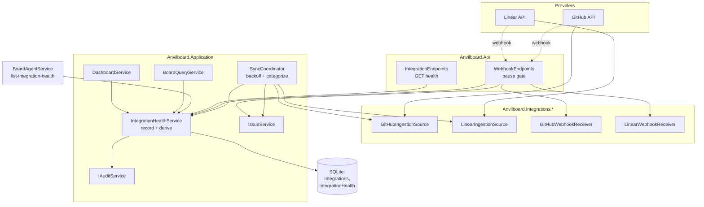

# Implementation Plan: Integration Sync Health, Backoff & Paused-Webhook Rejection

> Feature-level technical design and execution plan for the highest-ranked **open** capability gap
> in Anvilboard: a paused integration still ingests webhook traffic, a failing provider is retried
> forever at a fixed cadence, and nothing in the system can answer "is this board's data fresh?".
> Canonical chain: [`prd.md`](../anvilboard/prd.md) → [`srs.md`](../anvilboard/srs.md) →
> [`tech-design.md`](../anvilboard/tech-design.md) →
> [`integration-and-plugin-platform.md`](../features/integration-and-plugin-platform.md).

## 1. Document Information

| Field | Value |
|---|---|
| Document | Implementation Plan — Integration Sync Health, Backoff & Paused-Webhook Rejection |
| Feature component | [`integration-and-plugin-platform`](../features/integration-and-plugin-platform.md) |
| Milestone | [`tech-design.md`](../anvilboard/tech-design.md) §16 **M5: Integration Provenance & Health** |
| Audit findings | [`audit-report.md`](../audit-report.md) **MAJ-012**, **MAJ-013** (priority action #7) |
| SRS refs | `FR-INT-002` (primary), `FR-INT-001` (primary), `FR-WRK-002` (touched), `FR-WRK-004` (touched), `NFR-REL-002` (touched), `NFR-SEC-001` (touched) |
| Acceptance criteria | `FR-INT-001 AC3`, `FR-INT-002 AC3`, `FR-INT-002 AC4`, `FR-INT-002 AC5` |
| Status | **Implemented** — all tasks T1–T13 complete; suite green at 443 passing |
| Created | 2026-09-13 |

## 2. Why this feature was selected

The backlog lives in the feature index and the audit report, not in GitHub issues — the same
rationale recorded in [`artifact-service.md`](./artifact-service.md) §2 and
[`workflow-admin-surface.md`](./workflow-admin-surface.md) §2 still holds. Selecting "the next
feature" therefore means selecting the highest-ranked verified gap.

| Signal | Finding |
|---|---|
| Open GitHub issues | `gh issue list --state open` → only #41 (Renovate Dependency Dashboard). No feature work is tracked there. |
| Unresolved Critical findings | **None.** CRIT-001 (backup/restore), CRIT-002 (realtime), and CRIT-003 (`ArtifactService`) are all marked **RESOLVED**. |
| Highest open priority action | [`audit-report.md`](../audit-report.md) "Recommended Priority Actions" **#7** — *"Add sync-health/backoff tracking and enforce paused-integration webhook rejection — fixes MAJ-012, MAJ-013 — medium"*. Actions 1–6 and 10 are struck through; **7 is the first open row**. |
| Priority | `FR-INT-001` and `FR-INT-002` are both **P0**, in a **P0** component. The remaining open actions serve P1 UI parity (#8) or a smaller P0 slice (#9, "small"). |
| Milestone status | **M5** is the earliest still-`Partial` milestone after M3, and its §16 status text names exactly these two gaps as what keeps it partial. |
| Blocking relationship | `integration-and-plugin-platform.md` is listed as blocking `agent-and-automation-surface` and `audit-and-recovery`. It is also the declared owner of the sync-condition derivation that `issue-board-service` and the dashboard both depend on — that dependency is currently an explicit dead end in code (see §2.1). |

### 2.1 Verified current state

Every row below was confirmed by reading the code in this worktree at commit `4d9c01d`, not
inferred from the specs.

| Claim | Evidence |
|---|---|
| No health model exists anywhere | `src/Anvilboard.Domain/` has no `IntegrationHealth`; `AnvilboardDbContext` exposes no such `DbSet`; a repository-wide search for `SyncHealth`/`IntegrationHealth` finds zero types. |
| `Permission.ReadIntegrationHealth` is declared but dead | It is defined in [`Permission.cs`](../../src/Anvilboard.Domain/Permission.cs) and granted to `Administrator` **and** `Coordinator` in `RolePermissionMap`, yet the only other references in the repository are those two map entries. Nothing can currently require it — the same shape as `ManageWorkflowStates` before [`workflow-admin-surface.md`](./workflow-admin-surface.md). |
| The board's `syncCondition` filter is a deliberate dead end | [`BoardQueryService.cs`](../../src/Anvilboard.Application/Issues/BoardQueryService.cs) line 20: *"Sync health is supplied by the integration-platform slice. Until that model exists, a requested condition intentionally matches nothing rather than inventing health state."* — it returns `new BoardQueryResult([], 0, …)`. `BoardSyncCondition { Fresh, Stale, Paused, Failed }` already exists in `IBoardQueryService.cs`; only the producer is missing. |
| `SyncCoordinator` has no backoff and no error categorization | [`SyncCoordinator.cs`](../../src/Anvilboard.Application/Sync/SyncCoordinator.cs) (71 lines) delays a fixed `options.PollInterval` every iteration and swallows failures in a blanket `catch (Exception ex) when (ex is not OperationCanceledException)` that only calls `logger.LogError`. There is no consecutive-failure counter, no `Retry-After` handling, no transient/non-transient split. A provider with a revoked token is re-hit every 5 minutes, forever. |
| Webhooks ignore integration status entirely | [`WebhookEndpoints.cs`](../../src/Anvilboard.Api/Endpoints/WebhookEndpoints.cs) reads the receiver, verifies via `receiver.HandleAsync`, resolves the workspace from `result.TeamKey`, then upserts. `db.Integrations` is never queried; `IntegrationStatus.Paused` is never read on this path. Pausing an integration stops nothing on the push side. |
| `INTEGRATION_PAUSED` is a catalog code with no producer | `ErrorCodeCatalog` maps `"INTEGRATION_PAUSED" → 409` and `ErrorCatalogTranslatorTests` asserts that mapping, but no code path in the repository ever throws or returns it. |
| There is no integration REST surface at all | `src/Anvilboard.Api/Endpoints/` holds Artifact, Auth, Backup, Dashboard, Issue, Team, Webhook, and Workflow endpoints — there is no `IntegrationEndpoints.cs`. `IIntegrationService` is registered in DI and unit-tested, but unreachable from REST, CLI, or MCP. `BoardAgentService` exposes 20 operations across `issues`, `dashboard`, `backup`, and `workflow` — none for integrations. |

The gap is therefore not "write a retry helper": it is the **missing producer** for a health model
that three existing consumers (board filter, dashboard summary, and a declared-but-unused
permission) were already written to expect.

## 3. Overview

### 3.1 Background

Anvilboard's integration promise is provenance *plus honesty*: pull work in from GitHub and Linear,
keep the remote identity stable, and when a provider goes bad, **say so on the board** rather than
silently showing month-old data as if it were current. The ingestion half of that promise is
delivered — `ExternalLink` carries `(Provider, SourceKey)` with a unique index, `SyncFingerprint`
makes re-syncs cheap, and per-source loop isolation already satisfies "one failing integration does
not block local work".

The *health* half does not exist. `FR-INT-002 AC5` requires a health record exposing last attempt,
last success, cursor/freshness, and a safe error category; there is no such record. `FR-INT-002 AC3`
requires failures to "visibly mark staleness"; nothing is marked. `FR-INT-001 AC3` requires a paused
integration to perform "no scheduled polling **or webhook processing**"; the polling half is honored
only accidentally (via `IngestionOptions.Enabled`, which is host configuration, not the
administrator's pause action), and the webhook half is not honored at all.

The consequence is worse than a missing feature. A board rendered from a provider that stopped
answering three days ago looks identical to a healthy one, and the one filter built to expose that
(`syncCondition`) returns an empty list by design. For a local-first tool whose whole value
proposition is "you can trust what's in the file", that is the most consequential blind spot left.

### 3.2 Goals

1. **G1** — Introduce an `IntegrationHealth` record per configured integration, written after
   **every** sync attempt: `lastAttemptAt` always; `lastSuccessAt` + cleared error on success; a
   **safe** error category on failure (`FR-INT-002 AC5`, MAJ-013).
2. **G2** — Give `SyncCoordinator` bounded exponential backoff with jitter, `Retry-After`
   honoring, and a transient/non-transient split so a revoked credential quarantines the
   integration instead of hammering the provider forever (tech-design §7.6, MAJ-013).
3. **G3** — Reject inbound webhook deliveries for a paused integration with `409
   INTEGRATION_PAUSED`, before any upsert (`FR-INT-001 AC3`, MAJ-012) — giving that orphaned
   catalog code its first producer.
4. **G4** — Implement the `FRESH`/`STALE`/`PAUSED`/`FAILED` derivation **exactly once**, in
   `IntegrationHealthService`, and consume it from both `BoardQueryService` (replacing the
   line-20 dead end) and `DashboardService` (tech-design §7.5; the feature spec explicitly forbids
   duplicating it).
5. **G5** — Expose health read-only over REST and the agent surface under
   `Permission.ReadIntegrationHealth`, giving that permission its first enforcement point.
6. **G6** — Emit audit events on health **state transitions** (healthy → failed, failed →
   recovered) and on paused-webhook rejection, so an operator can reconstruct an outage from the
   append-only trail.

### 3.3 Non-Goals

- **Integration lifecycle REST/CLI surface.** `IIntegrationService` (configure/validate/enable/
  pause/remove) remains unreachable from adapters. This plan adds a *read-only health* surface
  only; wiring the mutating lifecycle is a separate, larger slice (§13.2).
- **Manual sync trigger.** `POST /api/v1/integrations/{id}/sync` is reserved in tech-design §9.1
  and is **not** built here; the coordinator remains the only sync driver (§13.2).
- **Sync-conflict detection / `SYNC_CONFLICT` / `LastSyncedVersion`.** FR-INT-005 and
  `SyncConflictDetector.cs` belong to M5.5 (§13.2).
- **Lifecycle hooks (`ILifecycleHook<TEvent>`) and core → plugin dispatch (MAJ-014).** M5.5.
- **Plugin manifest contract-version validation (AC-IPP-104).** Adjacent but independent.
- **Angular health UI.** The REST contract is the deliverable; rendering a health banner or
  wiring the board's `syncCondition` chip is follow-up (§13.2).
- **Per-workspace credentials for polling.** `SyncCoordinator` polls with host configuration, not
  per-`Integration` credentials. Changing that changes the `IIngestionSource` contract (§5, Option B).

### 3.4 Scope

| In scope | Out of scope |
|---|---|
| `IntegrationHealth` domain entity, EF configuration, migration | Any schema change to `Integration` itself |
| `IntegrationHealthService` (record + derive + read) | Health for plugins with no `Integration` row (logged only) |
| `SyncCoordinator` backoff, categorization, health writes | Changing `IIngestionSource.SyncAsync`'s signature |
| Two new plugin-facing exceptions for rate-limit/auth signalling | Host-side HTTP header parsing inside `Anvilboard.Application` |
| Pause gate in `WebhookEndpoints` | Pause gate on the (non-existent) manual-sync route |
| `BoardQueryService.SyncCondition` filter | New board filters |
| `DashboardService` freshness/exception summary | Dashboard UI |
| `GET /api/integrations/health` + `list-integration-health` agent op | Any integration mutation over any adapter |
| Audit on health transitions and pause rejections | Audit query surface (MAJ-018) |

### 3.5 User Scenarios

1. **The revoked token.** An administrator rotates a GitHub PAT and forgets Anvilboard. The next
   poll fails with an auth error. Instead of retrying every five minutes indefinitely, the
   coordinator categorizes it as non-transient, records `AUTH`, quarantines the loop, and writes an
   `integration.sync.failed` audit event. The board's GitHub-backed issues now match
   `syncCondition=failed`, and `GET /api/integrations/health` says `FAILED` with category `AUTH` —
   never the token.
2. **The rate limit.** GitHub returns 403 with a reset an hour out. The plugin throws
   `ProviderThrottledException(retryAfter)`. The coordinator records `RATE_LIMITED`, and the next
   attempt is scheduled no earlier than the reset — not at the 5-minute cadence that caused it.
3. **The paused provider.** An administrator pauses the Linear integration during a data
   migration. Linear keeps delivering webhooks. Each delivery passes HMAC verification, resolves to
   the workspace, and is then rejected `409 INTEGRATION_PAUSED` with an
   `integration.webhook.rejected` audit event. No issue is created or updated.
4. **The honest board.** A coordinator opens the board and filters `syncCondition=stale`. Instead
   of the current empty list, they see exactly the issues whose backing provider has not succeeded
   inside the freshness window.
5. **The recovery.** The token is fixed. The next attempt succeeds: `lastSuccessAt` advances,
   `lastErrorCategory` clears, the backoff resets to `PollInterval`, and
   `integration.sync.recovered` closes the incident in the audit trail.

### 3.6 Acceptance Criteria

| ID | Criterion | Traces to |
|---|---|---|
| `AC-ISH-001` | After any sync attempt against a provider with a configured, non-removed `Integration`, an `IntegrationHealth` row exists for that integration with `LastAttemptAt` set to the attempt time. | `FR-INT-002 AC5`, MAJ-013 |
| `AC-ISH-002` | On a successful attempt, `LastSuccessAt` advances, `LastErrorCategory` is cleared to `null`, `ConsecutiveFailureCount` resets to `0`, and `NextAttemptNotBefore` is cleared. | `FR-INT-002 AC5` |
| `AC-ISH-003` | On a transient failure, `LastErrorCategory` is one of `TRANSPORT`/`RATE_LIMITED`/`UNKNOWN`, `ConsecutiveFailureCount` increments, and the next delay is `min(PollInterval · 2^(n−1), MaxBackoff)` with full jitter — strictly greater than `PollInterval` for `n ≥ 2`. | tech-design §7.6, MAJ-013 |
| `AC-ISH-004` | When a plugin throws `ProviderThrottledException(retryAfter)`, the next attempt does not occur before `now + retryAfter`, even when that exceeds the computed backoff. | tech-design §7.6 |
| `AC-ISH-005` | When a plugin throws `ProviderAuthenticationException`, the category is `AUTH`, `IsNonTransient` is `true`, and the loop waits the quarantine interval rather than the transient backoff — the provider is not re-hit at the transient cadence. | tech-design §7.6, `FR-INT-002 AC3` |
| `AC-ISH-006` | No health record, log line, audit summary, REST body, or error message produced by this slice contains credential material. | `NFR-SEC-001`, `AC-IPP-103` |
| `AC-ISH-007` | A failing source still does not block or delay another source's loop, nor any local mutation. | `FR-INT-002 AC4`, `NFR-REL-002`, `AC-009` |
| `AC-ISH-008` | A webhook whose resolved workspace has a `Paused` integration for that provider is rejected with `409` and body code `INTEGRATION_PAUSED`; no `Issue`, `Comment`, or `ExternalLink` row is created or modified. | `FR-INT-001 AC3`, MAJ-012 |
| `AC-ISH-009` | The pause check runs **after** the receiver's signature verification, so an unauthenticated caller cannot use the response to learn whether an integration exists. | `NFR-SEC-001`, OQ-001 anti-oracle rule |
| `AC-ISH-010` | `BoardQueryService.QueryAsync` with `SyncCondition` set returns the issues whose provider health derives to that condition — and specifically no longer returns an unconditional empty result. | `FR-WRK-002`, MAJ-013 |
| `AC-ISH-011` | `DashboardService.GetSummaryAsync` reports a freshness summary computed by calling `IIntegrationHealthService` — the derivation exists in exactly one place. | tech-design §7.5, feature spec "never duplicated" |
| `AC-ISH-012` | `GET /api/integrations/health` returns `200` for an actor holding `ReadIntegrationHealth`, `403 WORKSPACE_ACCESS_DENIED` for one who does not, and never lists another workspace's integrations. | `NFR-SEC-002`, `FR-INT-002 AC5` |
| `AC-ISH-013` | Health transitions emit exactly one audit event per transition (`integration.sync.failed`, `integration.sync.recovered`) — not one per attempt. | `FR-OPS-001`, G6 |
| `AC-ISH-014` | The agent operation `list-integration-health` exists in the `integrations` category, is marked idempotent, and enforces `ReadIntegrationHealth` identically to REST. | `FR-AGT-002` parity |
| `AC-ISH-015` | Issues with `Provider = Local` never match any `syncCondition` value — they are not synced and therefore have no freshness. | `FR-WRK-002` boundary |

### 3.7 Success Metrics

| Metric | Target |
|---|---|
| Full suite | 394 passing before; all new tests green, none broken |
| `syncCondition` filter | returns a non-empty, correct result set for at least one condition in integration tests (today: always empty) |
| Producers of `INTEGRATION_PAUSED` | 0 → 1 |
| Enforcement sites for `ReadIntegrationHealth` | 0 → 2 (REST + agent) |
| Provider requests during a 1-hour outage at a 5-min interval | 12 → ≤ 6 (bounded backoff) |

## 4. System Context



The shape to notice: `IntegrationHealthService` is the **only** writer and the **only** deriver.
Every consumer — board, dashboard, REST, agent — reads through it, which is what makes G4's
"exactly once" enforceable rather than aspirational.

## 5. Solution Design

The hard question is not backoff arithmetic; it is **attribution**. `SyncCoordinator` runs one loop
per *plugin* (`IIngestionSource`), is host-global, has no authenticated actor, and calls
`IssueService.UpsertFromExternalUnscopedAsync` precisely because it has no workspace. But
`IntegrationHealth` must be workspace-scoped, or the board filter leaks one workspace's outage into
another's board. The three options below differ only in how they bridge that.

### Option A — Fan-out attribution (Recommended)

Keep one loop per plugin key and keep the `IIngestionSource` contract untouched. Before each
attempt, resolve every `Integration` row whose provider maps to that plugin key and whose status is
not `Removed`. Skip the poll entirely when every such row is `Paused`. After the attempt, write the
same outcome to each participating integration's health row.

- **+** Zero plugin-contract change; v1 plugins keep working.
- **+** Health is genuinely per-`(workspace, integration)`, so the board filter is correct.
- **+** Honors the administrator's pause action on the *poll* side too, which `IngestionOptions.Enabled`
  (host config) never did.
- **−** Attribution is coarse when two workspaces share one provider and one host credential: a
  single failure marks both. That is *accurate* under the current single-credential model — the
  poll genuinely did fail for both — and stops being coarse the day Option B lands.

### Option B — Per-integration loops

Change `IIngestionSource.SyncAsync` to accept a credential/workspace scope and run one loop per
`Integration` row.

- **+** Perfect attribution; per-workspace credentials; per-workspace poll intervals.
- **−** Breaking change to the published plugin contract, which `FR-INT-003` versions and which
  third-party plugins implement. Requires manifest contract-version validation (AC-IPP-104, not
  built) to land first, or every existing plugin breaks silently.
- **−** Multiplies the loop count by workspace count; the "low-resource local-first" story degrades.
- **−** Roughly triples this plan's size for a benefit no current deployment can observe.

### Option C — Plugin-keyed health only

Store health per plugin key with no workspace column; the board filter reads it globally.

- **+** Smallest change.
- **−** Violates workspace isolation (`NFR-SEC-002`): workspace A's board would render workspace B's
  outage. Disqualifying on its own.
- **−** Cannot satisfy `AC-ISH-012` at all.

### Comparison

| Criterion | A (fan-out) | B (per-integration) | C (plugin-keyed) |
|---|---|---|---|
| Plugin contract stability | **Unchanged** | Breaking | Unchanged |
| Workspace isolation | Correct | Correct | **Violated** |
| Attribution precision | Coarse under shared credentials | Exact | None |
| Migration surface | 1 new table | 1 new table + contract v2 | 1 new table |
| Enables `syncCondition` correctly | Yes | Yes | No |
| Estimated size | Medium | Large | Small |

### Decision

**Option A.** It is the only option that satisfies `AC-ISH-012` without breaking a contract the SRS
explicitly versions. The coarse-attribution limitation is recorded as `DR-ISH-002` with Option B
named as its planned successor, so the follow-up is documented rather than discovered.

## 6. Architecture

Four seams, in dependency order:

1. **Domain** — `IntegrationHealth` (new aggregate, 1:1 with `Integration`), `SyncErrorCategory`
   (new enum), `SyncCondition` (new enum, the domain twin of the existing `BoardSyncCondition`).
2. **Application/Sync** — `IIntegrationHealthService` + `IntegrationHealthService`: the single
   writer (`RecordAttemptAsync`) and the single deriver (`DeriveCondition`, a pure static function
   so it is testable without a database). `SyncCoordinator` gains a `BackoffState` per loop and
   calls the service after each attempt.
3. **Plugins.Abstractions** — `ProviderThrottledException` and `ProviderAuthenticationException`,
   so a plugin signals *semantics* (rate-limited until T; credential rejected) rather than the host
   guessing from an `HttpRequestException` message. This keeps HTTP parsing inside the provider
   adapter where it belongs (tech-design §7.6: "outbound provider adapters … honor provider
   `Retry-After`/rate-limit headers").
4. **Adapters** — `WebhookEndpoints` gains a pause gate; a new `IntegrationEndpoints` and one
   `[AgentOperation]` expose health read-only.

Consistent with `DR-WFA-001`, **the application service emits its own audit events** — neither the
coordinator's logger nor the endpoint writes them — so REST, the coordinator, and the agent produce
an identical trail.

## 7. Stack & Conventions

### 7.1 Stack

Unchanged: .NET 10, EF Core over SQLite, Minimal APIs, xUnit. No new package.

### 7.2 Naming

| Thing | Convention | This plan |
|---|---|---|
| REST route | lower-kebab plural | `/api/integrations/health` |
| Agent operation | lower-kebab, verb-first | `list-integration-health` |
| Audit action | dotted, past tense, `.rejected` sibling for refusals | `integration.sync.failed`, `integration.sync.recovered`, `integration.webhook.rejected` |
| Error code | UPPER_SNAKE, §7.7 catalog only | `INTEGRATION_PAUSED`, `PROVIDER_UNAVAILABLE`, `RATE_LIMITED` |
| DTO symbolic value | UPPER_SNAKE | `syncCondition: "STALE"`, `lastErrorCategory: "AUTH"` |
| Domain enum | PascalCase | `SyncErrorCategory.RateLimited` |

### 7.3 Parameter Validation

`RecordAttemptAsync` rejects a default `IntegrationId`. `DeriveCondition` requires a
non-negative freshness threshold. `GET /api/integrations/health` takes no caller-supplied ids at
all — the workspace comes from the authenticated actor — which removes an entire class of
cross-workspace probe.

### 7.4 Boundary Values

| Value | Bound | Rationale |
|---|---|---|
| `PollInterval` | existing `IngestionOptions` default 5 min | unchanged base delay |
| `MaxBackoff` | default 1 h, configurable | caps the 2^n growth |
| `QuarantineInterval` | default 1 h, configurable | non-transient wait; long, but still self-healing |
| Jitter | full jitter over `[0, computed]` | prevents two sources re-synchronizing after a shared outage |
| `StalenessThreshold` | default `3 × PollInterval`, min 1 min | one missed poll is not "stale"; three is |
| `ConsecutiveFailureCount` | saturates at 16 | `2^16 · 5 min` already exceeds `MaxBackoff`; prevents overflow |

### 7.5 Business Rules

The derivation, implemented once (tech-design §7.5, evaluated top-down):

```
FAILED   if LastErrorCategory is not null and (LastSuccessAt is null or LastSuccessAt < LastAttemptAt)
PAUSED   if Integration.Status == Paused
STALE    if LastSuccessAt is null or LastSuccessAt < now - StalenessThreshold
FRESH    otherwise
```

`FAILED` is ordered above `PAUSED` deliberately: an administrator who pauses a *broken* integration
must still see that it is broken, or "pause" becomes a way to hide an outage (`DR-ISH-004`).
`Removed` integrations are excluded from every read. `Provider = Local` issues match no condition
(`AC-ISH-015`).

### 7.6 Error Handling

| Plugin throws | Category | Transient | Next attempt |
|---|---|---|---|
| `ProviderThrottledException(retryAfter)` | `RateLimited` | yes | `max(now + retryAfter, backoff)` |
| `ProviderAuthenticationException` | `Auth` | **no** | `now + QuarantineInterval` |
| `HttpRequestException`, `TaskCanceledException`, `TimeoutException`, `IOException` | `Transport` | yes | backoff |
| anything else (except `OperationCanceledException` on shutdown) | `Unknown` | yes | backoff |

`OperationCanceledException` during shutdown remains untouched — it is not a failure and must not
write health or increment a counter. Exception **messages** are never persisted or returned; only
the category is (`AC-ISH-006`). The message stays in the structured log, which is host-local.

### 7.7 Error Catalog

No new codes. Three already-reserved rows gain their first producer:

| Code | Status | Producer added here |
|---|---:|---|
| `INTEGRATION_PAUSED` | 409 | `WebhookEndpoints` pause gate |
| `PROVIDER_UNAVAILABLE` | 502 | reserved for the future manual-sync route; unchanged here |
| `RATE_LIMITED` | 429 | recorded as a health category; no REST producer yet |
| `WORKSPACE_ACCESS_DENIED` | 403 | `GET /api/integrations/health` via existing middleware |

## 8. Detailed Design

### 8.1 Domain — `src/Anvilboard.Domain/IntegrationHealth.cs` (new)

```csharp
public enum SyncErrorCategory { Auth = 0, RateLimited = 1, Transport = 2, Unknown = 3 }

public enum SyncCondition { Fresh = 0, Stale = 1, Paused = 2, Failed = 3 }

public sealed class IntegrationHealth
{
    public IntegrationHealthId Id { get; init; }
    public required IntegrationId IntegrationId { get; init; }
    public required WorkspaceId WorkspaceId { get; init; }   // denormalized for scoped reads
    public required string PluginKey { get; init; }          // disambiguates Provider.Custom
    public DateTimeOffset? LastAttemptAt { get; set; }
    public DateTimeOffset? LastSuccessAt { get; set; }
    public SyncErrorCategory? LastErrorCategory { get; set; }
    public int ConsecutiveFailureCount { get; set; }
    public DateTimeOffset? NextAttemptNotBefore { get; set; }
    public string? LastCursorToken { get; set; }             // freshness evidence, FR-INT-002 AC5
    public DateTimeOffset UpdatedAt { get; set; }
}
```

`WorkspaceId` is denormalized so a scoped read needs no join, matching the `InWorkspace` pattern
already used by `DashboardService`. `IntegrationHealthId` joins the existing
`readonly record struct … : IStronglyTypedId` family in `Ids.cs`.

**No credential-bearing field exists on this type**, which is how `AC-ISH-006` is enforced
structurally rather than by review.

### 8.2 `IIntegrationHealthService` — `src/Anvilboard.Application/Sync/IntegrationHealthService.cs` (new)

```csharp
public interface IIntegrationHealthService
{
    Task RecordAttemptAsync(SyncAttemptOutcome outcome, CancellationToken ct = default);

    Task<IReadOnlyList<IntegrationHealthDto>> GetHealthAsync(
        WorkspaceId workspaceId, CancellationToken ct = default);

    Task<IReadOnlySet<IntegrationProvider>> ProvidersInConditionAsync(
        WorkspaceId workspaceId, SyncCondition condition, CancellationToken ct = default);

    static SyncCondition DeriveCondition(
        IntegrationHealthSnapshot snapshot, DateTimeOffset now, TimeSpan stalenessThreshold);
}

public sealed record SyncAttemptOutcome(
    IntegrationId IntegrationId,
    WorkspaceId WorkspaceId,
    string PluginKey,
    DateTimeOffset AttemptedAt,
    bool Succeeded,
    SyncErrorCategory? ErrorCategory,
    DateTimeOffset? NextAttemptNotBefore,
    string? CursorToken);
```

`DeriveCondition` is `static` and pure — §7.5's rules and nothing else — so `AC-ISH-011`'s "exactly
one implementation" is verifiable by searching for its call sites, and the boundary tests need no
database.

`RecordAttemptAsync` upserts the row, then compares the **previous** condition to the new one and
emits an audit event only on a transition (`AC-ISH-013`):

| From | To | Action | Channel | ActorId |
|---|---|---|---|---|
| not `Failed` | `Failed` | `integration.sync.failed` | `System` | `system:sync-coordinator` |
| `Failed` | not `Failed` | `integration.sync.recovered` | `System` | `system:sync-coordinator` |

`ResultSummary` names the provider, the category, and the consecutive-failure count — never the
exception message.

### 8.3 `SyncCoordinator` (modified)

`RunSourceLoopAsync` gains a per-loop `BackoffState(int ConsecutiveFailures, DateTimeOffset? NotBefore)`
and this shape:

```
loop:
  options = optionsMonitor.Get(source.Manifest.Key)
  if !options.Enabled: wait 1 min; continue                    // unchanged host-config gate

  targets = await ResolveTargetsAsync(source.Manifest.Key)     // Option A fan-out
  if targets is empty:      wait PollInterval; continue        // unconfigured plugin: log-only
  if all targets Paused:    wait PollInterval; continue        // FR-INT-001 AC3, poll side

  if backoff.NotBefore is in the future: wait until it; continue

  attemptedAt = now
  try:
      ...existing SyncAsync/upsert/cursor loop...
      outcome = success
      backoff = reset
  catch (OperationCanceledException) when shutting down: rethrow
  catch (Exception ex):
      (category, nonTransient, retryAfter) = Categorize(ex)
      backoff = Advance(backoff, options.PollInterval, category, nonTransient, retryAfter)
      outcome = failure(category, backoff.NotBefore)
      logger.LogError(ex, ...)                                  // message stays here only

  foreach target in targets (excluding Paused):
      await health.RecordAttemptAsync(outcome for target)

  wait until backoff.NotBefore ?? PollInterval
```

`ResolveTargetsAsync` maps plugin key → `IntegrationProvider` (`"github"` → `GitHub`, `"linear"` →
`Linear`, otherwise `Custom`) and selects non-`Removed` `Integration` rows for that provider. A
`Custom`-provider plugin with no matching row gets no health record and is logged once per loop
start, not per iteration (`DR-ISH-003`).

Two invariants preserved verbatim from today's code and asserted by `AC-ISH-007`: each source's loop
is independent (`Task.WhenAll` over per-source loops), and no failure escapes to stop the host.

Backoff:

```csharp
static TimeSpan Delay(int n, TimeSpan baseDelay, TimeSpan max) =>
    TimeSpan.FromTicks(Random.Shared.NextInt64(
        1, Math.Min(baseDelay.Ticks * (1L << Math.Min(n - 1, 16)), max.Ticks)));
```

Full jitter over `[0, computed]` rather than equal jitter, so two sources that failed together do
not re-synchronize on recovery (§7.4).

### 8.4 Plugin-facing exceptions — `src/Anvilboard.Plugins.Abstractions/ProviderExceptions.cs` (new)

```csharp
public class ProviderSyncException(string message, Exception? inner = null)
    : Exception(message, inner);

public sealed class ProviderThrottledException(TimeSpan retryAfter, string message, Exception? inner = null)
    : ProviderSyncException(message, inner)
{
    public TimeSpan RetryAfter { get; } = retryAfter;
}

public sealed class ProviderAuthenticationException(string message, Exception? inner = null)
    : ProviderSyncException(message, inner);
```

`GitHubIngestionSource` and `LinearIngestionSource` translate their HTTP responses into these
(`403`/`429` with `Retry-After` or `X-RateLimit-Reset` → `ProviderThrottledException`; `401`, and
`403` without a rate-limit header → `ProviderAuthenticationException`). Third-party plugins that
throw neither degrade gracefully to `Transport`/`Unknown`, which is the correct default.

### 8.5 `WebhookEndpoints` pause gate (modified)

Inserted **after** `receiver.HandleAsync` returns `Accepted` and after workspace resolution, before
the upsert loop:

```csharp
var provider = MapProvider(provider /* route value == RoutePrefix */);

if (trustedWorkspaceId is { } wsId)
{
    var paused = await db.Integrations.AnyAsync(i =>
        i.WorkspaceId == wsId && i.Provider == provider && i.Status == IntegrationStatus.Paused, ct);
    if (paused) return RejectPaused();
}
else
{
    // No team key ⇒ no workspace identity. Reject only when *every* non-removed integration for
    // this provider is paused; otherwise at least one live integration could legitimately own
    // this delivery, and the unscoped upsert path already fails closed on ambiguity.
    var rows = await db.Integrations
        .Where(i => i.Provider == provider && i.Status != IntegrationStatus.Removed)
        .Select(i => i.Status).ToListAsync(ct);
    if (rows.Count > 0 && rows.All(s => s == IntegrationStatus.Paused)) return RejectPaused();
}
```

`RejectPaused()` returns `Results.Problem(title: "INTEGRATION_PAUSED", statusCode:
ErrorCodeCatalog.HttpStatusFor("INTEGRATION_PAUSED"))` — the same shape `ArtifactEndpoints` and
`BackupEndpoints` use — and records `integration.webhook.rejected` on channel `System`.

Ordering matters and is asserted by `AC-ISH-009`: signature verification first, so the 409 is only
reachable by a caller that already proved the shared secret. An unauthenticated prober still sees
the existing 400, learning nothing about which integrations exist.

When **no** `Integration` row exists for the provider at all, the delivery proceeds — the PoC
supports plugin-configuration-only operation without a configured `Integration`, and silently
dropping those deliveries would be a regression (`DR-ISH-005`).

### 8.6 `BoardQueryService` (modified)

Line 20's early-return is replaced:

```csharp
if (query.SyncCondition is { } condition)
{
    var providers = await health.ProvidersInConditionAsync(
        query.WorkspaceId, Map(condition), ct);
    if (providers.Count == 0)
        return new BoardQueryResult([], 0, query.Page, query.Limit, null, query);
    issuesQuery = issuesQuery.Where(i => providers.Contains(i.Provider));
}
```

applied **after** the workspace join, so the condition narrows an already-scoped set. `Local` never
appears in `providers` because it never has an `Integration` row (`AC-ISH-015`). An empty result is
still possible — it is now a *fact* about the workspace rather than a placeholder.

### 8.7 `DashboardService` (modified)

`GetSummaryAsync` gains an `IntegrationFreshness` block on `DashboardSummary`: a count per
`SyncCondition` plus the per-integration `(provider, condition, lastSuccessAt, lastErrorCategory)`
rows, obtained from `GetHealthAsync`. No derivation logic is added to this file — a
`DashboardSummary` that disagreed with the board filter would be exactly the drift tech-design §7.5
forbids.

### 8.8 Adapters

`IntegrationEndpoints.MapIntegrationEndpoints` — one route, group-level
`.RequirePermission(Permission.ReadIntegrationHealth)`, workspace from
`http.GetActorContext().WorkspaceId`, mapped in `Program.cs` alongside the existing groups.
`BoardAgentService` gains one `[AgentOperation("list-integration-health", …, Category =
"integrations", IsIdempotent = true)]` with `[RequiresAgentPermission(Permission.ReadIntegrationHealth)]`,
and the operation joins `OperationsWithoutIdempotencyKey` since it is a read.

## 9. API Design

### 9.1 REST Overview

| Method | Route | Permission | Success |
|---|---|---|---|
| `GET` | `/api/integrations/health` | `ReadIntegrationHealth` | 200 + `IntegrationHealthDto[]` |

One route, read-only, no caller-supplied identifier. `Coordinator` already holds
`ReadIntegrationHealth` in `RolePermissionMap`, so both Administrators and Coordinators can see
health without gaining any integration-management capability — which is precisely why the
permission was split out in the first place.

### 9.2 Response Contract

```jsonc
// GET /api/integrations/health
[
  {
    "integrationId": "…guid…",
    "provider": "GITHUB",
    "status": "ENABLED",
    "syncCondition": "FAILED",
    "lastAttemptAt": "2026-09-13T09:15:00+00:00",
    "lastSuccessAt": "2026-09-11T22:40:00+00:00",
    "lastErrorCategory": "AUTH",
    "consecutiveFailureCount": 7,
    "nextAttemptNotBefore": "2026-09-13T10:15:00+00:00",
    "cursorToken": "2026-09-11T22:40:00Z"
  }
]
```

`syncCondition` is computed at serialization time from the stored inputs (§7.5) and is deliberately
**not** a column. There is no `message`, no `settingsJson`, and no credential reference of any kind
in this contract.

### 9.3 Webhook Rejection Contract

```jsonc
// POST /webhooks/{provider} — paused integration
// HTTP 409
{ "title": "INTEGRATION_PAUSED", "status": 409,
  "detail": "Synchronization for this integration is paused and must be resumed deliberately." }
```

The wording mirrors the feature spec's error table verbatim and names no workspace, team, or
integration id.

## 10. Data & Storage Design

One new table, one migration (`AddIntegrationHealth`), following the existing migration set under
`src/Anvilboard.Infrastructure/Migrations/` (most recently `AddPluginConfigAndState`).

| Column | Type | Notes |
|---|---|---|
| `Id` | GUID PK | via `StronglyTypedIdValueConverter<IntegrationHealthId>` |
| `IntegrationId` | GUID | **UNIQUE** — one health row per integration |
| `WorkspaceId` | GUID | indexed; denormalized for scoped reads |
| `PluginKey` | TEXT | disambiguates `Provider.Custom` |
| `LastAttemptAt` / `LastSuccessAt` / `NextAttemptNotBefore` | `DateTimeOffset?` | nullable |
| `LastErrorCategory` | INT? | `HasConversion<int>()`, matching `IntegrationConfiguration` |
| `ConsecutiveFailureCount` | INT | default 0 |
| `LastCursorToken` | TEXT? | opaque plugin cursor |
| `UpdatedAt` | `DateTimeOffset` | |

| Index | Purpose |
|---|---|
| UNIQUE `(IntegrationId)` | 1:1 invariant; makes the upsert race-safe |
| `(WorkspaceId)` | scoped read for `GetHealthAsync` / `ProvidersInConditionAsync` |

A cascade delete from `Integration` keeps a removed integration from leaving an orphan health row.
`IntegrationHealth` carries **no** credential column, so the existing
`BackupSecretScanTests` sweep continues to pass over the new table without modification.

## 11. Security Design

### 11.1 Authentication

`GET /api/integrations/health` sits behind the existing `WorkspaceAuthorizationMiddleware`; the
agent operation behind `WorkspaceAuthorizationPolicy`. `POST /webhooks/{provider}` stays anonymous
at the workspace layer — the receiver's HMAC is its authentication, unchanged.

### 11.2 Authorization

Health reads require `ReadIntegrationHealth`, granted by `RolePermissionMap` to `Administrator` and
`Coordinator`. This is the permission's **first** enforcement site. Enforcement happens once, in the
middleware/policy — handlers never re-check. Agent effective permissions remain the intersection of
the credential's grants and the actor's role, so a `Contributor`-backed automation credential cannot
read health even if the token nominally grants it.

`SyncCoordinator` runs with no actor and writes health directly through the service; it is a
`BackgroundService`, not a caller, and is therefore outside the authorization surface by
construction — which is exactly why it must never expose a route.

### 11.3 Data Protection & Isolation

`GetHealthAsync` and `ProvidersInConditionAsync` filter on the authenticated `WorkspaceId` before
anything else; neither accepts a caller-supplied id, so there is no existence oracle to probe. The
health record's schema contains no secret-bearing field, so `NFR-SEC-001` is satisfied structurally:
the raw `Retry-After`, the provider's error body, and the exception message all stop at the
structured log and never reach the database, the REST contract, or the audit summary
(`AC-ISH-006`).

The paused-webhook 409 is reachable only after HMAC verification (`AC-ISH-009`), so it discloses
integration state exclusively to a caller already in possession of the shared secret.

## 12. Testing Strategy

| Suite | File | Covers |
|---|---|---|
| Application unit | `src/Anvilboard.Application.Tests/Sync/IntegrationHealthServiceTests.cs` (new) | `AC-ISH-001`, `AC-ISH-002`, `AC-ISH-006`, `AC-ISH-012` (scoping), `AC-ISH-013`; `DeriveCondition` table-driven over the §7.5 rules including the `FAILED`-over-`PAUSED` precedence |
| Application unit | `src/Anvilboard.Application.Tests/Sync/SyncCoordinatorTests.cs` (new) | `AC-ISH-003`, `AC-ISH-004`, `AC-ISH-005`, `AC-ISH-007` — including `OneSourceFailing_DoesNotBlockOtherSourcesOrLocalMutations` (the name reserved by feature-spec `AC-009`) and `DuplicateDelivery_UpdatesNotDuplicates` (`AC-IPP-101`), driven by a fake `IIngestionSource` and an injected clock |
| Application unit | `Issues/BoardQueryServiceTests.cs` (extended) | `AC-ISH-010`, `AC-ISH-015` — the `syncCondition` filter returns a correct non-empty set, and `Local`-provider issues match nothing |
| Application unit | `Backup/BackupSecretScanTests.cs` (extended) | `AC-ISH-006` — the new table joins the existing secret sweep |
| API integration | `src/Anvilboard.Api.Tests/Integrations/IntegrationHealthEndpointTests.cs` (new) | `AC-ISH-012` — 200 for `ReadIntegrationHealth`, 403 for a `Contributor`, JSON shape, no secret fields |
| API integration | `Realtime/WebhookEndpointsTests.cs` (extended) | `AC-ISH-008`, `AC-ISH-009` — paused → 409 `INTEGRATION_PAUSED` with zero row deltas; invalid signature still 400 *before* any integration lookup; no-integration-configured still succeeds |
| API integration | `Authorization/CrossWorkspaceIsolationEndpointTests.cs` (extended) | the new route joins the existing cross-workspace sweep |
| Agent | `src/Anvilboard.Agent.Tests/Integrations/IntegrationHealthOperationTests.cs` (new) | `AC-ISH-014` — permission parity and the `integrations` category |
| Agent structural | `AgentCatalogInvariantsTests.cs` (extended) | automatic once `list-integration-health` is listed in `OperationsWithoutIdempotencyKey` |
| Provider unit | `Anvilboard.Integrations.GitHub.Tests` / `.Linear.Tests` (extended) | 429-with-`Retry-After` → `ProviderThrottledException`; 401 → `ProviderAuthenticationException` |

Backoff tests must not sleep: `SyncCoordinator` takes an injected `TimeProvider` (the .NET 10
abstraction) so `AC-ISH-003`/`AC-ISH-004` assert *scheduled* delays deterministically. Health tests
reuse the real-schema-over-in-memory-SQLite fixture pattern (`EnsureCreatedAsync`) already used by
`WorkflowFixture`, so the new unique index is genuinely exercised rather than mocked away.

Verification:

```powershell
dotnet test src\Anvilboard.Application.Tests\Anvilboard.Application.Tests.csproj --configuration Debug
dotnet test src\Anvilboard.Api.Tests\Anvilboard.Api.Tests.csproj --configuration Debug
dotnet test src\Anvilboard.Agent.Tests\Anvilboard.Agent.Tests.csproj --configuration Debug
dotnet test Anvilboard.slnx    # full suite; 394 passing before this change
```

## 13. Milestones & Task Breakdown

| # | Task | Files | Depends on |
|---|---|---|---|
| **T1** | `IntegrationHealth`, `SyncErrorCategory`, `SyncCondition`, `IntegrationHealthId` | `Domain/IntegrationHealth.cs`, `Domain/Ids.cs` | — |
| **T2** | `IntegrationHealthConfiguration` + `AddIntegrationHealth` migration + `DbSet` | `Infrastructure/Persistence/Configurations/`, `Infrastructure/Migrations/`, `AnvilboardDbContext.cs` | T1 |
| **T3** | `IIntegrationHealthService` / `IntegrationHealthService` / `IntegrationHealthDto` / `SyncAttemptOutcome`; DI registration | `Application/Sync/IntegrationHealthService.cs`, `Application/ServiceCollectionExtensions.cs` | T2 |
| **T4** | `ProviderSyncException` family | `Plugins.Abstractions/ProviderExceptions.cs` | — |
| **T5** | Provider adapters translate HTTP responses into T4's exceptions | `Integrations.GitHub/`, `Integrations.Linear/` | T4 |
| **T6** | `SyncCoordinator`: `TimeProvider`, `BackoffState`, `Categorize`, `ResolveTargetsAsync`, health writes, paused-poll skip | `Application/Sync/SyncCoordinator.cs` | T3, T4 |
| **T7** | Webhook pause gate + `integration.webhook.rejected` | `Api/Endpoints/WebhookEndpoints.cs` | T3 |
| **T8** | `BoardQueryService` `syncCondition` filter replaces the line-20 early return | `Application/Issues/BoardQueryService.cs` | T3 |
| **T9** | `DashboardService` freshness summary | `Application/Dashboard/DashboardService.cs` | T3 |
| **T10** | `IntegrationEndpoints` + `Program.cs` mapping | `Api/Endpoints/IntegrationEndpoints.cs`, `Api/Program.cs` | T3 |
| **T11** | `list-integration-health` agent operation + `AgentWorkspaceScope` member | `Agent/BoardAgentService.cs` | T3 |
| **T12** | Tests per §12 | see §12 | T6–T11 |
| **T13** | Docs: statuses, findings, catalogs | see §13.1 | T12 |

All tasks T1–T13 are complete. The suite is green at **443** .NET tests passing (394 before this change):
Application 257, API 73, Agent 55, Infrastructure 41, GitHub 12, Linear 5.

### 13.1 Canonical documents to update on completion

All rows below are done except the `README.md` row, which needed no change: the README makes no
sync-freshness claim, so there was nothing to correct or contradict.

| Document | Change |
|---|---|
| [`docs/features/integration-and-plugin-platform.md`](../features/integration-and-plugin-platform.md) | Status row: drop "paused integrations still accept webhooks" and "sync health/backoff tracking is not implemented" (MAJ-014 and manifest validation remain); move the four `SyncCoordinator` "future-state additions" into Key Behaviors as implemented; mark the sync-condition derivation implemented; add an `Implementation Plan` row linking here; refresh `Last verified`. |
| [`docs/features/overview.md`](../features/overview.md) | Update the integration-platform row's status and add a plan link, as the workflow and artifact rows already carry. |
| [`docs/features/issue-board-service.md`](../features/issue-board-service.md) | Remove the caveat that `syncCondition` matches nothing; point at `IntegrationHealthService` as the producer. |
| [`docs/features/audit-and-recovery.md`](../features/audit-and-recovery.md) | Add `integration.sync.failed`, `integration.sync.recovered`, `integration.webhook.rejected` to the audit-action examples. |
| [`docs/anvilboard/tech-design.md`](../anvilboard/tech-design.md) | §10.1: add a `Table: IntegrationHealth (new)` block alongside the existing twelve. §16: M5 `Partial` → `Implemented`. §7.7: note the `INTEGRATION_PAUSED` producer. Re-stamp "Last verified" (INFO-005). |
| [`docs/anvilboard/test-cases.md`](../anvilboard/test-cases.md) | Close the sync-health/backoff gap-analysis entry; add the §12 cases. |
| [`docs/audit-report.md`](../audit-report.md) | Mark **MAJ-012** and **MAJ-013** RESOLVED (keeping the findings for history); strike through Priority Action **#7** with a link here, as #5 does for `workflow-admin-surface.md`. |
| [`README.md`](../../README.md) | If it claims sync-health surfacing, confirm the claim is now true; otherwise add it to the integration bullet. |

### 13.2 Deliberate follow-ups (not this plan)

| Item | Why deferred |
|---|---|
| Option B — per-integration sync loops with per-workspace credentials | Breaks the versioned `IIngestionSource` contract; needs AC-IPP-104 manifest validation first (`DR-ISH-002`) |
| Integration lifecycle REST/CLI/MCP surface | `IIntegrationService` has no adapter at all; a slice of its own, larger than this one |
| `POST /api/v1/integrations/{id}/sync` manual trigger | Reserved in tech-design §9.1; needs the lifecycle surface above |
| Angular health banner + board `syncCondition` chip | Frontend slice; the REST contract here is its prerequisite |
| MAJ-014 core → plugin event dispatch, FR-INT-004 lifecycle hooks, FR-INT-005 sync conflicts | M5.5 |
| Realtime push of health transitions over SignalR | `IRealtimeUpdatePublisher` exists; a natural but independent enhancement |

## 14. Open Questions & Decision Records

| ID | Question / Decision | Status | Decision |
|---|---|---|---|
| `DR-ISH-001` | Separate `IntegrationHealth` table, or columns on `Integration`? | Resolved | **Separate table**, as named in the feature spec's File Structure. `Integration` is administrator-authored configuration; health is machine-authored telemetry written on every poll. Mixing them would put a high-churn write path on the row that also holds `ProtectedCredentials`, and would make the "no secrets in health" guarantee a review rule instead of a schema fact. |
| `DR-ISH-002` | How is a host-global poll attributed to a workspace-scoped health row? | Resolved | **Option A fan-out** (§5): one outcome written to every non-removed integration for the plugin's provider. Accurate under today's single-host-credential model; superseded by Option B when the plugin contract is versioned. |
| `DR-ISH-003` | What happens to a `Custom`-provider plugin with no `Integration` row? | Resolved | No health row; logged once per loop start. Inventing an `Integration` from a plugin key would create configuration the administrator never authored. Revisit with manifest validation. |
| `DR-ISH-004` | Should `PAUSED` outrank `FAILED`? | Resolved | **No** — `FAILED` is evaluated first. Pausing a broken integration must not hide that it is broken, or "pause" becomes an outage-concealment tool. |
| `DR-ISH-005` | Reject a webhook when no `Integration` row exists for the provider? | Resolved | **No** — proceed. The PoC supports plugin-configuration-only operation; rejecting would be a silent regression for every existing deployment that never called `ConfigureAsync`. |
| `DR-ISH-006` | Audit every attempt, or only transitions? | Resolved | **Transitions only.** A 5-minute poll across two providers would write ~576 audit rows/day steady-state, drowning the append-only trail that backup/restore is built to preserve. The per-attempt record already lives in `IntegrationHealth`. |
| `DR-ISH-007` | Does the coordinator need `Retry-After` HTTP parsing? | Resolved | **No** — the provider adapter parses and throws `ProviderThrottledException(retryAfter)`. Tech-design §7.6 assigns header handling to the adapters; keeping `Anvilboard.Application` free of HTTP semantics also keeps third-party plugins on equal footing. |
| `OQ-ISH-001` | Should `StalenessThreshold` be per-integration rather than host-wide? | Open | Host-wide `3 × PollInterval` for now. A provider-specific threshold belongs with per-integration poll configuration, which arrives with Option B. |
| `OQ-ISH-002` | Should a `FAILED` integration surface in realtime rather than on next poll? | Open | Deferred to the realtime follow-up (§13.2); the REST/agent read is sufficient for the acceptance criteria here. |
