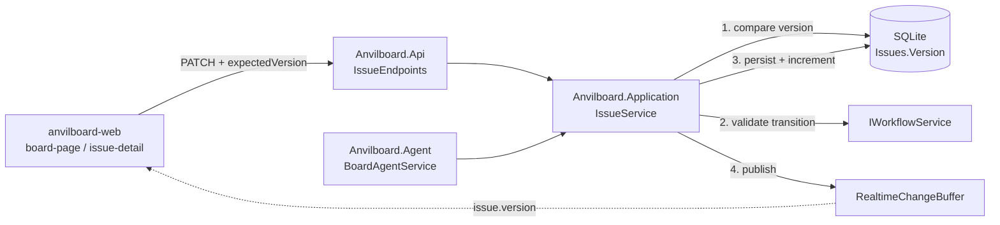
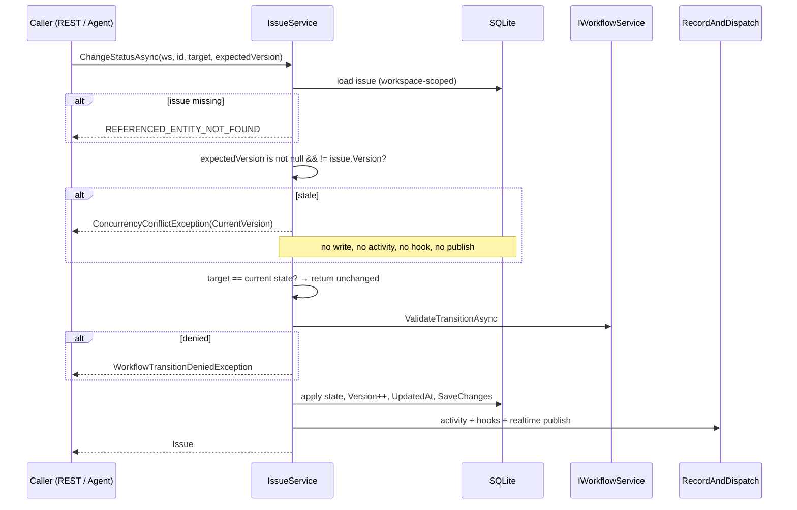

# Implementation Plan: Optimistic Concurrency Enforcement

> Feature-level technical design and execution plan for the **Major** gap in the
> `issue-board-service` component — the P0 SRS acceptance criterion (`FR-WRK-002` AC5) that
> is currently unimplemented in every layer.
> Canonical chain: [`prd.md`](../anvilboard/prd.md) → [`srs.md`](../anvilboard/srs.md) →
> [`tech-design.md`](../anvilboard/tech-design.md) → [`issue-board-service.md`](../features/issue-board-service.md).

## 1. Document Information

| Field | Value |
|---|---|
| Document | Implementation Plan — Optimistic Concurrency Enforcement |
| Feature component | [`issue-board-service`](../features/issue-board-service.md) |
| Milestone | [`tech-design.md`](../anvilboard/tech-design.md) §16 **M2: Configurable Workflow** (transition contract) / **M4: Automation Contract Normalization** (error taxonomy) |
| Audit findings | [`audit-report.md`](../audit-report.md) **MAJ-009** (primary) |
| SRS refs | `FR-WRK-002` (primary), `FR-AUT-001` + `FR-AUT-003` + `FR-WRK-003` (touched) |
| Acceptance criteria | `FR-WRK-002 AC5`, `FR-AUT-003 AC3`, tech-design `AC-004` |
| Status | **Implemented** — T1–T10 complete; `dotnet test Anvilboard.slnx` 581 passing, `npm test` 49 passing |
| Created | 2026-09-14 |

## 2. Why this feature was selected

The backlog lives in the feature index and the audit report, not in GitHub issues. Selecting "the
next feature" therefore means selecting the largest *verified* gap. The evidence:

| Signal | Finding |
|---|---|
| Open GitHub issues | `gh issue list --state open` → only `#41` "Dependency Dashboard" (Renovate bot). No feature work is tracked there. |
| Existing plans | All 8 documents in [`docs/plans/`](.) carry a `Status` row of **Implemented**/**Delivered**. No plan is unfinished, so a new one is genuinely required. |
| Unresolved Critical findings | **None.** CRIT-001, CRIT-002 and CRIT-003 are all marked RESOLVED. |
| Unresolved Major findings | 4 open after `audit-query-surface.md` closed MAJ-018: **MAJ-006**, **MAJ-009**, **MAJ-014**, **MAJ-020**. |
| Requirement priority | MAJ-009 is the only open finding whose gap is a **P0 SRS acceptance criterion** (`FR-WRK-002` AC5) that is *fully specified* — down to the error code, the response payload, and the one deliberate exemption — in both [`tech-design.md`](../anvilboard/tech-design.md) §7.7 and [`issue-board-service.md`](../features/issue-board-service.md) §Key Behaviors. Nothing needs to be designed from scratch; it needs to be built. |
| Failure class | MAJ-009 is a **silent data-loss** defect, not a missing convenience. Every other open finding is a missing capability whose absence is visible; a lost update is invisible to both writers. |
| Blast radius vs. effort | The change is confined to two service methods, two REST DTOs, two agent operations, and their callers. No schema migration, no new subsystem, no new dependency. |

### 2.1 Why not the other open findings

| Finding | Why deferred |
|---|---|
| MAJ-006 threaded comments | Needs a schema change (`Comment.ParentCommentId` — verified absent from all of `src/`), a migration, an API shape change, *and* a nesting/UX decision. The audit report itself offers "or re-scope the spec" as an acceptable resolution, so the requirement is not settled. |
| MAJ-014 outbound plugin events | A substantial new core→plugin pub/sub subsystem. The audit report's own status note narrows it but confirms no dispatch mechanism exists. Larger than one plan, and not blocking a P0 acceptance criterion. |
| MAJ-020 artifact lifecycle hooks | Already **partially resolved** — audit/activity emission is closed by `ArtifactService`; only the `IIssueHook` expansion path remains, and that is shared work with the hook infrastructure MAJ-014 also wants. Better sequenced after a hook-platform pass. |
| MIN-004 / MIN-010 | Minor severity; MIN-010 was deliberately narrowed rather than closed by the audit-query work and does not warrant a plan of its own. |

### 2.2 Verified current state

Claims below were checked against the working tree at `a105d7e`, not taken from the audit report.
Note that the audit report's MAJ-009 wording ("*not all* mutation paths validate/increment it",
"version-check logic present in some but not all") **overstates what exists**. The verified
position is stronger: the check is present in *none* of them.

| Claim | Verification |
|---|---|
| `Issue.Version` exists and is persisted | [`Issue.cs`](../../src/Anvilboard.Domain/Issue.cs) declares `public int Version { get; set; }`. The column ships in the `AddIssueWorkflowStateId` migration (`20260908100440`). |
| No production code ever *compares* a version | A solution-wide search for `expectedVersion` finds **zero** occurrences outside documentation. No service signature, no DTO, no endpoint, no agent operation accepts one. |
| `Version` is incremented in exactly three places, unconditionally | [`IssueService.cs`](../../src/Anvilboard.Application/Issues/IssueService.cs): `ChangeStatusAsync` (`issue.Version++`), `AssignAsync` (`issue.Version++`), and `UpsertFromExternalCoreAsync` (`issue.Version++`). `AddCommentAsync` does not touch it. |
| `CreateAsync` does not initialize `Version` to 1 | [`IssueService.cs`](../../src/Anvilboard.Application/Issues/IssueService.cs) `CreateAsync` builds the `Issue` object-initializer without a `Version` entry, so a new issue persists at `Version = 0`. [`issue-board-service.md`](../features/issue-board-service.md) step 4 of `CreateAsync` requires `Issue.Version = 1`. |
| The error code is catalogued but unreachable | [`ErrorCodeCatalog.cs`](../../src/Anvilboard.Application/Automation/ErrorCodeCatalog.cs) maps `["CONCURRENCY_CONFLICT"] = 409`. A solution-wide search for that string finds exactly **two** hits: that dictionary entry and its `ErrorCatalogTranslatorTests` `InlineData` row. **Zero production throw sites.** |
| Request DTOs carry no version | [`IssueEndpoints.cs`](../../src/Anvilboard.Api/Endpoints/IssueEndpoints.cs) declares `ChangeStatusRequest(Guid WorkflowStateId)` and `AssignRequest(Guid? AssigneeId)`. |
| Agent operations carry no version | [`BoardAgentService.cs`](../../src/Anvilboard.Agent/BoardAgentService.cs) `ChangeIssueStatusAsync(issueId, workflowStateId, idempotencyKey, ct)` and `AssignIssueAsync(issueId, idempotencyKey, assigneeId, ct)`. |
| The web client already *has* a version to send | [`models.ts`](../../src/anvilboard-web/src/app/core/models.ts) exposes `version: number` on `Issue`, and [`board-page.ts`](../../src/anvilboard-web/src/app/board/board-page/board-page.ts) already reasons about it (`current.version <= issue.version`) for realtime last-writer-wins coalescing. The client discards it on the way back out: `changeStatus(issueId, workflowStateId)` posts `{ workflowStateId }` only. |
| The **agent** client has no version to send | [`BoardAgentService.cs`](../../src/Anvilboard.Agent/BoardAgentService.cs) `IssueSummary` — the DTO every issue-returning agent operation yields — has no `Version` member. An agent cannot perform a conditional write today even in principle, so exposing it is a prerequisite rather than polish (`DR-CON-004`). |
| The exemption is already specified | [`issue-board-service.md`](../features/issue-board-service.md) states twice that `UpdateSessionStateAsync` "never reads or compares `Issue.Version`" and is "the one mutation path on this entity intentionally excluded". That method does not exist in `src/` yet, so the exemption costs nothing to honour now. |
| `AC-004`'s coverage exists, under a different name | Tech-design `AC-004` names `IssueServiceTests.RequestTransition_DisallowedTarget_ReturnsInvalidTransition`. No such file exists, but the scenario **is** covered — by `WorkflowEngineTests` in `Application.Tests/Workflows/`, which asserts `INVALID_WORKFLOW_TRANSITION` *and* an unchanged persisted `Version`. The gap is a stale doc reference, not missing coverage; §13.1 corrects the name rather than duplicating the test. |
| Existing tests pin `Version == 0` | `WorkflowEngineTests` asserts `Assert.Equal(0, unchanged.Version)` after a denied transition and `Assert.Equal(0, result.Version)` after a no-op. These build issues through the test fixture's object-initializer, **not** through `CreateAsync`, so `G5`'s new `Version = 1` seed does not touch them — a real risk worth confirming before assuming `G5` is free. |

The net position: the token is minted and incremented, it is published to clients over REST and
the realtime channel, the error code that reports a mismatch is catalogued and mapped to 409 —
and the comparison that would make any of it mean something was never written. Two humans dragging
the same card, or a human and an agent editing the same issue, silently clobber each other.

## 3. Overview

### 3.1 Background

`FR-WRK-002` AC5 is unambiguous:

> Conditional updates detect stale versions and return `CONCURRENCY_CONFLICT` with refresh guidance.

[`tech-design.md`](../anvilboard/tech-design.md) §7.7 elaborates: *"Expected version does not equal
the persisted version. Provide current version and instruct caller to refetch before retrying."*
§7.4 lists the concurrent-edit case explicitly: *"the losing writer receives `CONCURRENCY_CONFLICT`
with the current version and is expected to refetch and re-apply."*

This matters more for Anvilboard than for a typical tracker because of its stated purpose. The
product's pitch is that humans and coding agents work the same board through the same contract.
An agent that reads an issue, reasons for thirty seconds, and writes back is exactly the
long-read-modify-write window optimistic concurrency exists to protect — and the agent surface
today has no way to express "I am writing on the basis of what I read." `AgentIdempotency` protects
against the *same* request being applied twice; nothing protects against *two different* requests
being applied on top of the same stale read.

The gap is a correctness hole, not a polish item: the PRD's US-HUM-003 promise that "conflicting
edits show what changed" cannot hold when conflicts are not detected.

### 3.2 Goals

| # | Goal |
|---|---|
| G1 | Enforce `expectedVersion` on every caller-initiated field mutation of an `Issue` — today `ChangeStatusAsync` and `AssignAsync`. |
| G2 | Return `CONCURRENCY_CONFLICT` (HTTP 409) carrying the **current persisted version**, so the caller can refetch and retry without a second round trip to discover the version. |
| G3 | Keep REST and the agent surface behaviourally identical, per `FR-AUT-001` — the same stale write fails the same way through both. |
| G4 | Make the enforcement *uniform by construction*, so a future mutation method cannot silently omit the check. |
| G5 | Correct `CreateAsync` to seed `Version = 1`, closing the divergence from the feature spec's step 4. |
| G6 | Make the Angular client a good citizen: send the version it rendered, and recover from a conflict by refreshing rather than by failing silently. |
| G7 | Expose `Version` on the agent `IssueSummary` DTO, without which an agent has no way to obtain the token it is being asked to send. |

### 3.3 Non-Goals

| # | Non-goal | Rationale |
|---|---|---|
| N1 | Versioning `AddCommentAsync` | Comments are **additive**. Two concurrent comments are both correct and neither overwrites the other; the feature spec frames the concurrency envelope around field mutations. `AddCommentAsync` deliberately continues not to read or increment `Version`. |
| N2 | Versioning `UpdateSessionStateAsync` | Explicitly exempted by the feature spec (twice) so that frequent automated session-state writes do not churn the token. The method does not exist yet; this plan records the exemption so it is honoured when it is built. |
| N3 | Versioning the ingestion path (`UpsertFromExternalAsync` / `UpsertFromExternalUnscopedAsync`) | A webhook or poll has no client-supplied version to assert. Provider-versus-local divergence is a *different* failure with its own catalogued code — `SYNC_CONFLICT` — and its own resolution flow. The ingestion path keeps incrementing `Version` and keeps skipping the check. |
| N4 | Implementing `ResolveSyncConflictAsync` | Specified in the feature spec with an `expectedVersion` parameter, but the method does not exist in `src/` at all. Building it is a separate feature slice; §13.2 records that it must adopt the contract this plan establishes. |
| N5 | `PrePhaseChange`/`PostPhaseChange` hooks | Named alongside `expectedVersion` in the same "remain planned" note in the feature spec, but they are an independent capability with their own budget and denial semantics. Splitting them out keeps this plan reviewable. |
| N6 | Making `expectedVersion` mandatory | See `DR-CON-002`. Omitting it remains a legal last-writer-wins write; supplying it opts into the conditional contract. |
| N7 | A merge/diff UI showing *what* changed | US-HUM-003's "show what changed" affordance needs the conflict to be *detected* first. Detection is this plan; the diff view is a follow-up (§13.2). |

### 3.4 Scope

**Included**

- `IssueService.ChangeStatusAsync` and `IssueService.AssignAsync` accept `int? expectedVersion`.
- A new `ConcurrencyConflictException` carrying `ErrorCode` and `CurrentVersion`.
- `IssueService.CreateAsync` seeds `Version = 1`.
- REST: `ChangeStatusRequest` and `AssignRequest` gain `ExpectedVersion`; both `PATCH` handlers translate the exception to a 409 problem response with a `currentVersion` extension.
- Agent: `change-issue-status` and `assign-issue` gain an optional `expectedVersion`, included in the idempotency input hash; `IssueSummary` gains `Version`.
- Angular: `BoardApiService.changeStatus`/`assign` send the version; drag-drop and issue-detail callers pass the rendered issue's version and recover from 409 by refreshing.
- Tests across `Anvilboard.Application.Tests`, `Anvilboard.Api.Tests`, `Anvilboard.Agent.Tests`, and the web spec suite.

**Excluded**

- Everything in §3.3.
- Any schema migration (the column already exists; nothing about its type or mapping changes).
- Any `AgentContract.ApiVersion` bump — adding a property to a response record is additive (`DR-CON-004`).

### 3.5 User Scenarios

| # | Scenario |
|---|---|
| S1 | Two people have the board open. A drags `ANV-12` from *In Progress* to *Done*; B, looking at a stale render, drags the same card to *Blocked*. B's write is rejected with `CONCURRENCY_CONFLICT`, B's board refreshes, and B sees the card in *Done* rather than silently reverting A's move. |
| S2 | An agent calls `get-issue`, reasons, then calls `assign-issue` with `expectedVersion` thirty seconds later. A human reassigned the issue in the interim. The agent receives a 409 naming the current version, re-reads, and decides whether its instruction still applies instead of stomping the human. |
| S3 | A script written against the current API omits `expectedVersion` entirely. It keeps working exactly as before — last-writer-wins — because the field is optional (`DR-CON-002`). |
| S4 | A GitHub webhook syncs an upstream status change while a user is mid-edit. The webhook path is exempt (`N3`) and applies; the user's next conditional write then fails cleanly with the post-sync version rather than clobbering the synced value. |

### 3.6 Acceptance Criteria

| AC-ID | Priority | Criterion | Expected Result | Verification |
|---|---|---|---|---|
| `AC-CON-001` | P0 | `ChangeStatusAsync` called with `expectedVersion` equal to the persisted version. | Transition applies; `Version` increments by exactly 1. | `IssueServiceConcurrencyTests` |
| `AC-CON-002` | P0 | `ChangeStatusAsync` called with `expectedVersion` **less than** the persisted version. | Throws `ConcurrencyConflictException` with `ErrorCode == "CONCURRENCY_CONFLICT"` and `CurrentVersion` equal to the persisted version. | `IssueServiceConcurrencyTests` |
| `AC-CON-003` | P0 | `ChangeStatusAsync` called with a stale `expectedVersion`. | **Nothing persists**: `WorkflowStateId`, `Version`, `UpdatedAt` unchanged; no `ActivityEvent` written; no realtime envelope published; no `IIssueHook` invoked. | `IssueServiceConcurrencyTests` asserting persisted state and activity count |
| `AC-CON-004` | P0 | `AssignAsync` with a matching and then a stale `expectedVersion`. | Same pass/fail behaviour as `AC-CON-001`/`AC-CON-002`/`AC-CON-003`, including no `AssigneeChanged` activity on conflict. | `IssueServiceConcurrencyTests` |
| `AC-CON-005` | P0 | Either method called with `expectedVersion = null`. | Mutation applies unconditionally; behaviour byte-identical to today. | `IssueServiceConcurrencyTests` |
| `AC-CON-006` | P0 | The version check runs **before** workflow-transition validation and before the no-op short circuit. | A stale `expectedVersion` on a transition that is *also* workflow-invalid returns `CONCURRENCY_CONFLICT`, not `INVALID_WORKFLOW_TRANSITION`. A stale `expectedVersion` on a same-state (no-op) transition returns `CONCURRENCY_CONFLICT` rather than succeeding vacuously. | `IssueServiceConcurrencyTests` |
| `AC-CON-007` | P0 | `PATCH /api/issues/{id}/status` with a stale `expectedVersion`. | `409` problem response, `title == "CONCURRENCY_CONFLICT"`, body carries `currentVersion`, and `detail` instructs the caller to refetch. | `IssueConcurrencyEndpointTests` |
| `AC-CON-008` | P0 | `PATCH /api/issues/{id}/assignee` with a stale `expectedVersion`. | As `AC-CON-007`. | `IssueConcurrencyEndpointTests` |
| `AC-CON-009` | P0 | Agent `change-issue-status` / `assign-issue` with a stale `expectedVersion`. | Fails with the same `CONCURRENCY_CONFLICT` code as REST, and the idempotency key is **not** consumed — a corrected retry with the same key and a fresh `expectedVersion` succeeds. | `IssueConcurrencyOperationTests` |
| `AC-CON-010` | P0 | Two agent calls share one idempotency key but differ only in `expectedVersion`. | `IDEMPOTENCY_KEY_REUSED` — `expectedVersion` is a semantically significant input. | `IssueConcurrencyOperationTests` |
| `AC-CON-011` | P0 | A new issue is created. | `Version == 1` as persisted. | `IssueServiceConcurrencyTests` |
| `AC-CON-012` | P0 | `AddCommentAsync` and the ingestion upsert. | `AddCommentAsync` leaves `Version` unchanged; `UpsertFromExternalAsync` increments without requiring or accepting a version. Structural: neither signature exposes `expectedVersion`. | `IssueServiceConcurrencyTests` + reflection assertion |
| `AC-CON-013` | P1 | The board UI receives a 409 on a drag-drop status change. | The board refreshes to authoritative server state and surfaces a conflict message; the card does not remain in the optimistically-moved column. | `board-page.spec.ts` |
| `AC-CON-014` | P1 | Every `IssueService` method that mutates a caller-owned `Issue` field accepts `expectedVersion`. | Asserted structurally so a newly added mutation method fails the build rather than silently opting out (G4). | `IssueMutationContractTests` |
| `AC-CON-015` | P0 | An agent calls `get-issue`, then feeds the returned `Version` straight back into `change-issue-status` as `expectedVersion`. | Succeeds. The round trip is closed end-to-end on the agent surface — scenario S2 is reachable. `AgentContract.ApiVersion` remains `"1.0"`. | `IssueConcurrencyOperationTests` |

## 4. System Context



The loop is the point: the realtime channel and the REST read path both already hand the client a
`version`; this plan closes the loop by accepting it back on the write.

The check is placed in `IssueService` — not in the endpoint, not in the agent wrapper — because
`issue-board-service.md` §Purpose states the component "enforces every issue-level business rule
(workflow-transition validation, **optimistic concurrency**, workspace scoping) exactly once so the
web UI, REST API, CLI, and MCP surfaces can never observe divergent behavior." Duplicating the
comparison in two adapters would be the exact divergence that sentence forbids.

## 5. Solution Design

### 5.1 Solution A (Recommended) — Caller-supplied `expectedVersion`, explicit in-service comparison

Add `int? expectedVersion = null` to the mutating `IssueService` methods. Immediately after the
issue is loaded and before any other logic, compare it to `issue.Version` and throw
`ConcurrencyConflictException(currentVersion)` on mismatch. Adapters translate the exception; the
existing `ErrorCodeCatalog.HttpStatusFor("CONCURRENCY_CONFLICT") == 409` supplies the status.

This mirrors the shape the codebase already uses for the adjacent failure: `IWorkflowService`
denial becomes `WorkflowTransitionDeniedException(errorCode, message)`, which `IssueEndpoints`
catches and renders as a 409 problem. `IssueLinkException` follows the same pattern. A new
`ConcurrencyConflictException` is the third instance of an established idiom, not a new one — with
one addition: it carries `CurrentVersion` as typed data, because the spec requires the response to
*contain* the current version, not merely mention it in prose.

- **Pros**: Matches the specified semantics exactly (caller asserts what it read); no migration; no
  EF behaviour to reason about; the conflict is detectable and reportable *before* any hook runs or
  any activity is written; trivially testable; identical across REST/CLI/MCP by construction.
- **Cons**: The guard is written by hand in each mutation method, so a future method could omit it
  — mitigated by `AC-CON-014`'s structural test.

### 5.2 Solution B (Alternative) — EF Core native concurrency token

Map `Version` with `builder.Property(i => i.Version).IsConcurrencyToken()` in
`IssueConfiguration`, let EF append `WHERE Version = @original` to the `UPDATE`, and translate the
resulting `DbUpdateConcurrencyException`.

- **Pros**: Enforcement is declarative and cannot be forgotten by a new mutation method.
- **Cons**: **It does not detect the failure this requirement is about.** EF's "original value" is
  the value loaded into *this* `DbContext` instance, not the value the HTTP client read minutes
  ago. Every mutation here loads the issue fresh inside the same short-lived scoped context and
  saves microseconds later, so `@original` always equals the row's current value and the `UPDATE`
  always matches. It would catch a write racing inside that microsecond window — a genuine but
  vanishingly rare concern — while the read-modify-write-across-requests case that `FR-WRK-002` AC5
  actually names sails straight through. It also surfaces a framework exception after `SaveChanges`,
  by which point `RecordAndDispatchAsync` sequencing and hook invocation must be unwound.

### 5.3 Comparison Matrix

| Criterion | A: explicit `expectedVersion` | B: EF concurrency token |
|---|---|---|
| Detects cross-request stale writes (the actual requirement) | ✅ | ❌ |
| Detects intra-context races | ➖ (not a real scenario here) | ✅ |
| Returns the current version to the caller | ✅ typed on the exception | ⚠️ requires a re-read after the failure |
| Fails before side effects (activity, hooks, realtime) | ✅ | ❌ fails at `SaveChanges` |
| Requires a migration | ❌ none | ❌ none (mapping-only) |
| Cannot be forgotten by a new method | ❌ (mitigated by `AC-CON-014`) | ✅ |
| Matches the documented contract in `issue-board-service.md` step 2 | ✅ verbatim | ❌ no caller-supplied value exists |
| Behavioural parity across REST/CLI/MCP | ✅ enforced once in the service | ✅ |

### 5.4 Decision & Rationale

**Solution A.** B is disqualified on the first row: it is a well-known EF feature that solves a
different problem. The requirement is *conditional update* — the caller asserting the state it
based its decision on — and only a caller-supplied token can express that. B's single genuine
advantage (impossible to forget) is recovered cheaply by `AC-CON-014`'s reflection test, which
converts the discipline into a build-time failure.

The two are not mutually exclusive; B could be layered on later as belt-and-braces. It is not
layered on now because it would add an exception path with no scenario that currently reaches it.

## 6. Architecture Design



Ordering is load → **version** → no-op short circuit → workflow validation → persist. Two placements
are deliberate and both are asserted by `AC-CON-006`:

1. **Before workflow validation.** A caller writing on a stale read may be requesting a transition
   that is invalid *only because* of the state it did not see. Reporting
   `INVALID_WORKFLOW_TRANSITION` would send it to fix a workflow configuration when the real
   instruction is "refetch and reconsider". The more fundamental failure wins.
2. **Before the `issue.WorkflowStateId == targetStateId` early return.** `ChangeStatusAsync`
   currently returns the issue unchanged when it is already in the target state. If the version
   check sat after it, a stale caller requesting the state a *concurrent* writer had already moved
   the issue to would receive a silent success — precisely the lost update this plan exists to
   prevent, and the most confusing possible variant of it.

## 7. Technology Stack & Conventions

### 7.1 Stack

No additions. .NET 10, EF Core + SQLite, ASP.NET Core minimal APIs, Angular 20 standalone
components with signals, xUnit.

### 7.2 Naming Conventions

| Element | Convention | Value |
|---|---|---|
| Service parameter | camelCase, optional trailing | `int? expectedVersion = null` |
| REST DTO property | PascalCase on the record, camelCase on the wire | `ExpectedVersion` / `expectedVersion` |
| Agent parameter | camelCase, optional | `int? expectedVersion = null` |
| Exception | `{Condition}Exception`, matching `WorkflowTransitionDeniedException` | `ConcurrencyConflictException` |
| Error code | UPPER_SNAKE_CASE from the §7.7 catalog | `CONCURRENCY_CONFLICT` |
| Problem extension | camelCase | `currentVersion` |

### 7.3 Parameter Validation & Input Parsing

| Input | Rule | On violation |
|---|---|---|
| `expectedVersion` omitted / `null` | Legal. Unconditional write. | — |
| `expectedVersion` negative | Cannot match any persisted version (`Version` starts at 1). | `CONCURRENCY_CONFLICT` — *not* `VALIDATION_FAILED`; see `DR-CON-003`. |
| `expectedVersion` greater than persisted | The caller read a version this server never issued. | `CONCURRENCY_CONFLICT` with the real current version. |
| `expectedVersion` non-integer on the wire | Rejected by model binding before the handler runs. | `400` from the framework |

The check is `expectedVersion is int expected && expected != issue.Version`. Ordinary `int`
equality; no tolerance, no ranges.

### 7.4 Boundary Values & Edge Cases

| Case | Behaviour |
|---|---|
| `expectedVersion = 0` against a legacy row still at `0` | Matches. Rows created before `G5` persist at `0` and remain writable; `Version` is compared, never range-checked, so no backfill is required (`DR-CON-005`). |
| `expectedVersion = 1` against a newly created issue | Matches, once `G5` lands. |
| Issue not found | `REFERENCED_ENTITY_NOT_FOUND` (existing behaviour) — precedes the version check, since there is no version to compare against. |
| Workspace-scope denial | `WORKSPACE_ACCESS_DENIED` from `RestWorkspaceScope`/agent scope — precedes everything, including the load. A stale version must never be a channel for confirming an issue exists in another workspace. |
| No-op transition with a matching version | Returns unchanged, `Version` not incremented (existing behaviour preserved). |
| Conflict on the agent surface | Idempotency key **not** consumed: `AgentIdempotency` commits only after the mutation succeeds, so a throw leaves the key free (`AC-CON-009`). |
| Overflow of `int` | 2.1 billion mutations of a single issue in a local-first tracker. Not defended against. |

### 7.5 Business Logic Rules

| # | Rule |
|---|---|
| BR1 | `expectedVersion` is **optional**. Supplying it opts into a conditional write; omitting it is a last-writer-wins write and remains fully supported (`DR-CON-002`). |
| BR2 | The comparison happens **after** workspace scoping and issue load, and **before** every other decision in the method. |
| BR3 | A conflict produces **no** side effect of any kind: no field write, no `Version` increment, no `UpdatedAt` touch, no `ActivityEvent`, no `IIssueHook` invocation, no realtime envelope. |
| BR4 | `Version` increments by exactly 1 per successful caller-initiated field mutation — unchanged from today. |
| BR5 | `AddCommentAsync` neither reads nor increments `Version`. Comments are additive and cannot conflict (`N1`). |
| BR6 | `UpdateSessionStateAsync`, when built, neither reads nor increments `Version` — the single documented exemption (`N2`). |
| BR7 | The ingestion path increments `Version` and never compares it. Provider-versus-local divergence is `SYNC_CONFLICT`, a different code with a different flow (`N3`). |
| BR8 | `CreateAsync` seeds `Version = 1` (`G5`). |
| BR9 | The conflict response **must** carry the current persisted version. Forcing the caller into an extra `GET` to learn it would contradict tech-design §7.7's "provide current version". |

### 7.6 Error Handling Strategy

`ConcurrencyConflictException` derives from `InvalidOperationException`, exactly as
`WorkflowTransitionDeniedException` and `IssueLinkException` do, and carries `ErrorCode` plus
`CurrentVersion`. Each adapter catches it at its own boundary:

- **REST** — a `catch` beside the existing `WorkflowTransitionDeniedException` handler, rendering
  `Results.Problem(title: ex.ErrorCode, detail: …, statusCode: ErrorCodeCatalog.HttpStatusFor(ex.ErrorCode), extensions: new Dictionary<string, object?> { ["currentVersion"] = ex.CurrentVersion })`.
  Using `ErrorCodeCatalog.HttpStatusFor` rather than a literal `StatusCodes.Status409Conflict`
  follows the newer precedent set by the `ActivityQueryException` handler and keeps the catalog the
  single source of truth.
- **Agent** — propagates through `AgentIdempotency.ExecuteAsync` uncaught, so the key is not
  committed and the host's standard error envelope reports the code.

### 7.7 Error Catalog & Traceability

| Code | HTTP | Already in `ErrorCodeCatalog`? | First production throw site |
|---|---|---|---|
| `CONCURRENCY_CONFLICT` | 409 | ✅ mapped, zero throw sites today | `IssueService.ChangeStatusAsync` / `AssignAsync` (this plan) |
| `INVALID_WORKFLOW_TRANSITION` | 409 | ✅ | `WorkflowTransitionDeniedException` (existing) |
| `REFERENCED_ENTITY_NOT_FOUND` | 404 | ✅ | existing |
| `WORKSPACE_ACCESS_DENIED` | 403 | ✅ | existing |
| `IDEMPOTENCY_KEY_REUSED` | 409 | ✅ | existing |

No catalog entry is added. This plan is the first consumer of one that was written down and never
wired up.

## 8. Detailed Design

### 8.1 Contracts

```csharp
// src/Anvilboard.Application/Issues/ConcurrencyConflictException.cs  (new)

namespace Anvilboard.Application.Issues;

/// <summary>
/// Signals that a conditional mutation was rejected because the caller's <c>expectedVersion</c>
/// did not match the persisted <see cref="Issue.Version"/> — the caller acted on a stale read.
/// Carries <see cref="CurrentVersion"/> so the adapter can hand the caller the value it needs to
/// refetch and retry without a second round trip (tech-design §7.7).
/// </summary>
public sealed class ConcurrencyConflictException(int expectedVersion, int currentVersion)
    : InvalidOperationException(
        $"Expected version {expectedVersion} but the issue is at version {currentVersion}. " +
        "Refetch the issue and re-apply the change.")
{
    public string ErrorCode { get; } = "CONCURRENCY_CONFLICT";
    public int ExpectedVersion { get; } = expectedVersion;
    public int CurrentVersion { get; } = currentVersion;
}
```

```csharp
// src/Anvilboard.Application/Issues/IssueService.cs  (modified signatures)

public async Task<Issue> ChangeStatusAsync(
    WorkspaceId workspaceId, IssueId id, WorkflowStateId targetStateId,
    MemberId? actorId = null, int? expectedVersion = null, CancellationToken ct = default);

public async Task<Issue> AssignAsync(
    WorkspaceId workspaceId, IssueId id, MemberId? assigneeId = null,
    MemberId? actorId = null, int? expectedVersion = null, CancellationToken ct = default);
```

`expectedVersion` is inserted **before** `ct` and after `actorId`, preserving the codebase's
convention that `CancellationToken ct = default` is last. The four production call sites divide:

| Call site | Current form | Effect of the insertion |
|---|---|---|
| `IssueEndpoints.cs` ×2 | `…, targetStateId, ct: ct)` — `ct` named | Source-compatible; updated anyway to pass `request.ExpectedVersion`. |
| `BoardAgentService.cs` ×2 | `…, actor.MemberId, ct)` — `ct` **positional** | **Breaks the build**, because `ct` would bind to `int? expectedVersion`. This is the desired outcome: the compiler forces the agent surface to be updated rather than letting it silently keep passing no version. |

Test call sites in `WorkflowEngineTests` and `IssueServiceRealtimePublicationTests` omit `ct`
entirely and are unaffected.

```csharp
// src/Anvilboard.Api/Endpoints/IssueEndpoints.cs  (modified DTOs)

public sealed record ChangeStatusRequest(Guid WorkflowStateId, int? ExpectedVersion = null);
public sealed record AssignRequest(Guid? AssigneeId, int? ExpectedVersion = null);
```

Both gain a defaulted trailing property, so existing bodies that omit it continue to bind.

### 8.2 Core Workflow — the guard

```csharp
var issue = await db.Issues.InWorkspace(db, workspaceId).FirstOrDefaultAsync(i => i.Id == id, ct)
    ?? throw new InvalidOperationException($"Issue {id} does not exist.");

// BR2/BR3: before the no-op short circuit and before transition validation, so a stale caller
// is told to refetch rather than being handed a vacuous success or a misleading workflow error.
if (expectedVersion is int expected && expected != issue.Version)
{
    throw new ConcurrencyConflictException(expected, issue.Version);
}

if (issue.WorkflowStateId == targetStateId)
{
    return issue;
}
// … unchanged from here
```

Because the throw precedes `SaveChangesAsync`, `RecordAndDispatchAsync`, and
`PublishRealtimeAsync`, `BR3` holds structurally rather than by cleanup.

### 8.3 Uniformity guard (`G4`, `AC-CON-014`)

`IssueMutationContractTests` reflects over `IssueService`'s public methods and asserts, against an
explicit allow-list, that each is classified correctly:

| Classification | Members | Required shape |
|---|---|---|
| Conditional mutation | `ChangeStatusAsync`, `AssignAsync` | **must** declare `int? expectedVersion` |
| Exempt mutation | `AddCommentAsync`, `CreateAsync`, `UpsertFromExternalAsync`, `UpsertFromExternalUnscopedAsync` | **must not** declare it, with the exempting rule cited in the test |
| Read | `GetAsync`, `ListAsync`, `ListCommentsAsync` | ignored |

A new public method on `IssueService` appears in neither list and fails the test, forcing an
explicit decision. This is the mechanism that converts Solution A's one weakness into a build error.

## 9. API Design

### 9.1 Overview

| Method | Route | Change |
|---|---|---|
| `PATCH` | `/api/issues/{id}/status` | Body accepts optional `expectedVersion`; may now return `409 CONCURRENCY_CONFLICT` |
| `PATCH` | `/api/issues/{id}/assignee` | Same |

Permissions are unchanged (`ReadWriteIssues`, `ReadWriteAssignedIssues`). No new route, no new
group, no `Program.cs` change.

### 9.2 Request Contract

```jsonc
// PATCH /api/issues/{id}/status
{ "workflowStateId": "9c1e…", "expectedVersion": 7 }

// PATCH /api/issues/{id}/assignee
{ "assigneeId": "4b2a…", "expectedVersion": 7 }
```

Conflict response:

```jsonc
// 409
{
  "title": "CONCURRENCY_CONFLICT",
  "status": 409,
  "detail": "Expected version 7 but the issue is at version 9. Refetch the issue and re-apply the change.",
  "currentVersion": 9
}
```

`currentVersion` is a problem-details extension rather than a bespoke body, keeping the response
shape consistent with every other error this API emits.

### 9.3 Agent Contract

```csharp
[AgentOperation("change-issue-status", "Changes the workflow state of an issue", Category = "issues")]
[RequiresAgentPermission(Permission.ReadWriteIssues, Permission.ReadWriteAssignedIssues)]
public async Task<AgentResponse<IssueSummary>> ChangeIssueStatusAsync(
    Guid issueId, Guid workflowStateId, string idempotencyKey,
    int? expectedVersion = null, CancellationToken cancellationToken = default)
{
    var summary = await idempotency.ExecuteAsync(
        "change-issue-status", idempotencyKey, [issueId, workflowStateId, expectedVersion],
        …);
}
```

`expectedVersion` joins the `requestInputs` array (`AC-CON-010`): replaying one key with a
different expected version is a different intent and must surface as `IDEMPOTENCY_KEY_REUSED`
rather than silently returning the first attempt's result. `assign-issue` changes identically.

`IssueSummary` gains a `Version` member so agents can read the token they are expected to send
(`G7`, `DR-CON-004`):

```csharp
public sealed record IssueSummary(
    Guid Id, Guid TeamId, string Key, string Title, string? Description,
    IssueStatus Status, Guid WorkflowStateId, int Version, IssuePriority Priority,
    …)
{
    public static IssueSummary FromIssue(Issue issue) => new(
        …, issue.WorkflowStateId.Value, issue.Version, issue.Priority, …);
}
```

`Version` is positioned beside `WorkflowStateId` — the field it guards — rather than appended.
`IssueSummary` is constructed in exactly one place (`FromIssue`), so positional insertion is safe
and the diff stays confined.

Neither operation is idempotent-by-read, so neither is added to `OperationsWithoutIdempotencyKey`;
`AgentCatalogInvariantsTests` needs no change beyond continuing to pass.

## 10. Data & Storage Design

**No migration.** `Issues.Version` is an existing `INTEGER NOT NULL` column shipped in
`20260908100440_AddIssueWorkflowStateId`. Nothing about its type, nullability, mapping, or indexing
changes. `IssueConfiguration` is untouched (Solution B, which *would* have touched it, was
rejected).

Existing rows keep whatever version they hold. `G5` changes the seed for *new* issues only; because
`Version` is only ever compared for equality and incremented, a mixed population of `0`- and
`1`-based rows is harmless and no backfill is warranted (`DR-CON-005`).

## 11. Security Design

- Workspace scoping is unchanged and still runs **first**. A caller cannot probe another workspace's
  issues by guessing versions: the scope check fails before the issue is loaded, so a
  cross-workspace request yields `WORKSPACE_ACCESS_DENIED` regardless of the version supplied.
- The conflict response discloses only the current version of an issue the caller is already
  authorized to read and write. No new information is exposed.
- Permissions are unchanged; no permission is added, widened, or removed.
- The feature *strengthens* the accountability story: a rejected stale write produces no
  `ActivityEvent`, so the activity trail stops implying that a write which never happened did.

## 12. Testing Strategy

| Project | File | Covers |
|---|---|---|
| `Anvilboard.Application.Tests` | `Workflows/IssueServiceConcurrencyTests.cs` (new, beside `WorkflowEngineTests.cs` so it shares `WorkflowFixture`) | `AC-CON-001`…`AC-CON-006`, `AC-CON-011`, `AC-CON-012` |
| `Anvilboard.Application.Tests` | `Issues/IssueMutationContractTests.cs` (new) | `AC-CON-014` |
| `Anvilboard.Api.Tests` | `Issues/IssueConcurrencyEndpointTests.cs` (new, beside `IssueActivityEndpointTests.cs`, via `ApiFactory`) | `AC-CON-007`, `AC-CON-008` |
| `Anvilboard.Agent.Tests` | `IssueConcurrencyOperationTests.cs` (new) | `AC-CON-009`, `AC-CON-010`, `AC-CON-015` |
| `anvilboard-web` | `board/board-page/board-page.spec.ts` | `AC-CON-013` |

Service tests reuse the existing `WorkflowFixture` (`Application.Tests/Workflows/`), which already
builds a real SQLite-backed `DbContext`, a workflow graph, and an `IssueService` via
`CreateIssueService(fixture)` — the exact harness `WorkflowEngineTests` uses for these two methods.
No new fixture is written.

`AC-CON-003` is the test that matters most and needs a deliberate fixture: after the expected
throw, re-read the issue **through a fresh `DbContext`** and assert `WorkflowStateId`, `Version`,
and `UpdatedAt` are untouched, *and* assert `db.ActivityEvents.Count()` is unchanged. Asserting only
the exception would pass even if the write had partially landed and been rolled back inconsistently.

`AC-CON-006` needs two fixtures that are easy to omit: (a) a stale version on a transition that is
*also* workflow-invalid, asserting the returned code is `CONCURRENCY_CONFLICT`; and (b) a stale
version on a same-state request, asserting it conflicts rather than returning the unchanged issue.
Without (b) the guard could be placed after the early return and every other test would still pass.

`AC-CON-012` is asserted structurally by reflecting over the `AddCommentAsync` and
`UpsertFromExternal*` signatures, so a future "consistency" refactor that adds `expectedVersion` to
the additive or ingestion paths fails the build rather than quietly violating `N1`/`N3`.

**Existing tests that must keep passing unchanged.** `WorkflowEngineTests` asserts
`Assert.Equal(0, unchanged.Version)` after a denied transition and `Assert.Equal(0, result.Version)`
after a no-op; `IssueServiceRealtimePublicationTests` exercises both mutation methods. All of these
construct issues through the fixture's object-initializer rather than `CreateAsync`, so `G5`'s new
seed does not perturb them, and all omit `ct`, so the new optional parameter does not either. If any
of these assertions starts failing, the guard has been placed wrongly — they are a useful tripwire,
not just a regression cost.

Verification commands:

```powershell
dotnet test src\Anvilboard.Application.Tests\Anvilboard.Application.Tests.csproj
dotnet test src\Anvilboard.Api.Tests\Anvilboard.Api.Tests.csproj
dotnet test src\Anvilboard.Agent.Tests\Anvilboard.Agent.Tests.csproj
dotnet test Anvilboard.slnx   # full regression
```

```powershell
cd src\anvilboard-web
npm test -- --watch=false
npm run build
```

Baseline to hold or exceed, measured on a clean tree at `a105d7e` rather than quoted from an
earlier document:

| Project | Passing |
|---|---|
| `Anvilboard.Application.Tests` | 298 |
| `Anvilboard.Api.Tests` | 127 |
| `Anvilboard.Agent.Tests` | 74 |
| `Anvilboard.Infrastructure.Tests` | 41 |
| `Anvilboard.Integrations.GitHub.Tests` | 12 |
| `Anvilboard.Integrations.Linear.Tests` | 5 |
| **.NET total** | **557** |
| `anvilboard-web` (`vitest`, 6 files) | **44** |

`tests/Anvilboard.IntegrationTests` builds but contains no discoverable tests; `dotnet test` reports
"No test is available" for it, which is expected and not a regression.

Note that `src/anvilboard-web` requires `npm ci` before `npm test` in a fresh worktree — the
`@angular/build:unit-test` builder resolves from `node_modules` and the suite fails to start
without it.

## 13. Milestones & Task Breakdown

| # | Task | Files | Depends on | Status |
|---|---|---|---|---|
| **T1** | `ConcurrencyConflictException` | `Application/Issues/ConcurrencyConflictException.cs` | — | Done |
| **T2** | Guard in `ChangeStatusAsync` + `AssignAsync`; `expectedVersion` parameters; `CreateAsync` seeds `Version = 1` | `Application/Issues/IssueService.cs` | T1 | Done |
| **T3** | REST DTOs + 409 translation on both `PATCH` handlers | `Api/Endpoints/IssueEndpoints.cs` | T2 | Done |
| **T4** | Agent `expectedVersion` on `change-issue-status` / `assign-issue`, added to `requestInputs`; `IssueSummary.Version` + `FromIssue` | `Agent/BoardAgentService.cs` | T2 | Done |
| **T5** | Angular: `BoardApiService.changeStatus`/`assign` send the version; drag-drop and issue-detail pass it; 409 → refresh + conflict message | `anvilboard-web/src/app/core/board-api.service.ts`, `board/board-page/board-page.ts`, `board/issue-detail/issue-detail.ts` | T3 | Done |
| **T6** | Service + contract tests | `Application.Tests/Workflows/IssueServiceConcurrencyTests.cs`, `Application.Tests/Issues/IssueMutationContractTests.cs` | T2 | Done |
| **T7** | API tests | `Api.Tests/Issues/IssueConcurrencyEndpointTests.cs` | T3 | Done |
| **T8** | Agent tests | `Agent.Tests/IssueConcurrencyOperationTests.cs` | T4 | Done |
| **T9** | Web spec | `anvilboard-web/src/app/board/board-page/board-page.spec.ts` | T5 | Done |
| **T10** | Documentation updates | see §13.1 | T6–T9 | Done |

### 13.1 Canonical documents to update on completion

| Document | Change |
|---|---|
| [`docs/features/issue-board-service.md`](../features/issue-board-service.md) | `Status` row: drop "optimistic concurrency (`Issue.Version`) is not enforced on every mutation path"; re-stamp `Last verified` with the delivery commit and new test totals; add this plan to the front matter. Amend the "Current progress" note (§Key Behaviors) so `expectedVersion` is no longer listed as "remain planned" alongside the hooks — the hooks alone remain. Record that the check precedes both transition validation and the no-op short circuit. |
| [`docs/audit-report.md`](../audit-report.md) | Mark **MAJ-009** RESOLVED with a resolution note and a `Plan:` link here; update the Findings summary (line 53) from "Open (5)" to "Open (3): MAJ-006, MAJ-014, MAJ-020" and the resolved count. Correct the finding's Evidence line, which claims the check is "present in some but not all" methods — it was present in none (§2.2). **Also fix the pre-existing staleness found while writing this plan**: the same summary still counts MAJ-018 as open although [`audit-query-surface.md`](./audit-query-surface.md) closed it, so the line is wrong on two counts. |
| [`docs/anvilboard/tech-design.md`](../anvilboard/tech-design.md) | `AC-004`'s verification method names `IssueServiceTests.RequestTransition_DisallowedTarget_ReturnsInvalidTransition`, which has never existed; the scenario is covered by `WorkflowEngineTests` (§2.2). Repoint the reference at the real test. |
| [`docs/features/overview.md`](../features/overview.md) | Row 3: remove "uniform `Issue.Version` enforcement (`MAJ-009`)" from the outstanding list, leaving threaded comments (`MAJ-006`); add this plan alongside the board-parity plan link. |
| [`src/Anvilboard.Domain/Issue.cs`](../../src/Anvilboard.Domain/Issue.cs) | Fix the stale XML doc on `Version` — "incremented by the **future** Issue & Board Service" — to describe the token and name the two exempt paths. |
| [`CHANGELOG.md`](../../CHANGELOG.md) | Entry under the appropriate heading. |

### 13.2 Deliberate follow-ups (not this plan)

| # | Follow-up | Tracked by |
|---|---|---|
| F1 | `ResolveSyncConflictAsync(issueId, resolution, expectedVersion, ct)` — must adopt `ConcurrencyConflictException` and this parameter placement when built. | `issue-board-service.md` §Interfaces |
| F2 | `UpdateSessionStateAsync` + `PATCH /api/issues/{id}/session-state` — must honour the `N2` exemption. | `issue-board-service.md`, `FR-WRK-006` |
| F3 | `PrePhaseChange`/`PostPhaseChange` hooks — the other half of the "remain planned" note. | `AC-IBS-111`, `AC-IBS-112` |
| F4 | A conflict UI that shows *what* changed, completing US-HUM-003's promise now that detection exists. | PRD US-HUM-003 |
| F5 | Threaded comments (MAJ-006), outbound plugin events (MAJ-014), artifact expansion hooks (MAJ-020) — the three Major findings left open. | `audit-report.md` |

## 14. Open Questions & Decision Records

| ID | Decision |
|---|---|
| `DR-CON-001` | **Explicit caller-supplied `expectedVersion`, not an EF concurrency token.** EF's original-value tracking compares against the value loaded in the *current* short-lived `DbContext`, not the value the client read across an earlier request, so it cannot detect the read-modify-write staleness `FR-WRK-002` AC5 describes. See §5.4. |
| `DR-CON-002` | **`expectedVersion` is optional, not required.** SRS AC5 says *"**conditional** updates detect stale versions"* — conditionality is the caller's choice. Making it mandatory would break every existing REST and agent caller for a requirement that never asked for it, and would make the *unconditional* write — legitimate for bulk and administrative operations — inexpressible. Revisit only if lost updates are observed from callers that could have opted in. |
| `DR-CON-003` | **A negative or out-of-range `expectedVersion` returns `CONCURRENCY_CONFLICT`, not `VALIDATION_FAILED`.** It is a well-formed integer that simply does not match; the caller's correct remedy — refetch and retry — is identical to any other mismatch, and reporting it as a validation error would send them to inspect their serialization instead. |
| `DR-CON-004` | **`IssueSummary` (the agent DTO) gains `Version`.** It is currently absent, which means an agent calling `get-issue` has no way to obtain a version and therefore *cannot* perform a conditional write at all — scenario S2 would be unreachable without this. Adding a property to a response record is **additive**: existing agents ignore the new field, so `AgentContract.ApiVersion` stays at `1.0`. Telling agents to discover the version from a conflict response instead was rejected: it would require every agent to deliberately lose a write before it could protect one. |
| `DR-CON-005` | **No backfill of pre-existing `Version = 0` rows.** `Version` is only compared for equality and incremented; a mixed `0`/`1`-based population is behaviourally identical. A data migration to satisfy an aesthetic invariant would carry more risk than the inconsistency it removes. |
| `DR-CON-006` | **The version check precedes the no-op short circuit.** Placing it after would let a stale caller requesting the state a concurrent writer had *already* applied receive a silent success — the worst variant of the lost update this plan prevents. Asserted by `AC-CON-006`. |
| `OQ-CON-001` | Should the Angular client send `expectedVersion` on *every* mutation, or only on drag-drop (where two users racing is most likely)? The plan assumes **every** mutation, because a partial rollout makes the conflict behaviour unpredictable to users. Revisit if the refresh-on-conflict flow proves disruptive for low-contention edits. |
| `OQ-CON-002` | Should `ConcurrencyConflictException` live in `Anvilboard.Application/Issues/` or a shared location, given that artifacts, workflow states, and integrations may eventually need the same guard? Scoped to `Issues/` now, matching `IssueLinkException` and `WorkflowTransitionDeniedException`. Promote to a shared namespace at the second consumer, not in anticipation of one. |
