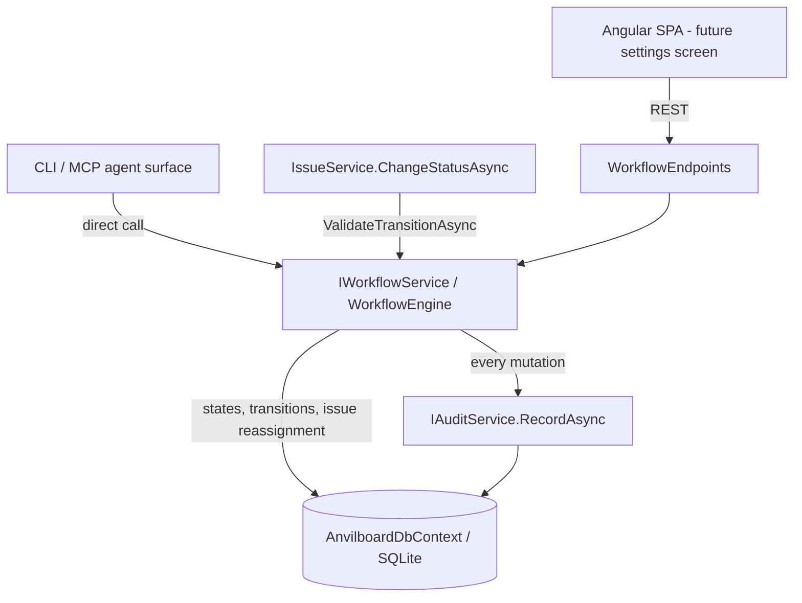

# Implementation Plan: Workflow Admin Surface & Workflow Audit Events

> Feature-level technical design and execution plan for the highest-ranked **open** capability gap
> in Anvilboard: administrators cannot read or change their workspace's workflow, and the workflow
> mutations that do exist are invisible to the audit trail.
> Canonical chain: [`prd.md`](../anvilboard/prd.md) → [`srs.md`](../anvilboard/srs.md) →
> [`tech-design.md`](../anvilboard/tech-design.md) →
> [`workflow-engine.md`](../features/workflow-engine.md).

## 1. Document Information

| Field | Value |
|---|---|
| Document | Implementation Plan — Workflow Admin Surface & Workflow Audit Events |
| Feature component | [`workflow-engine`](../features/workflow-engine.md) |
| Milestone | [`tech-design.md`](../anvilboard/tech-design.md) §16 **M2: Configurable Workflow** |
| Audit findings | [`audit-report.md`](../audit-report.md) **MAJ-003**, **MAJ-004**, **MAJ-005** (priority action #5) |
| SRS refs | `FR-WS-002` (primary), `FR-WS-003` (touched), `FR-OPS-001` (touched), `NFR-SEC-002` (touched) |
| Acceptance criteria | `FR-WS-002 AC1`, `FR-WS-002 AC2`, `FR-WS-002 AC3`, `FR-WS-002 AC4` |
| Status | **Implemented** |
| Created | 2026-09-12 |

## 2. Why this feature was selected

The backlog lives in the feature index and the audit report, not in GitHub issues — the same
rationale recorded in [`artifact-service.md`](./artifact-service.md) §2 still holds. Selecting "the
next feature" therefore means selecting the highest-ranked verified gap.

| Signal | Finding |
|---|---|
| Open GitHub issues | `gh issue list --state open` → only #41 (Renovate Dependency Dashboard). No feature work is tracked there. |
| Unresolved Critical findings | **None.** CRIT-001 (backup/restore), CRIT-002 (realtime), and CRIT-003 (`ArtifactService`) are all marked **RESOLVED**. |
| Highest open priority action | [`audit-report.md`](../audit-report.md) "Recommended Priority Actions" #5 — *"Add workflow admin transition/config CRUD surface plus audit-event emission on workflow mutations — fixes MAJ-003, MAJ-004, MAJ-005 — medium"*. Actions 1–4, 6, and 10 are struck through; 5 is the first open row. |
| Priority | `FR-WS-002` is **P0**, as is the owning component. Every other open action serves a P1 component or a smaller P0 slice (#9 `QueryAsync`, "small"). |
| Milestone status | **M2** is the earliest still-`Partial` milestone in §16, and this is the only work blocking it. |
| Blocking relationship | `workflow-engine.md` is listed as a dependency of `issue-board-service` and `agent-and-automation-surface`; its configuration half being unbuilt is what keeps `MIN-003` (legacy `IssueStatus` API surface) unresolvable. |

### 2.1 Verified current state

Every row below was confirmed by reading the code in this worktree at commit `4de5442`, not
inferred from the specs.

| Claim | Evidence |
|---|---|
| No workflow configuration surface exists on **any** adapter | `src/Anvilboard.Api/Endpoints/` holds Artifact, Auth, Backup, Dashboard, Issue, Team, and Webhook endpoints — there is no `WorkflowEndpoints.cs`, and `Program.cs` maps no workflow group. `BoardAgentService` exposes 13 operations across the `issues`, `dashboard`, and `backup` categories — none for workflow. |
| `Permission.ManageWorkflowStates` is declared but dead | It is defined in [`Permission.cs`](../../src/Anvilboard.Domain/Permission.cs) and granted to `Administrator` in `RolePermissionMap`, yet a repository-wide search finds **zero** other references. Nothing in the system can currently require it. |
| Transitions are write-once, by migration | `WorkflowTransition` rows are produced only by the seed migration `20260908093300_AddWorkflowStates.cs` and `WorkspaceAuthorizationService.CreateDefaultWorkflowTransitions` at workspace bootstrap. No runtime code path ever adds or removes one. |
| The service contract has no read or update operations | [`IWorkflowService`](../../src/Anvilboard.Application/Workflows/IWorkflowService.cs) declares exactly three members: `ValidateTransitionAsync`, `CreateWorkflowStateAsync`, `ArchiveWorkflowStateAsync`. There is no list, no update, and nothing for transitions at all — even though `workflow-engine.md`'s own lifecycle diagram already names `UpdateWorkflowStateAsync`. |
| Workflow mutations emit nothing | [`WorkflowEngine`](../../src/Anvilboard.Application/Workflows/WorkflowEngine.cs) is constructed as `WorkflowEngine(AnvilboardDbContext db)` — no `IAuditService`, no `IActivityService`. It calls `db.SaveChangesAsync` directly and returns. This is `FR-WS-002 AC4` ("every configuration mutation emits an audit event") unimplemented. |
| The two existing mutations are unreachable from outside the process | Nothing in `src/` calls `CreateWorkflowStateAsync` or `ArchiveWorkflowStateAsync` except `WorkflowEngineTests`. The implemented validation logic is currently exercised only by tests. |

The gap is therefore narrower than "build a workflow engine" and wider than "add a controller": the
validation core exists and is tested; the **contract**, the **adapters**, and the **audit seam**
around it do not.

## 3. Overview

### 3.1 Background

Anvilboard's headline workflow claim is that a workspace's states and transitions are data, not a
hardcoded enum. The domain model delivers that: `WorkflowState` (workspace-scoped, keyed, ordered,
archivable) and `WorkflowTransition` (an explicit adjacency edge) are both persisted with unique
indexes, and `WorkflowEngine.ValidateTransitionAsync` refuses any move that has no configured edge.

What is missing is the other half of the promise. An administrator has no way to see the states
their workspace has, add one, rename one, reorder the board, archive an obsolete one, or open a new
transition edge — the configuration is frozen at whatever the bootstrap seeded. And because
`WorkflowEngine` has no audit dependency, even the two mutations that exist would leave no trace if
they were reachable. For a product whose recovery story is "one SQLite file plus an append-only
audit log", an unlogged change to the rules that govern every issue transition is the most
consequential blind spot left in the trail.

### 3.2 Goals

1. **G1** — Give `IWorkflowService` a complete configuration contract: list/create/update/archive
   states, and list/create/remove transitions.
2. **G2** — Expose that contract over REST at `/api/workflow/...`, gated by
   `Permission.ManageWorkflowStates` for writes, giving that permission its first real enforcement
   point (MAJ-003, MAJ-004).
3. **G3** — Expose the same contract on the CLI/MCP agent surface under a `workflow` category, so
   an automation configures a workspace through exactly the same validated path a human does
   (MAJ-004's "across any adapter").
4. **G4** — Emit an audit event for **every** workflow configuration mutation, success or
   validation failure, with an explicit channel and correlation id (MAJ-005, `FR-WS-002 AC4`).
5. **G5** — Preserve the existing dependency guard: archiving a referenced state still requires a
   replacement, and now removing a *transition* gets an equivalent guard (`FR-WS-002 AC3`).

### 3.3 Non-Goals

- **Angular workflow-admin UI.** The REST surface is the deliverable; the settings screen is a
  presentation-layer follow-up (§13.2).
- **Retiring the legacy `IssueStatus` enum** from the issue API (MIN-003). This plan makes the
  configurable model *manageable*; migrating the public issue contract off the enum is a separate,
  breaking change with its own compatibility window (§13.2).
- **Per-transition guards** (role-restricted transitions, required fields, hook conditions). The
  adjacency list stays a plain edge set; `tech-design.md` §7.5 does not promise more.
- **Reordering as a bulk operation.** `Order` is updated per state; a drag-and-drop bulk reorder
  endpoint is UI-driven and belongs with the UI (§13.2).
- **A generic audit `QueryAsync`** (MAJ-018, priority action #9). This plan *writes* workflow audit
  events; reading them back through a filterable query stays with that action.

### 3.4 Scope

| In scope | Out of scope |
|---|---|
| `IWorkflowService` + `WorkflowEngine` contract expansion | Angular settings UI |
| `WorkflowStateDto` / `WorkflowTransitionDto` with symbolic serialization | Bulk reorder endpoint |
| `WorkflowEndpoints` (`/api/workflow/states`, `/api/workflow/transitions`) | `IssueStatus` retirement (MIN-003) |
| Seven `[AgentOperation]`s in a new `workflow` category | Per-transition authorization guards |
| `WorkflowOperationContext` + `IAuditService` emission on every mutation | Audit read/query API (MAJ-018) |
| `WorkflowValidationException` carrying a catalog error code | New error-catalog codes |

### 3.5 User Scenarios

1. **Adding a review gate.** An administrator's team introduces a QA step. They `POST` a new
   `qa_review` state, then `POST` two transitions (`in_progress → qa_review`,
   `qa_review → done`). The board picks the state up on the next read; the audit log shows three
   entries naming the actor and the correlation id of each request.
2. **Retiring a state.** `on_hold` is no longer used, but nine issues still sit in it. `DELETE`
   without a replacement returns `400 VALIDATION_FAILED` naming the nine dependents
   (`FR-WS-002 AC3`). The administrator retries with `?replacementStateId=…`, the nine issues are
   reassigned, the state is archived, and one audit event records both the archive and the
   reassignment count.
3. **Typo in a key.** A second `POST` with `key: "in_progress"` is rejected with
   `409 RESOURCE_ALREADY_EXISTS` naming the duplicate (`FR-WS-002 AC1`), and the rejection is
   itself audited so a repeated misconfiguration attempt is visible.
4. **Automated workspace provisioning.** A setup agent runs
   `dotnet run -- workflow create-workflow-state --key qa_review … --idempotencyKey ws-setup-004`.
   A retry after a network timeout replays the stored result instead of creating a duplicate, and
   the audit event records `AuditChannel.Cli`, not `Rest`.
5. **Reviewing a surprise.** A transition that "used to work" now fails. The auditor queries the
   audit log for `workflow.transition.removed` and finds who removed the edge, when, and from which
   channel — impossible today.

### 3.6 Acceptance Criteria

| AC-ID | Priority | Criterion | Expected result | Verification |
|---|---|---|---|---|
| `AC-WFA-001` | P0 | `GET /api/workflow/states` as a `ReadBoard` holder | 200 + every state in the caller's workspace, each with `id`, `key`, `symbolicKey`, `displayName`, `order`, `isTerminal`, `isArchived` | API test |
| `AC-WFA-002` | P0 | `POST /api/workflow/states` with a key already present in the workspace | `409 RESOURCE_ALREADY_EXISTS` naming the duplicate key; no second row (`FR-WS-002 AC1`) | Unit + API test |
| `AC-WFA-003` | P0 | `POST /api/workflow/states` with `key = "In Progress"` | `400 VALIDATION_FAILED` naming the `^[a-z0-9_]+$` rule | Unit test |
| `AC-WFA-004` | P0 | `PATCH /api/workflow/states/{id}` changing `displayName`/`order`/`isTerminal` | 200 + updated DTO; `Key` is immutable and a supplied `key` is rejected `400 VALIDATION_FAILED` | Unit + API test |
| `AC-WFA-005` | P0 | `DELETE /api/workflow/states/{id}` with dependent issues and no replacement | `400 VALIDATION_FAILED` naming the dependent count; state stays active (`FR-WS-002 AC3`) | Unit test (exists in spirit; re-asserted at the adapter) |
| `AC-WFA-006` | P0 | `DELETE …?replacementStateId={other}` with dependents | 204; dependents reassigned; state archived; one audit event carrying `reassignedIssues=n` | Unit + API test |
| `AC-WFA-007` | P0 | `DELETE` of the **last active** state in a workspace | `400 VALIDATION_FAILED` — a workspace must retain at least one active state, else issue creation breaks (`FR-WS-002 AC2`) | Unit test |
| `AC-WFA-008` | P0 | `POST /api/workflow/transitions` for an edge that already exists | `409 RESOURCE_ALREADY_EXISTS`; the unique index is never violated at the DB level | Unit + API test |
| `AC-WFA-009` | P0 | `POST /api/workflow/transitions` naming a state from another workspace | `403 WORKSPACE_ACCESS_DENIED` — identical to an unknown id (anti-oracle) | API test |
| `AC-WFA-010` | P0 | `DELETE /api/workflow/transitions/{id}` | 204; a subsequent `ValidateTransitionAsync` over that pair returns `Denied(INVALID_WORKFLOW_TRANSITION)` | Unit test |
| `AC-WFA-011` | P0 | Any successful mutation on any adapter | Exactly one `AuditEvent` with the documented action, `TargetType`, `TargetId`, the caller's actor id, the request correlation id, and the **adapter's** channel (`FR-WS-002 AC4`) | Unit + API + agent test |
| `AC-WFA-012` | P0 | A mutation rejected by validation | An audit event with the `….rejected` action and the error code in `ResultSummary`; no entity mutated | Unit test |
| `AC-WFA-013` | P0 | Any write route without `ManageWorkflowStates` (e.g. a `Contributor`) | `403 WORKSPACE_ACCESS_DENIED` from the middleware, before the handler runs | API test |
| `AC-WFA-014` | P0 | An agent mutation replayed with the same `idempotencyKey` | The stored result is returned; no second entity and no second audit event | Agent test |
| `AC-WFA-015` | P1 | Every new agent operation | Declares required permissions, returns `AgentResponse<T>`, and (if mutating) requires an `idempotencyKey` | `AgentCatalogInvariantsTests` (structural, already enforced) |

### 3.7 Success Metrics

- MAJ-003, MAJ-004, MAJ-005 all move to **RESOLVED**; priority action #5 is struck through.
- `workflow-engine.md` Status → `Implemented`; `overview.md` row 2 → `Implemented`;
  `tech-design.md` §16 **M2** → `Implemented`.
- `Permission.ManageWorkflowStates` has at least one enforcement site (currently zero).
- Full suite green: `dotnet test Anvilboard.slnx` (348 passing today) plus the new tests.

## 4. System Context



`WorkflowEngine` remains the only node with an edge into `WorkflowStates` / `WorkflowTransitions`.
Both new adapters call the *same* methods, so a configuration change made by an automation is
validated and audited exactly like one made by a human — the property `FR-ART-002 AC1` established
for artifacts, applied here.

The existing `IssueService → ValidateTransitionAsync` edge is untouched. This plan adds
configuration alongside validation; it does not alter how a transition is checked.

## 5. Solution Design

### 5.1 Solution A (Recommended) — Extend the engine; audit inside it; thin adapters

`IWorkflowService` grows from 3 members to 10. `WorkflowEngine`'s constructor gains
`IAuditService audit`. Every mutating method takes an explicit `WorkflowOperationContext(ActorId,
Channel, CorrelationId)` — the shape `BackupService` already uses — and records an audit event
immediately after its `SaveChangesAsync`, or on the validation-failure path before rethrowing.
`WorkflowEndpoints` and seven `[AgentOperation]`s are thin adapters that build that context from
their own ambient actor/correlation and translate `WorkflowValidationException` through
`ErrorCodeCatalog.HttpStatusFor`.

**Auditing inside the service is the central decision.** `FR-WS-002 AC4` says *every* configuration
mutation emits an event — a property that must hold for adapters that do not exist yet (the Angular
settings screen, a future plugin-driven provisioning path). Placing emission in the one class that
owns the writes makes the guarantee structural: a new adapter cannot forget it, because the adapter
never touches the tables. The cost is that the service can no longer infer its caller, which is why
the context is a required parameter rather than an optional one — the same reasoning
`BackupOperationContext` records, and the reason `BoardAgentService.AgentChannel` is derived once
from argv instead of being guessed per call.

### 5.2 Solution B (Alternative) — Audit at the adapter layer

Each endpoint and agent operation records its own event after a successful service call. The
service keeps its current dependency-free constructor.

Rejected: it makes `AC4` a convention rather than an invariant (a future adapter, or the
`IssueService` bootstrap path, silently skips it), it cannot see the *outcome detail* the event
should carry (how many issues a replacement reassigned is known only inside the archive
transaction), and it duplicates the emission logic once per adapter — three copies on day one.

### 5.3 Solution C (Alternative) — A separate `WorkflowConfigurationService`

Split configuration (CRUD + audit) from validation (`ValidateTransitionAsync`), leaving
`WorkflowEngine` untouched.

Rejected: the two halves share every validation rule (key format, workspace scoping, archived-state
semantics) and the same two tables, so the split would either duplicate those rules or introduce a
service-to-service call for no isolation benefit. `workflow-engine.md` explicitly scopes both halves
to this component ("Persists a workspace's workflow configuration **and** validates state changes").
A `WorkflowEngine.Configuration.cs` partial file gives the same readability win — the class is
already `sealed partial` — without splitting the contract.

### 5.4 Comparison Matrix

| Criterion | A (engine + context) | B (adapter audit) | C (split service) |
|---|---|---|---|
| `AC4` guaranteed for future adapters | ✅ structural | ❌ by convention | ✅ structural |
| Audit payload can carry outcome detail | ✅ | ❌ | ✅ |
| Emission logic duplicated | once | 3× and growing | once |
| Matches an existing repo precedent | ✅ `BackupService` | partially | ❌ no precedent |
| Validation rules stay single-sourced | ✅ | ✅ | ❌ duplicated or cross-called |
| Churn in existing call sites | 1 (`ValidateTransitionAsync` unchanged; DI ctor) | 0 | 2 registrations |

### 5.5 Decision & Rationale

**Solution A.** It is the only option that makes `FR-WS-002 AC4` an invariant *and* lets the audit
payload describe the outcome, at the cost of one constructor parameter and an explicit context
argument on five methods — a cost the codebase has already chosen to pay once, for backups.

## 6. Architecture Design

```
src/Anvilboard.Application/Workflows/
├── IWorkflowService.cs              # Modified: +7 members, +WorkflowOperationContext on mutations
├── WorkflowEngine.cs                # Modified: +IAuditService ctor param (validation core unchanged)
├── WorkflowEngine.Configuration.cs  # New: list/create/update/archive + transition CRUD + audit
├── WorkflowOperationContext.cs      # New: (ActorId, Channel, CorrelationId)
├── WorkflowStateDto.cs              # New: + WorkflowTransitionDto
├── WorkflowValidationException.cs   # Modified: carries a catalog ErrorCode instance member
└── TransitionValidationResult.cs    # Unchanged

src/Anvilboard.Api/Endpoints/
└── WorkflowEndpoints.cs             # New: /api/workflow/{states,transitions}

src/Anvilboard.Agent/
└── BoardAgentService.cs             # Modified: +7 operations in a new "workflow" category
```

`WorkflowEngine` stays `sealed partial`; the configuration half lands in a sibling partial file so
the validation hot path remains readable on its own. No new DI registration is needed for the
service itself — only the constructor's new dependency, which is already registered in both hosts.

## 7. Technology Stack & Conventions

### 7.1 Stack

.NET 10 minimal APIs, EF Core + SQLite, `DotNetAgentSurface` for the CLI/MCP catalog, xUnit. No new
package.

### 7.2 Naming Conventions

- Routes are lower-kebab plural: `/api/workflow/states`, `/api/workflow/transitions`.
- Agent operations are lower-kebab verb-first: `list-workflow-states`, `create-workflow-state`,
  `update-workflow-state`, `archive-workflow-state`, `list-workflow-transitions`,
  `create-workflow-transition`, `remove-workflow-transition`.
- Audit actions are dotted, past-tense, lowest-specific-last:
  `workflow.state.created`, `workflow.state.updated`, `workflow.state.archived`,
  `workflow.transition.created`, `workflow.transition.removed`, plus a `.rejected` sibling for the
  validation-failure path. This matches `workspace.backup.created` / `workspace.restore.failed`.
- `WorkflowState.Key` stays lower-snake internally; DTOs carry **both** `key` (`in_progress`) and
  `symbolicKey` (`IN_PROGRESS`), per `workflow-engine.md` "Symbolic serialization" — the client
  never has to invert the transform, and `tech-design.md` §7.2's UPPER_SNAKE_CASE convention is
  honored without losing the value the API accepts back.

### 7.3 Parameter Validation & Input Parsing

Reuse the rules `CreateWorkflowStateAsync` already enforces, unchanged: `key` trimmed, 1–100 chars,
`^[a-z0-9_]+$`; `displayName` trimmed, 1–200 chars. `order` is any `int` (no cap — `tech-design.md`
§7.4 warns above ~25 states but must not reject). Update accepts `displayName`, `order`,
`isTerminal`; a request naming `key` is rejected rather than silently ignored, because `Key` is the
stable identity referenced by transitions and a rename would be an undetectable break.

### 7.4 Boundary Values & Edge Cases

| Case | Behavior |
|---|---|
| Archive an already-archived state | No-op, 204, **no** audit event (nothing changed) — preserves the existing early return |
| Archive the last active state | `VALIDATION_FAILED` (`AC-WFA-007`) — otherwise `GetInitialWorkflowStateIdAsync` has nothing to assign and issue creation breaks (`FR-WS-002 AC2`) |
| Replacement equals the state being archived | `VALIDATION_FAILED` (existing rule, retained) |
| Replacement is archived, or in another workspace | `VALIDATION_FAILED` / `WORKSPACE_ACCESS_DENIED` respectively |
| Self-loop transition (`from == to`) | Rejected `VALIDATION_FAILED` — `IssueService.ChangeStatusAsync` returns early when the status is unchanged and never calls the engine, so a stored self-edge could never be consulted |
| Transition touching an archived state | Rejected `VALIDATION_FAILED` — an archived state is never a valid endpoint |
| Removing the last transition out of a state | Allowed; a dead-end state is a legitimate (if unhelpful) configuration and the UI can warn |
| Concurrent duplicate create | The unique indexes (`WorkspaceId,Key` and `WorkspaceId,FromStateId,ToStateId`) are the backstop; `DbUpdateException` is translated to `RESOURCE_ALREADY_EXISTS`, never a 500 |

### 7.5 Business Logic Rules

1. Configuration reads require `ReadBoard` (the board cannot render without the state list); every
   mutation requires `ManageWorkflowStates`.
2. Workspace scoping is non-negotiable: every query filters by the authenticated `WorkspaceId`
   first, and every caller-supplied GUID is resolved through the workspace before use.
3. A mutation either changes data *and* emits an event, or changes nothing. There is no path that
   writes silently.
4. Archival never deletes. `IsArchived` is the only removal mechanism for states, preserving the
   referential integrity of historical `Issue.WorkflowStateId` values. Transitions, which nothing
   references, are hard-deleted.
5. The adjacency list stays the sole source of transition truth — no ordering, terminality, or key
   naming may be used to infer an edge (`tech-design.md` §7.5).

### 7.6 Error Handling Strategy

`WorkflowValidationException` gains an **instance** `ErrorCode` property (defaulting to the existing
`VALIDATION_FAILED` constant, so current throw sites keep compiling) plus a constructor overload
taking a code. Adapters map it with `ErrorCodeCatalog.HttpStatusFor(ex.ErrorCode)` rather than a
hand-written switch, so the surface can never drift from the §7.7 catalog. `DbUpdateException` from
a unique-index collision is caught and re-thrown as
`WorkflowValidationException("RESOURCE_ALREADY_EXISTS", …)`; no EF exception escapes the application
boundary.

### 7.7 Error Catalog & Traceability

| Condition | Code | HTTP | Source |
|---|---|---|---|
| Malformed key/displayName; archive with dependents and no replacement; last active state; self-loop; archived endpoint; attempt to change `Key` | `VALIDATION_FAILED` | 400 | Catalog (exists) |
| Duplicate state key, or duplicate transition edge | `RESOURCE_ALREADY_EXISTS` | 409 | Catalog (exists) |
| Replacement state named but absent *after* workspace scoping succeeded | `REFERENCED_ENTITY_NOT_FOUND` | 404 | Catalog (exists) |
| Unknown **or** foreign state/transition id in the route | `WORKSPACE_ACCESS_DENIED` | 403 | `RestWorkspaceScope` / `AgentWorkspaceScope` |
| Caller lacks `ManageWorkflowStates` | `WORKSPACE_ACCESS_DENIED` | 403 | `WorkspaceAuthorizationMiddleware` |
| Agent idempotency key reused with different arguments | `IDEMPOTENCY_KEY_REUSED` | 409 | Existing agent idempotency store |

**No catalog additions are required.** Every code this feature needs is already registered in
[`ErrorCodeCatalog`](../../src/Anvilboard.Application/Automation/ErrorCodeCatalog.cs).

## 8. Detailed Design

### 8.1 Contracts

```csharp
/// Who is changing the workflow, over which channel, under which correlation id.
/// Required on every mutation so the service never infers its caller (cf. BackupOperationContext).
public sealed record WorkflowOperationContext(string ActorId, AuditChannel Channel, string CorrelationId);

public sealed record WorkflowStateDto(
    Guid Id, string Key, string SymbolicKey, string DisplayName,
    int Order, bool IsTerminal, bool IsArchived)
{
    public static WorkflowStateDto FromState(WorkflowState state) =>
        new(state.Id.Value, state.Key, state.Key.ToUpperInvariant(),
            state.DisplayName, state.Order, state.IsTerminal, state.IsArchived);
}

public sealed record WorkflowTransitionDto(
    Guid Id, Guid FromStateId, string FromStateKey, Guid ToStateId, string ToStateKey);

public interface IWorkflowService
{
    // Unchanged — the validation hot path.
    Task<TransitionValidationResult> ValidateTransitionAsync(
        WorkspaceId workspaceId, WorkflowStateId currentStateId, WorkflowStateId targetStateId,
        CancellationToken ct = default);

    // Reads.
    Task<IReadOnlyList<WorkflowStateDto>> ListWorkflowStatesAsync(
        WorkspaceId workspaceId, bool includeArchived = false, CancellationToken ct = default);

    Task<IReadOnlyList<WorkflowTransitionDto>> ListWorkflowTransitionsAsync(
        WorkspaceId workspaceId, CancellationToken ct = default);

    // State mutations.
    Task<WorkflowStateDto> CreateWorkflowStateAsync(
        WorkspaceId workspaceId, string key, string displayName, int order, bool isTerminal,
        WorkflowOperationContext operation, CancellationToken ct = default);

    Task<WorkflowStateDto> UpdateWorkflowStateAsync(
        WorkspaceId workspaceId, WorkflowStateId stateId,
        string? displayName, int? order, bool? isTerminal,
        WorkflowOperationContext operation, string? key = null,
        CancellationToken ct = default);

    Task ArchiveWorkflowStateAsync(
        WorkspaceId workspaceId, WorkflowStateId stateId, WorkflowStateId? replacementStateId,
        WorkflowOperationContext operation, CancellationToken ct = default);

    // Transition mutations.
    Task<WorkflowTransitionDto> CreateWorkflowTransitionAsync(
        WorkspaceId workspaceId, WorkflowStateId fromStateId, WorkflowStateId toStateId,
        WorkflowOperationContext operation, CancellationToken ct = default);

    Task RemoveWorkflowTransitionAsync(
        WorkspaceId workspaceId, WorkflowTransitionId transitionId,
        WorkflowOperationContext operation, CancellationToken ct = default);
}
```

`CreateWorkflowStateAsync` and `ArchiveWorkflowStateAsync` are **modified**, not added: they gain
the context parameter and the create method now returns a DTO rather than the entity, so no adapter
is handed a tracked EF object. Their only production caller today is none — the sole non-test caller
is absent — so the churn is confined to `WorkflowEngineTests`.

### 8.2 Core Workflow — `CreateWorkflowStateAsync`

1. Normalize and validate `key` / `displayName` (rules unchanged, §7.3).
2. Reject a duplicate key in the workspace with `RESOURCE_ALREADY_EXISTS` (upgraded from today's
   `VALIDATION_FAILED`, because §7.7 already reserves a 409 for exactly this and `FR-WS-002 AC1`
   asks for a distinguishable rejection).
3. Insert, `SaveChangesAsync`. Catch `DbUpdateException` on the unique index → same 409.
4. `audit.RecordAsync(workflow.state.created, TargetType "workflow_state", TargetId = new id,
   ResultSummary = "key=…;order=…;isTerminal=…")`.
5. On any validation throw, emit `workflow.state.rejected` with the error code in the summary
   *before* rethrowing, then rethrow unchanged (`AC-WFA-012`).

Steps 4–5 are factored into one private `AuditAsync(operation, action, targetType, targetId,
summary, ct)` helper so all five mutations share one emission shape.

### 8.3 Core Workflow — `UpdateWorkflowStateAsync`

1. Reject a supplied `key` with `VALIDATION_FAILED` and a service-owned rejection audit, because
   stable workflow keys are immutable (`DR-WFA-003`).
2. Load the state scoped to the workspace; absent → `WorkflowValidationException` (the adapter has
   already turned an unknown/foreign route id into a 403, so reaching here means a *dependent*
   miss).
3. Apply only the supplied fields; a request that changes nothing is a no-op returning the current
   DTO with **no** audit event.
4. `SaveChangesAsync`, then `workflow.state.updated` with a `ResultSummary` naming the changed
   fields and their new values — the diff is what makes the entry useful to an auditor.

### 8.4 Core Workflow — `ArchiveWorkflowStateAsync`

Unchanged logic, two additions:

1. Before the dependency check, count remaining **active** states; if archiving this one would leave
   zero, throw `VALIDATION_FAILED` (`AC-WFA-007`).
2. After the existing reassignment + `IsArchived = true` + `SaveChangesAsync`, emit
   `workflow.state.archived` with `ResultSummary = "key=…;replacementKey=…;reassignedIssues=n"`.
   The reassignment count is knowable only here — the argument for Solution A in miniature.

Transitions referencing the archived state are deliberately **left in place**: `ValidateTransitionAsync`
already refuses any edge touching an archived state, so the rows are inert, and keeping them makes a
future "unarchive" a single flag flip rather than a reconstruction. This is recorded as `DR-WFA-005`.

### 8.5 Core Workflow — transition create / remove

**Create**: resolve both state ids in the workspace; reject `from == to` and any archived endpoint
(`VALIDATION_FAILED`); reject an existing edge (`RESOURCE_ALREADY_EXISTS`, with the unique index as
the concurrency backstop); insert; emit `workflow.transition.created` with
`TargetId = transitionId` and `ResultSummary = "from=…;to=…"` using **keys**, not GUIDs, so the
entry is legible after the states are renamed.

**Remove**: load the transition scoped to the workspace, delete, emit `workflow.transition.removed`
carrying the same key-based summary — captured *before* the delete, since the row is gone
afterwards.

## 9. API Design

### 9.1 REST Overview

| Method | Route | Permission | Success |
|---|---|---|---|
| `GET` | `/api/workflow/states?includeArchived=false` | `ReadBoard` | 200 + `WorkflowStateDto[]` |
| `POST` | `/api/workflow/states` | `ManageWorkflowStates` | 201 + `WorkflowStateDto` |
| `PATCH` | `/api/workflow/states/{id:guid}` | `ManageWorkflowStates` | 200 + `WorkflowStateDto` |
| `DELETE` | `/api/workflow/states/{id:guid}?replacementStateId={guid}` | `ManageWorkflowStates` | 204 |
| `GET` | `/api/workflow/transitions` | `ReadBoard` | 200 + `WorkflowTransitionDto[]` |
| `POST` | `/api/workflow/transitions` | `ManageWorkflowStates` | 201 + `WorkflowTransitionDto` |
| `DELETE` | `/api/workflow/transitions/{id:guid}` | `ManageWorkflowStates` | 204 |

The group is declared `.RequirePermission(Permission.ReadBoard)` and each mutating route overrides
with `.RequirePermission(Permission.ManageWorkflowStates)`, mirroring how `IssueEndpoints` layers a
narrower requirement on a `ReadBoard` group. Enforcement stays in
`WorkspaceAuthorizationMiddleware` — no handler repeats the check (§11.2 single enforcement point).

`DELETE` is used for state archival rather than a `POST /archive` action because the resource is
being removed from the caller's perspective; `IsArchived` is an implementation detail of how removal
preserves history (`DR-WFA-004`).

### 9.2 Request Contracts

```jsonc
// POST /api/workflow/states
{ "key": "qa_review", "displayName": "QA Review", "order": 3, "isTerminal": false }

// PATCH /api/workflow/states/{id}   — all fields optional; "key" is rejected if present
{ "displayName": "Quality Review", "order": 4, "isTerminal": null }

// POST /api/workflow/transitions
{ "fromStateId": "…guid…", "toStateId": "…guid…" }
```

Errors return `Results.Problem(title: errorCode, detail: message, statusCode:
ErrorCodeCatalog.HttpStatusFor(errorCode))`, the shape `ArtifactEndpoints` and `BackupEndpoints`
already use. Route ids resolve through `RestWorkspaceScope`, which needs two new members —
`RequireWorkflowStateAsync(Guid)` and `RequireWorkflowTransitionAsync(Guid)` — built exactly like
`RequireIssueAsync`, and `WorkspaceScopeDeniedException` maps to `WorkspaceScopeResults.Denied()`.

### 9.3 Agent Operations

| Category | Operation | Permission | Idempotency key |
|---|---|---|---|
| `workflow` | `list-workflow-states` | `ReadBoard`, `ManageWorkflowStates` | No (read) |
| `workflow` | `list-workflow-transitions` | `ReadBoard`, `ManageWorkflowStates` | No (read) |
| `workflow` | `create-workflow-state` | `ManageWorkflowStates` | **Yes** |
| `workflow` | `update-workflow-state` | `ManageWorkflowStates` | **Yes** |
| `workflow` | `archive-workflow-state` | `ManageWorkflowStates` | **Yes** |
| `workflow` | `create-workflow-transition` | `ManageWorkflowStates` | **Yes** |
| `workflow` | `remove-workflow-transition` | `ManageWorkflowStates` | **Yes** |

Each follows the established shape: `[AgentOperation]` + `[RequiresAgentPermission]`, mutations
wrapped in `idempotency.ExecuteAsync(name, key, args, …)`, ids resolved through
`AgentWorkspaceScope`, results wrapped in `AgentResponse<T>.For(correlationId, data)`, and the
context built from `AgentActorId.For(actors.Actor)` + the existing `AgentChannel` (`Cli` or `Mcp`,
derived once from argv) + `correlation.CorrelationId`. The catalog grows from 13 to 20 operations,
and `AgentCatalogInvariantsTests` enforces every structural property automatically — the two reads
must be added to `OperationsWithoutIdempotencyKey`.

Unlike restore (`DR-AGT-004`, deliberately REST-only), workflow configuration **is** exposed to
agents: MAJ-004 names "any adapter" as the gap, provisioning a workspace's workflow is a natural
automation task, and the operation is reversible and audited.

## 10. Data & Storage Design

**No schema change and no new migration.** The existing tables already carry everything this plan
needs, including the two unique indexes that make the 409 paths safe under concurrency:

| Table | Relevant constraint | Why it matters here |
|---|---|---|
| `WorkflowStates` | `IX (WorkspaceId, Key)` unique | Backstop for `AC-WFA-002` duplicate-key |
| `WorkflowTransitions` | `IX (WorkspaceId, FromStateId, ToStateId)` unique | Backstop for `AC-WFA-008` duplicate-edge |
| `AuditEvents` | append-only; no `Update`/`Remove` exposed | Workflow events inherit the existing immutability guarantee |

`WorkflowState` already exposes settable `DisplayName`, `Order`, `IsTerminal`, and `IsArchived`, so
update and archive need no domain change. `WorkflowTransition` needs none either.

## 11. Security Design

### 11.1 Authentication

Unchanged. REST routes sit behind `WorkspaceAuthorizationMiddleware`; agent operations behind
`WorkspaceAuthorizationPolicy` and the automation-credential token.

### 11.2 Authorization

Reads require `ReadBoard`; every mutation requires `ManageWorkflowStates`, which
`RolePermissionMap` grants to `Administrator` only. This is the permission's **first** enforcement
site. Enforcement happens once, in the middleware/policy — handlers never re-check
(`workflow-engine.md`: "Authorization is not this component's concern").

Effective agent permissions remain the intersection of the credential's grants and the actor's
workspace role, so an automation credential cannot configure a workflow unless its member is an
administrator.

### 11.3 Data Protection & Isolation

Every service query filters on the authenticated `WorkspaceId` first — a workflow query can never
span workspaces. Caller-supplied GUIDs resolve through `RestWorkspaceScope` / `AgentWorkspaceScope`,
which deliberately return the **same** `403 WORKSPACE_ACCESS_DENIED` for unknown and foreign ids so
no route becomes an existence oracle for another workspace (`AC-WFA-009`). A `404` appears only for
a dependent entity missing *after* scoping already succeeded — e.g. a replacement state named in the
body of an otherwise-authorized archive.

### 11.4 Audit Logging

| Action | TargetType | TargetId | ResultSummary |
|---|---|---|---|
| `workflow.state.created` | `workflow_state` | state id | `key=qa_review;order=3;isTerminal=false` |
| `workflow.state.updated` | `workflow_state` | state id | changed fields only, e.g. `displayName=Quality Review;order=4` |
| `workflow.state.archived` | `workflow_state` | state id | `key=on_hold;replacementKey=todo;reassignedIssues=9` |
| `workflow.state.rejected` | `workflow_state` | state id or `key:<key>` | `errorCode=RESOURCE_ALREADY_EXISTS;key=in_progress` |
| `workflow.transition.created` | `workflow_transition` | transition id | `from=in_progress;to=qa_review` |
| `workflow.transition.removed` | `workflow_transition` | transition id | `from=in_progress;to=qa_review` |
| `workflow.transition.rejected` | `workflow_transition` | `pair:<from>-><to>` | `errorCode=VALIDATION_FAILED;reason=…` |

Every event carries the actor id, the request's correlation id, and the **adapter's** channel —
`Rest`, `Cli`, or `Mcp` — never an inferred one. `AuditService` scrubs `ResultSummary` through
`SecretRedactor.Scrub`; workflow summaries contain only keys, counts, and error codes, so nothing
sensitive is at risk in the first place.

### 11.5 Residual Risk

- **A compromised administrator credential can now reshape a workflow**, where previously the
  configuration was effectively immutable after bootstrap. This is the intended capability; the
  mitigation is that it is Administrator-only, fully audited, and non-destructive (archival, not
  deletion), so the change is both attributable and reversible.
- **Archive is not transactional with issue reassignment across processes.** Both happen in one
  `SaveChangesAsync`, so the *database* is consistent; a concurrent issue created into the state
  between the dependency count and the save would end up on an archived state. It remains readable
  and editable (transitions *out* of an archived state are what's blocked — and `ValidateTransitionAsync`
  denies those, which is the correct, visible failure). Accepted as bounded; recorded as `DR-WFA-006`.

## 12. Testing Strategy

| Suite | File | Covers |
|---|---|---|
| Application unit | `src/Anvilboard.Application.Tests/Workflows/WorkflowConfigurationTests.cs` (new) | `AC-WFA-002` … `AC-WFA-008`, `AC-WFA-010`, `AC-WFA-011`, `AC-WFA-012` — validation, dependency guards, audit emission (recording `IAuditService` double), cross-workspace isolation |
| Application unit | `WorkflowEngineTests.cs` (modified) | Existing coverage, updated for the new context parameter |
| API integration | `src/Anvilboard.Api.Tests/Workflow/WorkflowEndpointTests.cs` (new) | `AC-WFA-001`, `AC-WFA-004`, `AC-WFA-006`, `AC-WFA-009`, `AC-WFA-011`, `AC-WFA-013` — routing, JSON shape, permission denial, 403 anti-oracle, channel `Rest` |
| API integration | `Authorization/CrossWorkspaceIsolationEndpointTests.cs` (extended) | The new routes join the existing cross-workspace sweep |
| Agent | `src/Anvilboard.Agent.Tests/Workflow/WorkflowOperationTests.cs` (new) | `AC-WFA-014`, channel `Cli`/`Mcp` on the emitted event |
| Agent structural | `AgentCatalogInvariantsTests.cs` (extended) | `AC-WFA-015` — automatic once the two reads are listed in `OperationsWithoutIdempotencyKey` |

Unit tests use the existing `WorkflowFixture` (real schema over in-memory SQLite via
`EnsureCreatedAsync`), so the unique indexes are genuinely exercised rather than mocked away.

Verification:

```powershell
dotnet test src\Anvilboard.Application.Tests\Anvilboard.Application.Tests.csproj --configuration Debug
dotnet test src\Anvilboard.Api.Tests\Anvilboard.Api.Tests.csproj --configuration Debug
dotnet test src\Anvilboard.Agent.Tests\Anvilboard.Agent.Tests.csproj --configuration Debug
dotnet test Anvilboard.slnx    # full suite; 348 passing before this change
```

## 13. Milestones & Task Breakdown

| # | Task | Files | Depends on |
|---|---|---|---|
| **T1** | `WorkflowOperationContext`, `WorkflowStateDto`, `WorkflowTransitionDto`; `WorkflowValidationException` gains an instance `ErrorCode` | `Application/Workflows/{WorkflowOperationContext,WorkflowStateDto,WorkflowValidationException}.cs` | — |
| **T2** | Expand `IWorkflowService` to the §8.1 contract | `Application/Workflows/IWorkflowService.cs` | T1 |
| **T3** | `WorkflowEngine.Configuration.cs` — list/create/update/archive, transition create/remove, shared `AuditAsync` helper, `DbUpdateException` translation; add `IAuditService` to the ctor | `Application/Workflows/WorkflowEngine{,.Configuration}.cs` | T2 |
| **T4** | `RestWorkspaceScope.RequireWorkflowStateAsync` / `RequireWorkflowTransitionAsync` | `Api/Authorization/RestWorkspaceScope.cs` | — |
| **T5** | `WorkflowEndpoints` + `app.MapWorkflowEndpoints()` | `Api/Endpoints/WorkflowEndpoints.cs`, `Api/Program.cs` | T3, T4 |
| **T6** | Seven `[AgentOperation]`s in the `workflow` category + `AgentWorkspaceScope` members | `Agent/BoardAgentService.cs`, `Agent/Authorization/AgentWorkspaceScope.cs` | T3 |
| **T7** | Tests per §12; update `WorkflowEngineTests` for the new signatures | see §12 | T3, T5, T6 |
| **T8** | Docs: statuses, findings, catalogs | see §13.1 | T7 |

### 13.1 Canonical documents to update on completion

| Document | Change |
|---|---|
| [`docs/features/workflow-engine.md`](../features/workflow-engine.md) | Status `Partial` → `Implemented`; add the new methods to Key Behaviors; add an `Implementation Plan` row linking here; refresh `Last verified`. |
| [`docs/features/overview.md`](../features/overview.md) | Row 2 status `Partial` → `Implemented`, with a plan link as rows 1 and 6 already carry. |
| [`docs/features/audit-and-recovery.md`](../features/audit-and-recovery.md) | Add the six workflow actions to the audit-action examples. |
| [`docs/audit-report.md`](../audit-report.md) | Mark **MAJ-003**, **MAJ-004**, **MAJ-005** RESOLVED (keeping the findings for history); strike through priority action #5; note **MIN-003** is now unblocked. |
| [`docs/anvilboard/tech-design.md`](../anvilboard/tech-design.md) | §16 row **M2** `Partial` → `Implemented`. |
| [`DEVELOPMENT.md`](../../DEVELOPMENT.md) | Agent catalog 13 → 20 operations; add the `workflow` category rows; update the "six workspace-data mutations" count and the test-count table. |
| [`CHANGELOG.md`](../../CHANGELOG.md) | Add the workflow admin surface / workflow audit entry. |

### 13.2 Deliberate follow-ups (not this plan)

1. **Angular workflow settings screen** — list, reorder, add, archive states and edit the
   transition matrix; presentation layer (§3.3), and it now has a REST surface to bind to.
2. **`IssueStatus` retirement (MIN-003)** — migrate the issue API off the legacy enum onto
   `workflowStateId` + symbolic key. Unblocked by this plan, but a breaking contract change with
   its own compatibility window.
3. **Bulk reorder endpoint** — a single `PUT /api/workflow/states/order` for drag-and-drop; deferred
   until the UI exists and its shape is known.
4. **Generic audit `QueryAsync` (MAJ-018, action #9)** — this plan writes the events that query
   will read back.

## 14. Open Questions & Decision Records

| ID | Question | Decision |
|---|---|---|
| `DR-WFA-001` | Where is the audit event emitted — service or adapter? | **Service** (§5.1/§5.5). It is the only placement that makes `FR-WS-002 AC4` structural and can see outcome detail such as `reassignedIssues`. |
| `DR-WFA-002` | Expose workflow configuration to CLI/MCP, or REST-only like restore? | **Both.** MAJ-004 names "any adapter"; unlike restore, the operations are reversible, audited, and a natural provisioning task. |
| `DR-WFA-003` | Is `WorkflowState.Key` mutable? | **No.** It is the stable identity behind transitions and `Issue.WorkflowStateId` semantics; a `PATCH` naming `key` is rejected rather than ignored, so a client learns the rule instead of silently losing the edit. |
| `DR-WFA-004` | `DELETE` or `POST /archive` for state removal? | **`DELETE`** — removal is the caller's intent; `IsArchived` is how the system preserves history (§9.1). |
| `DR-WFA-005` | Cascade-remove transitions when a state is archived? | **No.** They are inert (`ValidateTransitionAsync` refuses any archived endpoint) and keeping them makes a future unarchive a flag flip (§8.4). |
| `DR-WFA-006` | Guard against an issue created into a state that is being archived concurrently? | **No extra locking.** The database stays consistent; the issue lands on an archived state, remains readable, and its next transition attempt fails visibly (§11.5). |
| `DR-WFA-007` | New error codes? | **None.** `VALIDATION_FAILED`, `RESOURCE_ALREADY_EXISTS`, `REFERENCED_ENTITY_NOT_FOUND`, and `WORKSPACE_ACCESS_DENIED` already cover every case (§7.7). Duplicate-key is upgraded from 400 to 409 to use the code the catalog already reserves for it. |
| `DR-WFA-008` | Audit validation *failures*, not just successes? | **Yes** — a repeated misconfiguration attempt is exactly the pattern an auditor needs to see, and `BackupService` already records failure events (`workspace.restore.failed`). |
